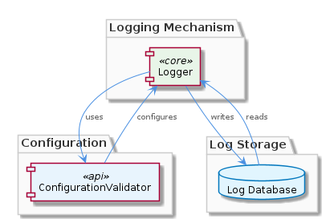
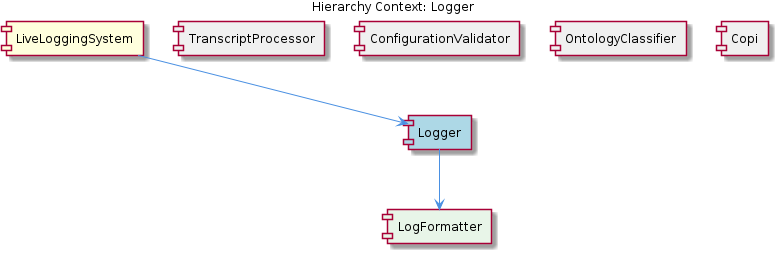

# Logger

**Type:** SubComponent

The Logger component is implemented in 'integrations/mcp-server-semantic-analysis/src/logging.ts', providing a unified logging interface.

## What It Is  

The **Logger** sub‑component lives in the file `integrations/mcp-server-semantic-analysis/src/logging.ts`.  It supplies a **unified logging interface** that the rest of the LiveLoggingSystem can call to record diagnostic information, errors, and operational events.  By exposing a single entry point for all log activity, the Logger guarantees that every message emitted by the system adheres to a **standardized logging format** and can be filtered, routed, or persisted in a consistent way.

The component is deliberately **modular**: new logging mechanisms (e.g., console, file, remote telemetry) can be added without touching the core interface.  Developers can also adjust which categories of logs are captured through built‑in **log filtering** capabilities, and the overall behaviour is driven by the **ConfigurationValidator** component that validates runtime settings.

---

## Architecture and Design  

The Logger is part of a **modular architecture** orchestrated by its parent, **LiveLoggingSystem**.  LiveLoggingSystem groups together several sibling sub‑components—`TranscriptProcessor`, `ConfigurationValidator`, `OntologyClassifier`, and `Copi`—each responsible for a distinct concern.  Within this ecosystem, the Logger occupies the logging concern and **contains** a dedicated `LogFormatter` child component that encapsulates the rules for the standardized output format.

The design emphasizes **separation of concerns** and **composition**:

* **Separation of concerns** is evident in the way logging, transcript processing, and configuration validation are each isolated in their own directories and modules.  This reduces coupling and makes it straightforward to evolve one concern without impacting the others.  
* **Composition** is reflected by the Logger’s relationship with `LogFormatter`.  Rather than embedding formatting logic directly, the Logger delegates to its child, allowing the formatter to evolve independently (e.g., to support JSON, plain‑text, or structured log schemas).

The component also follows a **configuration‑driven pattern**.  All logging settings—such as enabled log levels, destinations, and filter rules—are validated by the `ConfigurationValidator` before the Logger is instantiated.  This ensures that mis‑configurations are caught early, improving reliability.

---

## Implementation Details  

At its core, the file `integrations/mcp-server-semantic-analysis/src/logging.ts` exports a **unified logging API**.  The API provides methods such as:

* `logInfo(message: string, meta?: object)` – general informational messages.  
* `logError(error: Error, context?: object)` – captures stack traces and contextual data for exceptions.  
* `setFilters(filters: LogFilter[])` – allows callers to specify which log categories or levels should be emitted.

Internally, the Logger maintains a **pipeline**:

1. **Filtering Layer** – incoming log entries are first evaluated against the active `LogFilter` set.  Entries that do not match are dropped, conserving I/O and storage bandwidth.  
2. **Formatting Layer** – the remaining entries are passed to the `LogFormatter` child.  `LogFormatter` converts raw log objects into the **standardized format** (e.g., a JSON structure with timestamp, level, message, and optional metadata).  
3. **Destination Layer** – the formatted payload is then routed to one or more configured destinations.  Because the design is modular, each destination implements a simple interface (e.g., `write(formattedLog: string): void`), making it trivial to add new sinks such as a remote log aggregation service.

The Logger is built to **handle high volumes of log data**.  It employs efficient in‑memory buffering and asynchronous I/O so that logging does not become a bottleneck for the main application threads.  The buffering strategy also enables batch writes, reducing the overhead of frequent disk or network operations.

Configuration is sourced from the **ConfigurationValidator** component, which parses a configuration file (or environment variables), validates required fields, and supplies the Logger with a concrete settings object.  This tight coupling ensures that any change in logging behaviour is centrally governed.

---

## Integration Points  

The Logger interacts with several other parts of the system:

* **LiveLoggingSystem (parent)** – the overall system invokes the Logger wherever diagnostic output is needed, treating it as the single source of truth for all log activity.  
* **ConfigurationValidator (sibling)** – before the Logger starts, the `ConfigurationValidator` validates the logging configuration.  The Logger reads the resulting settings object to initialise filters, destinations, and formatter options.  
* **LogFormatter (child)** – the Logger delegates all formatting responsibilities to this component, keeping the core logging flow agnostic of output representation.  
* **TranscriptProcessor, OntologyClassifier, Copi (siblings)** – each of these modules calls the Logger to record their own operational events, errors, or performance metrics, benefiting from the same filtering and formatting pipeline.  

The relationship diagram below visualizes these connections:

---

## Usage Guidelines  

1. **Prefer the unified API** – always call the exported logging functions (`logInfo`, `logError`, etc.) rather than writing directly to a destination.  This guarantees that every entry passes through the filter and formatter pipeline.  
2. **Configure filters early** – use `setFilters` or adjust the configuration file before the application starts.  Over‑filtering can hide important diagnostics; under‑filtering can flood storage.  
3. **Leverage structured metadata** – when logging errors, include contextual objects (e.g., request IDs, user identifiers).  The `LogFormatter` will embed these into the standardized format, making downstream analysis easier.  
4. **Do not block the main thread** – the Logger’s internal buffering is asynchronous, but callers should avoid awaiting the logging calls unless they need guaranteed persistence (e.g., during graceful shutdown).  
5. **Extend destinations via the destination interface** – if a new log sink is required (e.g., a cloud‑based log analytics service), implement the simple `write(formattedLog: string)` contract and register the new sink in the configuration.  No changes to `logging.ts` are needed.

---

### Architectural Patterns Identified  
* Modular architecture (separate concerns per sub‑component)  
* Composition (Logger → LogFormatter)  
* Configuration‑driven initialization (validated by ConfigurationValidator)  

### Design Decisions and Trade‑offs  
* **Modularity vs. Indirection** – By delegating formatting and destination handling, the Logger remains lightweight, but introduces an extra layer of indirection that can add minimal overhead.  
* **Filtering at entry point** – Early filtering conserves resources but requires careful filter design to avoid discarding useful data.  
* **Asynchronous buffering** – Improves throughput for high‑volume scenarios, yet developers must be aware of potential log loss on abrupt termination.  

### System Structure Insights  
* Logger sits centrally within LiveLoggingSystem, acting as the logging hub for all sibling components.  
* The child `LogFormatter` encapsulates format rules, enabling easy evolution of log schemas without touching the core logger.  

### Scalability Considerations  
* High‑volume handling is achieved through in‑memory buffering and batch writes, allowing the system to scale horizontally (multiple Logger instances can write to the same destination if the destination supports concurrency).  
* Modular destinations permit scaling out to distributed log aggregation services without redesigning the Logger core.  

### Maintainability Assessment  
* Clear separation of responsibilities (filtering, formatting, destination) makes the codebase easy to understand and modify.  
* Centralized configuration validation reduces the risk of runtime mis‑configurations.  
* Adding new logging mechanisms or formats requires only new modules that conform to existing interfaces, minimizing the impact on existing code.

## Hierarchy Context

### Parent
- [LiveLoggingSystem](./LiveLoggingSystem.md) -- [LLM] The LiveLoggingSystem component utilizes a modular architecture, with separate components for logging, transcript processing, and configuration validation. This is evident in the directory structure, where the 'integrations' folder contains subfolders for 'browser-access', 'code-graph-rag', and 'copi', each representing a distinct aspect of the system. For instance, the 'copi' subfolder contains files such as 'INSTALL.md' and 'USAGE.md', which provide installation and usage guidelines for the Copi component. The 'lib/agent-api' folder contains the TranscriptAdapter abstract base class, which is responsible for reading and converting transcripts from different agent formats. The 'scripts' folder contains the LSLConfigValidator, which is used for validating and optimizing LSL configuration. The logging module, located in 'integrations/mcp-server-semantic-analysis/src/logging.ts', provides a unified logging interface and is used throughout the system.

### Children
- [LogFormatter](./LogFormatter.md) -- The Logger component is implemented in 'integrations/mcp-server-semantic-analysis/src/logging.ts', which suggests that log formatting is a crucial aspect of this component.

### Siblings
- [TranscriptProcessor](./TranscriptProcessor.md) -- The TranscriptProcessor uses the TranscriptAdapter abstract base class in 'lib/agent-api' to read and convert transcripts from various agent formats.
- [ConfigurationValidator](./ConfigurationValidator.md) -- The ConfigurationValidator is implemented in the 'scripts' folder, using the LSLConfigValidator script to validate and optimize configuration.
- [OntologyClassifier](./OntologyClassifier.md) -- The OntologyClassifier uses a modular design, allowing for easy integration of new ontology systems and classification mechanisms.
- [Copi](./Copi.md) -- The Copi component is implemented in the 'integrations/copi' folder, providing a GitHub Copilot CLI wrapper with logging and Tmux integration.

---

*Generated from 7 observations*
