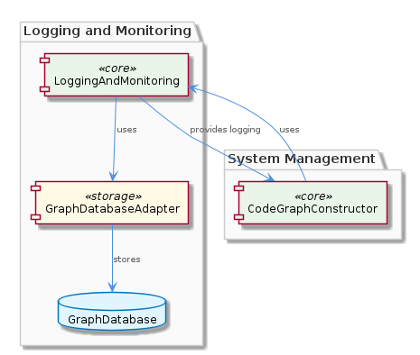
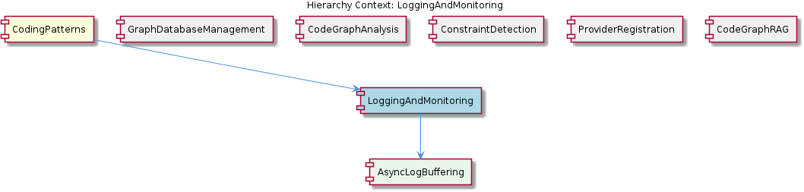

# LoggingAndMonitoring

**Type:** SubComponent

The LoggingAndMonitoring sub-component provides a method for logging and monitoring, which is used by the CodeGraphConstructor for constructing and analyzing code graphs.

## What It Is  

The **LoggingAndMonitoring** sub‑component lives inside the *CodingPatterns* family and is realized through a set of markdown‑based specifications and runtime helpers. Its concrete definition appears in the documentation files **`integrations/copi/docs/STATUS-LINE-QUICK-REFERENCE.md`** and **`integrations/copi/docs/hooks.md`**, where the *async log buffering and flushing* pattern is described. The component’s purpose is to capture operational events, performance metrics, and system‑wide alerts, then make that information available for downstream analysis and notification.  

In practice, LoggingAndMonitoring acts as the entry point for any code that needs to record a log entry or emit a monitoring signal. It buffers these records asynchronously, periodically flushing them to persistent storage that is backed by the **`GraphDatabaseAdapter`** (implemented in **`storage/graph-database-adapter.ts`**). This design enables both low‑overhead logging during normal operation and rich, graph‑oriented queries for later diagnostics.  

The sub‑component also supplies the **AsyncLogBuffering** child, which encapsulates the buffering mechanics, and it is referenced directly by the **CodeGraphConstructor** (see **`integrations/mcp-server-semantic-analysis/src/agent/code-graph-agent.ts`**) when constructing and analysing code graphs.  

---

## Architecture and Design  

LoggingAndMonitoring follows a **buffer‑flush** architectural style. The core idea—explicit in both `STATUS-LINE-QUICK-REFERENCE.md` and `hooks.md`—is to decouple the act of generating a log entry from the act of persisting it. Calls to the logging API push a record into an in‑memory queue; a background task later flushes the queue in bulk to the graph database. This pattern reduces latency for the caller and batches I/O, which is especially valuable when the system is under heavy load.  

The component relies on the **Adapter** pattern via **`GraphDatabaseAdapter`**. By abstracting the underlying graph store (Graphology + LevelDB) behind a clean interface, LoggingAndMonitoring can persist logs as graph nodes/edges without being tied to a specific database implementation. This mirrors the relationship seen in the parent *CodingPatterns* component, where many sub‑components (e.g., CodeGraphConstructor) also depend on the same adapter.  

Interaction flow (simplified):  

1. Application code invokes the LoggingAndMonitoring API → **AsyncLogBuffering** enqueues the log.  
2. The async buffer’s flush scheduler (triggered by time‑outs or size thresholds) extracts a batch.  
3. Each batch is handed to **`GraphDatabaseAdapter`**, which creates graph entities representing the log entry (timestamp, severity, source, etc.).  
4. The graph layer makes the logs queryable alongside code‑graph data, enabling the **CodeGraphConstructor** to correlate runtime events with static code structure.  

Because the component is a sibling to **GraphDatabaseManagement**, **CodeGraphAnalysis**, **ConstraintDetection**, **ProviderRegistration**, and **CodeGraphRAG**, it shares the same persistence foundation but diverges in purpose: LoggingAndMonitoring focuses on time‑series operational data, whereas its siblings handle static analysis, constraint enforcement, or provider registration.  

---

## Implementation Details  

### AsyncLogBuffering (Child)  
The child component is described in the **`integrations/copi/README.md`** (“Logging & Tmux Integration”). It implements a non‑blocking queue (likely a simple array or a more sophisticated ring buffer) and a periodic timer. The buffer exposes two public methods:  

* `log(entry: LogEntry)` – pushes a new entry onto the queue.  
* `flush()` – drains the queue and forwards the batch to the persistence layer.  

The buffering logic is deliberately lightweight to keep the critical path fast; flushing occurs on a separate event loop tick, ensuring that log generation never blocks the main application flow.

### GraphDatabaseAdapter (Dependency)  
Implemented in **`storage/graph-database-adapter.ts`**, this adapter offers CRUD operations over a Graphology‑based graph persisted with LevelDB. For logging, it provides a method such as `createLogNode(payload)` that creates a node with properties (`timestamp`, `level`, `message`, `context`). Because the graph model is already used by **CodeGraphConstructor**, the same adjacency queries can later retrieve logs that are directly linked to code entities (e.g., “function X emitted an error at runtime”).

### Integration with CodeGraphConstructor  
The **CodeGraphConstructor** (in **`integrations/mcp-server-semantic-analysis/src/agent/code-graph-agent.ts`**) calls LoggingAndMonitoring to annotate the graph with runtime observations. For example, after parsing a source file, the constructor may log “module loaded” and later, when an exception occurs, it logs an error node that is linked to the offending function node. This creates a unified graph that blends static structure with dynamic behavior.

### Configuration & Extensibility  
The markdown specifications (`STATUS-LINE-QUICK-REFERENCE.md` and `hooks.md`) act as a declarative contract for how log levels, buffering thresholds, and flush intervals are set. Because the pattern is described in documentation rather than hard‑coded, developers can adjust these parameters without recompiling the code, supporting flexible deployment scenarios.

---

## Integration Points  

1. **GraphDatabaseAdapter** – The sole persistence dependency. All log nodes are created through this adapter, making the logging subsystem tightly coupled to the graph storage layer used across the *CodingPatterns* ecosystem.  

2. **CodeGraphConstructor** – Consumes LoggingAndMonitoring to embed runtime events into the code graph. This bidirectional relationship enables downstream components (e.g., **CodeGraphRAG**) to answer “what happened when this function executed?”  

3. **ConstraintDetection** – While not directly mentioned in the observations, the sibling’s `execute(input, context)` pattern suggests that constraint violations could be emitted as log entries, feeding into the same async buffer.  

4. **ProviderRegistration** – May register new logging providers (e.g., external observability services) via the same adapter interface, extending the graph with external nodes.  

5. **External Hooks** – The `hooks.md` file outlines hook points where other subsystems can inject custom log payloads, ensuring that the buffer can be enriched without modifying core logging code.  

All these integrations share the same underlying graph database, reinforcing a cohesive data model while allowing each sibling to specialize its use of the log data.

---

## Usage Guidelines  

* **Prefer asynchronous logging** – Call the LoggingAndMonitoring API from any performance‑critical path; never invoke the flush routine manually unless you are shutting down the process.  

* **Structure log payloads consistently** – Include at least `timestamp`, `level`, `message`, and a `context` object that can contain identifiers useful for graph linking (e.g., `functionId`, `moduleName`).  

* **Respect buffering thresholds** – The default configuration, as documented in `STATUS-LINE-QUICK-REFERENCE.md`, flushes when the queue reaches 100 entries or after 5 seconds. Adjust these values only after measuring the impact on latency and LevelDB write throughput.  

* **Link logs to graph entities** – When possible, attach identifiers that the **CodeGraphConstructor** can resolve to graph nodes. This maximizes the value of the unified graph for later analysis.  

* **Do not bypass the adapter** – Direct writes to LevelDB or Graphology will break the consistency guarantees of the logging subsystem and may cause graph corruption.  

* **Monitor buffer health** – Expose metrics (queue length, last flush time) through the system’s monitoring endpoint to detect back‑pressure early.  

* **Leverage hooks for extensibility** – Use the hook definitions in `hooks.md` to plug in custom enrichers (e.g., correlation IDs, request tracing) without altering the core buffer implementation.  

---

### Architectural patterns identified  
* **Async Buffer‑Flush** (non‑blocking queue with periodic bulk persistence)  
* **Adapter** (GraphDatabaseAdapter abstracts Graphology + LevelDB)  

### Design decisions and trade‑offs  
* **Performance vs. durability** – Asynchronous buffering reduces request latency but introduces a small window where logs could be lost on crash; the trade‑off is acceptable for high‑throughput scenarios.  
* **Graph‑centric persistence** – Storing logs as graph nodes enables powerful correlation with code entities but adds storage overhead compared to plain file logs.  

### System structure insights  
LoggingAndMonitoring sits under *CodingPatterns*, shares the GraphDatabaseAdapter with siblings, and delegates buffering to its child AsyncLogBuffering. This creates a clear vertical stack: API → Buffer → Adapter → Persistent Graph.  

### Scalability considerations  
* **Horizontal scaling** – Because the buffer is in‑process, each service instance maintains its own queue; scaling out simply adds more independent buffers, each flushing to the same LevelDB‑backed graph store.  
* **Back‑pressure handling** – Adjusting batch size and flush interval can tune throughput; the graph store’s write amplification must be monitored as the log volume grows.  

### Maintainability assessment  
The reliance on well‑documented markdown specifications and a single adapter class keeps the codebase easy to reason about. Adding new log fields or changing flush policies requires only updates to the documentation and possibly minor configuration tweaks, avoiding widespread code changes. The tight coupling to the graph database does mean that any major migration of the persistence layer would affect all siblings, but the Adapter pattern isolates most of that impact.

## Hierarchy Context

### Parent
- [CodingPatterns](./CodingPatterns.md) -- [LLM] The CodingPatterns component's architecture is heavily influenced by the GraphDatabaseAdapter class in storage/graph-database-adapter.ts, which provides methods for creating, reading, and manipulating graph data. This class utilizes Graphology and LevelDB for persistence, ensuring efficient data storage and retrieval. The CodeGraphConstructor sub-component, as seen in integrations/mcp-server-semantic-analysis/src/agent/code-graph-agent.ts, relies on the GraphDatabaseAdapter for constructing and analyzing code graphs. This tightly coupled relationship between the GraphDatabaseAdapter and CodeGraphConstructor enables the efficient creation and analysis of code graphs.

### Children
- [AsyncLogBuffering](./AsyncLogBuffering.md) -- The integrations/copi/README.md file mentions 'Logging & Tmux Integration', indicating the importance of logging in the system.

### Siblings
- [GraphDatabaseManagement](./GraphDatabaseManagement.md) -- GraphDatabaseAdapter in storage/graph-database-adapter.ts utilizes Graphology and LevelDB for persistence, ensuring efficient data storage and retrieval.
- [CodeGraphAnalysis](./CodeGraphAnalysis.md) -- The CodeGraphConstructor in integrations/mcp-server-semantic-analysis/src/agent/code-graph-agent.ts relies on the GraphDatabaseAdapter for constructing and analyzing code graphs.
- [ConstraintDetection](./ConstraintDetection.md) -- The ConstraintDetection sub-component uses the execute(input, context) pattern for detecting and monitoring constraints.
- [ProviderRegistration](./ProviderRegistration.md) -- The ProviderRegistration sub-component uses the ProviderRegistry class for registering new providers.
- [CodeGraphRAG](./CodeGraphRAG.md) -- The CodeGraphRAG sub-component is a graph-based RAG system for any codebases, as seen in integrations/code-graph-rag/README.md.

---

*Generated from 7 observations*
