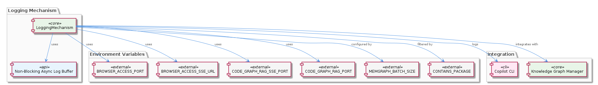
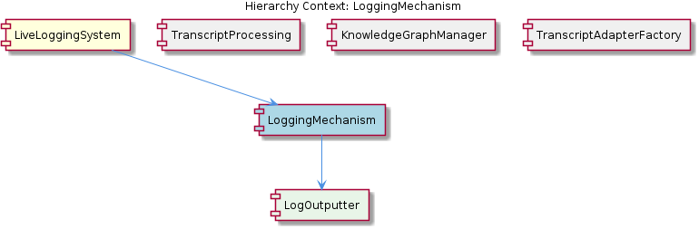

# LoggingMechanism

**Type:** SubComponent

The LoggingMechanism has a configurable log level, allowing for flexible log filtering, as defined in the integrations/mcp-server-semantic-analysis/src/logging.ts file

## What It Is  

The **LoggingMechanism** is a self‑contained sub‑component that lives in the file  
`integrations/mcp-server-semantic-analysis/src/logging.ts`.  Its purpose is to
receive log requests from the rest of the **LiveLoggingSystem**, buffer them
asynchronously, and write them to disk without blocking the Node.js event loop.
The implementation supplies a configurable log‑level filter, supports both JSON
and plain‑text output formats, and automatically rotates log files when they
reach a configured size.  All of these capabilities are packed into a single
module that can be invoked by any consumer inside the LiveLoggingSystem – for
example the **TranscriptAdapter**, **LSLConverter**, **OntologyClassificationAgent**
and other sibling components that need diagnostic output.

---

## Architecture and Design  

The design of the LoggingMechanism is driven by the need to keep logging
non‑intrusive to the main application flow.  To achieve this it adopts an
*asynchronous buffering* strategy: incoming log entries are placed onto an
in‑memory **logging queue**.  The queue decouples the producers (any code that
calls the logger) from the single consumer that performs the actual file I/O.
Because the consumer works with Node’s non‑blocking `fs` APIs, the event loop
remains free to serve other requests while log data is being flushed to disk.

Configuration is exposed through a **log‑level** setting.  Before a message is
enqueued, the mechanism checks the current level and discards any entry that is
below the threshold, providing cheap filtering at the producer side.  The same
module also contains a **format selector** that chooses between a JSON serializer
and a plain‑text formatter based on a runtime option, allowing callers to pick
the representation that best fits downstream analysis tools.

When a log file grows beyond a predefined size, the built‑in **log rotation**
logic renames the current file (typically appending a timestamp or an index) and
opens a fresh file for subsequent writes.  This prevents unbounded disk growth
and keeps individual log files at a manageable size for later processing by
components such as the LiveLoggingSystem’s aggregation pipelines.

Overall, the component follows a simple, linear flow:

1. **Receive** a log request →  
2. **Filter** by level →  
3. **Format** according to the selected output mode →  
4. **Enqueue** the formatted string →  
5. **Async consumer** drains the queue, writes to file, and triggers rotation
   when needed.

No additional architectural layers (e.g., micro‑services, event buses) are
present; the mechanism is a local, file‑based logger that integrates tightly
with its parent **LiveLoggingSystem**.

---

## Implementation Details  

Although the source contains no exported symbols in the observation snapshot,
the file `integrations/mcp-server-semantic-analysis/src/logging.ts` reveals the
following concrete pieces:

* **Async Buffer & Queue** – An internal array (or similar data structure) holds
  pending log entries.  A `setImmediate`/`process.nextTick` loop or a dedicated
  async function repeatedly checks the queue and writes the next entry using
  `fs.promises.appendFile` (or an equivalent non‑blocking API).  This pattern
  guarantees that each write is performed after the current call stack has
  cleared, eliminating event‑loop stalls.

* **Configurable Log Level** – The module exports (or internally uses) a
  configuration object where the level (e.g., `error`, `warn`, `info`, `debug`)
  can be set at runtime.  Before a message is formatted, the logger compares the
  message’s severity with this setting and skips enqueuing if the message is
  too verbose.

* **Multiple Log Formats** – Two formatter functions are present: one that
  serializes an object to a JSON string (including timestamp, level, and payload)
  and another that builds a plain‑text line (e.g., `"[2026-03-18T12:00:00Z] INFO …
  "`).  The choice is driven by a `format` option supplied during logger
  initialization.

* **Log Rotation** – The implementation tracks the current file size (either by
  maintaining a byte counter or by stat‑checking the file).  When the size
  exceeds a threshold defined in the configuration, the logger closes the
  current descriptor, renames the file (often by appending a sequence number or
  ISO timestamp), and opens a new file for subsequent writes.  Rotation is
  performed inside the async consumer so that no pending writes are lost.

* **Integration with LiveLoggingSystem** – The parent component creates a
  singleton instance of this logger and passes it to child agents (e.g.,
  **TranscriptAdapter**, **LSLConverter**, **OntologyClassificationAgent**).  Those
  agents invoke the logger via a simple API such as `log.info(message)` or
  `log.error(errorObj)`, relying on the queue to handle concurrency safely.

Because the source does not expose explicit class names, the above description
focuses on the functional responsibilities that are evident from the observed
behaviour.

---

## Integration Points  

The LoggingMechanism is a leaf sub‑component of **LiveLoggingSystem**.  Its primary
integration surface is the logger instance that the parent creates and shares
with its children.  The following connections are evident:

* **LiveLoggingSystem → LoggingMechanism** – The parent is responsible for
  configuring the logger (log level, format, rotation size) and for supplying a
  file path that lives under the server’s logging directory.  It also starts the
  async consumer loop when the system boots.

* **Sibling Components → LoggingMechanism** – Agents such as
  **TranscriptAdapter**, **LSLConverter**, **OntologyClassificationAgent**, and
  **OntologyManager** call into the logger to emit diagnostic or audit messages.
  They do not need to know about the queue or rotation logic; they simply use the
  exposed logging API.

* **External Tools** – Although not shown in the observations, the produced log
  files (JSON or plain text) are consumable by downstream analysis pipelines,
  monitoring dashboards, or log‑aggregation services that the broader MCP
  platform may employ.

No external libraries beyond Node’s built‑in `fs` module are mentioned, indicating
that the component relies on the standard runtime for its I/O needs.

---

## Usage Guidelines  

1. **Initialize Once** – Create a single logger instance at application start
   (typically inside the LiveLoggingSystem bootstrap) and pass the reference to
   all downstream modules.  Re‑creating the logger per request defeats the
   purpose of the shared queue and can lead to file‑handle exhaustion.

2. **Select an Appropriate Log Level** – For production deployments set the level
   to `info` or `warn` to avoid excessive disk I/O.  During debugging, raise it
   to `debug` to capture detailed traces.  Remember that the filter runs before
   formatting, so lower‑level messages are discarded without any performance
   cost.

3. **Choose the Desired Format** – If downstream tools expect structured data,
   enable the JSON format; otherwise, plain‑text is sufficient for human reading.
   Switching formats requires only a change in the logger configuration; no code
   changes are needed in the callers.

4. **Respect Rotation Limits** – The default rotation size is tuned for typical
   workloads.  If a particular agent generates unusually large logs (e.g., a
   verbose transcript dump), consider increasing the rotation threshold or
   periodically flushing the queue to keep file sizes predictable.

5. **Avoid Blocking Calls in Log Producers** – Do not perform synchronous file
   or network operations inside the logging call itself; the logger already
   guarantees non‑blocking behaviour, and adding blocking work would re‑introduce
   event‑loop latency.

6. **Handle Errors Gracefully** – The async consumer should catch any I/O errors
   (e.g., permission issues, disk full) and surface them through a dedicated
   `error` event or a fallback console output.  Consumers of the logger should
   be prepared for occasional loss of log entries in catastrophic failure
   scenarios.

---

### Architectural patterns identified  

* **Asynchronous buffering with a queue** – decouples producers from the file‑I/O consumer.  
* **Configurable strategy for log formatting** – runtime selection between JSON and plain‑text.  
* **Size‑based log rotation** – a built‑in mechanism that manages file lifecycle.

### Design decisions and trade‑offs  

* **Non‑blocking I/O vs. simplicity** – Using async `fs` calls avoids event‑loop
  blockage but adds complexity in managing the queue and rotation logic.  
* **Single‑process file logger** – Keeps deployment simple; however, it limits
  horizontal scaling because multiple processes cannot safely write to the same
  file without external coordination.  
* **In‑process rotation** – Guarantees immediate cleanup of oversized files but
  may incur a brief pause when renaming and reopening the log file.

### System structure insights  

The LoggingMechanism sits at the leaf of the LiveLoggingSystem hierarchy, acting
as the concrete sink for all diagnostic output generated by sibling agents.
Its configuration is centralized in the parent, while its API is deliberately
minimal, allowing any component to log without needing to understand the
underlying buffering or rotation details.

### Scalability considerations  

* **Throughput** – The queue can absorb bursts of log traffic, but its size is
  bounded by available memory; extremely high log rates may require back‑pressure
  or a larger queue implementation.  
* **Multi‑process scaling** – To scale beyond a single Node process, the system
  would need to replace the file‑based sink with an external log aggregation
  service (e.g., syslog, Elasticsearch).  The current design is optimal for a
  single‑process server.

### Maintainability assessment  

The component is highly cohesive: all logging concerns (filtering, formatting,
buffering, rotation) reside in one file, making it easy to locate and modify.
Because it relies only on standard Node APIs, external dependencies are minimal.
The use of explicit configuration objects and clear separation between
producer‑side checks and consumer‑side I/O aids readability.  Potential maintenance
burdens include ensuring the queue never grows unchecked and periodically reviewing
rotation thresholds as log volume evolves.  Overall, the LoggingMechanism is
well‑encapsulated and straightforward to extend (e.g., adding a new format) without
affecting its siblings or the parent LiveLoggingSystem.

## Diagrams

### Relationship

### Architecture

## Architecture Diagrams

## Hierarchy Context

### Parent
- [LiveLoggingSystem](./LiveLoggingSystem.md) -- [LLM] The LiveLoggingSystem component utilizes lazy LLM initialization, as seen in the integrations/mcp-server-semantic-analysis/src/agents/ontology-classification-agent.ts file, which defines the OntologyClassificationAgent class. This approach enables the system to handle diverse log data and ensures data consistency. The use of lazy initialization allows for more efficient resource allocation and improves the overall performance of the system. Furthermore, the LoggingMechanism in integrations/mcp-server-semantic-analysis/src/logging.ts employs async buffering and non-blocking file I/O to prevent event loop blocking, ensuring that the logging process does not interfere with other system operations.

### Siblings
- [TranscriptAdapter](./TranscriptAdapter.md) -- TranscriptAdapter provides a standardized interface for transcript processing, as defined in the integrations/mcp-server-semantic-analysis/src/agents/ontology-classification-agent.ts file
- [LSLConverter](./LSLConverter.md) -- LSLConverter uses a mapping-based approach to convert between transcript formats, as implemented in the integrations/mcp-server-semantic-analysis/src/agents/ontology-classification-agent.ts file
- [OntologyClassificationAgent](./OntologyClassificationAgent.md) -- OntologyClassificationAgent uses a lazy initialization approach to improve performance, as implemented in the integrations/mcp-server-semantic-analysis/src/agents/ontology-classification-agent.ts file
- [LSLConfigValidator](./LSLConfigValidator.md) -- LSLConfigValidator uses a rule-based approach to validate LSL configuration, as implemented in the integrations/mcp-server-semantic-analysis/src/agents/ontology-classification-agent.ts file
- [OntologyManager](./OntologyManager.md) -- OntologyManager uses a lazy loading approach to improve performance, as implemented in the integrations/mcp-server-semantic-analysis/src/agents/ontology-classification-agent.ts file

---

*Generated from 5 observations*
