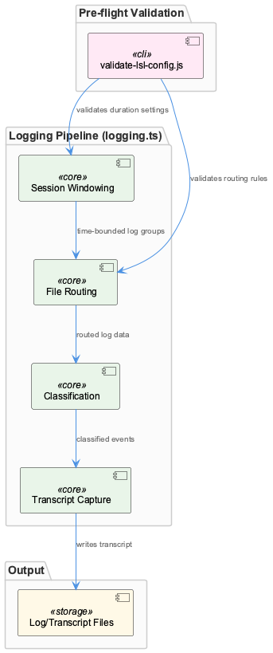
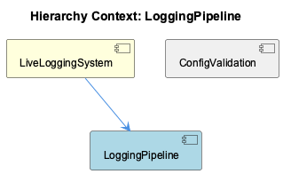

# LoggingPipeline

**Type:** SubComponent

Transcript capture in logging.ts is the terminal stage of the pipeline, executed only after earlier stages (windowing, routing, classification) have processed the incoming data

# LoggingPipeline: Technical Insight Document

## What It Is

LoggingPipeline is implemented in `logging.ts`, where it constitutes the main runtime pipeline of the LiveLoggingSystem. It executes only after configuration has been validated by a separate pre-flight script, `scripts/validate-lsl-config.js`, meaning `logging.ts` itself contains no configuration-validation logic — that responsibility is entirely delegated upstream. The pipeline processes incoming log/session data through a sequence of distinct stages: session windowing, file routing, classification, and transcript capture.

## Architecture and Design

The core architectural pattern here is a **staged pipeline** with strict separation of concerns: each stage (windowing, routing, classification, capture) is implemented as a distinct internal function or module within `logging.ts`, and stages execute in a fixed order, with transcript capture explicitly positioned as the terminal stage that only runs after windowing, routing, and classification have completed. This ordering is a deliberate design decision — it ensures that by the time raw data reaches capture, it has already been time-bounded, routed to a destination, and categorized, so the capture stage itself stays simple and focused solely on writing output.

A second key design decision is **validation-ahead-of-time rather than inline checking**. File routing rules and session window durations are both validated beforehand by `validate-lsl-config.js` rather than checked during pipeline execution. This trades a small amount of upfront complexity (maintaining a separate validation script) for reduced runtime overhead and fail-fast guarantees at the system level — a pattern shared with the sibling ConfigValidation component, which implements exactly this standalone check.

## Implementation Details

Within `logging.ts`, session windowing logic consumes duration settings that have already been validated, using them to group log data into time-bounded windows. File routing logic then determines output destinations for transcripts/logs based on pre-validated rules rather than performing routing checks at capture time. Classification logic is kept explicitly separate from transcript capture — categorizing captured events as its own modular stage rather than folding categorization into the write path. Transcript capture, the final stage, is triggered only after the preceding three stages have processed the data, acting as the pipeline's terminal sink.

Although no specific classes or function signatures are enumerated in the current code structure inventory, the observations make clear that these four stages are conceptually (and likely physically) separated within `logging.ts`, supporting independent reasoning about and modification of each concern.

## Integration Points

LoggingPipeline is a child of LiveLoggingSystem, which frames it as one segment of a larger pipeline that begins with configuration validation. Its primary upstream dependency is `scripts/validate-lsl-config.js` (the ConfigValidation sibling), which supplies validated session window durations and file routing rules consumed directly by the windowing and routing stages. This creates a clear producer/consumer relationship between ConfigValidation and LoggingPipeline: ConfigValidation runs standalone and independently, while LoggingPipeline assumes its outputs are already correct by the time it runs.

## Usage Guidelines

Developers modifying session window durations or file routing rules should do so with the understanding that `logging.ts` does not re-validate these values — correctness depends entirely on running `validate-lsl-config.js` first. Any change to configuration should be validated via the standalone script before invoking the full pipeline, preserving the fail-fast guarantee designed into LiveLoggingSystem. When extending the pipeline, new logic should respect the existing stage boundaries: windowing, routing, and classification concerns should not be merged into transcript capture, since that separation is intentional and keeps the terminal capture stage simple. Given classification and capture are explicitly decoupled, any changes to event categorization should be made in the classification stage rather than inline within capture logic.

## Hierarchy Context

### Parent
- [LiveLoggingSystem](./LiveLoggingSystem.md) -- [LLM] The LiveLoggingSystem is structured as a pipeline with distinct, separable stages: configuration validation, session windowing, file routing, classification, and transcript capture. This separation is evident in the presence of scripts/validate-lsl-config.js as a standalone pre-flight check that runs independently of the main logging.ts pipeline, meaning developers can validate configuration changes (session window durations, file routing rules) without triggering the full logging pipeline. This design supports fail-fast behavior: catching misconfiguration before any live session data is captured, rather than discovering issues mid-capture when data loss or malformed logs could occur.

### Siblings
- [ConfigValidation](./ConfigValidation.md) -- scripts/validate-lsl-config.js runs as a standalone script separate from logging.ts, allowing developers to validate config changes without invoking the live logging pipeline

---

*Generated from 6 observations*
