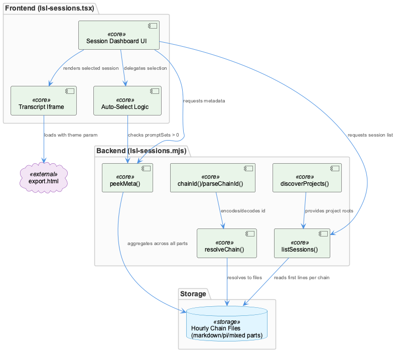
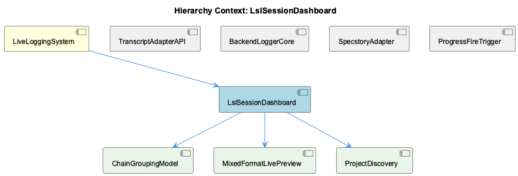

# LslSessionDashboard

**Type:** SubComponent

lsl-sessions.mjs defines a chain as an hourly tranche including rotation parts, not a single file, because legacy '-N_' markdown parts are headerless fragments split mid-token and pi-format parts are linked via parentSession

# LslSessionDashboard: Technical Insight Document

## What It Is

LslSessionDashboard is implemented primarily across `lsl-sessions.mjs` (backend/data layer) and `lsl-sessions.tsx` (frontend rendering layer), forming the operator-facing view into the LiveLoggingSystem's captured session data. As a SubComponent of LiveLoggingSystem, it does not own the raw ingestion path — that responsibility belongs to `logging.ts` in the parent — but instead provides discovery, aggregation, and visualization over the files that logging.ts and its adapters (e.g., SpecstoryAdapter, TranscriptAdapterAPI implementations) produce. Its central abstraction is the "chain": an hourly tranche of related files rather than a single file, reflecting the reality that live logging output is rotated, fragmented, and sometimes format-mixed.

## Architecture and Design

The dashboard is architected around three delegated concerns, each surfaced as a child component: ChainGroupingModel for identity/resolution of chains, MixedFormatLivePreview for format-transparent rendering, and ProjectDiscovery for locating project roots across deployment environments. This separation lets `lsl-sessions.mjs` remain a coordinating module rather than a monolith — it defines chain semantics but delegates ID encoding, format handling, and project scanning to focused, independently reasoned-about units.

A key design decision is treating a "chain" as the unit of aggregation instead of a file. This exists because rotation parts (legacy `-N_` markdown fragments, which are headerless and split mid-token) and pi-format parts (linked via `parentSession`) mean no single file is a complete session record. This decision cascades into how `listSessions()` and `peekMeta()` are written: both must reason across all parts of a chain, not just one file, to produce correct aggregate state.

Performance is a recurring trade-off. With a corpus of ~20k files, `listSessions()` deliberately reads only the first lines of each chain's parts to keep discovery cheap, accepting reduced fidelity (format detection via extension-checking across parts) in exchange for scan speed. `peekMeta()` makes the opposite trade-off for a narrower, more precision-sensitive query — it aggregates agent name and promptSets count across *every* part of a chain, since a 12-part tranche's first file may represent only a small fraction of total prompt sets. This asymmetry between "cheap listing" and "accurate metadata" is a deliberate layering of read cost against correctness requirements.

## Implementation Details

`chainId()` and `parseChainId()` in ChainGroupingModel encode an opaque, reversible identifier of the shape `<project>/<yyyy>/<mm>/<chainKey>`, which `resolveChain()` uses to map an ID back to concrete files on disk. This scheme allows the frontend and backend to pass around a compact string handle for a chain without either side needing to understand file layout directly.

`discoverProjects()` (ProjectDiscovery) scans both `path.resolve(codingRoot, '..')` and an `LSL_WORKSPACE_ROOT`-configurable `/workspace` path. This dual-scan exists specifically to reconcile how sibling projects are bind-mounted differently inside the coding-services container versus on the host — a deployment-environment concern baked directly into discovery logic rather than handled via external configuration alone.

On the frontend, `lsl-sessions.tsx` renders transcripts through an iframe pointed at `export.html` with a theme query parameter. This is necessitated by the iframe being a separate document context that cannot inherit the dashboard's CSS theme state, so theme propagation is done explicitly via URL parameter rather than shared stylesheets. Session auto-selection logic in `lsl-sessions.tsx` chooses the newest session with `promptSets > 0`, rather than simply the newest session by timestamp — this guards against selecting a header-only file that was caught mid-flush by the ETM (event/transcript manager), which would otherwise render as empty or broken.

MixedFormatLivePreview reinforces format-fidelity: per the `lsl-sessions.mjs` header comment, `.md` chains are converted in memory "through the same parser and writer the backfill uses," ensuring the live viewer's rendering matches backfill output exactly rather than drifting via a parallel, viewer-specific parsing path.

## Integration Points

LslSessionDashboard sits downstream of LiveLoggingSystem's core `logging.ts`, consuming files written under session-window and rotation semantics defined there — any change to how a session window rolls over directly affects how chains are grouped and resolved here. It is a sibling to BackendLoggerCore, TranscriptAdapterAPI, SpecstoryAdapter, and ProgressFireTrigger, but does not appear to call into them directly; instead it operates on their output artifacts on disk. Internally, it composes ChainGroupingModel (identity), MixedFormatLivePreview (format-consistent rendering shared with the backfill parser/writer), and ProjectDiscovery (environment-aware path resolution) as first-class children, each independently a source of truth for its concern.

## Usage Guidelines

Developers should never assume a chain corresponds to one file — any new logic touching chains must account for rotation parts and pi-format `parentSession` links. When adding metadata queries, prefer the `peekMeta()` pattern (full-chain aggregation) over the `listSessions()` pattern (first-line-only) whenever correctness of counts/fields matters more than scan speed; conflating the two will silently produce wrong aggregate values at scale. Path-resolution logic should always route through `discoverProjects()` rather than hardcoding `codingRoot`-relative paths, since container vs. host bind-mount differences are only handled there via `LSL_WORKSPACE_ROOT`. Frontend changes to transcript rendering should preserve the export.html/iframe/theme-query-param approach rather than attempting direct CSS inheritance, and any change to session auto-selection must preserve the `promptSets > 0` guard to avoid regressing on mid-flush ETM artifacts.

## Hierarchy Context

### Parent
- [LiveLoggingSystem](./LiveLoggingSystem.md) -- [LLM] The LiveLoggingSystem centers around logging.ts, which owns the core responsibilities of session windowing, file routing, and transcript capture. This module acts as the single ingestion point for live Claude Code conversation data, meaning any change to session lifecycle semantics (e.g., how a 'session window' is defined or when it rolls over to a new file) has cascading effects on downstream consumers like the classification agent and config validation tooling. New developers should treat logging.ts as the authoritative source of truth for how raw conversation events are structured before they are persisted to disk.

### Children
- [ChainGroupingModel](./ChainGroupingModel.md) -- chainId(project, year, month, key) builds an opaque reversible id of shape '<project>/<yyyy>/<mm>/<chainKey>', parsed back by parseChainId via regex.
- [MixedFormatLivePreview](./MixedFormatLivePreview.md) -- lsl-sessions.mjs header states '.md chains are converted IN MEMORY through the same parser and writer the backfill uses' so the viewer matches backfill output exactly.
- [ProjectDiscovery](./ProjectDiscovery.md) -- discoverProjects(codingRoot) scans path.resolve(codingRoot, '..') plus an optional LSL_WORKSPACE_ROOT (default '/workspace') because sibling projects are bind-mounted differently inside coding-services container vs on host.

### Siblings
- [TranscriptAdapterAPI](./TranscriptAdapterAPI.md) -- TranscriptAdapter is an abstract base class in transcript-api.js that throws on direct instantiation via `new.target === TranscriptAdapter` check, forcing agent-specific subclasses to implement getAgentType, readTranscripts, convertToLSL, getCurrentSession
- [BackendLoggerCore](./BackendLoggerCore.md) -- Logger.js loads config/logging-config.json once via loadConfig(), caching it in module-level sharedConfig and exposing reloadConfig() to force a refresh
- [SpecstoryAdapter](./SpecstoryAdapter.md) -- SpecstoryAdapter.initialize() tries three connection methods in fallback order: connectViaHTTP(), then connectViaIPC(), then connectViaFileWatch()
- [ProgressFireTrigger](./ProgressFireTrigger.md) -- progressFireDecision() fires on EITHER of two independent triggers: a token-delta trigger (cumulative output tokens grown by >= thresholdTokens since last mark) or a wall-clock trigger (elapsed ms >= elapsedThresholdMs)

---

*Generated from 7 observations*
