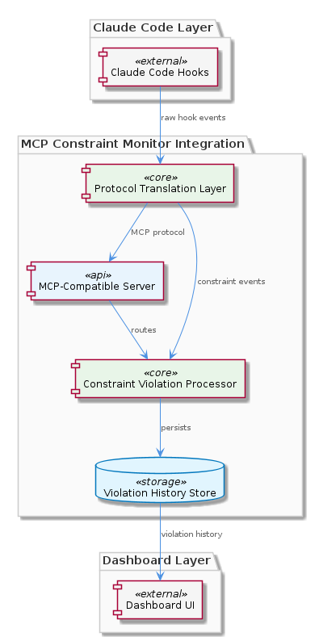
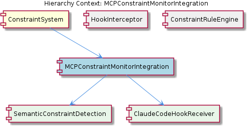

# MCPConstraintMonitorIntegration

**Type:** SubComponent

integrations/mcp-constraint-monitor/dashboard/README.md indicates the integration also surfaces violation data to a dashboard layer, implying a persistent violation history store is managed through this integration

# MCPConstraintMonitorIntegration

## What It Is

MCPConstraintMonitorIntegration is implemented as a dedicated integration package located at `integrations/mcp-constraint-monitor/`, documented in `integrations/mcp-constraint-monitor/README.md`. It wraps the constraint monitoring functionality as an MCP-compatible (Model Context Protocol) server component, exposing it to the broader Claude Code ecosystem through a standardized protocol surface.

As a SubComponent of the `ConstraintSystem`, this integration serves as the protocol translation and persistence layer that sits between raw Claude Code hooks and the visualization dashboard. Where its parent `ConstraintSystem` provides the overall constraint monitoring and enforcement capability — validating code actions and file operations against configured rules during Claude Code sessions — this integration is specifically responsible for making those capabilities accessible via MCP and for surfacing violation data to downstream consumers.

The integration also incorporates a dashboard layer, evidenced by `integrations/mcp-constraint-monitor/dashboard/README.md`, which implies that a persistent violation history store is managed through this integration. This makes MCPConstraintMonitorIntegration the bridge between live session activity (received via hooks) and persistent violation history storage (rendered through the dashboard).

## Architecture and Design

The architectural approach evident from the observations is a **layered adapter pattern**: the integration sits between two boundaries — the Claude Code hook protocol on one side, and the MCP server interface (plus dashboard consumers) on the other. This positioning is significant: it isolates protocol translation concerns from the core rule evaluation logic implemented by the sibling `ConstraintRuleEngine`, and from hook interception logic handled by the sibling `HookInterceptor`.

The integration decomposes into two child components that handle distinct architectural concerns. `ClaudeCodeHookReceiver`, documented at `integrations/mcp-constraint-monitor/docs/CLAUDE-CODE-HOOK-FORMAT.md`, defines a well-formed ingestion interface accepting structured payloads from Claude Code's pre-tool and post-tool events. `SemanticConstraintDetection`, documented at `integrations/mcp-constraint-monitor/docs/semantic-detection-design.md`, encapsulates the more sophisticated semantic-level detection subsystem — the existence of a dedicated design document signals this is a non-trivial subsystem with its own architectural rationale, distinct from straightforward pattern-based rule matching.

The design separation between siblings is also instructive: while `HookInterceptor` (per `CLAUDE-CODE-HOOK-FORMAT.md`) governs the wire format and interception mechanism, and `ConstraintRuleEngine` (per `constraint-configuration.md`) governs rule definitions, scopes, and enforcement modes, the MCPConstraintMonitorIntegration brings these together under an MCP-compatible server boundary. This composition allows each concern to evolve independently while presenting a unified MCP surface to clients.

## Implementation Details

The integration is packaged under `integrations/mcp-constraint-monitor/` with a clear internal layout. The top-level `README.md` describes the MCP server wrapping, the `dashboard/` subdirectory contains the dashboard layer for visualizing violation data, and the `docs/` subdirectory houses formal specifications including `CLAUDE-CODE-HOOK-FORMAT.md`, `constraint-configuration.md`, and `semantic-detection-design.md`.

`ClaudeCodeHookReceiver` implements ingestion against the payload structure formalized in `CLAUDE-CODE-HOOK-FORMAT.md`. This document defines the exact wire format for pre-tool and post-tool events emitted by Claude Code, meaning the receiver is bound to a stable contract and can validate or reject malformed payloads against that schema. Because the format is dedicated to a single document, the implementation can rely on a single source of truth when parsing incoming events.

`SemanticConstraintDetection` is implemented according to the design captured in `semantic-detection-design.md`. The presence of a "Design Document" file (as opposed to mere usage docs) suggests the implementation embodies deliberate architectural decisions — likely involving analysis steps beyond simple textual matching, such as interpreting the semantic intent of tool invocations or file operations before checking them against constraints.

Persistence is implicit but evident: the dashboard layer described in `dashboard/README.md` requires a violation history store, and because the dashboard lives inside this integration package, the persistence mechanism is owned by MCPConstraintMonitorIntegration rather than by the parent `ConstraintSystem` or external infrastructure. This means the integration handles not only protocol translation but also durable storage of violation records produced during constraint evaluation.

## Integration Points

Upstream, MCPConstraintMonitorIntegration receives data from Claude Code through the hook channel defined by sibling `HookInterceptor` and consumed by child `ClaudeCodeHookReceiver`. The hook format specified in `CLAUDE-CODE-HOOK-FORMAT.md` constitutes the primary inbound interface, covering both pre-tool and post-tool event structures.

Laterally, the integration coordinates with the sibling `ConstraintRuleEngine`, which provides the rule definitions, scopes, and enforcement modes described in `constraint-configuration.md`. Detected events flowing through `ClaudeCodeHookReceiver` and analyzed by `SemanticConstraintDetection` are evaluated against rules from this engine to produce violation records.

Downstream, the integration exposes two interfaces. First, it presents an MCP-compatible server endpoint per the `README.md`, allowing MCP clients to interact with constraint monitoring functionality through standardized protocol calls. Second, it feeds the dashboard layer (`dashboard/README.md`), supplying violation history for visualization. The parent `ConstraintSystem` aggregates this integration alongside its siblings to form the complete constraint monitoring and enforcement system, bridging live session activity with persistent violation history storage.

## Usage Guidelines

When extending or maintaining this integration, treat the documents in `integrations/mcp-constraint-monitor/docs/` as authoritative contracts. Any changes to inbound hook handling must remain consistent with `CLAUDE-CODE-HOOK-FORMAT.md`, since Claude Code itself produces payloads against that schema — diverging from this format risks dropping or misinterpreting events from upstream `HookInterceptor`.

Rule configuration changes should be coordinated with `constraint-configuration.md`, which is the schema reference for the sibling `ConstraintRuleEngine`. Because MCPConstraintMonitorIntegration evaluates ingested events against rules defined under this schema, changes to rule types, scopes, or enforcement modes need to propagate consistently across the integration's evaluation paths.

When working on semantic detection logic, refer to `semantic-detection-design.md` before modifying `SemanticConstraintDetection`. The existence of a separate design document signals that ad-hoc changes risk violating the architectural rationale; preserve the documented decisions or update the design document alongside any structural change.

For dashboard and persistence concerns, recognize that the violation history store is owned by this integration. Avoid bypassing the integration to write violations directly from elsewhere in `ConstraintSystem` — doing so would split ownership of persistent state and break the layered adapter design that positions MCPConstraintMonitorIntegration as the single persistence and protocol translation layer between Claude Code hooks and the dashboard.

Finally, when adding new MCP-exposed capabilities, ensure they are surfaced through the integration's MCP server boundary described in the package `README.md` rather than as side-channels, so that all external interactions with constraint monitoring remain consistent with the MCP protocol contract.

## Hierarchy Context

### Parent
- [ConstraintSystem](./ConstraintSystem.md) -- The ConstraintSystem is a constraint monitoring and enforcement system that validates code actions and file operations against configured rules during Claude Code sessions. It operates primarily through a hook-based architecture where hooks intercept agent tool calls (pre-tool, post-tool events) and evaluate them against constraint rules, capturing any violations for persistence and dashboard display. The system integrates with the MCP (Model Context Protocol) infrastructure via the mcp-constraint-monitor integration, and bridges live session activity with persistent violation history storage.

### Children
- [SemanticConstraintDetection](./SemanticConstraintDetection.md) -- integrations/mcp-constraint-monitor/docs/semantic-detection-design.md ('Semantic Constraint Detection - Design Document') describes the architectural design decisions behind semantic-level detection, suggesting this is a non-trivial subsystem with its own design rationale
- [ClaudeCodeHookReceiver](./ClaudeCodeHookReceiver.md) -- integrations/mcp-constraint-monitor/docs/CLAUDE-CODE-HOOK-FORMAT.md ('Claude Code Hook Data Format') is a dedicated document describing the exact payload structure expected from Claude Code hooks, indicating a well-defined ingestion interface

### Siblings
- [HookInterceptor](./HookInterceptor.md) -- integrations/mcp-constraint-monitor/docs/CLAUDE-CODE-HOOK-FORMAT.md defines the wire format for hook payloads exchanged between Claude Code and the constraint monitor, covering pre-tool and post-tool event structures
- [ConstraintRuleEngine](./ConstraintRuleEngine.md) -- integrations/mcp-constraint-monitor/docs/constraint-configuration.md provides the full configuration schema for defining constraint rules, including rule types, scopes, and enforcement modes

---

*Generated from 3 observations*
