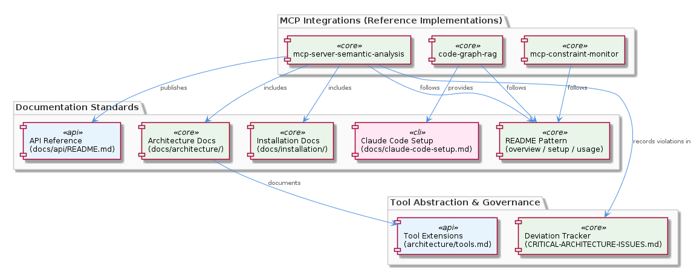
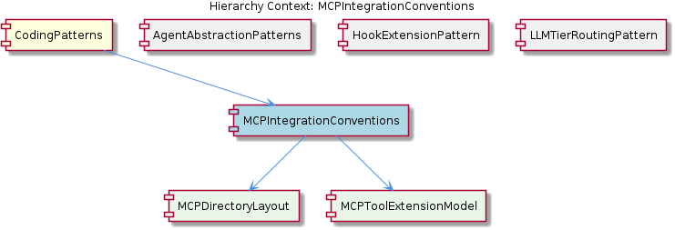

# MCPIntegrationConventions

**Type:** SubComponent

integrations/mcp-server-semantic-analysis/ follows the canonical MCP integration directory structure with subdirectories docs/architecture/, docs/api/, docs/installation/, and docs/configuration.md, establishing the expected layout new integrations must mirror

# MCPIntegrationConventions

## What It Is

MCPIntegrationConventions is a SubComponent of the broader CodingPatterns family that codifies the structural, documentation, and extension conventions every MCP (Model Context Protocol) server integration in this repository must follow. It is implemented as a set of concrete reference layouts under the `integrations/` directory, most notably `integrations/mcp-server-semantic-analysis/`, `integrations/mcp-constraint-monitor/`, and `integrations/code-graph-rag/`. These three integrations together form the canonical template that new MCP servers are expected to mirror.

Rather than being expressed as code, this convention lives primarily as a directory and documentation contract. The `integrations/mcp-server-semantic-analysis/` tree — with its `docs/architecture/`, `docs/api/`, `docs/installation/`, and `docs/configuration.md` subdirectories — serves as the reference implementation that fixes the expected shape of an MCP integration. The convention's purpose is to ensure that any MCP server added to the project is discoverable, documented, and extensible in a predictable way, both for human contributors and for the Claude Code clients that consume these servers.

## Architecture and Design

The architectural approach is a **template-by-example** convention: rather than enforcing structure through tooling or a scaffold generator, the project establishes one or more reference integrations whose layout is treated as normative. The convention decomposes into two formally tracked child sub-conventions: MCPDirectoryLayout and MCPToolExtensionModel. MCPDirectoryLayout captures the file and folder organization (evidenced by `integrations/mcp-server-semantic-analysis/docs/architecture/` containing `README.md`, `agents.md`, `integration.md`, and `tools.md` as multiple focused documents rather than a single monolithic file). MCPToolExtensionModel captures the extension-point philosophy embodied in `integrations/mcp-server-semantic-analysis/docs/architecture/tools.md`, which is titled "Tool Extensions" and treats tools as plug-in capabilities rather than core server logic.

The design also formalizes a process for handling deviations. The presence of `integrations/mcp-server-semantic-analysis/CRITICAL-ARCHITECTURE-ISSUES.md`, which records a resolved architectural deviation, demonstrates that the convention is not just a static template — it includes an expected practice of documenting structural violations and their resolutions in-tree. This makes the convention self-correcting: architectural drift is surfaced as a tracked artifact rather than absorbed silently.

Consistency across integrations is reinforced by the fact that both `integrations/mcp-constraint-monitor/README.md` and `integrations/code-graph-rag/README.md` follow the same overview/setup/usage README structure. This horizontal consistency across siblings — including additional documentation like `integrations/code-graph-rag/docs/claude-code-setup.md` for client setup — confirms that the convention is actually being followed rather than aspirational.

## Implementation Details

The canonical directory structure consists of:

- A top-level `README.md` per integration following an overview/setup/usage template (visible in both `integrations/mcp-constraint-monitor/README.md` and `integrations/code-graph-rag/README.md`).
- A `docs/architecture/` subdirectory containing multiple focused architecture documents. The reference set in `integrations/mcp-server-semantic-analysis/docs/architecture/` includes `README.md`, `agents.md`, `integration.md`, and `tools.md`.
- A `docs/api/README.md` file providing an API Reference that documents tool endpoints in a uniform format. This is the contract surface that downstream MCP clients depend on.
- A `docs/installation/` subdirectory for installation procedures.
- A `docs/configuration.md` file at the documentation root for configuration reference.
- A client-setup document targeted at Claude Code consumers, exemplified by `integrations/code-graph-rag/docs/claude-code-setup.md`.

The MCPToolExtensionModel child component prescribes that an integration's capabilities are exposed through a named-tool abstraction layer. The architecture document `integrations/mcp-server-semantic-analysis/docs/architecture/tools.md` makes this explicit by framing tools as "Tool Extensions" — extension points layered over a stable server core. This separation enables tools to be added, modified, or removed without touching server scaffolding.

The architectural-issue tracking pattern is implemented as a top-level Markdown file (e.g., `CRITICAL-ARCHITECTURE-ISSUES.md`) sitting alongside the `README.md`. Its prominence in the integration root makes deviations highly visible to anyone navigating the directory.

## Integration Points

MCPIntegrationConventions sits inside its parent CodingPatterns container, alongside sibling patterns AgentAbstractionPatterns, HookExtensionPattern, and LLMTierRoutingPattern. The relationship to siblings is non-trivial: HookExtensionPattern is realized within `integrations/mcp-constraint-monitor/docs/CLAUDE-CODE-HOOK-FORMAT.md`, meaning a single MCP integration directory simultaneously embodies the MCPIntegrationConventions layout *and* hosts the documentation for HookExtensionPattern's data contract. Similarly, LLMTierRoutingPattern is documented in `integrations/mcp-server-semantic-analysis/docs/TIERED-MODEL-PROPOSAL.md`, which is itself a document living inside an MCP integration that follows these conventions. The convention therefore acts as a host for several other patterns' documentation.

The relationship to the parent CodingPatterns — particularly its Agent Lazy-Initialization Pattern — is indirect but compatible: MCP integrations that wrap agent functionality are expected to honor the constructor/initialize() split that CodingPatterns mandates, and the architecture documents under `docs/architecture/agents.md` are the appropriate place to document any agent-lifecycle specifics for the integration.

The convention's two children, MCPDirectoryLayout and MCPToolExtensionModel, are the concrete contracts it composes. MCPDirectoryLayout governs *where* things live; MCPToolExtensionModel governs *how* capabilities are exposed. The primary external integration point is the Claude Code client itself: the `docs/claude-code-setup.md` and `docs/api/README.md` files together form the consumer-facing surface that allows Claude Code to discover, install, and invoke each MCP server.

## Usage Guidelines

When adding a new MCP integration, mirror the directory layout established in `integrations/mcp-server-semantic-analysis/`. Create the `docs/architecture/`, `docs/api/`, and `docs/installation/` subdirectories, a `docs/configuration.md`, and a top-level `README.md` following the overview/setup/usage structure observed across `integrations/mcp-constraint-monitor/README.md` and `integrations/code-graph-rag/README.md`. Always publish an `docs/api/README.md` documenting tool endpoints in the uniform format used by the reference integration — this is the contract that Claude Code consumers depend on.

Split architecture documentation into focused files (`README.md`, `agents.md`, `integration.md`, `tools.md`) rather than a single monolithic document. This is a deliberate decision driven by the child MCPDirectoryLayout convention and aids both navigation and incremental review. Provide a dedicated client-setup document such as `docs/claude-code-setup.md` so that Claude Code users have an explicit entry point separate from general installation instructions.

Expose capabilities exclusively through the named-tool abstraction described in `docs/architecture/tools.md` ("Tool Extensions"). Treat tools as extension points — do not bury capability logic in core server code, as this would violate the MCPToolExtensionModel child convention and complicate future tool additions. When agents are part of the integration, document their lifecycle in `docs/architecture/agents.md` and respect the parent CodingPatterns' Agent Lazy-Initialization Pattern in any code that performs LLM client setup.

If a structural deviation arises, document it explicitly in a top-level Markdown file (following the precedent of `integrations/mcp-server-semantic-analysis/CRITICAL-ARCHITECTURE-ISSUES.md`) and resolve it through visible, tracked work. The convention assumes that drift is surfaced rather than hidden, so silent deviations — even small ones — are stronger violations than well-documented temporary departures.

---

**Summary of analytical points:**

1. **Architectural patterns identified:** Template-by-example convention, separation of layout (MCPDirectoryLayout) from extension model (MCPToolExtensionModel), named-tool extension points, documentation-as-contract for client consumption.
2. **Design decisions and trade-offs:** Multiple focused architecture documents instead of a monolithic one (favors navigability over single-source consolidation); convention enforcement via reference example rather than scaffold tooling (favors flexibility and low ceremony, at the cost of relying on human discipline); explicit in-tree tracking of architectural deviations (favors transparency over a clean façade).
3. **System structure insights:** The `integrations/` directory is a flat collection of self-similar subprojects, each mirroring the same internal shape; MCP integrations double as host directories for sibling patterns' documentation (HookExtensionPattern, LLMTierRoutingPattern).
4. **Scalability considerations:** New integrations scale horizontally by cloning the canonical layout; the tool-as-extension model lets individual servers grow capability surface without restructuring; documentation uniformity keeps cognitive overhead constant as the integration count grows.
5. **Maintainability assessment:** Strong — the convention is observable, consistent across three sibling integrations, and includes a documented escape valve (CRITICAL-ARCHITECTURE-ISSUES.md) for managed deviation. The main maintainability risk is that the convention is enforced socially rather than mechanically, so onboarding documentation and code review remain the only guarantees of continued adherence.

## Hierarchy Context

### Parent
- [CodingPatterns](./CodingPatterns.md) -- [LLM] Agent Lazy-Initialization Pattern: Across the Coding project's agent implementations, a consistent lazy-initialization idiom is applied where LLM client setup is deferred until actual execution rather than performed at construction time. This pattern is documented in docs/puml/agent-integration-flow.puml and docs/puml/agent-abstraction-architecture.puml. The motivation is to avoid paying the cost of LLM connection setup (which may involve network calls, credential validation, and model loading) when an agent object is instantiated—particularly important in systems where many agent types are registered but only a subset are invoked per workflow. A new developer working on an agent should expect a two-phase lifecycle: a lightweight constructor that stores configuration references, followed by an initialize() or setup() method (or equivalent lazy property) that establishes the actual LLM connection on first use. Violating this convention by eagerly connecting in the constructor would break the startup performance characteristics that the rest of the system assumes.

### Children
- [MCPDirectoryLayout](./MCPDirectoryLayout.md) -- integrations/mcp-server-semantic-analysis/docs/architecture/README.md, agents.md, integration.md, and tools.md confirm a dedicated architecture subdirectory with multiple focused documents rather than a single monolithic file
- [MCPToolExtensionModel](./MCPToolExtensionModel.md) -- integrations/mcp-server-semantic-analysis/docs/architecture/tools.md is titled 'Tool Extensions', indicating tools are treated as extension points rather than core server logic

### Siblings
- [AgentAbstractionPatterns](./AgentAbstractionPatterns.md) -- docs/puml/agent-abstraction-architecture.puml documents the base agent interface enforcing the constructor/initialize() split, ensuring all concrete agent types adhere to the same lifecycle contract
- [HookExtensionPattern](./HookExtensionPattern.md) -- integrations/mcp-constraint-monitor/docs/CLAUDE-CODE-HOOK-FORMAT.md documents the data format Claude Code emits at hook points, defining the contract between the hook producer and constraint-monitor consumer
- [LLMTierRoutingPattern](./LLMTierRoutingPattern.md) -- integrations/mcp-server-semantic-analysis/docs/TIERED-MODEL-PROPOSAL.md documents the formal proposal for tiered model selection, establishing the rationale and design that llm-providers.yaml implements

---

*Generated from 6 observations*
