# Comprehensive Knowledge Management System Pattern

*A complete implementation pattern for automated knowledge capture, visualization, and sharing in development teams*

## Overview

This document captures a comprehensive knowledge management system that automatically extracts, structures, and visualizes development insights from multiple sources including git commits, AI-assisted conversations, and manual expert input. The system transforms conventional development artifacts into a persistent knowledge graph that enables pattern recognition, knowledge sharing, and transferable learning across projects and teams.

## System Architecture

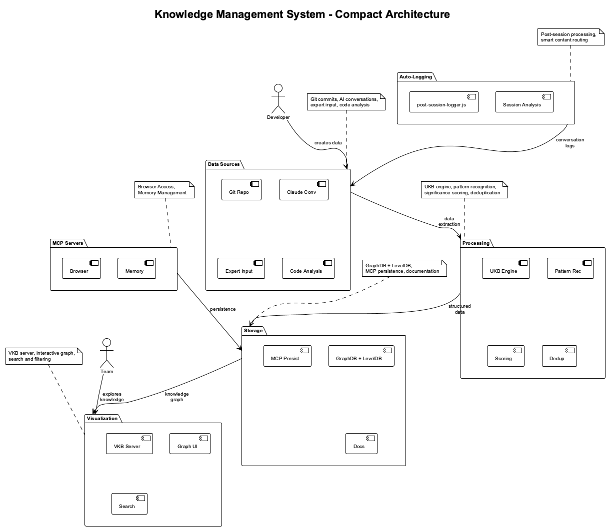

## Interactive Knowledge Visualizer

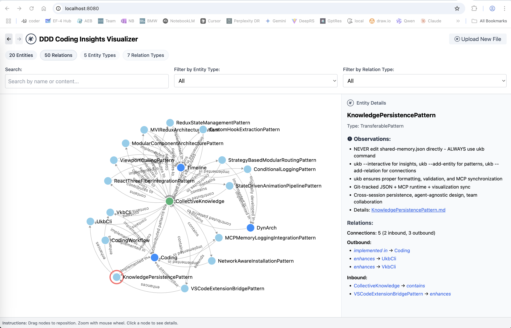

The knowledge visualizer provides an interactive D3.js-based graph interface that allows teams to explore their knowledge base visually. Key features include:

### Visual Elements
- **Node Types**: Different colors represent entity types (System=green, Project=blue, Patterns=default)
- **Node Sizes**: Proportional to significance scores (1-10 scale)
- **Edge Connections**: Show relationships between concepts and projects
- **Interactive Navigation**: Click, drag, zoom, and pan for exploration

### User Interface Features
- **Search Functionality**: Find specific entities by name or content
- **Type Filtering**: Show/hide different entity types
- **Relationship Filtering**: Focus on specific relationship types
- **Detail Panels**: Click nodes to view full observations and metadata
- **Documentation Links**: Direct access to detailed insight files

### Real-Time Data
- **Live Updates**: Automatically refreshes when VKB server restarts
- **Git Integration**: Reflects latest shared-memory.json from repository
- **Cross-Platform**: Works in any modern web browser
- **Local Hosting**: Runs on localhost:8080 for security and speed

The system implements a multi-layered architecture with clear separation of concerns:

### 1. Data Sources Layer
- **Git Repository**: Conventional commits with structured message format
- **Claude Code Conversations**: AI-assisted development sessions (.specstory/history)
- **Manual Expert Input**: Interactive insight capture sessions
- **Code Analysis**: Static analysis of architectural patterns and changes

### 2. Processing Layer
- **UKB (Update Knowledge Base)**: Intelligent extraction and analysis engine
- **Pattern Recognition**: Automated identification of transferable knowledge
- **Significance Scoring**: AI-assisted ranking of insights (1-10 scale)
- **Deduplication**: Entity consolidation and relationship mapping

### 3. Storage Layer - Dual Architecture
- **shared-memory.json**: Authoritative knowledge graph (git-tracked, team-shared)
- **MCP Memory Server**: Runtime knowledge graph database (session-persistent, query-optimized)
- **Detailed Documentation**: Markdown files in knowledge-management/insights/

#### MCP Memory Server Integration
The MCP memory server provides a runtime knowledge graph database that works alongside the file-based storage:

**Available MCP Tools:**
- `mcp__memory__create_entities` - Add new knowledge entities to runtime graph
- `mcp__memory__create_relations` - Link entities together in memory
- `mcp__memory__search_nodes` - Fast querying of the knowledge graph
- `mcp__memory__read_graph` - Read current runtime graph state
- `mcp__memory__add_observations` - Add details to existing entities

**Data Flow:**
```
UKB Engine → shared-memory.json → MCP Sync Instructions → Claude Code → MCP Memory Server
```

**Key Benefits:**
- **Cross-Session Persistence**: Knowledge survives Claude Code restarts
- **Fast Querying**: Optimized graph operations during conversations  
- **Team Collaboration**: Git-tracked authoritative storage enables knowledge sharing
- **Real-Time Updates**: Live knowledge graph operations during Claude sessions

### 4. Visualization Layer
- **VKB (View Knowledge Base)**: Server management and data conversion
- **Interactive Graph**: D3.js-based network visualization
- **Search and Filtering**: Entity type and relationship filtering
- **Documentation Links**: Direct access to detailed insight documentation

## Core Components

### System Integration Architecture

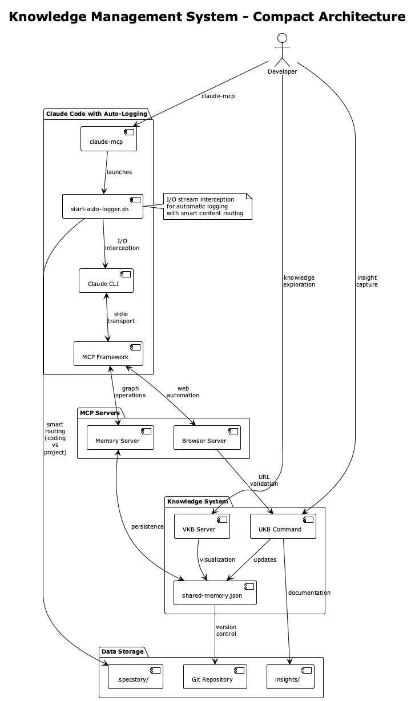

### Detailed System Architecture

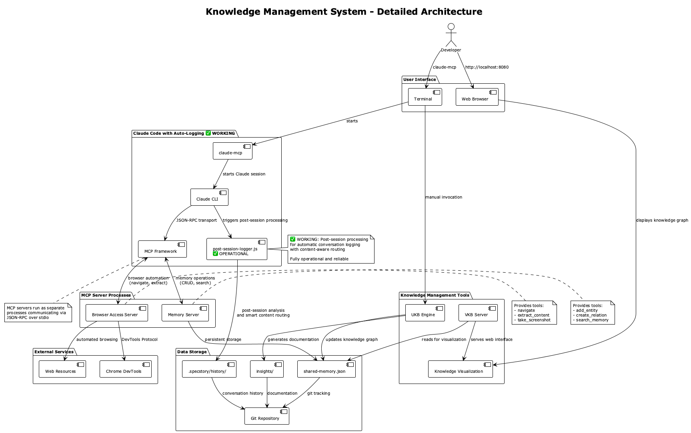

**Key Architectural Points:**
- **MCP Servers** run as separate processes communicating with Claude via JSON-RPC over stdio
- **Memory Server** provides persistent knowledge graph operations (add_entity, create_relation, search_memory)
- **Browser Server** enables web automation (navigate, extract_content, take_screenshot)
- **I/O Logger** operates independently of MCP, intercepting conversation streams
- **Smart Routing** ensures coding-related content goes to coding/.specstory/history/

### System Components

#### 1. Cross-Session Knowledge Access via MCP Memory

**Claude Code sessions actively access accumulated knowledge through the MCP memory server:**

```typescript
// Every claude-mcp session startup:
1. Loads shared-memory.json summary (12 entities, 21 relations)
2. Displays available patterns (ReduxStateManagement, ViewportCulling, etc.)
3. Activates MCP memory server for runtime queries
4. Enables knowledge-enhanced conversations
```

**Cross-Session Use Cases:**
- **Pattern Recognition**: "This looks like the ViewportCullingPattern from project X"
- **Solution Suggestion**: "Based on previous sessions, ReduxStateManagement solved similar issues"
- **Knowledge Building**: "This extends the ConditionalLoggingPattern - I'll update the knowledge base"

**Current Status**: ✅ **Auto-sync working** - shared-memory.json automatically syncs with MCP memory on startup via `.mcp-sync/sync-required.json` trigger.

#### 2. Automatic Conversation Logging (Post-Session Capture)

```bash
# Scripts: start-auto-logger.sh + post-session-logger.js + conversation-capture.js
# Purpose: Automatic conversation logging via post-session capture
# Key Features:
- Post-session conversation capture when Claude exits
- Smart content routing (coding vs project-specific)
- Cross-project knowledge preservation
- SpecStory-compatible logging format
- Zero manual intervention required
- Intelligent content classification for routing
```

**Implementation Details:**
- `start-auto-logger.sh`: Main entry point that starts Claude and sets up session tracking
- `post-session-logger.js`: Captures conversation after Claude exits and routes to appropriate repository
- `conversation-capture.js`: Real-time backup capture system with signal handlers
- **Content Classification**: Coding keywords → `coding/.specstory/history/`, others → current project

**Legacy MCP Server**: `claude-logger-mcp` still available for manual logging scenarios but replaced by post-session system for automatic logging.

#### 3. Browser Access MCP Server

```typescript
// Package: @browserbasehq/mcp-stagehand  
// Purpose: AI-powered browser automation for research and validation
// Key Features:
- Automated web navigation and data extraction
- URL validation for insight references
- Research automation for pattern verification
- Screenshot capture for documentation
```

#### 4. Memory Management MCP Server

```typescript
// Purpose: Persistent knowledge graph management
// Key Features:
- Entity and relationship CRUD operations
- Graph querying and search capabilities
- Git-based versioning
- Cross-session persistence
```

### Command Line Tools

#### UKB (Update Knowledge Base)

```bash
# Interactive mode for deep insight capture
ukb --interactive

# Automatic mode for session analysis  
ukb --auto

# Key capabilities:
- Commit analysis with significance scoring
- AI conversation pattern extraction
- Interactive expert knowledge capture
- Transferable pattern identification
```

#### VKB (View Knowledge Base)

```bash
# Start visualization server
vkb start

# Server management
vkb stop|restart|status|logs

# Key capabilities:
- Background HTTP server management
- Real-time data synchronization
- Browser integration
- Documentation serving
```

## Key Patterns and Innovations

### 1. Multi-Source Knowledge Extraction

**Problem**: Development insights are scattered across commits, conversations, and implicit expert knowledge.

**Solution**: Unified extraction pipeline that processes multiple data sources:

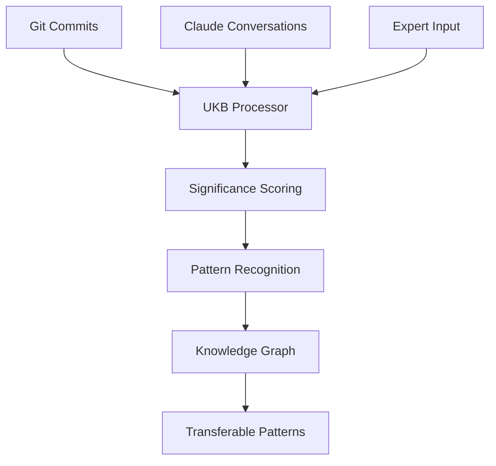

### 2. Significance-Based Filtering

**Innovation**: AI-assisted significance scoring prevents information overload by focusing on high-value insights.

```typescript
// Significance scoring algorithm
const calculateSignificance = (content: string, category: string) => {
  let score = getBaseCategoryScore(category); // 1-10 base score
  
  // Adjust for profound keywords
  const profoundKeywords = [
    'architecture', 'paradigm', 'scalability', 'refactor',
    'state management', 'performance breakthrough', 'system design'
  ];
  
  profoundKeywords.forEach(keyword => {
    if (content.toLowerCase().includes(keyword)) {
      score = Math.min(score + 1, 10);
    }
  });
  
  return score;
};
```

### 3. Transferable Pattern Extraction

**Pattern**: Automatic promotion of high-significance insights to transferable patterns linked to the central CodingKnowledge hub.

```json
{
  "name": "ReduxStateManagementPattern",
  "entityType": "TransferablePattern",
  "significance": 9,
  "problem": "Complex state management in React applications",
  "solution": "MVI architecture with Redux Toolkit and automatic persistence",
  "applicability": "Large React applications with complex state requirements",
  "technologies": ["TypeScript", "React", "Redux Toolkit"],
  "documentation_link": "knowledge-management/insights/redux-state-management.md"
}
```

### 4. Network-Aware Installation Pattern

**Innovation**: Enterprise-ready installation that adapts to network restrictions and multiple repository sources.

```bash
# Multi-stage network detection
detect_network_environment() {
    # Stage 1: SSH connectivity test
    if timeout 5s ssh -T git@corporate-github.domain.com; then
        NETWORK_TYPE="corporate"
    # Stage 2: External connectivity test
    elif timeout 5s curl -s https://google.com; then
        NETWORK_TYPE="external"
    else
        NETWORK_TYPE="restricted"
    fi
}
```

### 5. Interactive vs Automatic Modes

**Design**: Dual-mode operation balancing automation with expert knowledge capture.

- **Automatic Mode**: Conservative extraction focusing on clear architectural patterns
- **Interactive Mode**: Expert-guided deep insight capture with structured prompts
- **Hybrid Approach**: Automatic detection followed by interactive refinement

## Use Cases and Workflows

### Cross-Session Knowledge Usage

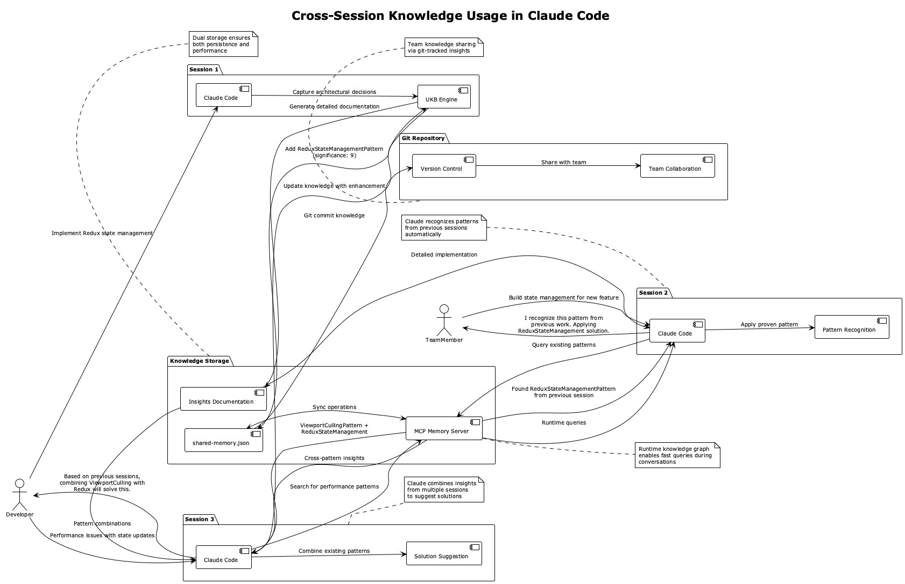

**How Claude Code Sessions Access Accumulated Knowledge:**

Every `claude-mcp` session provides Claude with access to the accumulated knowledge base:

1. **Session Startup**: Loads shared-memory.json summary showing available patterns and insights
2. **MCP Memory Server**: Activates runtime knowledge graph for fast querying  
3. **Pattern Recognition**: Claude can identify when current work matches previous patterns
4. **Solution Suggestions**: Claude suggests proven solutions from past sessions
5. **Knowledge Building**: Claude extends existing insights with new learnings

### MCP Memory Server Data Flow

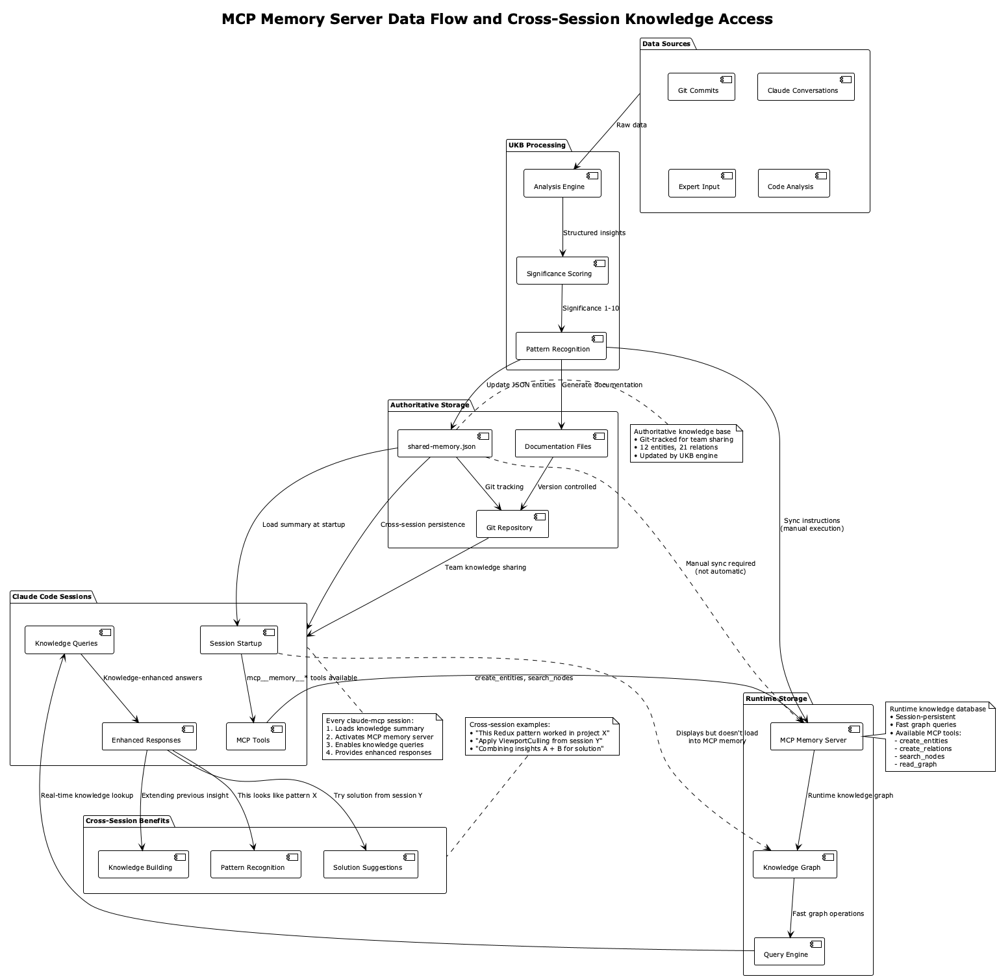

**Claude Code sessions actively consider everything in the knowledge base through:**

- **Startup Knowledge Loading**: Every session displays available patterns and insights
- **MCP Memory Tools**: Real-time access to `create_entities`, `search_nodes`, `read_graph`
- **Cross-Session Persistence**: Knowledge survives Claude Code restarts
- **Fast Graph Queries**: Optimized runtime database for knowledge operations
- **Documentation Access**: Direct file system access to detailed insight markdown files

**Current System Status:**
- ✅ **Knowledge Base Available**: Every session has access to accumulated insights
- ✅ **Pattern Recognition**: Claude can identify and apply previous solutions  
- ✅ **Documentation Access**: Full read access to insights/ markdown files via file tools
- ⚠️ **Manual Sync Required**: shared-memory.json updates need manual loading into MCP memory

### Daily Development Workflow

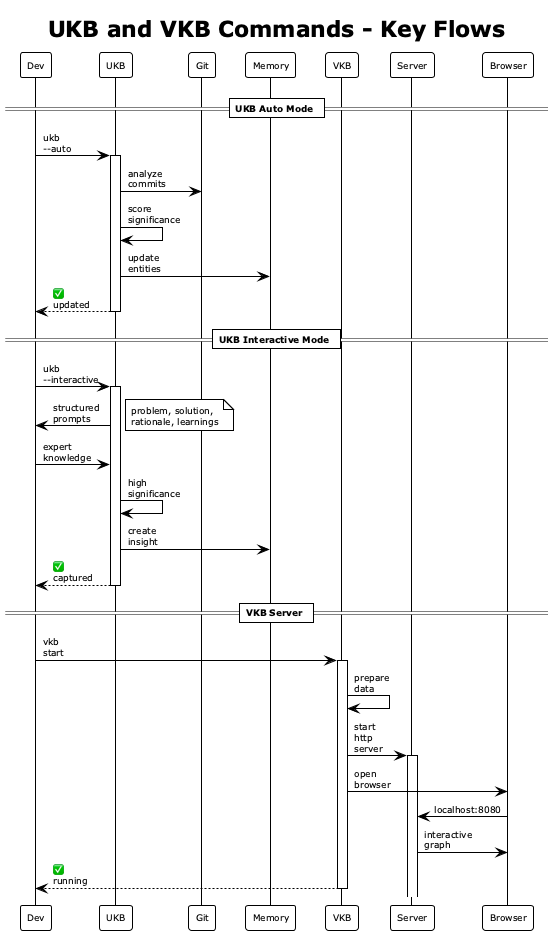

### Knowledge Discovery Workflow

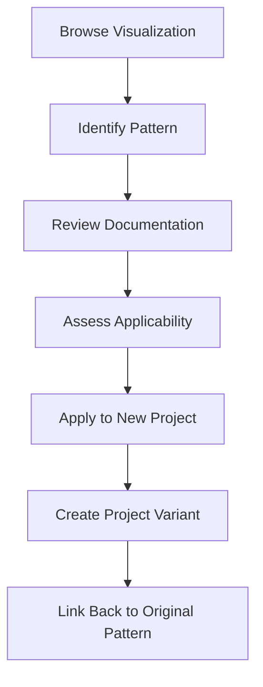

### Team Collaboration Workflow

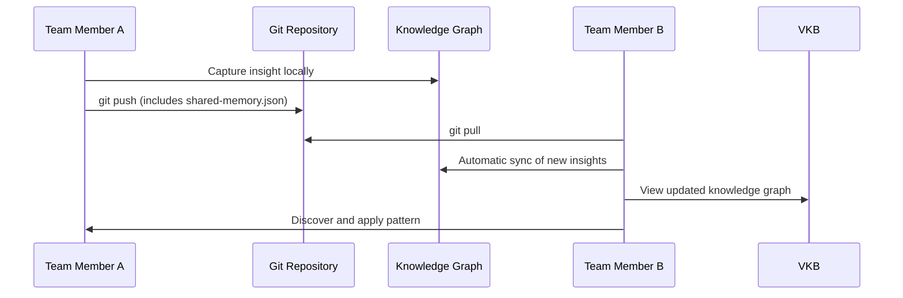

## Technical Implementation Details

### Entity Deduplication Strategy

```typescript
// Prevent orphaned entities through name-based deduplication
const deduplicateEntities = (entities: Entity[]) => {
  return entities
    .sort((a, b) => new Date(b.created) - new Date(a.created))
    .reduce((acc, entity) => {
      if (!acc.find(e => e.name === entity.name)) {
        acc.push(entity);
      }
      return acc;
    }, []);
};
```

### Real-Time Data Synchronization

```bash
# VKB server automatically refreshes data on restart
prepare_memory_data() {
    # Convert shared memory to NDJSON for visualizer
    {
        jq -r '.entities | group_by(.name) | map(max_by(.created)) | .[] | @json' "$SHARED_MEMORY"
        jq -r '.relations[] | @json' "$SHARED_MEMORY"
    } > "$VISUALIZER_DIR/dist/memory.json"
}
```

### URL Validation and Reference Management

```bash
# Automatic validation of insight references
validate_url() {
    local url="$1"
    local status_code
    status_code=$(curl -s -o /dev/null -w "%{http_code}" --max-time 10 "$url")
    [[ "$status_code" =~ ^[23][0-9][0-9]$ ]]
}
```

## Advanced Features

### 1. Conversation Analysis Pipeline

The system automatically analyzes Claude Code conversations to extract transferable patterns:

```typescript
// Pattern recognition from AI conversations
const extractPatterns = (conversation: string) => {
  const patterns = {
    architecture: /architecture|design pattern|refactor|restructure/i,
    debugging: /debug|troubleshoot|diagnose|root cause/i,
    performance: /performance|optimize|speed up|memory|efficient/i,
    stateManagement: /state management|redux|context|global state/i
  };
  
  return Object.entries(patterns)
    .filter(([_, regex]) => regex.test(conversation))
    .map(([pattern]) => pattern);
};
```

### 2. Automatic Documentation Generation

```bash
# Generate insight documentation with proper linking
create_insight_documentation() {
    local insight_name="$1"
    local doc_filename="${insight_name,,}.md"
    local doc_path="knowledge-management/insights/${doc_filename}"
    
    # Auto-generate documentation template
    cat > "$doc_path" << EOF
# ${insight_name}

## Problem
[Automatically extracted from insight data]

## Solution
[Automatically extracted from insight data]

## Implementation
[Links to relevant code files]

## Applicability
[Where this pattern can be applied]
EOF
}
```

### 3. Cross-Project Pattern Recognition

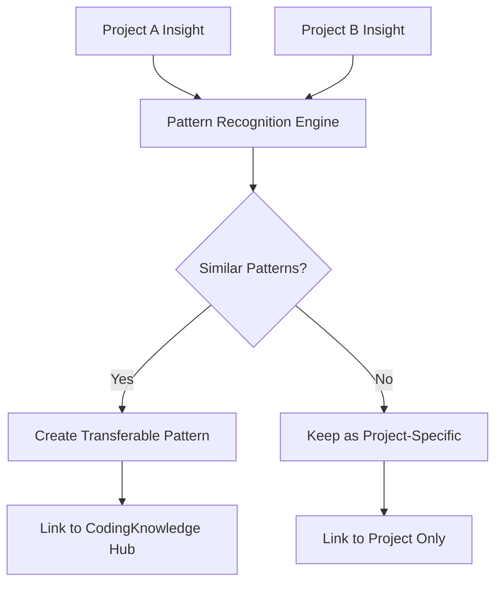

## Metrics and Analytics

### Knowledge Graph Metrics

```typescript
// Knowledge graph health metrics
interface KnowledgeMetrics {
  totalEntities: number;
  totalRelations: number;
  transferablePatterns: number;
  averageSignificance: number;
  coverageByProject: Record<string, number>;
  patternReusability: Record<string, number>;
}
```

### Usage Analytics

- **Pattern Application Frequency**: Track which patterns are most commonly referenced
- **Cross-Project Knowledge Transfer**: Measure pattern reuse across different projects
- **Expert Knowledge Capture Rate**: Monitor interactive vs automatic insight ratio
- **Documentation Access Patterns**: Identify most valuable insights

## Benefits and ROI

### For Individual Developers
1. **Personal Knowledge Base**: Never lose architectural decisions or problem-solving approaches
2. **Pattern Recognition**: Identify recurring solutions and optimize approaches
3. **Learning Acceleration**: Build on previous insights rather than starting from scratch

### For Development Teams
1. **Institutional Knowledge**: Capture and share expert knowledge across team members
2. **Onboarding Acceleration**: New team members can quickly understand team patterns
3. **Cross-Project Learning**: Apply successful patterns from one project to another

### for Organizations
1. **Knowledge Retention**: Prevent knowledge loss when team members leave
2. **Best Practice Propagation**: Spread successful patterns across multiple teams
3. **Innovation Tracking**: Identify and promote breakthrough solutions

## Implementation Checklist

### Phase 1: Basic Setup

- [ ] Install and configure MCP servers (claude-logger, memory, browser-access)
- [ ] Set up git repository with conventional commit format
- [ ] Create knowledge-management directory structure
- [ ] Configure UKB and VKB commands with proper paths

### Phase 2: Automated Capture

- [ ] Enable automatic conversation logging
- [ ] Configure ukb for daily session analysis
- [ ] Set up visualization server (vkb)
- [ ] Establish git tracking for shared-memory.json

### Phase 3: Expert Knowledge Integration

- [ ] Train team on interactive insight capture (ukb --interactive)
- [ ] Establish significance scoring guidelines
- [ ] Create documentation templates for insights
- [ ] Set up regular knowledge review sessions

### Phase 4: Advanced Features

- [ ] Implement cross-project pattern recognition
- [ ] Set up automated documentation generation
- [ ] Configure team collaboration workflows
- [ ] Add analytics and metrics tracking

## Related Patterns

This knowledge management system builds on and integrates several key patterns:

- **Redux State Management Pattern**: Demonstrates how individual technical patterns feed into the knowledge system
- **Network-Aware Installation Pattern**: Shows enterprise deployment considerations
- **MCP Server Architecture**: Illustrates modular component design
- **Git-Based Team Collaboration**: Leverages version control for knowledge sharing

## Future Enhancements

### 1. AI-Powered Insights

- Automatic insight generation from code analysis
- Pattern suggestion based on current project context
- Intelligent relationship inference between concepts

### 2. Enhanced Visualization

- Interactive filtering and search capabilities
- Timeline view of knowledge evolution
- Collaborative annotation and discussion features

### 3. Integration Ecosystem

- IDE plugins for real-time insight capture
- CI/CD integration for automated pattern detection
- Slack/Teams integration for knowledge sharing notifications

## Conclusion

This comprehensive knowledge management system represents a paradigm shift from implicit to explicit knowledge capture in software development. By automatically extracting insights from multiple sources, applying AI-assisted significance scoring, and providing interactive visualization, it creates a persistent learning system that scales with team growth and project complexity.

The system's strength lies in its multi-modal approach: combining the convenience of automated extraction with the depth of expert knowledge capture, all while maintaining enterprise-grade reliability and team collaboration features. For organizations serious about knowledge retention and accelerated learning, this pattern provides a proven blueprint for implementation.

## Metadata

- **Pattern Type**: System Architecture
- **Significance**: 10/10 (Foundational system with broad applicability)
- **Technologies**: TypeScript, Node.js, Python, Bash, D3.js, Git, MCP
- **Applicable Domains**: Software development teams, R&D organizations, consulting firms
- **Implementation Complexity**: High (requires multiple components and careful integration)
- **Maintenance Requirements**: Medium (primarily configuration and content curation)
- **ROI Timeline**: 3-6 months for individual benefits, 6-12 months for team benefits
