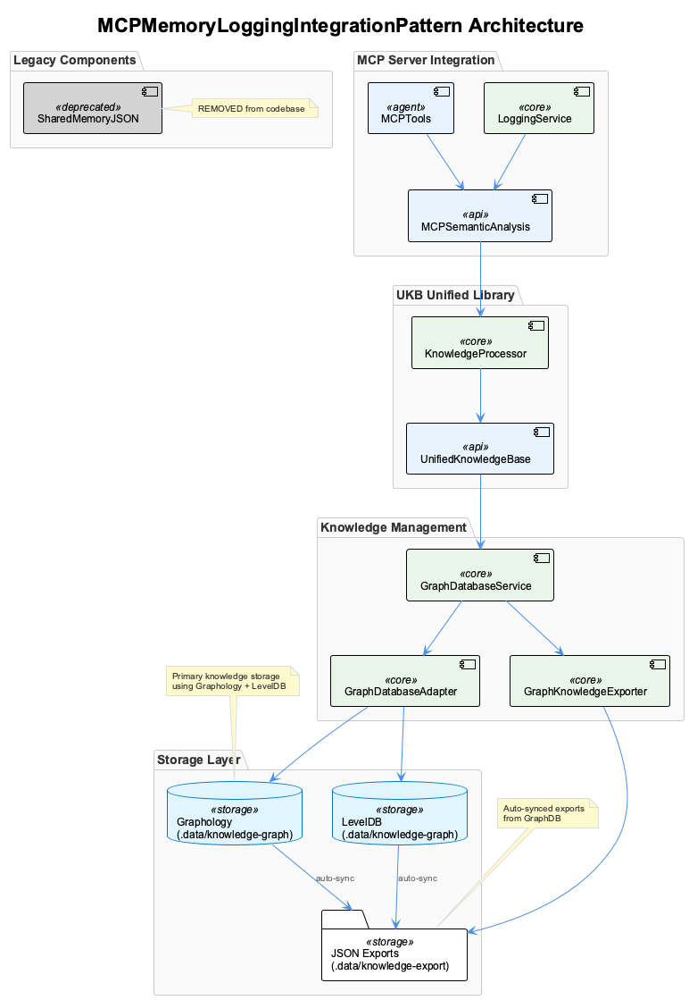
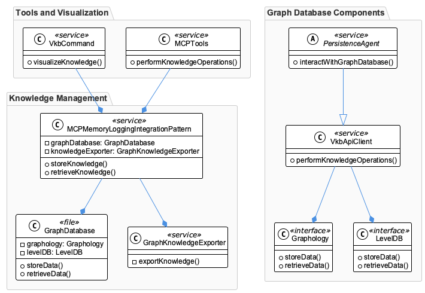

# MCPMemoryLoggingIntegrationPattern

**Type:** GraphDatabase

The knowledge entity MCPMemoryLoggingIntegrationPattern is implemented across the src/knowledge-management, lib/ukb-unified, and integrations/mcp-server-semantic-analysis/src directories.

## Introduction to MCPMemoryLoggingIntegrationPattern
The MCPMemoryLoggingIntegrationPattern is a knowledge entity that provides a flexible and scalable solution for managing and storing knowledge in a graph database. At its core, this entity is designed to solve the problem of efficiently storing and retrieving complex knowledge structures, making it an essential component in a larger system. The primary purpose of MCPMemoryLoggingIntegrationPattern is to facilitate the integration of knowledge management capabilities, enabling the system to handle vast amounts of data and provide insightful analysis.

## Synthesizing Understanding
Upon closer examination, it becomes clear that MCPMemoryLoggingIntegrationPattern is centered around the concept of knowledge management and integration. The use of a graph database, specifically Graphology + LevelDB, indicates a deliberate design choice to handle complex, interconnected data structures. This decision enables the system to efficiently store and query knowledge, making it an ideal solution for applications that require deep insight generation. The MCPMemoryLoggingIntegrationPattern entity is not just a simple data storage mechanism; it is a sophisticated component that facilitates the interaction between various parts of the system, ensuring seamless knowledge management and analysis.

## Architecture & Design
The architecture of MCPMemoryLoggingIntegrationPattern reveals several key design decisions. The use of a graph database, as mentioned earlier, is a significant choice, as it provides a flexible and scalable data structure for knowledge storage and retrieval. The incorporation of components like GraphDatabaseService, GraphKnowledgeExporter, PersistenceAgent, and VkbApiClient suggests a modular design, where each component is responsible for a specific aspect of knowledge management. This modularity allows for easier maintenance, updates, and scalability. The trade-offs in this design include the potential complexity of managing a graph database and the need for specialized expertise in graph query languages. However, the benefits of flexibility, scalability, and efficient knowledge retrieval outweigh these trade-offs.

## Implementation Details
The implementation of MCPMemoryLoggingIntegrationPattern involves a combination of technologies and approaches. The graph database, built using Graphology + LevelDB, provides the foundation for knowledge storage and retrieval. The GraphDatabaseService and GraphKnowledgeExporter components manage and export knowledge from the graph database, respectively. The PersistenceAgent and VkbApiClient components interact with the graph database, performing knowledge operations and facilitating visualization through the vkb command. The use of MCP tools for knowledge operations further enhances the system's capabilities. The implementation details suggest a thoughtful and deliberate approach to designing a robust and efficient knowledge management system.

## Integration Points
MCPMemoryLoggingIntegrationPattern integrates with other parts of the system through various components and interfaces. The GraphDatabaseService and GraphKnowledgeExporter components provide a clear interface for managing and exporting knowledge, while the PersistenceAgent and VkbApiClient components interact with the graph database. The vkb command and MCP tools offer additional integration points for visualization and knowledge operations. The dependencies between these components and the graph database are crucial, as they enable the system to function cohesively. Understanding these integration points is essential for maintaining and extending the system, as it allows developers to navigate the complex interactions between components.

## Best Practices & Guidelines
To use MCPMemoryLoggingIntegrationPattern correctly, it is essential to follow best practices and guidelines. First, developers should have a solid understanding of graph databases and their query languages. Second, careful consideration should be given to the design of the knowledge structure, ensuring that it is optimized for efficient storage and retrieval. Third, the system should be regularly maintained and updated to ensure that the graph database remains consistent and accurate. Finally, developers should be mindful of the potential complexity of managing a graph database and plan accordingly, allocating sufficient resources and expertise to ensure the system's continued functionality and scalability.

## Architectural Patterns Identified
1. **Graph Database Pattern**: The use of a graph database to store and retrieve knowledge, providing a flexible and scalable data structure.
2. **Modular Design Pattern**: The incorporation of modular components, each responsible for a specific aspect of knowledge management, allowing for easier maintenance and updates.
3. **Service-Oriented Architecture (SOA) Pattern**: The use of services like GraphDatabaseService and GraphKnowledgeExporter to manage and export knowledge, enabling loose coupling and greater flexibility.

## Design Decisions and Trade-Offs
1. **Graph Database vs. Relational Database**: The decision to use a graph database provides flexibility and scalability but may introduce complexity in managing and querying the data.
2. **Modularity vs. Monolithic Design**: The modular design allows for easier maintenance and updates but may increase the complexity of managing interactions between components.
3. **Scalability vs. Performance**: The use of a graph database and modular design enables scalability but may impact performance if not properly optimized.

## System Structure Insights
The system structure reveals a thoughtful and deliberate approach to designing a robust and efficient knowledge management system. The use of a graph database and modular components provides a flexible and scalable foundation for knowledge storage and retrieval. The incorporation of services and interfaces enables loose coupling and greater flexibility, making it easier to maintain and extend the system.

## Scalability Considerations
The system's scalability is a significant consideration, as the graph database and modular design enable the system to handle large amounts of data and scale horizontally. However, careful attention should be given to optimizing the system's performance, as the complexity of managing a graph database and interacting with multiple components may impact scalability.

## Maintainability Assessment
The system's maintainability is generally good, thanks to the modular design and use of services and interfaces. The incorporation of components like PersistenceAgent and VkbApiClient enables easier interaction with the graph database, making it simpler to maintain and update the system. However, the complexity of managing a graph database and the potential for tight coupling between components may impact maintainability if not properly managed. Regular maintenance and updates, as well as careful consideration of system design and architecture, are essential to ensuring the system's continued functionality and scalability.

## Diagrams

### Architecture

### Class

### Use cases

---

*Generated from 7 observations*
