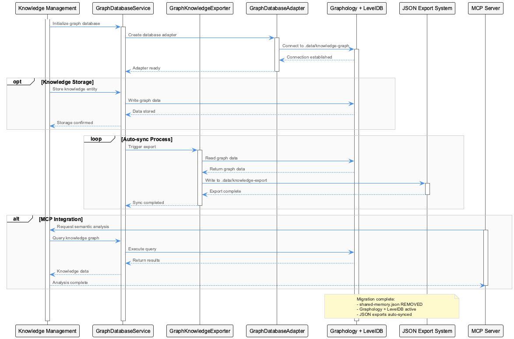

# MCPMemoryLoggingIntegrationPattern

**Type:** TransferablePattern

MCPMemoryLoggingIntegrationPattern is implemented across: src/knowledge-management, lib/ukb-unified, integrations/mcp-server-semantic-analysis/src

## What It Is

- MCPMemoryLoggingIntegrationPattern is implemented across: src/knowledge-management, lib/ukb-unified, integrations/mcp-server-semantic-analysis/src

- shared-memory.json has been REMOVED from the codebase

- JSON exports are at .data/knowledge-export (auto-synced from GraphDB)

- Core components: GraphDatabaseService, GraphKnowledgeExporter, GraphDatabaseAdapter

## Diagrams

### Architecture

### Sequence

### Class

### Use cases

---

*Generated from 5 observations*
