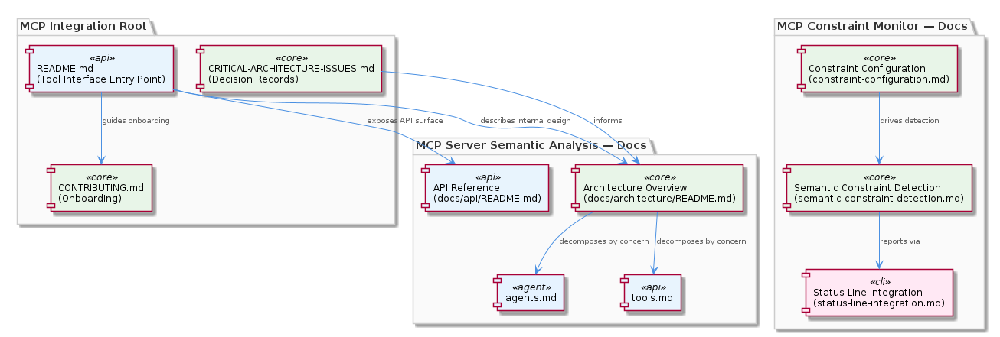
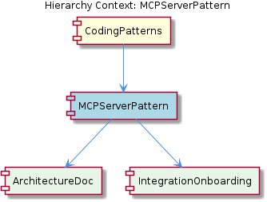

# MCPServerPattern

**Type:** SubComponent

Each integration maintains a top-level README.md describing the tool interface: integrations/mcp-constraint-monitor/README.md ('MCP Constraint Monitor'), integrations/mcp-server-semantic-analysis/README.md ('MCP Server - Semantic Analysis'), and integrations/code-graph-rag/README.md each serve as the primary tool description entry point.

# MCPServerPattern

## What It Is

MCPServerPattern is the enforced structural convention governing how MCP (Model Context Protocol) server integrations are organized within the project. It is instantiated across three concrete integrations: `integrations/mcp-constraint-monitor/`, `integrations/mcp-server-semantic-analysis/`, and `integrations/code-graph-rag/`. Each of these directories is a self-contained MCP server implementation that conforms to the same scaffolding rules: a root `README.md` describing the tool interface, a `docs/` subdirectory carrying architectural and onboarding material, and configuration files declaring tool schemas to AI agent hosts.

As a SubComponent of CodingPatterns, MCPServerPattern represents one of the project's explicitly enforced conventions rather than an organic coincidence. The uniformity across all three integrations signals that this structure is expected to be replicated when new MCP tools are introduced. Its two recognized child components — ArchitectureDoc and IntegrationOnboarding — formalize the internal documentation obligations that every integration must satisfy.

## Architecture and Design

The pattern imposes a two-tier documentation architecture within each integration. The first tier is the root `README.md`, which serves as the external-facing tool description — the entry point for any consumer or AI agent host trying to understand what the integration does. The second tier is the `docs/` subdirectory, which carries internal design detail at whatever depth the integration warrants. `integrations/mcp-constraint-monitor/docs/` demonstrates that this subdirectory can house multiple focused documents such as `constraint-configuration.md`, `semantic-constraint-detection.md`, and `status-line-integration.md`, each addressing a distinct architectural concern without collapsing them into a monolithic file.

`integrations/mcp-server-semantic-analysis/` pushes this further by splitting `docs/` into `docs/api/` and `docs/architecture/`, establishing an explicit separation between the external API surface (`docs/api/README.md`) and internal design decisions (`docs/architecture/README.md`). The architecture subdirectory is itself decomposed by concern into `agents.md`, `tools.md`, and `integration.md` — corresponding to the ArchitectureDoc child component — rather than being a single sprawling document. This decomposition-by-concern principle is a deliberate design decision that keeps each document focused and independently navigable.

A notable design accommodation is the presence of `integrations/mcp-server-semantic-analysis/CRITICAL-ARCHITECTURE-ISSUES.md` at the integration root. This elevates decision records and resolved architectural issues to first-class documentation artifacts, meaning the pattern explicitly supports capturing the history of significant design problems alongside the forward-looking reference material. This is a meaningful trade-off: it adds noise at the root level but ensures critical context is never buried inside `docs/`.

## Implementation Details

The structural mechanics of MCPServerPattern can be described as a directory contract. Every conforming integration is expected to provide at minimum: a root `README.md` with tool description, an API reference document, and a configuration file declaring tool schemas. Beyond this minimum, the `docs/` subdirectory is open-ended — it supports arbitrary depth and arbitrary document decomposition.

The IntegrationOnboarding child component is realized concretely in `integrations/code-graph-rag/CONTRIBUTING.md` and `integrations/code-graph-rag/docs/claude-code-setup.md`. The `CONTRIBUTING.md` is scoped to the individual integration rather than delegating to a top-level project guide, which means onboarding context travels with the integration itself. This is a deliberate locality decision: a developer cloning or examining a single integration directory gets everything they need without navigating to a project root.

The ArchitectureDoc child component is most fully expressed in `integrations/mcp-server-semantic-analysis/docs/architecture/`, where `agents.md`, `tools.md`, and `integration.md` separate agent design, tool extension points, and integration behavior respectively. This three-way decomposition reflects the natural concern boundaries of an MCP server: how agents are structured, what tools they expose, and how the whole assembly integrates with external systems.

## Integration Points

MCPServerPattern sits inside CodingPatterns, which means its conventions are governed at the project-wide coding standards level. Any enforcement mechanism, linting rule, or scaffolding script that CodingPatterns introduces would propagate down to MCPServerPattern and, by extension, to every integration directory. New integrations added to `integrations/` are implicitly expected to conform to this pattern by virtue of the existing three implementations establishing precedent.

The pattern's relationship to AI agent hosts is implicit but structurally important: the root `README.md` and tool schema configuration files are the integration points that agent hosts consume. The `docs/` content is primarily for human developers, while the schema configuration is the machine-readable surface. This division of audience within the same directory structure is a key design insight.

## Usage Guidelines

When scaffolding a new MCP server integration, developers should create the full directory contract immediately rather than adding documentation incrementally. The three existing integrations demonstrate that the `docs/` structure, onboarding guides, and API references are not afterthoughts — they are structural requirements of the pattern. At minimum: provide a root `README.md`, a `docs/api/README.md` for tool schema documentation, and a `CONTRIBUTING.md` or setup guide fulfilling the IntegrationOnboarding obligation.

For integrations of sufficient complexity, adopt the `docs/api/` and `docs/architecture/` split used by `mcp-server-semantic-analysis`. This separation prevents API reference material and internal design rationale from mixing, which degrades navigability as an integration grows. When the architecture subdirectory itself grows, decompose it by concern (agents, tools, integration) rather than appending to a single file.

Decision records and resolved architectural issues should be surfaced at the integration root as standalone files in the style of `CRITICAL-ARCHITECTURE-ISSUES.md`. Burying such context inside `docs/` reduces its visibility; placing it at the root ensures it is encountered during any initial exploration of the integration. This convention is particularly important for MCP servers, where tool schema decisions and agent interaction patterns often have non-obvious constraints that future developers need to understand immediately.

## Hierarchy Context

### Parent
- [CodingPatterns](./CodingPatterns.md) -- [LLM] The MCP (Model Context Protocol) server pattern is applied uniformly across all three major integrations: mcp-constraint-monitor, mcp-server-semantic-analysis, and code-graph-rag. Each integration follows a consistent directory layout with a README.md describing the tool interface, a docs/ subdirectory containing architectural detail, and configuration files that declare the tool's capabilities to AI agent hosts. This pattern means new integrations can be scaffolded by copying this structure and registering new tool definitions. The mcp-server-semantic-analysis integration further documents this in docs/api/README.md and docs/architecture/README.md, separating API surface from internal architecture. Developers adding a new MCP tool should expect to create at minimum: a README with tool description, an API reference doc, and a configuration file declaring tool schemas. The consistency of this pattern across integrations suggests it is an enforced project convention rather than an organic coincidence.

### Children
- [ArchitectureDoc](./ArchitectureDoc.md) -- integrations/mcp-server-semantic-analysis/docs/architecture/ contains three focused documents: agents.md ('Agent Architecture'), tools.md ('Tool Extensions'), and integration.md ('Integration Patterns'), separating concerns across agent design, tool extension points, and integration behavior.
- [IntegrationOnboarding](./IntegrationOnboarding.md) -- integrations/code-graph-rag/CONTRIBUTING.md ('Contributing to Code Graph RAG') provides contribution-specific guidance scoped to the code-graph-rag integration, separate from any top-level project CONTRIBUTING.md.

---

*Generated from 6 observations*
