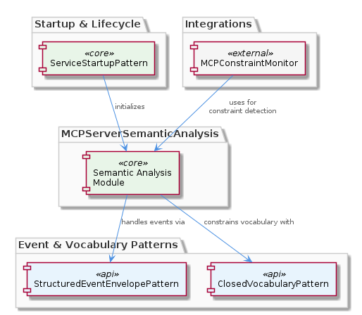
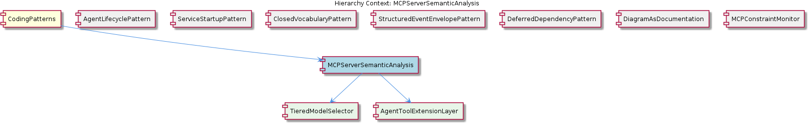

# MCPServerSemanticAnalysis

**Type:** SubComponent

The MCPServerSemanticAnalysis is designed to work with the ClosedVocabularyPattern, as seen in integrations/mcp-server-semantic-analysis/docs/configuration.md

# MCPServerSemanticAnalysis — Technical Insight Document

## What It Is

The `MCPServerSemanticAnalysis` is a SubComponent of the broader `CodingPatterns` family, implemented under `integrations/mcp-server-semantic-analysis/`. Its primary entry point for documentation and discovery is `integrations/mcp-server-semantic-analysis/README.md`, which describes the module's role as a dedicated semantic analysis server within the MCP (Model Context Protocol) integration layer. The module is responsible for producing a clear and concise representation of the semantic analysis process, exposing this capability to other parts of the codebase that need to interpret, classify, or reason about structured content.

Within the project hierarchy, this module sits alongside siblings such as `AgentLifecyclePattern`, `ServiceStartupPattern`, `ClosedVocabularyPattern`, `StructuredEventEnvelopePattern`, `DeferredDependencyPattern`, `DiagramAsDocumentation`, and `MCPConstraintMonitor`. It is one of the more substantive members of this group because it has its own internal structure: it contains two child components, `TieredModelSelector` and `AgentToolExtensionLayer`, each of which is given dedicated architectural documentation under `integrations/mcp-server-semantic-analysis/docs/`. This makes `MCPServerSemanticAnalysis` not just a pattern reference but a small subsystem with documented internal architecture.

## Architecture and Design

The architectural approach is grounded in composition with three closely related project patterns. First, `MCPServerSemanticAnalysis` uses the `StructuredEventEnvelopePattern` (a sibling component documented through `CLAUDE-CODE-HOOK-FORMAT.md`) to standardize how events flowing in and out of the semantic analysis pipeline are wrapped. Second, it is designed to work with the `ClosedVocabularyPattern` — as documented in `integrations/mcp-server-semantic-analysis/docs/configuration.md` — which restricts the set of semantic types and labels the analyzer will produce or accept, preventing vocabulary drift. Third, it integrates with the `ServiceStartupPattern` to ensure that semantic analysis services come online in a consistent, retry-aware fashion, mirroring the `startServiceWithRetry()` pattern used by sibling services.

Internally, the design separates *model selection* from *agent capability extension*. `TieredModelSelector`, captured as a first-class proposal in `integrations/mcp-server-semantic-analysis/docs/TIERED-MODEL-PROPOSAL.md`, encodes a deliberate architectural decision: rather than hard-coding a single model, the server routes requests to different tiers of models based on task characteristics. The fact that this was proposed as a formal architectural document (rather than implemented ad hoc) signals that trade-offs around cost, latency, and accuracy were explicitly weighed. `AgentToolExtensionLayer`, documented in `integrations/mcp-server-semantic-analysis/docs/architecture/agents.md`, gives agents their own lifecycle, roles, and coordination patterns rather than burying them as utility helpers.

Because the parent `CodingPatterns` family enforces a project-wide singleton guard idiom (formalized in `docs/puml/psm-singleton-pattern.puml`), any stateful manager exposed by `MCPServerSemanticAnalysis` — for instance, a model client manager or an agent registry — should be assumed to follow that guard-and-return idiom. This means access points for stateful components inside the semantic analysis server should go through designated factory or accessor functions rather than invoking `new` directly, preserving consistency with siblings such as `AgentLifecyclePattern` and `ServiceStartupPattern`.

## Implementation Details

The implementation surface is organized around three documentation anchors that mirror the runtime concerns of the module. The root `README.md` under `integrations/mcp-server-semantic-analysis/` describes the semantic analysis capabilities at a high level. The `docs/configuration.md` file explains how the `ClosedVocabularyPattern` is wired in — meaning developers extending the analyzer must update the vocabulary configuration there rather than introducing free-form labels in code. The `docs/TIERED-MODEL-PROPOSAL.md` file specifies how the `TieredModelSelector` chooses between model tiers, and `docs/architecture/agents.md` defines the role boundaries for the `AgentToolExtensionLayer`.

Event handling is mediated by the `StructuredEventEnvelopePattern`: inbound and outbound payloads conform to the structured envelope format defined in `CLAUDE-CODE-HOOK-FORMAT.md`. This provides a uniform schema for `MCPServerSemanticAnalysis` consumers — including `MCPConstraintMonitor`, which references this server in `integrations/mcp-constraint-monitor/docs/semantic-constraint-detection.md` for detecting semantic constraint violations. The envelope discipline ensures the server can be plugged into pipelines without bespoke adapter code for each consumer.

Service lifecycle follows `ServiceStartupPattern` conventions, meaning the semantic analysis server is expected to be brought up using the same retry-wrapped startup logic used elsewhere in the codebase (e.g., the `startServiceWithRetry()` helper in `lib/service-starter.js`). This pattern reuse means failures during initialization — such as a delayed model backend or a missing configuration source — are handled uniformly rather than with bespoke recovery logic.

## Integration Points

The most visible downstream consumer is `MCPConstraintMonitor`, which uses semantic analysis output to drive constraint detection, as documented in `integrations/mcp-constraint-monitor/docs/semantic-constraint-detection.md`. The constraint monitor's reliance on this module is structural: semantic classifications produced here become the input signals that determine whether constraints have been violated, making the closed vocabulary contract especially important — both sides must agree on the canonical type set.

The module's three pattern integrations also act as integration points in their own right. The `StructuredEventEnvelopePattern` is the wire-level integration contract, the `ClosedVocabularyPattern` is the semantic integration contract (defining the legal label space), and the `ServiceStartupPattern` is the operational integration contract (defining how the server boots and recovers). Sibling components such as `AgentLifecyclePattern` are also relevant: the lifecycle methods `init()`, `start()`, `stop()`, `pause()`, and `resume()` defined on `BaseAgent` in `base-agent.ts` are likely realized by agents inside the `AgentToolExtensionLayer`, providing a consistent lifecycle surface across all agent-bearing modules.

Internally, the child components form a small dependency graph: `TieredModelSelector` is invoked by the server to choose a model for a given analysis request, while `AgentToolExtensionLayer` provides the agent abstractions that wrap those model calls into task-specific capabilities. The `DeferredDependencyPattern` (a sibling exemplified by `VkbApiClient` in `lib/ukb-unified/core/VkbApiClient.js`) is a reasonable model for loading optional or heavy model backends on demand if the semantic analysis server needs to delay binding to specific runtime dependencies.

## Usage Guidelines

Developers extending or integrating with `MCPServerSemanticAnalysis` should treat the three sibling patterns it depends on as non-negotiable contracts. New event types must be wrapped in the `StructuredEventEnvelopePattern` envelope; new semantic labels must be registered through the `ClosedVocabularyPattern` configuration in `integrations/mcp-server-semantic-analysis/docs/configuration.md` rather than emitted ad hoc; and new server entry points must be brought up through the `ServiceStartupPattern` retry-aware startup mechanism. Skipping any of these breaks the implicit contract that downstream consumers like `MCPConstraintMonitor` rely on.

When working with the child components, follow the documented intent: `TieredModelSelector` exists precisely so that callers do not pick models directly — requests should be routed through the selector so that tier policy remains centralized and the proposal in `docs/TIERED-MODEL-PROPOSAL.md` continues to reflect actual usage. Similarly, agent logic should be added through the `AgentToolExtensionLayer` defined in `docs/architecture/agents.md` rather than embedded as inline utility code, preserving the explicit lifecycle and coordination boundaries the architecture document establishes.

Finally, because the parent `CodingPatterns` family enforces the singleton guard idiom from `docs/puml/psm-singleton-pattern.puml`, any stateful manager introduced inside this module — model clients, agent registries, vocabulary caches — must use the project's guard-and-return access pattern rather than direct construction. This is particularly important in the Node.js event-driven environment where concurrent subsystems may attempt to initialize the same manager; routing through the designated accessor functions prevents race conditions and ensures the semantic analysis server behaves consistently across all call sites.

## Hierarchy Context

### Parent
- [CodingPatterns](./CodingPatterns.md) -- [LLM] The project-wide singleton guard pattern is formally codified in `docs/puml/psm-singleton-pattern.puml` and manifests consistently wherever stateful managers are instantiated. The pattern follows a strict guard-and-return idiom: a module-level variable holds the single instance (initialized to null or undefined), and every access point checks that variable before constructing a new object. If an instance already exists, the existing reference is returned immediately without re-running any constructor or initialization logic. This prevents race conditions in async service environments where multiple subsystems might attempt to spin up the same stateful manager concurrently — a real concern in Node.js applications that use event-driven concurrency without explicit locking primitives. For new developers, the implication is that any class described as a 'manager' or 'session' object in this codebase should be assumed to follow this pattern: do not call `new` directly on these classes from arbitrary call sites; instead, always go through the designated factory or accessor function that enforces the singleton contract. The PlantUML diagram in `docs/puml/psm-singleton-pattern.puml` is authoritative and should be consulted before introducing any new singleton-style manager to ensure the guard logic is structurally consistent with the rest of the project.

### Children
- [TieredModelSelector](./TieredModelSelector.md) -- The mechanism is captured as a first-class proposal in integrations/mcp-server-semantic-analysis/docs/TIERED-MODEL-PROPOSAL.md ('Tiered Model Selection Proposal'), indicating it was a deliberate architectural decision requiring justification rather than an ad-hoc implementation.
- [AgentToolExtensionLayer](./AgentToolExtensionLayer.md) -- integrations/mcp-server-semantic-analysis/docs/architecture/agents.md ('Agent Architecture') is a dedicated document, signaling that agents have their own lifecycle, roles, and coordination patterns rather than being embedded utility logic.

### Siblings
- [AgentLifecyclePattern](./AgentLifecyclePattern.md) -- The BaseAgent class in base-agent.ts defines the lifecycle methods init(), start(), stop(), pause(), and resume()
- [ServiceStartupPattern](./ServiceStartupPattern.md) -- The startServiceWithRetry() function in lib/service-starter.js wraps the service startup with retry logic
- [ClosedVocabularyPattern](./ClosedVocabularyPattern.md) -- The migration scripts in integrations/mcp-constraint-monitor/docs/constraint-configuration.md enforce fixed canonical type sets
- [StructuredEventEnvelopePattern](./StructuredEventEnvelopePattern.md) -- The CLAUDE-CODE-HOOK-FORMAT.md document specifies the structured event envelope format
- [DeferredDependencyPattern](./DeferredDependencyPattern.md) -- The VkbApiClient module in lib/ukb-unified/core/VkbApiClient.js is loaded dynamically using dynamic-import
- [DiagramAsDocumentation](./DiagramAsDocumentation.md) -- The PlantUML diagrams in docs/puml/ capture architectural decisions and provide visual specification
- [MCPConstraintMonitor](./MCPConstraintMonitor.md) -- The MCPConstraintMonitor module in integrations/mcp-constraint-monitor/README.md monitors and enforces constraints

---

*Generated from 6 observations*
