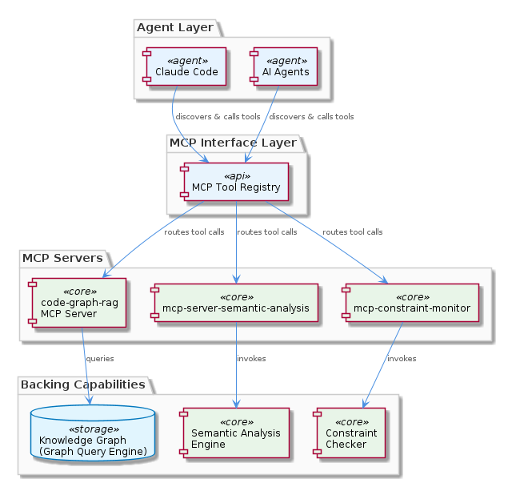
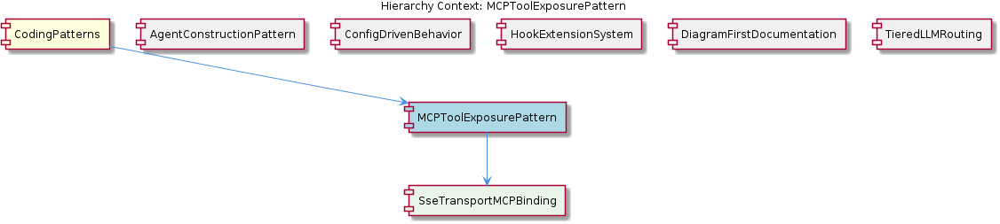

# MCPToolExposurePattern

**Type:** SubComponent

integrations/mcp-server-semantic-analysis/docs/architecture/integration.md documents Integration Patterns, explicitly describing how agents discover and call MCP tools rather than importing service modules

# MCPToolExposurePattern

## What It Is

`MCPToolExposurePattern` is an architectural convention applied across the `integrations/` directory of the project, governing how internal capabilities are exposed to AI agents. Rather than publishing capabilities as importable Python libraries or HTTP REST endpoints, each integration wraps its functionality behind a Model Context Protocol (MCP) server. This pattern is observable across at least three production integrations: `integrations/code-graph-rag/` (graph query capabilities), `integrations/mcp-server-semantic-analysis/` (semantic analysis), and `integrations/mcp-constraint-monitor/` (constraint checking).

The pattern is documented as an enforced architectural rule. The file `integrations/mcp-server-semantic-analysis/CRITICAL-ARCHITECTURE-ISSUES.md` (now marked RESOLVED) previously flagged direct service coupling as a critical issue — confirming that the team has deliberately closed the door on agents importing service modules directly. As a `SubComponent` under the parent `CodingPatterns` aggregate, `MCPToolExposurePattern` sits alongside siblings such as `AgentConstructionPattern`, `ConfigDrivenBehavior`, and `HookExtensionSystem`, each of which codifies a cross-cutting convention rather than a single piece of code.

## Architecture and Design

The architectural approach is a uniform agent-facing interface layer: every backend capability is reached through MCP tool calls regardless of the underlying implementation language or runtime. `integrations/code-graph-rag/README.md` describes the graph-query system as an MCP server; `integrations/mcp-server-semantic-analysis/README.md` does the same for semantic analysis; and `integrations/mcp-constraint-monitor/README.md` repeats the pattern for constraint checking. The result is that agents see a homogeneous tool surface even though the underlying services have heterogeneous internals.

This design intentionally trades the convenience of in-process imports for the indirection of an RPC-style protocol. The benefit is that agents — including external runtimes like Claude Code — never need to know about each service's Python modules, virtualenvs, or class hierarchies. `integrations/code-graph-rag/docs/claude-code-setup.md` provides the wiring instructions that confirm MCP is the uniform integration boundary: any MCP-compatible agent runtime can be plugged in by registering the server, with no service-specific SDK on the consumer side.

The pattern is naturally complemented by `SseTransportMCPBinding`, the child component that defines how individual MCP servers expose their tools over Server-Sent Events. The presence of two separate port configuration keys (`CODE_GRAPH_RAG_PORT` and `CODE_GRAPH_RAG_SSE_PORT`) shows that the pattern accommodates multiple transport modes per server, with SSE being one canonical binding for streaming agent interactions.

## Implementation Details

Concrete implementation guidance is centralized in per-integration documentation. `integrations/mcp-server-semantic-analysis/docs/api/README.md` enumerates each tool that the semantic analysis server exposes — this acts as the contract document for agents discovering capabilities. `integrations/mcp-server-semantic-analysis/docs/architecture/integration.md` further documents the "Integration Patterns" section, which describes the discovery-and-invoke loop agents follow: list available tools, call them with structured arguments, and consume structured responses, rather than constructing service objects in code.

Each integration repository follows a recognizable layout: a top-level `README.md` describing the MCP server purpose, a `docs/architecture/` directory documenting internal patterns, a `docs/api/` directory enumerating the tool surface, and (where relevant) a `docs/claude-code-setup.md` or equivalent wiring guide. This consistent structure is itself part of the pattern — new integrations are expected to ship the same set of documents so that agents and operators can discover them predictably.

The transport layer is delegated to `SseTransportMCPBinding`, which manages the SSE port configuration and connection lifecycle. This separation means that `MCPToolExposurePattern` itself is concerned with *what* is exposed and *that* it is exposed via MCP, while the binding component handles the wire-level details. Configuration of the binding follows the parent `CodingPatterns` convention of externalized configuration — port values live in config files and environment variables, not in source.

## Integration Points

The pattern's primary integration point is the agent runtime. `integrations/code-graph-rag/docs/claude-code-setup.md` documents the canonical case: registering the MCP server with Claude Code so that the agent can call tools during a session. Because MCP is a standardized protocol, this same registration approach works for any MCP-aware client; the project does not assume a single agent vendor.

Internally, the pattern interacts with sibling conventions in well-defined ways. It pairs naturally with `AgentConstructionPattern`, which uses a constructor + lazy-init + execute() lifecycle — MCP tool calls are precisely the kind of external invocation that an agent's `execute()` method makes. It also relies on `ConfigDrivenBehavior` (its sibling at the `CodingPatterns` level) for port assignments and feature flags, and it cooperates with `HookExtensionSystem` because the JSON hook payload format defined in `integrations/mcp-constraint-monitor/docs/CLAUDE-CODE-HOOK-FORMAT.md` is the mirror image of the MCP tool-call contract: hooks observe what MCP tools execute.

The most important non-integration is what is *forbidden*: direct in-process coupling. The RESOLVED entry in `integrations/mcp-server-semantic-analysis/CRITICAL-ARCHITECTURE-ISSUES.md` documents that direct service coupling was identified and removed, making MCP-only access an enforced rule rather than a stylistic preference. Any new code that bypasses an MCP server to import a service module directly should be considered a regression against this pattern.

## Usage Guidelines

When adding a new capability to the project, developers should default to wrapping it as an MCP server under `integrations/` rather than as a shared library or REST API. The expected scaffold includes a top-level `README.md` stating that the capability is exposed as MCP tools, a `docs/api/` directory listing each tool and its schema, a `docs/architecture/` directory documenting internal structure, and a setup guide that explains how to wire the server into an MCP-aware agent runtime.

Agents and agent-side code must consume these capabilities exclusively through MCP tool calls. Importing a service's Python modules directly — even for "quick" prototypes — violates the pattern and reintroduces the direct service coupling that `CRITICAL-ARCHITECTURE-ISSUES.md` explicitly resolved. If a needed capability is not yet exposed as an MCP tool, the correct response is to add the tool to the relevant server's API, not to bypass MCP.

Transport configuration belongs to `SseTransportMCPBinding` and follows the project-wide `ConfigDrivenBehavior` convention. Distinct ports for standard and SSE transports (as illustrated by `CODE_GRAPH_RAG_PORT` versus `CODE_GRAPH_RAG_SSE_PORT`) should be declared explicitly in configuration so operators can run multiple transport modes side by side without code changes. Documentation of new tools should land in the integration's `docs/api/README.md` at the same time as the tool implementation, since that file is the authoritative discovery surface for agent developers.

Finally, treat the MCP surface as a stable public API. Because agents discover tools by listing them at runtime, renaming or removing a tool is a breaking change for every consuming agent configuration. Additive changes (new tools, new optional arguments) are safe; subtractive or renaming changes should follow a deprecation cycle visible in the integration's API documentation.

## Hierarchy Context

### Parent
- [CodingPatterns](./CodingPatterns.md) -- [LLM] **Externalized Configuration as Runtime Behavior Control**: The project enforces a strict separation between behavior and code through a suite of JSON/YAML configuration files under config/. Files such as config/agent-profiles.json, config/health-verification-rules.json, config/llm-providers.yaml, config/knowledge-management.json, and config/hooks-config.json collectively replace what would otherwise be scattered hard-coded logic. A new developer should understand that adding a new agent profile, adjusting an LLM provider's model tier, or modifying a health rule does not require touching TypeScript or Python source files — only the relevant config file. This pattern means that operational changes (e.g., switching a task class from a lightweight to a heavyweight model, or disabling a health rule during an incident) are achievable at runtime or deploy time without code review cycles. The convention also implies that any new subsystem added to the project is expected to declare its configurable parameters in a corresponding config file rather than using environment variables alone or embedding defaults in source.

### Children
- [SseTransportMCPBinding](./SseTransportMCPBinding.md) -- The project documentation enumerates two separate port configuration keys, CODE_GRAPH_RAG_PORT and CODE_GRAPH_RAG_SSE_PORT, indicating the server intentionally separates standard and SSE transport modes rather than using a single endpoint.

### Siblings
- [AgentConstructionPattern](./AgentConstructionPattern.md) -- integrations/mcp-server-semantic-analysis/docs/architecture/agents.md documents the agent architecture showing each agent follows a constructor + lazy-init + execute() lifecycle rather than eager initialization at import time
- [ConfigDrivenBehavior](./ConfigDrivenBehavior.md) -- config/agent-profiles.json defines per-agent behavioral parameters (e.g., which LLM tier to use, concurrency limits) so adding a new agent type requires only a new JSON entry, not a code change
- [HookExtensionSystem](./HookExtensionSystem.md) -- integrations/mcp-constraint-monitor/docs/CLAUDE-CODE-HOOK-FORMAT.md specifies the exact JSON payload format that hooks emit on each tool call entry and exit, defining the contract between agents and monitors
- [DiagramFirstDocumentation](./DiagramFirstDocumentation.md) -- docs/puml/_standard-style.puml provides shared color palette, font, and stereotype definitions imported by all other diagrams, ensuring visual consistency across subsystem diagrams
- [TieredLLMRouting](./TieredLLMRouting.md) -- integrations/mcp-server-semantic-analysis/docs/TIERED-MODEL-PROPOSAL.md formally proposes and documents the tiered model selection approach, classifying tasks into complexity buckets before provider assignment

---

*Generated from 6 observations*
