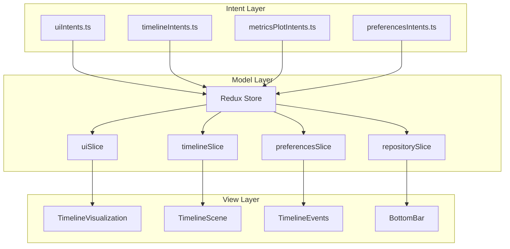

# MVI Redux Architecture Pattern

## Table of Contents

- [Overview](#overview)
- [Timeline Project Implementation](#timeline-project-implementation)
  - [Architecture Overview](#architecture-overview)
  - [Key Implementation Details](#key-implementation-details)
- [Benefits](#benefits)
- [Applicability](#applicability)
- [Related Patterns](#related-patterns)
- [Pattern Consolidation](#pattern-consolidation)
- [References](#references)
- [Code Examples](#code-examples)
- [Implementation Checklist](#implementation-checklist)
- [Timeline Project Stats](#timeline-project-stats)

## Overview

**Problem:** Complex React applications with 20+ components suffer from state management chaos, prop drilling, and unpredictable updates. Traditional MVC patterns break down when state needs to be shared across deeply nested component trees.

**Solution:** Implement Model-View-Intent (MVI) architecture using Redux Toolkit, separating state management into three distinct layers:
- **Model**: Redux store with feature-based slices
- **View**: Pure React components that derive state from Redux
- **Intent**: Async thunks that handle user interactions and side effects

**Significance:** 9/10 - Fundamental architecture pattern for scalable React applications

## Timeline Project Implementation

### Architecture Overview



### Key Implementation Details

#### 1. Store Configuration
```typescript
// src/store/index.ts
export const store = configureStore({
  reducer: {
    timeline: timelineSlice,
    ui: uiSlice,
    preferences: preferencesSlice,
    repository: repositorySlice,
    logging: loggingSlice,
  },
  middleware: (getDefaultMiddleware) =>
    getDefaultMiddleware({
      serializableCheck: false, // Required for Three.js objects
    }).concat(hoverLoggingMiddleware),
});

// Typed hooks for TypeScript
export const useAppDispatch = () => useDispatch<AppDispatch>();
export const useAppSelector: TypedUseSelectorHook<RootState> = useSelector;
```

#### 2. Intent Pattern Example
```typescript
// src/store/intents/uiIntents.ts
export const updateTimelinePosition = createAsyncThunk<
  void,
  { position: number; updateCamera?: boolean },
  { state: RootState }
>(
  'ui/updateTimelinePosition',
  async ({ position, updateCamera = true }, { dispatch, getState }) => {
    dispatch(setMarkerPosition(position));
    dispatch(setCurrentPosition(position));

    if (updateCamera) {
      const state = getState();
      const currentCamera = state.ui.cameraState;
      
      dispatch(updateCameraState({
        target: { 
          x: currentCamera.target.x, 
          y: currentCamera.target.y, 
          z: position 
        },
      }));
    }

    // Throttled persistence
    dispatch(updateMarkerPositionPreferences(position));
  }
);
```

#### 3. Component Integration
```typescript
// src/components/TimelineVisualization.tsx
export const TimelineVisualization = () => {
  const dispatch = useAppDispatch();
  const { events, loading } = useAppSelector(state => state.timeline);
  const { viewAll, droneMode } = useAppSelector(state => state.ui);

  useEffect(() => {
    dispatch(fetchTimelineData({ repository: currentRepo }));
  }, [dispatch, currentRepo]);

  // Pure rendering based on Redux state
  return <TimelineScene events={events} viewAll={viewAll} />;
};
```

## Benefits

1. **Predictable State Updates**: All state changes flow through Redux actions
2. **Time-Travel Debugging**: Redux DevTools enable state history inspection
3. **Separation of Concerns**: Business logic isolated in intent layer
4. **Type Safety**: Full TypeScript support with typed hooks
5. **Performance**: Optimized re-renders with React-Redux selectors
6. **Testability**: Pure functions and isolated logic layers

## Applicability

### When to Use
- Applications with 15+ components sharing state
- Complex async operations (API calls, animations)
- Need for undo/redo functionality
- Multi-developer teams requiring predictable patterns
- Applications requiring state persistence

### When NOT to Use
- Simple applications with <10 components
- Prototype/MVP development
- Static websites with minimal interactivity

## Related Patterns
- [Redux Store Configuration Pattern](./ReduxStoreConfigurationPattern.md)
- [Async Thunk Intent Pattern](./AsyncThunkIntentPattern.md)
- [State Persistence Pattern](./StatePersistencePattern.md)


## Pattern Consolidation

This pattern consolidates several implementation aspects that were previously documented separately:

- **Redux Store Configuration**: Middleware setup, serialization handling, and type integration
- **Async Thunk Intent Pattern**: Implementation of the Intent layer through async thunks
- **State Persistence**: Automatic state persistence and hydration mechanisms

These are now documented as implementation details of the overall MVI+Redux architecture rather than separate patterns.

## References
- [Redux Toolkit Documentation](https://redux-toolkit.js.org/)
- [MVI Architecture Pattern](https://hannesdorfmann.com/android/model-view-intent/)
- [React-Redux Best Practices](https://react-redux.js.org/api/hooks)

## Code Examples

### Feature Slice Template
```typescript
const featureSlice = createSlice({
  name: 'feature',
  initialState,
  reducers: {
    actionName: (state, action) => {
      // Immer allows direct mutation
      state.property = action.payload;
    },
  },
  extraReducers: (builder) => {
    builder
      .addCase(asyncIntent.pending, (state) => {
        state.loading = true;
      })
      .addCase(asyncIntent.fulfilled, (state, action) => {
        state.data = action.payload;
        state.loading = false;
      });
  },
});
```

### Intent Pattern Template
```typescript
export const complexIntent = createAsyncThunk<
  ReturnType,
  ArgumentType,
  { state: RootState }
>(
  'domain/intentName',
  async (args, { dispatch, getState }) => {
    // 1. Get current state if needed
    const state = getState();
    
    // 2. Perform async operations
    const result = await apiCall(args);
    
    // 3. Dispatch multiple actions
    dispatch(updateSliceA(result.a));
    dispatch(updateSliceB(result.b));
    
    // 4. Side effects (persistence, analytics)
    await persistToStorage(result);
    
    return result;
  }
);
```

## Implementation Checklist

- [ ] Set up Redux Toolkit with TypeScript
- [ ] Create typed hooks (useAppDispatch, useAppSelector)
- [ ] Organize slices by feature domain
- [ ] Implement intent layer for async operations
- [ ] Configure middleware for non-serializable data
- [ ] Add Redux DevTools for debugging
- [ ] Set up state persistence if needed
- [ ] Write unit tests for reducers and intents

## Timeline Project Stats
- **5 Redux slices**: ui, timeline, preferences, repository, logging
- **4 intent files**: uiIntents, timelineIntents, preferencesIntents, metricsPlotIntents
- **27+ components** using Redux state
- **Zero prop drilling** throughout the application
- **100% TypeScript** coverage with strict mode