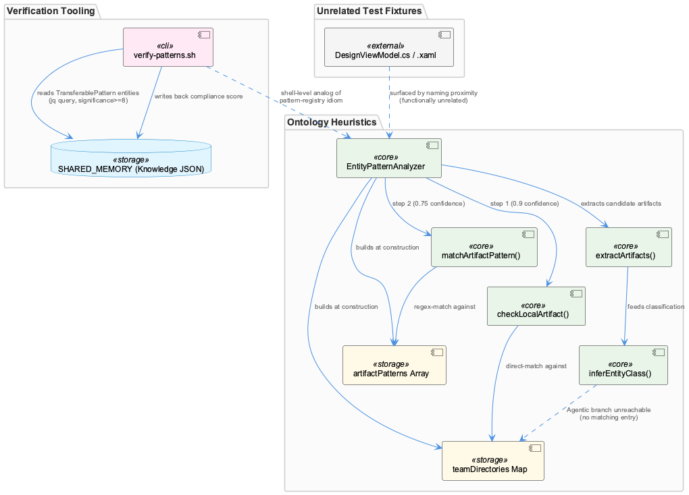
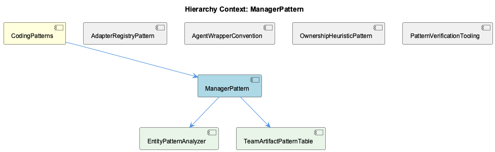

# ManagerPattern

**Type:** SubComponent

[Architecture Notes] EntityPatternAnalyzer diverges from the parent's stated Manager convention: no init/start/stop, no per-request mutable state — it's a pure function-like classifier over data frozen in the constructor.; Layer 1 labeling (`layer: 1, layerName: 'EntityPatternAnalyzer'` in returned LayerResult) implies this class is one stage in a larger multi-layer classification pipeline not fully shown in the provided files.; Data-model drift: 'Agentic' team exists in inferEntityClass's teamMappings but is absent from teamDirectories/artifactPatterns, making that branch unreachable via the public analyzeEntityPatterns() entry point.; verify-patterns.sh couples shell-level static analysis (ripgrep counts) directly to a JSON knowledge store (SHARED_MEMORY) via jq, both reading pattern definitions and writing back a compliance score — a tight coupling between the verification script and the knowledge graph's on-disk format.; Confidence values (0.9 for direct match, 0.75 for pattern match) are hardcoded numeric literals rather than configuration, contrasting with the config-driven <AWS_SECRET_REDACTED> approach described elsewhere in the parent context.

# ManagerPattern: Technical Insight Document

## What It Is

ManagerPattern, as materialized primarily in `src/ontology/heuristics/EntityPatternAnalyzer.ts`, is a specialization — and partial subversion — of the naming and structural convention established by its parent, CodingPatterns. Where CodingPatterns describes classes like LLMServiceProvider, MockModeManager, CircuitBreakerManager, and BudgetTracker as owners of stateful, lifecycle-bound resources (init/start/stop, mutable counters, connect/disconnect semantics), the concrete child under this pattern, EntityPatternAnalyzer, is suffixed "Analyzer" rather than "Manager" yet structurally echoes the same shape: it builds immutable state in its constructor and exposes a narrow public surface. Its two children, EntityPatternAnalyzer and TeamArtifactPatternTable, together represent a "Manager-adjacent" variant — one that manages a classification registry rather than an external resource's lifecycle.

## Architecture and Design

The defining architectural decision is a two-step, confidence-scored classification cascade implemented in `analyzeEntityPatterns()`: `checkLocalArtifact()` performs a direct team-directory prefix match against the `teamDirectories` Map (confidence 0.9), falling back only on miss to `matchArtifactPattern()`, which runs regex matching against the `artifactPatterns` array (confidence 0.75). This "strong evidence first, weak evidence as fallback" ordering is baked directly into control flow rather than externalized as configuration — a notable divergence from the config-driven <AWS_SECRET_REDACTED> approach (`config/prompt-classifier.yaml`) cited elsewhere in the system, and echoed identically across sibling perspectives AdapterRegistryPattern, AgentWrapperConvention, OwnershipHeuristicPattern, and PatternVerificationTooling, all of which describe the same cascade from their own vantage points.

Structurally, this is a data-driven registry rather than an object-oriented adapter registry: `teamDirectories` (a `Map<string, string[]>`) and `artifactPatterns` (an array of `{team, patterns, entityClassMap}` records), both built by TeamArtifactPatternTable's logic in the constructor, stand in for what elsewhere in the codebase (ProviderRegistryManager) would be instantiated adapter objects. Extending ownership resolution to a new team is intended to be a matter of appending table entries rather than editing `analyzeEntityPatterns()`'s control flow — a config-over-code philosophy applied inconsistently, since the tables themselves are hardcoded TypeScript literals with no YAML/JSON backing.

## Implementation Details

`extractArtifacts()` performs four regex passes over free text — file paths (`.ts|.js|.cpp|.java|.tsx|.jsx|.py|.go|.rs`), npm-scoped package names, class names ending in `Service|Agent|Manager|Engine|Handler|Analyzer|Classifier|Filter|Monitor`, and bare directory prefixes — deduplicating results into a `Set<string>`. Notably, the classPattern regex hardcodes the project's suffix-naming convention (including "Manager") as a literal alternation, meaning this analyzer operationally depends on that naming convention holding true project-wide rather than merely documenting it.

A data-model inconsistency exists between the four teams covered by `teamDirectories`/`artifactPatterns` (Coding, RaaS, ReSi, UI) and the private `inferEntityClass()` method's `teamMappings`, which additionally defines an "Agentic" team (Agent→AgentFramework, RAG→RAGSystem, LLM→LLMProvider, Vector→VectorStore) absent from the direct-match tables. Since `checkLocalArtifact()` only iterates `teamDirectories.entries()`, this Agentic branch is dead code from the public `analyzeEntityPatterns()` entry point — a maintenance drift risk. The returned `LayerResult` labels this component `layer: 1`, implying it is one stage of a larger, only-partially-visible multi-layer classification pipeline.

## Integration Points

ManagerPattern's classification output feeds a broader pattern-verification ecosystem. `scripts/knowledge-management/verify-patterns.sh` operationalizes the sibling PatternVerificationTooling idea concretely: it derives high-significance TransferablePattern entities via `jq` against a `$SHARED_MEMORY` JSON knowledge graph, cross-checks them against ripgrep-derived usage counts (`LOGGER_COUNT`, `REDUX_COUNT`, `CONSOLE_LOG_COUNT`), and writes a `pattern_compliance_score` back into the same store. Its hardcoded ConditionalLoggingPattern check (console.log vs Logger.* calls) directly operationalizes a project-wide rule, though its `sed`-based remediation is a naive string substitution that wouldn't wire in a proper Logger import.

Unrelated test fixtures (`integrations/graphify/tests/fixtures/xaml_viewmodel/ViewModels/DesignViewModel.cs` and `DesignView.xaml`) surface alongside this component purely through naming/pattern proximity, illustrating that without a dedicated source directory for CodingPatterns concepts, retrieval and analysis tooling can conflate structurally similar but functionally unrelated files.

## Usage Guidelines

Developers should not assume every class avoiding the literal "Manager" suffix falls outside this pattern family — EntityPatternAnalyzer demonstrates that immutable, constructor-frozen classifiers are a legitimate sibling variant, distinguished by the absence of lifecycle methods or mutable counters. When adding a new team to TeamArtifactPatternTable, both `teamDirectories`/`artifactPatterns` and `inferEntityClass()`'s `teamMappings` must be updated together to avoid unreachable branches like the current Agentic gap. Because confidence values (0.9, 0.75) and regex tables are hardcoded rather than config-driven, any change to naming conventions or directory layout requires editing and recompiling `EntityPatternAnalyzer.ts` directly — a real maintainability cost compared to the YAML-driven classifiers elsewhere in the system.

## Hierarchy Context

### Parent
- [CodingPatterns](./CodingPatterns.md) -- [LLM] The Manager-suffix naming convention observed across LLMServiceProvider, MockModeManager, CachingMechanism, CircuitBreakerManager, and BudgetTracker reflects a deliberate architectural choice to encapsulate stateful, cross-cutting concerns behind a consistent interface shape. New developers should expect any class named *Manager to expose lifecycle methods (init/start/stop or similar), own some internal mutable state (cache entries, circuit state, budget counters), and be instantiated once per service boundary rather than per-request. This convention makes it easy to locate resilience and resource-control logic by grep'ing for 'Manager' across the codebase, and it implies that when adding a new cross-cutting concern (e.g., rate limiting), the idiomatic approach is to add a RateLimitManager sibling rather than embedding the logic inline in provider code.

### Children
- [EntityPatternAnalyzer](./EntityPatternAnalyzer.md) -- [CGR] EntityPatternAnalyzer (class) in EntityPatternAnalyzer.ts
- [TeamArtifactPatternTable](./TeamArtifactPatternTable.md) -- [LLM] EntityPatternAnalyzer.ts's constructor builds `teamDirectories` as a `Map<string, string[]>` with exactly four keys (Coding, RaaS, ReSi, UI), each mapping to a hardcoded array of directory-prefix strings (e.g. Coding → ['src/ontology', 'src/knowledge-management', 'src/live-logging', 'scripts', '.specstory']). This is a closed enumeration with no external configuration source (no YAML/JSON load, unlike config/prompt-classifier.yaml elsewhere in the project) — adding a new team or relocating a directory requires editing and recompiling this TypeScript file directly, which is a maintenance cost the parent's config-driven classifiers don't share.

### Siblings
- [AdapterRegistryPattern](./AdapterRegistryPattern.md) -- [LLM] EntityPatternAnalyzer (src/ontology/heuristics/EntityPatternAnalyzer.ts) is the concrete implementation of the 'registry + adapter' idiom described at the parent (CodingPatterns) level: `teamDirectories` is a Map acting as a lightweight registry keying team names to directory prefixes, and `artifactPatterns` is an array-of-records registry keying team names to arrays of RegExp + an `entityClassMap`. Rather than a class-per-adapter registry (as implied by ProviderRegistryManager or SpecstoryAdapter/TranscriptAdapter), this component implements the same conceptual pattern with plain data structures (Map and array literals) instead of instantiated adapter objects — a 'data-driven registry' variant of the adapter-registry idiom rather than an object-oriented one.
- [AgentWrapperConvention](./AgentWrapperConvention.md) -- [LLM] src/ontology/heuristics/EntityPatternAnalyzer.ts implements a two-step, confidence-scored team-attribution heuristic: analyzeEntityPatterns() first calls extractArtifacts() to pull file paths, npm scopes, class names (via a Service|Agent|Manager|Engine|Handler|Analyzer|Classifier|Filter|Monitor suffix regex), and bare directory prefixes out of free-text knowledge content, then tries checkLocalArtifact() (directory-prefix match against the teamDirectories Map, confidence 0.9) before falling back to matchArtifactPattern() (regex match against artifactPatterns, confidence 0.75). This mirrors the parent's documented Classifier-suffix convention (<AWS_SECRET_REDACTED>) but is notably NOT YAML-driven — the team directories and regex patterns are hardcoded TypeScript literals in the constructor, contradicting the 'classification thresholds and categories are treated as data, not code' philosophy described for prompt-classifier.yaml elsewhere in the system.
- [OwnershipHeuristicPattern](./OwnershipHeuristicPattern.md) -- [LLM] EntityPatternAnalyzer (src/ontology/heuristics/EntityPatternAnalyzer.ts) implements the ownership heuristic as a two-step cascade inside analyzeEntityPatterns(): step (a) checkLocalArtifact() does an O(teams) prefix match against a hardcoded teamDirectories Map (e.g. 'src/ontology', 'src/knowledge-management', 'src/live-logging', 'scripts', '.specstory' → 'Coding'), and only if that misses does step (b) matchArtifactPattern() fall back to a set of per-team RegExp arrays (artifactPatterns) keyed on class-name suffixes like *Manager, *Classifier, *Analyzer. This ordering encodes an explicit confidence hierarchy: a direct path match returns confidence 0.9 while a naming-convention match returns 0.75, meaning the heuristic trusts 'where a file lives' strictly more than 'what a class is called' — a defensible choice given that directory placement is enforced by repo structure while naming conventions can drift.
- [PatternVerificationTooling](./PatternVerificationTooling.md) -- [LLM] EntityPatternAnalyzer (src/ontology/heuristics/EntityPatternAnalyzer.ts) implements the PatternVerificationTooling component's core classification logic as a two-step, two-layer detector: `checkLocalArtifact` performs a direct team-directory prefix match (via the `teamDirectories` Map, confidence 0.9) before falling back to `matchArtifactPattern`, which runs a table of per-team regexes (`artifactPatterns`, confidence 0.75) against extracted artifact strings. This mirrors the 'Manager wraps external resource lifecycle' and 'registry + adapter' idioms noted in the parent context: rather than a single monolithic dispatcher, ownership resolution is data-driven (the `entityClassMap` and `teamDirectories` tables) so adding a new team means appending to a table, not editing `analyzeEntityPatterns`'s control flow — the same config-over-code philosophy attributed to <AWS_SECRET_REDACTED> in the parent observations.

---

*Generated from 10 observations*
