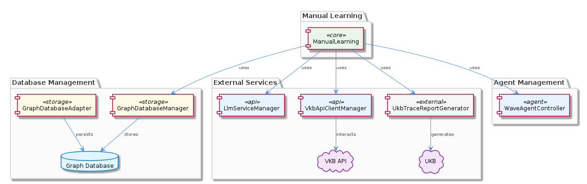

# ManualLearning

**Type:** SubComponent

ManualLearning may follow a specific workflow or pipeline, potentially defined in a configuration file or a specific module like batch-analysis.yaml

## What It Is  

ManualLearning is a **SubComponent** of the larger **KnowledgeManagement** component. It lives conceptually within the `KnowledgeManagement` source tree and is responsible for the curation of knowledge that is created or edited by humans rather than generated automatically. Although no concrete source files are listed for ManualLearning itself, its role is inferred from the surrounding ecosystem: it coordinates with the **GraphDatabaseManager**, **LlmServiceManager**, **WaveAgentController**, **UkbTraceReportGenerator**, and **VkbApiClientManager** to store, enrich, and trace manually‑produced knowledge entities. The sub‑component also owns a child module called **ManualKnowledgePipeline**, which encapsulates the step‑by‑step workflow that drives the manual curation process.  

The typical entry point for the pipeline is likely defined in a configuration artifact such as `batch-analysis.yaml`, which would describe the sequence of actions (e.g., ingest, validation, graph persistence, trace reporting). All of these activities are anchored in the same repository that hosts the **GraphDatabaseAdapter** implementation at  

```
integrations/mcp-server-semantic-analysis/src/storage/graph-database-adapter.ts
```  

This adapter provides the low‑level graph persistence layer that ManualLearning ultimately relies on.  



---

## Architecture and Design  

The architecture surrounding ManualLearning follows a **layered, component‑oriented** style. At the top sits **KnowledgeManagement**, which aggregates several peer sub‑components (OnlineLearning, GraphDatabaseManager, WaveAgentController, UkbTraceReportGenerator, LlmServiceManager, VkbApiClientManager). ManualLearning occupies the same tier as its siblings, sharing common infrastructure services while focusing on a distinct workflow: manual knowledge ingestion.  

The design leans heavily on **service‑mediated interaction**. ManualLearning does not talk directly to the graph store; instead, it calls the **GraphDatabaseManager**, which in turn uses the **GraphDatabaseAdapter** (the concrete file path above) to perform CRUD operations on the underlying graph database. This indirection isolates ManualLearning from storage‑specific concerns and enables swapping or scaling the persistence layer without touching the manual curation logic.  

LLM‑related processing is delegated to the **LlmServiceManager**. When a curator requests enrichment (e.g., generating summaries or extracting entities from free‑form text), ManualLearning forwards the request to LlmServiceManager, which may coordinate with the **WaveAgentController** to spin up or reuse a Wave agent that actually runs the large language model. This separation of concerns keeps the manual pipeline lightweight and lets the LLM infrastructure evolve independently.  

Traceability is provided by the **UkbTraceReportGenerator**. After a manual knowledge item has been persisted, ManualLearning likely invokes this generator to produce a trace report that captures provenance, transformation steps, and any automated reasoning performed by downstream UKB (Universal Knowledge Base) workflows.  

Finally, external knowledge sources are accessed via the **VkbApiClientManager**, which abstracts VKB (Virtual Knowledge Base) API calls. ManualLearning may fetch reference data or push curated entities to VKB through this manager, ensuring a consistent API contract across the system.  


---

## Implementation Details  

Although the source code for ManualLearning itself is not enumerated, the surrounding implementation clues allow us to outline its internal mechanics:

1. **Pipeline Orchestration (ManualKnowledgePipeline)** – This child component likely defines a series of stages expressed as functions or classes that are invoked sequentially. Typical stages include:
   * **Ingestion** – Accepting manual input (e.g., JSON payloads, UI forms) and performing basic validation.
   * **Enrichment** – Calling `LlmServiceManager` to run LLM‑driven augmentation (entity extraction, summarisation). The Wave agents managed by `WaveAgentController` execute these tasks, possibly in an asynchronous job queue.
   * **Persistence** – Forwarding enriched entities to `GraphDatabaseManager`, which uses `GraphDatabaseAdapter` (the TypeScript file at `integrations/mcp-server-semantic-analysis/src/storage/graph-database-adapter.ts`) to write nodes and edges to the graph store. The adapter also handles automatic JSON export synchronization, ensuring that a flat representation is kept in step with the graph.
   * **Trace Generation** – Invoking `UkbTraceReportGenerator` to compile a trace report that records each transformation, the LLM prompts used, and any provenance metadata.
   * **External Sync** – Optionally pushing or pulling data via `VkbApiClientManager` to keep the VKB repository aligned with the manually curated knowledge.

2. **Configuration‑Driven Execution** – The reference to a file such as `batch-analysis.yaml` suggests that the pipeline stages, their ordering, and runtime parameters (e.g., LLM temperature, batch size) are externalised. ManualLearning reads this YAML at startup, constructs the pipeline dynamically, and thus can be re‑configured without code changes.

3. **Error Handling & Retry** – Because ManualLearning relies on multiple external services (LLM, graph DB, VKB API), it is reasonable to assume that each stage implements retry logic and propagates structured error objects back to the pipeline orchestrator. This pattern is common across its siblings (e.g., OnlineLearning) and would be consistent here.

4. **Data Model** – The knowledge entities handled by ManualLearning are stored as graph nodes/edges, matching the model used by `GraphDatabaseAdapter`. The automatic JSON export implies that each entity also has a serialisable representation, which may be used for audit logs or downstream batch jobs.

---

## Integration Points  

ManualLearning sits at the nexus of several core services:

| Integration Target | Role | Interaction Mechanism |
|--------------------|------|-----------------------|
| **GraphDatabaseManager** | Persistence of manually curated entities | Calls `storeNode`, `storeEdge`, or batch write APIs; relies on `GraphDatabaseAdapter` for low‑level I/O |
| **LlmServiceManager** | Enrichment of raw manual input via LLMs | Sends enrichment requests (e.g., `runPrompt`) and receives generated text or extracted entities |
| **WaveAgentController** | Execution environment for LLM workloads | May request an agent instance, monitor job status, and retrieve results |
| **UkbTraceReportGenerator** | Auditing and provenance | Provides a `generateReport` method that consumes the pipeline’s context and outputs a trace artifact |
| **VkbApiClientManager** | External knowledge base synchronization | Executes HTTP calls (`GET`, `POST`, `PATCH`) against the VKB API, abstracting authentication and rate‑limiting |
| **Configuration (batch-analysis.yaml)** | Pipeline definition | Parsed at runtime to assemble the `ManualKnowledgePipeline` stages |

These integration points are all **service‑oriented**; ManualLearning communicates via well‑defined interfaces (e.g., method calls, async promises) rather than directly accessing low‑level libraries. This design mirrors the patterns used by its sibling components, ensuring a uniform interaction model across the KnowledgeManagement domain.

---

## Usage Guidelines  

1. **Define the Pipeline in YAML** – Before invoking ManualLearning, create or update `batch-analysis.yaml` to reflect the desired sequence of stages and any parameters (LLM temperature, batch sizes, retry limits). Keep this file version‑controlled to guarantee reproducibility.  

2. **Validate Input Early** – ManualKnowledgePipeline expects clean, schema‑validated payloads. Use the provided validation utilities (if any) before handing data to the pipeline to avoid unnecessary round‑trips to the graph store.  

3. **Leverage LLM Services Sparingly** – Since LLM calls can be costly and latency‑sensitive, only request enrichment when the manual input truly benefits from it (e.g., when a curator supplies free‑text notes). Configure the `LlmServiceManager` parameters in the YAML to balance quality and cost.  

4. **Monitor Trace Reports** – After each successful run, inspect the output from `UkbTraceReportGenerator`. These reports are essential for compliance, debugging, and future audits of manual curation decisions.  

5. **Handle Failures Gracefully** – Implement retry logic around external calls (graph DB, VKB API) using exponential back‑off. The pipeline should be idempotent where possible; for example, use upsert semantics when persisting nodes to avoid duplicate entries.  

6. **Keep Dependencies Updated** – Because ManualLearning relies on shared services (GraphDatabaseManager, LlmServiceManager, etc.), ensure that any upgrades to those services are tested against the manual pipeline. The layered architecture isolates changes, but version mismatches can still surface in interface contracts.  

---

### Summary of Key Insights  

1. **Architectural patterns identified** – Layered component architecture, service‑mediated interaction, configuration‑driven pipelines, and separation of concerns between enrichment (LLM), persistence (graph DB), and traceability.  

2. **Design decisions and trade‑offs** – Delegating storage to GraphDatabaseManager abstracts the graph implementation (scalable but adds an indirection layer). Using LLM services via LlmServiceManager provides flexibility but introduces latency and cost considerations. YAML‑based pipeline definition enhances configurability at the expense of runtime validation complexity.  

3. **System structure insights** – ManualLearning is a peer of OnlineLearning within KnowledgeManagement, sharing core services while focusing on human‑curated data. Its child, ManualKnowledgePipeline, orchestrates the workflow, and all interactions funnel through well‑defined managers.  

4. **Scalability considerations** – The GraphDatabaseAdapter’s automatic JSON export and LevelDB persistence suggest the graph layer can handle large knowledge graphs. LLM calls are the primary scalability bottleneck; batching requests and reusing Wave agents mitigate this. YAML pipelines allow horizontal scaling by spawning multiple pipeline instances with identical configurations.  

5. **Maintainability assessment** – The clear separation of responsibilities (pipeline orchestration, service managers, adapters) promotes maintainability. Changes to one service (e.g., swapping the graph database) require only updates in the corresponding manager/adapter, leaving ManualLearning’s core logic untouched. However, the lack of explicit code symbols for ManualLearning means developers must rely on documentation and configuration files to understand the exact flow, underscoring the importance of keeping `batch-analysis.yaml` and trace reports well‑documented.


## Hierarchy Context

### Parent
- [KnowledgeManagement](./KnowledgeManagement.md) -- [LLM] The KnowledgeManagement component utilizes the GraphDatabaseAdapter (integrations/mcp-server-semantic-analysis/src/storage/graph-database-adapter.ts) for persisting data in a graph database with automatic JSON export synchronization. This design decision enables efficient storage and retrieval of knowledge entities and relationships, which is crucial for the system's overall goals of knowledge discovery and insight generation. Furthermore, the use of Graphology+LevelDB persistence ensures a scalable and performant solution for managing the knowledge graph.

### Children
- [ManualKnowledgePipeline](./ManualKnowledgePipeline.md) -- The ManualLearning sub-component likely interacts with the GraphDatabaseManager to store and retrieve manually created knowledge entities and relationships, as inferred from the parent context.

### Siblings
- [OnlineLearning](./OnlineLearning.md) -- OnlineLearning likely employs the GraphDatabaseManager to store and manage automatically extracted knowledge entities and relationships.
- [GraphDatabaseManager](./GraphDatabaseManager.md) -- GraphDatabaseManager likely utilizes the GraphDatabaseAdapter for interacting with the graph database.
- [WaveAgentController](./WaveAgentController.md) -- WaveAgentController likely interacts with the LlmServiceManager for LLM operations and initialization.
- [UkbTraceReportGenerator](./UkbTraceReportGenerator.md) -- UkbTraceReportGenerator likely interacts with the GraphDatabaseManager to retrieve data for trace reports.
- [LlmServiceManager](./LlmServiceManager.md) -- LlmServiceManager likely interacts with other components for LLM-related tasks, such as the GraphDatabaseManager and WaveAgentController.
- [VkbApiClientManager](./VkbApiClientManager.md) -- VkbApiClientManager likely interacts with the GraphDatabaseManager for storing and retrieving data related to VKB API interactions.


---

*Generated from 7 observations*
