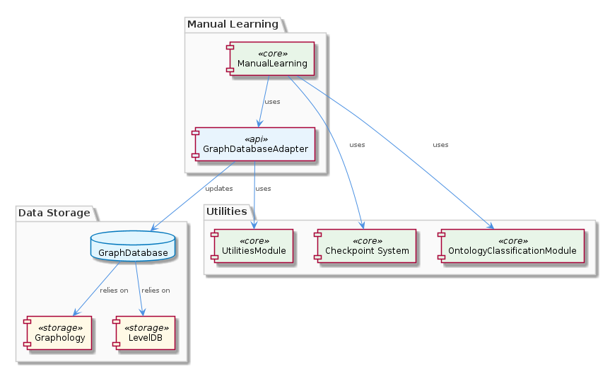

# ManualLearning

**Type:** SubComponent

ManualLearning relies on the migrateGraphDatabase script in scripts/migrate-graph-db-entity-types.js to update entity types in the live LevelDB/Graphology database.

## What It Is  

ManualLearning is a **sub‑component** of the larger **KnowledgeManagement** system. Its implementation lives primarily in two concrete artifacts:  

* the migration script **`scripts/migrate-graph-db-entity-types.js`** – the “GraphDatabaseUpdater” child that rewrites entity type definitions directly in the live **LevelDB/Graphology** store, and  
* the **`integrations/mcp-server-semantic-analysis/src/storage/graph-database-adapter.ts`** file – the **GraphDatabaseAdapter** that mediates all read/write operations against the same LevelDB/Graphology knowledge graph.  

Together these pieces enable a workflow where human curators manually enrich and correct entities, while the surrounding infrastructure guarantees that the curated data is persisted, version‑tracked, and kept in sync with downstream JSON exports. ManualLearning therefore represents the “human‑in‑the‑loop” segment of KnowledgeManagement, sitting alongside sibling components such as **OnlineLearning**, **OntologyClassificationModule**, and **UtilitiesModule**.

## Architecture and Design  

The design of ManualLearning follows a **layered adapter‑centric architecture**. The **GraphDatabaseAdapter** acts as an abstraction layer (the classic *Adapter* pattern) that hides the specifics of the underlying **Graphology + LevelDB** persistence engine from the rest of the system. All manual curation actions – adding, editing, or deleting entities – are funneled through this adapter, ensuring a single point of control for data consistency, transaction handling, and automatic JSON export synchronization.

The **migration script** (`migrate-graph-db-entity-types.js`) is a **stand‑alone procedural utility** that directly manipulates the graph store to evolve entity type schemas. Its placement as a child component (**GraphDatabaseUpdater**) reflects a **script‑driven migration pattern**: rather than embedding migration logic in the runtime service, a dedicated, version‑controlled script is executed when a schema change is required. This keeps the core adapter code clean and focused on CRUD operations while still providing a reliable path for bulk updates.

ManualLearning also leverages the **checkpoint system** from **UtilitiesModule**. Checkpoints act as lightweight progress markers stored alongside the graph data, enabling the system to resume long‑running curation batches without reprocessing already‑handled entities. This pattern resembles a **saga‑style checkpointing** approach, albeit implemented as simple state snapshots rather than a full distributed transaction manager.

Finally, the **OntologyClassificationModule** is consulted during curation to assign or validate entity types based on their properties. This tight coupling ensures that manual edits remain semantically aligned with the ontology, reinforcing data integrity across the KnowledgeManagement suite.

## Implementation Details  

### GraphDatabaseAdapter (`graph-database-adapter.ts`)  
The adapter exposes a clear API (e.g., `getEntity(id)`, `upsertEntity(entity)`, `deleteEntity(id)`) that internally translates calls into Graphology graph mutations and LevelDB key/value writes. Two notable responsibilities are:  

1. **Consistency enforcement** – before persisting an entity, the adapter validates the payload against the current ontology (via OntologyClassificationModule) and checks for conflicts with existing nodes.  
2. **Automatic JSON export sync** – every successful mutation triggers an asynchronous routine that writes a JSON representation of the affected sub‑graph to a designated export directory. This export is consumed by downstream services (e.g., InsightGenerationModule) that require a flat data view.

### Migration Script (`migrate-graph-db-entity-types.js`)  
The script follows a three‑step process:  

1. **Discovery** – it scans the LevelDB store for nodes whose `type` field does not match the target schema version.  
2. **Transformation** – using a mapping table (hard‑coded or supplied via CLI arguments), each outdated node is re‑typed, and any required property migrations are applied.  
3. **Commit** – changes are written back atomically where possible; otherwise, the script logs a checkpoint (via UtilitiesModule) so that a partial run can be resumed safely.

Because the script runs outside the normal request path, it can afford to lock the database briefly, guaranteeing that no concurrent writes corrupt the migration.

### Checkpoint System (UtilitiesModule)  
Checkpoints are simple JSON blobs stored in a dedicated LevelDB namespace (e.g., `checkpoints/manual-learning`). They record the last processed entity ID, timestamp, and migration version. ManualLearning’s long‑running curation jobs read this checkpoint at start‑up, skip already‑processed entities, and update the checkpoint after each batch, thereby providing **idempotent** and **fault‑tolerant** execution.

### Ontology Classification Integration  
When a curator adds a new entity, the ManualLearning flow invokes the **OntologyClassificationModule** to infer the most appropriate type based on supplied properties. The module, in turn, consults the **OntologySystem** (shared across the KnowledgeManagement domain) to ensure the classification aligns with the global taxonomy. This bidirectional validation prevents drift between manually curated data and the automated classification logic used by other components such as OnlineLearning.

## Integration Points  

* **Parent – KnowledgeManagement** – ManualLearning inherits the overarching persistence contract defined by KnowledgeManagement’s GraphDatabaseAdapter. Any changes to the adapter’s contract (e.g., method signatures, export format) ripple through ManualLearning, requiring coordinated updates.  
* **Sibling – GraphDatabaseModule** – Both components rely on the same adapter; GraphDatabaseModule typically performs automated ingestion, while ManualLearning focuses on human‑driven edits. They share the same export sync mechanism, ensuring that updates from either side are reflected in the JSON exports consumed by InsightGenerationModule.  
* **Sibling – OntologyClassificationModule** – Provides the classification logic that ManualLearning calls during curation. The two modules must stay in sync regarding ontology version; a mismatch would cause validation failures.  
* **Sibling – UtilitiesModule** – Supplies the checkpoint infrastructure. ManualLearning’s long‑running jobs depend on UtilitiesModule’s `createCheckpoint`, `readCheckpoint`, and `updateCheckpoint` utilities.  
* **Child – GraphDatabaseUpdater** – The migration script is invoked when entity‑type schema changes are introduced. ManualLearning may schedule this script as part of a release pipeline to ensure that manually curated data conforms to the new schema before further curation proceeds.

All interactions are mediated through **well‑defined TypeScript interfaces** (as seen in the adapter file), avoiding direct file‑system or LevelDB manipulation outside the adapter’s scope. This encapsulation simplifies testing and future refactoring.

## Usage Guidelines  

1. **Always route entity modifications through `GraphDatabaseAdapter`** – Direct LevelDB writes bypass validation and export sync, risking data inconsistency.  
2. **Run the migration script (`migrate-graph-db-entity-types.js`) before starting a new curation cycle** whenever the ontology version is bumped. Record the script’s exit status and checkpoint to confirm successful completion.  
3. **Leverage the checkpoint API** from UtilitiesModule for any batch‑oriented manual curation job. Initialize the job by reading the latest checkpoint, process entities in deterministic order, and update the checkpoint after each successful batch.  
4. **Validate entity types via OntologyClassificationModule** before committing changes. Use the module’s `classify(entity)` method to obtain a recommended type and compare it against the curator’s intended classification.  
5. **Monitor the JSON export directory** – downstream components (e.g., InsightGenerationModule) depend on up‑to‑date exports. If the export sync appears stalled, check the adapter’s background worker logs for errors.  
6. **Version control the migration script** – treat each schema change as a separate script version (e.g., `migrate-graph-db-entity-types.v2.js`). This practice enables safe roll‑backs and clear audit trails.

## Architectural Patterns Identified  

* **Adapter Pattern** – `GraphDatabaseAdapter` abstracts Graphology + LevelDB.  
* **Script‑Driven Migration** – `migrate-graph-db-entity-types.js` provides a controlled, versioned schema evolution path.  
* **Checkpoint / Saga‑Style Progress Tracking** – UtilitiesModule’s checkpoint mechanism enables resumable, idempotent batch processing.  
* **Facade for Ontology Classification** – ManualLearning uses OntologyClassificationModule as a façade to enforce semantic consistency.

## Design Decisions and Trade‑offs  

* **Centralized Adapter vs. Direct DB Access** – Centralizing all graph interactions through an adapter improves consistency and testability but adds a thin performance overhead for each call.  
* **Standalone Migration Script** – Isolating schema changes into a script reduces runtime complexity but requires disciplined operational procedures to ensure the script is executed at the right time.  
* **Checkpoint Granularity** – Storing checkpoints per curation job yields fine‑grained resumability but increases the number of small LevelDB entries, which may marginally affect read performance.  
* **Automatic JSON Export** – Guarantees downstream freshness but couples the adapter’s write path to I/O‑bound export work; the system mitigates this via asynchronous workers.

## System Structure Insights  

ManualLearning sits at the intersection of **human curation** and **automated knowledge pipelines**. Its reliance on the same adapter and export mechanisms as GraphDatabaseModule ensures a unified view of the knowledge graph across both manual and automated processes. The child **GraphDatabaseUpdater** script acts as a bridge when the underlying ontology evolves, preserving the integrity of previously curated data.

## Scalability Considerations  

* **Graphology + LevelDB** – Both are designed for high‑read, moderate‑write workloads. ManualLearning’s write pattern (human‑driven, bursty) is well‑matched, but large‑scale batch imports should be throttled or staged to avoid overwhelming LevelDB’s write amplification.  
* **Export Sync** – As the graph grows, JSON export size may become a bottleneck. Consider partitioning exports by sub‑graph or introducing incremental diff generation.  
* **Checkpoint Storage** – Since checkpoints are tiny, scaling the number of concurrent curation jobs does not strain LevelDB, but the checkpoint read/write path should be kept lock‑free to avoid contention.

## Maintainability Assessment  

The architecture’s **single‑point adapter** simplifies maintenance: changes to the persistence layer (e.g., swapping LevelDB for RocksDB) require updates only in `graph-database-adapter.ts`. The **script‑based migration** isolates schema evolution logic, making it straightforward to audit and test migrations independently. However, the tight coupling between ManualLearning and OntologyClassificationModule means that ontology version changes must be coordinated across both modules, necessitating clear release governance. Overall, the component exhibits high **modularity** (clear boundaries between adapter, migration, checkpoint, and classification) and **testability** (each piece can be unit‑tested in isolation), supporting long‑term maintainability.

## Hierarchy Context

### Parent
- [KnowledgeManagement](./KnowledgeManagement.md) -- [LLM] The KnowledgeManagement component utilizes a GraphDatabaseAdapter for persistence, which is implemented in the file integrations/mcp-server-semantic-analysis/src/storage/graph-database-adapter.ts. This adapter provides an interface for agents to interact with the central Graphology + LevelDB knowledge graph. The adapter also includes automatic JSON export sync, ensuring that the knowledge graph remains up-to-date. Furthermore, the migrateGraphDatabase script, located in scripts/migrate-graph-db-entity-types.js, is used to update entity types in the live LevelDB/Graphology database, demonstrating a clear focus on data consistency and integrity.

### Children
- [GraphDatabaseUpdater](./GraphDatabaseUpdater.md) -- The migrateGraphDatabase script is located in scripts/migrate-graph-db-entity-types.js, which is a key artifact in the ManualLearning sub-component.

### Siblings
- [OnlineLearning](./OnlineLearning.md) -- OnlineLearning uses the Code Graph RAG system in integrations/code-graph-rag to extract knowledge from codebases.
- [GraphDatabaseModule](./GraphDatabaseModule.md) -- GraphDatabaseModule uses the GraphDatabaseAdapter to interact with the Graphology + LevelDB knowledge graph.
- [OntologyClassificationModule](./OntologyClassificationModule.md) -- OntologyClassificationModule uses the OntologySystem to classify entities based on their types and properties.
- [InsightGenerationModule](./InsightGenerationModule.md) -- InsightGenerationModule uses the UKB trace report from the UtilitiesModule to generate insights.
- [AgentFrameworkModule](./AgentFrameworkModule.md) -- AgentFrameworkModule uses the agent development guide in integrations/copi/docs/hooks.md to provide a framework for agent development.
- [UtilitiesModule](./UtilitiesModule.md) -- UtilitiesModule uses the checkpoint system to track progress and ensure data consistency.
- [BrowserAccess](./BrowserAccess.md) -- BrowserAccess uses the browser access guide in integrations/browser-access/README.md to provide browser access to the MCP server.
- [CodeGraphRAG](./CodeGraphRAG.md) -- CodeGraphRAG uses the code-graph-rag guide in integrations/code-graph-rag/README.md to provide a graph-based RAG system.

---

*Generated from 5 observations*
