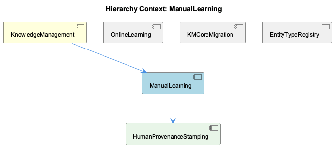
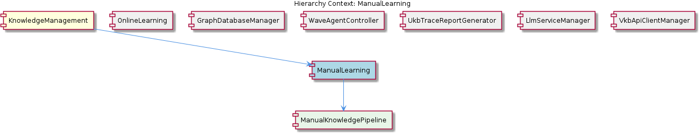

# ManualLearning

**Type:** SubComponent

The GraphDatabaseAdapter employs a lock-free architecture to prevent LevelDB lock conflicts, ensuring that ManualLearning can handle multiple concurrent requests without performance degradation.

## What It Is  

**ManualLearning** is a sub‑component of the **KnowledgeManagement** domain that focuses on the acquisition, persistence, and manipulation of knowledge extracted from code, documentation, and other learning sources. The core of its persistence layer lives in the file **`storage/graph-database-adapter.ts`**, where the **`GraphDatabaseAdapter`** class is defined. This adapter supplies the concrete implementation that stores and queries knowledge graphs using a **Graphology + LevelDB** backend, while automatically synchronising a JSON export for downstream consumption.  

ManualLearning does not operate in isolation; it collaborates with a suite of sibling agents—**CodeAnalysisAgent**, **OntologyClassificationAgent**, **ContentValidationAgent**, **TraceReportGenerator**, and **OnlineLearning**—to transform raw inputs into structured graph entities. Its parent, **KnowledgeManagement**, delegates all graph‑persistence responsibilities to the same adapter, ensuring a single source of truth for entity storage across the entire knowledge stack.

---

## Architecture and Design  

The architecture that emerges from the observations is a **modular, adapter‑centric design**. The **`GraphDatabaseAdapter`** acts as an *Adapter* pattern that abstracts the underlying LevelDB storage details behind a clean, domain‑specific API used by ManualLearning and its siblings. By locating the adapter in **`storage/graph-database-adapter.ts`**, the system isolates persistence concerns from the learning logic, enabling each component to evolve independently.

A notable architectural decision is the **lock‑free implementation** of the adapter. LevelDB, by default, enforces a single‑writer lock that can become a bottleneck under concurrent workloads. ManualLearning’s designers replaced the traditional lock with a lock‑free strategy (likely using atomic operations or write‑ahead logs) to **prevent LevelDB lock conflicts**. This choice directly supports the requirement that ManualLearning handle **multiple concurrent requests without performance degradation**, a critical scalability trait for a system that may ingest code analysis results, ontology classifications, and validation reports in parallel.

Interaction between components follows a **pipeline‑style composition**:  
1. **CodeAnalysisAgent** parses source code with AST techniques and emits raw concepts.  
2. **OntologyClassificationAgent** consumes those concepts, classifies them against an ontology, and attaches confidence scores.  
3. **ContentValidationAgent** validates the enriched concepts according to configurable modes, producing validation reports.  
4. **TraceReportGenerator** can then stitch together the full provenance of a knowledge‑graph update, capturing data flow across the pipeline.  

ManualLearning’s role is to **receive the final, validated concepts** and persist them via the **`GraphDatabaseAdapter`**. The sibling **OnlineLearning** component runs a similar pipeline but sources its inputs from git history and LSL sessions, showing a **shared processing model** that re‑uses the same adapter for storage.

---

## Implementation Details  

The **`GraphDatabaseAdapter`** (found in **`storage/graph-database-adapter.ts`**) encapsulates three primary responsibilities:

1. **Graphology + LevelDB Integration** – It creates a Graphology graph instance backed by LevelDB, enabling efficient vertex/edge storage while leveraging LevelDB’s on‑disk performance characteristics.  
2. **Lock‑Free Write Path** – Rather than acquiring a global LevelDB mutex, the adapter employs a lock‑free algorithm (e.g., compare‑and‑swap on write batches) to allow simultaneous write operations. This eliminates the classic “database is locked” error that would otherwise surface when ManualLearning processes many concurrent extraction jobs.  
3. **Automatic JSON Export Sync** – After each successful mutation, the adapter serialises the affected sub‑graph to JSON and writes it to a designated export location. This side‑channel export is used by downstream consumers (e.g., UI dashboards, audit tools) that prefer a static, human‑readable snapshot.

From the perspective of ManualLearning, the workflow is:

```ts
import { GraphDatabaseAdapter } from './storage/graph-database-adapter';

// 1. Receive validated concepts from ContentValidationAgent
async function persistConcepts(concepts: Concept[]) {
  const adapter = GraphDatabaseAdapter.getInstance(); // singleton for shared DB
  await adapter.beginTransaction();

  for (const c of concepts) {
    // Map Concept -> Graph node + edges
    adapter.upsertNode(c.id, { ...c.metadata });
    // Possibly create relationships to existing entities
    adapter.upsertEdge(c.id, c.parentId, { type: 'derivedFrom' });
  }

  await adapter.commitTransaction(); // lock‑free commit
}
```

The **singleton pattern** (implicit in `getInstance`) guarantees a single connection pool to LevelDB, reinforcing the lock‑free guarantee across the entire KnowledgeManagement suite. The **transactional API** (`beginTransaction`, `commitTransaction`) abstracts the batch‑write semantics required for atomic updates, while the adapter internally flushes the JSON export after commit.

---

## Integration Points  

ManualLearning sits at the intersection of **knowledge extraction** and **knowledge persistence**. Its primary integration surface is the **`GraphDatabaseAdapter`**, which it consumes directly. The adapter’s public contract (e.g., `upsertNode`, `upsertEdge`, `query`, `beginTransaction`, `commitTransaction`) is also used by the sibling **GraphDatabaseManager** component, illustrating a **shared persistence contract** across the KnowledgeManagement domain.

Upstream, ManualLearning receives data from three agents:

* **CodeAnalysisAgent** – Supplies raw AST‑derived concepts. The interface likely returns a list of `Concept` objects that include identifiers, source locations, and initial metadata.  
* **OntologyClassificationAgent** – Enhances those concepts with ontology class labels and confidence scores. The classification payload is merged into the `Concept` objects before they reach ManualLearning.  
* **ContentValidationAgent** – Performs mode‑specific validation (e.g., syntactic, semantic, policy) and attaches a validation status and report. ManualLearning only persists concepts that pass validation, ensuring data quality.

Downstream, the **TraceReportGenerator** can query the same `GraphDatabaseAdapter` to reconstruct the lineage of any persisted node, linking back through the agents that contributed to its creation. This tight coupling via a common adapter enables **full‑stack traceability** without additional plumbing.

Because the adapter is lock‑free and supports concurrent writes, ManualLearning can be invoked from multiple entry points (e.g., HTTP handlers, background workers) simultaneously, without needing external coordination mechanisms.

---

## Usage Guidelines  

1. **Obtain the Adapter via its Singleton** – Always call `GraphDatabaseAdapter.getInstance()` rather than constructing a new adapter. This guarantees that the lock‑free write path and JSON export synchronisation remain consistent across all components.  
2. **Batch Mutations Inside Transactions** – Wrap all node/edge upserts for a single learning session inside `beginTransaction` / `commitTransaction`. This not only leverages the adapter’s lock‑free batch commit but also ensures that the JSON export reflects a coherent snapshot.  
3. **Validate Before Persisting** – Only forward concepts that have successfully passed the **ContentValidationAgent**. Persisting unvalidated data defeats the purpose of the validation pipeline and can pollute the knowledge graph with low‑confidence entities.  
4. **Respect Ontology Confidence Scores** – When persisting classifications from **OntologyClassificationAgent**, store the confidence score alongside the class label. Downstream consumers (e.g., UI ranking, reasoning engines) rely on this metric to surface the most reliable knowledge.  
5. **Avoid Direct LevelDB Calls** – All interactions with the underlying LevelDB store must go through the adapter. Direct LevelDB access bypasses the lock‑free logic and can re‑introduce contention, breaking the concurrency guarantees that ManualLearning depends on.  

---

### Summary of Key Architectural Insights  

1. **Architectural patterns identified** – Adapter pattern for persistence abstraction; lock‑free concurrency strategy; pipeline composition across agents; singleton for shared DB connection.  
2. **Design decisions and trade‑offs** – Choosing a lock‑free LevelDB wrapper improves concurrency at the cost of added complexity in write‑path implementation; automatic JSON export adds storage overhead but provides immediate consumable snapshots.  
3. **System structure insights** – ManualLearning is a leaf sub‑component that delegates all storage to a shared `GraphDatabaseAdapter`, while upstream agents enrich data before it reaches the graph. Sibling components share the same adapter, promoting a unified data model.  
4. **Scalability considerations** – Lock‑free writes enable high request parallelism; LevelDB’s on‑disk efficiency supports large graph sizes; JSON export may become a bottleneck if the graph grows dramatically, suggesting a possible future off‑load to a streaming export service.  
5. **Maintainability assessment** – The clear separation of concerns (agents → validation → persistence) and the centralized adapter make the codebase easy to reason about and extend. However, the lock‑free implementation is a specialized area that should be well‑documented and covered by targeted tests to avoid subtle concurrency bugs.

## Diagrams

### Relationship




## Architecture Diagrams




## Hierarchy Context

### Parent
- [KnowledgeManagement](./KnowledgeManagement.md) -- [LLM] The KnowledgeManagement component utilizes a GraphDatabaseAdapter for storing and managing knowledge graphs. This adapter, implemented in storage/graph-database-adapter.ts, enables Graphology+LevelDB persistence with automatic JSON export sync. By using this adapter, the component can efficiently store and query knowledge graphs, which are essential for entity persistence and knowledge decay tracking. Furthermore, the GraphDatabaseAdapter employs a lock-free architecture to prevent LevelDB lock conflicts, ensuring that the component can handle multiple concurrent requests without performance degradation.

### Children
- [GraphDatabaseAdapter](./GraphDatabaseAdapter.md) -- The ManualLearning sub-component utilizes the GraphDatabaseAdapter in storage/graph-database-adapter.ts to store and manage knowledge graphs.

### Siblings
- [OnlineLearning](./OnlineLearning.md) -- OnlineLearning uses the batch analysis pipeline to extract knowledge from git history, LSL sessions, and code analysis.
- [GraphDatabaseManager](./GraphDatabaseManager.md) -- GraphDatabaseManager utilizes the GraphDatabaseAdapter in storage/graph-database-adapter.ts to manage the graph database connection.
- [CodeAnalysisAgent](./CodeAnalysisAgent.md) -- CodeAnalysisAgent uses AST-based techniques to analyze code structures and extract concepts.
- [OntologyClassificationAgent](./OntologyClassificationAgent.md) -- OntologyClassificationAgent uses ontology systems to classify entities and provide confidence scores for classifications.
- [ContentValidationAgent](./ContentValidationAgent.md) -- ContentValidationAgent uses various modes to validate content and provide validation reports.
- [TraceReportGenerator](./TraceReportGenerator.md) -- TraceReportGenerator generates detailed trace reports of UKB workflow runs, capturing data flow, concept extraction, and ontology classification.


---

*Generated from 6 observations*
