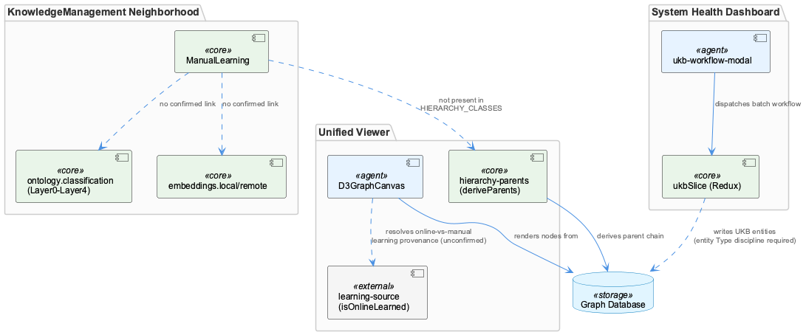
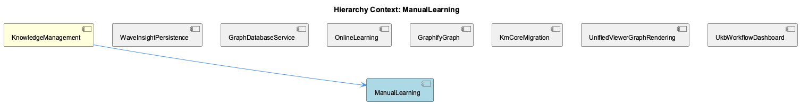

# ManualLearning

**Type:** SubComponent

[Code References] lib/ukb-database/cli.js:44 - isVKBRunning() health probe against VKB_SERVER_URL; lib/ukb-database/cli.js - updateEntityFromStdin checks vkbRunning before choosing write path; addEntityFromStdin/addRelationFromStdin do not; lib/ukb-unified/cli.js - UKBCli.defaultCommand: checkpoint load → GapAnalyzer.getGapSummary → WorkflowOrchestrator.executeIncrementalWorkflow; lib/ukb-unified/core/VkbApiClient.js:20 - isServerAvailable() treats any response.ok as available, deliberately ignoring graph health field; integrations/system-health-dashboard/src/components/ukb-workflow-modal.tsx - calculateDynamicEta() and legacy calculateStepAwareEta() delegation; integrations/system-health-dashboard/src/components/ukb-workflow-modal.tsx - HISTORY_PAGE_SIZE raised 50→500 due to /api/ukb/history full-read-then-slice behavior; integrations/system-health-dashboard/src/components/workflow/multi-agent-graph.tsx - WAVE_AGENTS fallback list for historical/completed view node+edge rendering

# ManualLearning — Technical Insight Document

## What It Is

ManualLearning is not a single implementation but a **constellation of parallel entry points** into a shared knowledge-graph substrate, all living under `lib/ukb-database/` and `lib/ukb-unified/`, plus a dashboard-facing UI layer under `integrations/system-health-dashboard/`. Its four children — UKBDatabaseCLI, UKBUnifiedCLI, WorkflowOrchestrator, and VkbApiClient — represent three structurally distinct ways of mutating the same knowledge entities/relations: direct database writes (`lib/ukb-database/cli.js` via `DatabaseManager`/`UKBDatabaseWriter` against SQLite + Qdrant), an orchestrated incremental workflow (`lib/ukb-unified/cli.js` via `WorkflowOrchestrator`/`TeamCheckpointManager`/`GapAnalyzer`), and an HTTP-based path (`lib/ukb-unified/core/VkbApiClient.js`) that talks to a live VKB server. As a SubComponent of KnowledgeManagement, ManualLearning sits alongside OnlineLearning, VkbServer, and UkbUnifiedCli, sharing the same underlying VKB server and graph backend (KMCore) that its parent component centers around.

## Architecture and Design

The dominant architectural theme is **write-path plurality without a unifying arbiter**. Nothing in the observed code enforces mutual exclusion between the direct-DB path, the HTTP path, and the orchestrated incremental pipeline, making race conditions and divergence a structural risk rather than an edge case. `lib/ukb-database/cli.js` partially acknowledges this: `updateEntityFromStdin` calls `isVKBRunning()` before deciding how to persist, avoiding stale server caches — but `addEntityFromStdin` and `addRelationFromStdin` skip this check entirely, an inconsistency in dual-write guarding that means new entities can silently bypass a running server until restart or re-hydration.

A second pattern is **checkpoint-gated incremental processing**. `UKBCli.defaultCommand` in `lib/ukb-unified/cli.js` loads a git-tracked checkpoint (`.data/ukb-last-run.json`) via `TeamCheckpointManager`, computes a gap through `GapAnalyzer.getGapSummary`/`generateIncrementalScope`, and only invokes `WorkflowOrchestrator.executeIncrementalWorkflow` when new work exists. Storing this checkpoint in git (rather than per-machine) is a deliberate multi-developer coordination primitive, letting any team member's `ukb` run resume from the last committed checkpoint — at the cost of exposing merge-conflict/stale-commit failure modes that aren't visible from the CLI code alone. This dovetails with the sibling UkbUnifiedCli's safety valve: if no checkpoint exists, the CLI refuses to silently run a full analysis, instead directing users to `ukb --full`.

A third pattern is **liveness-over-strict-health** client design: `VkbApiClient.isServerAvailable()` treats any HTTP 200 from `/api/health` as "available" regardless of the graph health flag, explicitly trading strict correctness for availability since "entity APIs work via HTTP even if graph health check has issues."

## Implementation Details

`lib/ukb-database/cli.js:44`'s `isVKBRunning()` probes `VKB_SERVER_URL` as a health check, but its coverage is asymmetric — only `updateEntityFromStdin` consults it before choosing a write path. `VkbApiClient.js:20`'s `isServerAvailable()` deliberately ignores the graph-health field in the response body, and the client itself is a thin, timeout-guarded fetch wrapper (`AbortSignal.timeout` on every call) with no retry/backoff logic; failures surface as thrown Errors parsed from JSON response bodies.

On the dashboard side, `ukb-workflow-modal.tsx` implements `calculateDynamicEta()`, a multi-source estimator blending in-run batch durations (weighted toward reliability once ≥2 batches complete, penalized 1.2x with a single sample), historical `WorkflowTimingStats` medians via `getStepMedianDuration`/`calculateMedian`, and a linear-interpolation fallback, clamped to 30%–200% of the linear estimate as a sanity bound. This supersedes `calculateStepAwareEta`, explicitly retained only for call-site compatibility — a textbook strangler-pattern refactor. The same file encodes an operational lesson in its `HISTORY_PAGE_SIZE` constant (raised 50→500): `/api/ukb/history` reads and parses every report before slicing, so small page sizes silently made runs beyond ~50 unreachable; the fix is "close to free" but does not resolve the underlying O(n) full-parse cost.

`multi-agent-graph.tsx` hardcodes a `WAVE_AGENTS` list (`batch_scheduler`, `semantic_analysis`, `quality_assurance`, `ontology_classification`, `persistence`, `kg_operators`, `insight_generation`) to keep historical/completed-view node and edge rendering consistent when live execution data (`effectiveSteps`) is absent — previously a source of inconsistent edge-filtering bugs.

## Integration Points

ManualLearning's children interoperate tightly with KnowledgeManagement's parent-level VKB server: `VkbApiClient` calls it directly over HTTP (`http://localhost:8080`), while `UKBDatabaseCLI` bypasses it for direct SQLite/Qdrant writes, and `UKBUnifiedCLI` mediates between the two via `WorkflowOrchestrator`. `UKBUnifiedCLI`'s constructor eagerly builds `TeamCheckpointManager`, `GapAnalyzer`, and `ConfigManager`, but lazily initializes `WorkflowOrchestrator` (`this.orchestrator = null`) because it depends on async `configManager.loadConfig()` — a constructor-ordering trap for any new command path that touches `this.orchestrator` prematurely. Sibling OnlineLearning shares the same `ukb-workflow-modal.tsx` file and `calculateDynamicEta()` logic, framing it as an online-learning-style ETA predictor for the wave-analysis workflow, while sibling VkbServer supplies the backend (`VKBServer` class) that both `VkbApiClient` and the direct-DB path ultimately affect.

## Usage Guidelines

Developers extending write paths must recognize that only entity *updates* in `lib/ukb-database/cli.js` are guarded against a live VKB server; new entity/relation creation is not — any fix should extend the `isVKBRunning()` check symmetrically. Anyone relying on `VkbApiClient.isServerAvailable()` should be aware it is intentionally lenient and does not guarantee full graph health; callers needing stricter guarantees must inspect the health payload themselves, since the client has no retry/backoff and surfaces raw thrown errors. When modifying checkpoint behavior, remember `.data/ukb-last-run.json` is git-tracked and shared across the team — treat it as coordination state, not local cache. Finally, any new pipeline agent added to the backend must be propagated by hand into `AGENT_SUBSTEPS`, `WAVE_AGENTS`, and `MULTI_AGENT_EDGES`/`STEP_TO_SUBSTEP` in the dashboard's `./constants`, or historical-view rendering will silently regress — a known maintainability hazard flagged directly in code comments.

## Hierarchy Context

### Parent
- [KnowledgeManagement](./KnowledgeManagement.md) -- [LLM] The KnowledgeManagement component centers on the VKB (Virtual Knowledge Base) server, which acts as the primary interface for storing, querying, and decaying knowledge graph entities. This server sits atop a graph database backend (KMCore) that replaced an earlier LevelDB-based storage engine. Developers working on this component should understand that the VKB server is not just a passthrough to the database—it implements query logic, caching, and decay scheduling that must be preserved across any storage backend swap, as evidenced by the dedicated migration test suite.

### Children
- [UKBDatabaseCLI](./UKBDatabaseCLI.md) -- [LLM] lib/ukb-database/cli.js's initializeDatabase() (cli.js:64-101) performs a three-way composite health dependency in one call: it constructs a single DatabaseManager wired to SQLite (path from SQLITE_PATH or a default under .data/knowledge.db), Qdrant (host/port from env, toggled by QDRANT_ENABLED), and a graph DB path — then awaits databaseManager.initialize() before instantiating UKBDatabaseWriter. Because writer is a module-level singleton guarded by `if (writer) return writer;`, every stdin-driven command (addEntityFromStdin, addRelationFromStdin, displayStatus) in a given process shares one lazily-initialized connection set; a partial failure (e.g. Qdrant down but SQLite up) is not surfaced per-subsystem at call time, only via the later `writer.getStatistics()`/`databaseManager.getHealth()` calls inside displayStatus (cli.js:170-186), meaning add-entity/add-relation commands have no equivalent health-check gate before writing.
- [UKBUnifiedCLI](./UKBUnifiedCLI.md) -- [LLM] The 'UKBUnifiedCLI' component (lib/ukb-unified/cli.js) is a thin orchestration layer around four core managers instantiated in the UKBCli constructor: TeamCheckpointManager, GapAnalyzer, ConfigManager, and a lazily-initialized WorkflowOrchestrator (cli.js:36-42). The lazy init pattern for `this.orchestrator = null` deviates from the other three managers, which are constructed eagerly in the constructor — this is because WorkflowOrchestrator requires config loaded via `this.configManager.loadConfig()` (cli.js:229), an async call that can't happen in a synchronous constructor. This asymmetry means any code path that touches `this.orchestrator` before `defaultCommand()` or an equivalent init sequence runs will find it null, a subtle constructor-ordering trap for future maintainers adding new commands.
- [WorkflowOrchestrator](./WorkflowOrchestrator.md) -- [CGR] WorkflowOrchestrator (class) in WorkflowOrchestrator.js
- [VkbApiClient](./VkbApiClient.md) -- [CGR] VkbApiClient (class) in VkbApiClient.js

### Siblings
- [OnlineLearning](./OnlineLearning.md) -- [LLM] The OnlineLearning subcomponent's most detailed artifact, integrations/system-health-dashboard/src/components/ukb-workflow-modal.tsx, is not a learning engine itself but an operator-facing ETA/progress predictor for the wave-analysis workflow. `calculateDynamicEta()` implements a genuine online-learning loop: it computes `learnedAvgBatchMs` from batches completed *within the current run* (falling back to historical `workflowStats.avgBatchDurationMs` only when zero batches have finished), then blends that live estimate with a `linearEtaMs` sanity check that clamps the result to `[linearEtaMs * 0.3, linearEtaMs * 2.0]`. This is a textbook exponential-refinement pattern applied to progress estimation rather than model weights — the system 'learns' the current run's throughput characteristics and self-corrects as more batches complete, with `completedBatchCount === 1` handled specially (a 1.2x conservative multiplier) to avoid overfitting to a single noisy sample.
- [VkbServer](./VkbServer.md) -- [CGR] VKBServer (class) in index.js
- [UkbUnifiedCli](./UkbUnifiedCli.md) -- [LLM] lib/ukb-unified/cli.js implements the UKBCli class as the top-level entry point for knowledge base updates, and its defaultCommand() method (around line ~150) encodes a deliberate incremental-first philosophy: it loads a TeamCheckpointManager checkpoint, and if none exists it explicitly refuses to run a full analysis, instead printing a recommendation to use `ukb --full`. This is a safety valve against an unbounded first-run cost (analyzing the entire git history and session log corpus) being triggered accidentally by a bare `ukb` invocation — the CLI treats 'first run' as a distinct, opt-in code path rather than silently falling back to full analysis.

---

*Generated from 10 observations*
