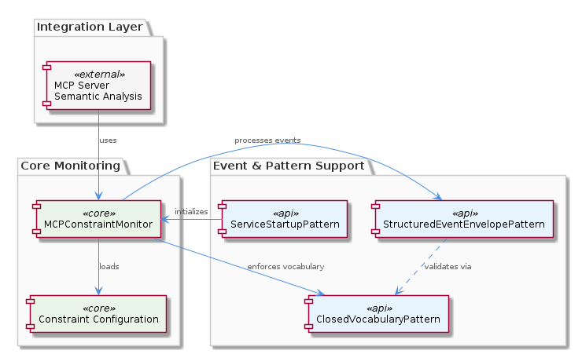
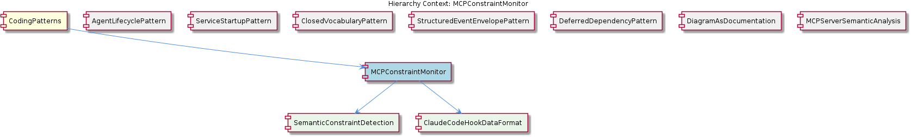

# MCPConstraintMonitor

**Type:** SubComponent

The MCPConstraintMonitor is designed to work with the ClosedVocabularyPattern, as seen in integrations/mcp-constraint-monitor/docs/constraint-configuration.md

# MCPConstraintMonitor — Technical Insight Document

## What It Is

The MCPConstraintMonitor is a SubComponent implemented under `integrations/mcp-constraint-monitor/`, with its primary entry-point documentation located at `integrations/mcp-constraint-monitor/README.md`. It is a constraint monitoring and enforcement module that observes activity within the broader system and validates it against a defined set of rules. The module sits inside the `CodingPatterns` parent grouping, alongside sibling patterns such as `AgentLifecyclePattern`, `ServiceStartupPattern`, `ClosedVocabularyPattern`, `StructuredEventEnvelopePattern`, `DeferredDependencyPattern`, `DiagramAsDocumentation`, and `MCPServerSemanticAnalysis`.

Functionally, MCPConstraintMonitor exposes a clear and concise representation of the constraint monitoring process — it ingests events (notably from Claude Code hooks), evaluates them against configured constraints, and surfaces enforcement outcomes. Its two child sub-features, `SemanticConstraintDetection` and `ClaudeCodeHookDataFormat`, define the two main pillars of the system: the detection logic that determines whether a constraint has been violated, and the schema of incoming data the monitor consumes.

The module is referenced and used throughout the codebase, with examples appearing in `integrations/mcp-server-semantic-analysis/docs/api/README.md`, indicating cross-integration adoption beyond its own package boundary.

## Architecture and Design

Architecturally, MCPConstraintMonitor is composed around two complementary concerns: a well-defined ingestion boundary and a well-defined detection core. The ingestion boundary is governed by `ClaudeCodeHookDataFormat`, specified in `integrations/mcp-constraint-monitor/docs/CLAUDE-CODE-HOOK-FORMAT.md`. This document establishes the payload schema that Claude Code emits when invoking the constraint monitor as a downstream hook consumer, making it the primary contract through which external events enter the system. The detection core is realized through `SemanticConstraintDetection`, which is significant enough to be documented across two separate files — `integrations/mcp-constraint-monitor/docs/semantic-constraint-detection.md` for operational guidance and `integrations/mcp-constraint-monitor/docs/semantic-detection-design.md` for design rationale. This split signals that the detection logic carries non-trivial complexity and warrants both how-to and why-to documentation.

The monitor adheres to the `StructuredEventEnvelopePattern` (a sibling pattern) for handling events. This means incoming activity is wrapped in a normalized envelope structure before being processed, consistent with the format specified in `CLAUDE-CODE-HOOK-FORMAT.md`. By committing to the envelope pattern, the monitor decouples its detection logic from the raw shape of any single producer's event format and can uniformly evaluate events regardless of origin.

The constraint configuration layer, documented at `integrations/mcp-constraint-monitor/docs/constraint-configuration.md`, is explicitly designed to interoperate with the `ClosedVocabularyPattern`. The migration scripts described in that same document enforce fixed canonical type sets, ensuring constraint definitions reference only known, vetted vocabulary terms. This prevents arbitrary or free-form constraint expressions from drifting outside the controlled domain language.

## Implementation Details

At an implementation level, MCPConstraintMonitor is structured around three layered concerns: hook ingestion, envelope normalization, and semantic detection. Hook ingestion is the inbound edge — the monitor receives payloads conforming to the format defined in `integrations/mcp-constraint-monitor/docs/CLAUDE-CODE-HOOK-FORMAT.md`. Because this format is owned by the `ClaudeCodeHookDataFormat` child component, any change to how Claude Code emits hook data is reflected here as the canonical source of schema truth.

Once a hook payload is received, it is normalized into the envelope structure mandated by `StructuredEventEnvelopePattern`. From there, the `SemanticConstraintDetection` child performs the actual evaluation. The dual documentation (`semantic-constraint-detection.md` and `semantic-detection-design.md`) reflects that detection is not a trivial string-match or rule-table lookup — it carries semantic understanding of the events it processes, and the design document exists specifically to capture the rationale developers need before modifying that logic.

Constraint definitions themselves are governed by `integrations/mcp-constraint-monitor/docs/constraint-configuration.md`, and the migration scripts mentioned there enforce vocabulary closure. This ensures that as constraints evolve, they continue to draw from a controlled set of canonical types rather than fragmenting into ad-hoc terminology.

Because the source code symbol inventory for this entity yielded no exported symbols in the provided observations, the implementation guidance here is necessarily framed at the architectural-document level rather than at the class or function level.

## Integration Points

MCPConstraintMonitor integrates with the broader codebase along several distinct seams. First, it consumes events from Claude Code via the hook payload contract defined in `ClaudeCodeHookDataFormat`. This is the primary ingestion boundary and the means by which external tool activity enters the constraint pipeline.

Second, it depends on the `StructuredEventEnvelopePattern` sibling pattern for the in-flight representation of events. Any subsystem producing envelope-formatted events can, in principle, route them through the monitor for evaluation.

Third, it relies on the `ClosedVocabularyPattern` to constrain its own configuration surface. The link is made explicit in `integrations/mcp-constraint-monitor/docs/constraint-configuration.md`, where migration scripts enforce fixed canonical type sets. This integration ensures that constraint definitions remain semantically aligned with the rest of the system's controlled vocabulary.

Fourth, it is deployed in conjunction with the `ServiceStartupPattern` sibling, ensuring that constraint monitoring is brought up consistently and reliably as part of service initialization. Given that `ServiceStartupPattern` is realized via the `startServiceWithRetry()` function in `lib/service-starter.js`, the monitor benefits from the same retry-on-failure startup semantics that other managed services use.

Finally, the module is referenced from other integrations — notably `integrations/mcp-server-semantic-analysis/docs/api/README.md` — demonstrating that its API surface is consumed by sibling MCP integrations such as `MCPServerSemanticAnalysis`.

## Usage Guidelines

Developers working with MCPConstraintMonitor should treat the four documentation files in `integrations/mcp-constraint-monitor/docs/` as authoritative: `CLAUDE-CODE-HOOK-FORMAT.md` for the inbound payload schema, `constraint-configuration.md` for defining and migrating constraints, `semantic-constraint-detection.md` for operational detection behavior, and `semantic-detection-design.md` for the rationale behind detection design choices. Before modifying detection logic, consult the design document — its very existence signals that the design contains non-obvious decisions.

When defining new constraints, respect the `ClosedVocabularyPattern` enforced by the migration scripts described in `constraint-configuration.md`. Do not introduce new type identifiers outside the canonical set; instead, extend the vocabulary through the same migration mechanism so that the closed-vocabulary contract remains intact across the codebase.

When emitting or consuming events that flow through the monitor, conform to the `StructuredEventEnvelopePattern` rather than passing raw payloads. The envelope normalization is what allows the monitor to treat heterogeneous event sources uniformly, and bypassing it would either break detection or require special-case handling.

When starting the monitor as part of a service, use the `ServiceStartupPattern` (via `startServiceWithRetry()` in `lib/service-starter.js`) rather than constructing and starting it ad-hoc. This guarantees consistent startup semantics, retry behavior, and observability alongside other managed services. Additionally, because the monitor exists within the `CodingPatterns` parent grouping where stateful managers commonly follow the project-wide singleton guard idiom, avoid instantiating the monitor multiple times from arbitrary call sites — route through the designated accessor to preserve consistent constraint state across the application.

## Hierarchy Context

### Parent
- [CodingPatterns](./CodingPatterns.md) -- [LLM] The project-wide singleton guard pattern is formally codified in `docs/puml/psm-singleton-pattern.puml` and manifests consistently wherever stateful managers are instantiated. The pattern follows a strict guard-and-return idiom: a module-level variable holds the single instance (initialized to null or undefined), and every access point checks that variable before constructing a new object. If an instance already exists, the existing reference is returned immediately without re-running any constructor or initialization logic. This prevents race conditions in async service environments where multiple subsystems might attempt to spin up the same stateful manager concurrently — a real concern in Node.js applications that use event-driven concurrency without explicit locking primitives. For new developers, the implication is that any class described as a 'manager' or 'session' object in this codebase should be assumed to follow this pattern: do not call `new` directly on these classes from arbitrary call sites; instead, always go through the designated factory or accessor function that enforces the singleton contract. The PlantUML diagram in `docs/puml/psm-singleton-pattern.puml` is authoritative and should be consulted before introducing any new singleton-style manager to ensure the guard logic is structurally consistent with the rest of the project.

### Children
- [SemanticConstraintDetection](./SemanticConstraintDetection.md) -- Documented across two distinct files — `integrations/mcp-constraint-monitor/docs/semantic-constraint-detection.md` and `integrations/mcp-constraint-monitor/docs/semantic-detection-design.md` — indicating this feature is complex enough to require both an operational guide and a separate design rationale document.
- [ClaudeCodeHookDataFormat](./ClaudeCodeHookDataFormat.md) -- Specified in `integrations/mcp-constraint-monitor/docs/CLAUDE-CODE-HOOK-FORMAT.md`, this document establishes the payload schema that Claude Code emits when invoking the constraint monitor as a downstream hook consumer, forming the primary ingestion boundary of the system.

### Siblings
- [AgentLifecyclePattern](./AgentLifecyclePattern.md) -- The BaseAgent class in base-agent.ts defines the lifecycle methods init(), start(), stop(), pause(), and resume()
- [ServiceStartupPattern](./ServiceStartupPattern.md) -- The startServiceWithRetry() function in lib/service-starter.js wraps the service startup with retry logic
- [ClosedVocabularyPattern](./ClosedVocabularyPattern.md) -- The migration scripts in integrations/mcp-constraint-monitor/docs/constraint-configuration.md enforce fixed canonical type sets
- [StructuredEventEnvelopePattern](./StructuredEventEnvelopePattern.md) -- The CLAUDE-CODE-HOOK-FORMAT.md document specifies the structured event envelope format
- [DeferredDependencyPattern](./DeferredDependencyPattern.md) -- The VkbApiClient module in lib/ukb-unified/core/VkbApiClient.js is loaded dynamically using dynamic-import
- [DiagramAsDocumentation](./DiagramAsDocumentation.md) -- The PlantUML diagrams in docs/puml/ capture architectural decisions and provide visual specification
- [MCPServerSemanticAnalysis](./MCPServerSemanticAnalysis.md) -- The MCPServerSemanticAnalysis module in integrations/mcp-server-semantic-analysis/README.md performs semantic analysis

---

*Generated from 6 observations*
