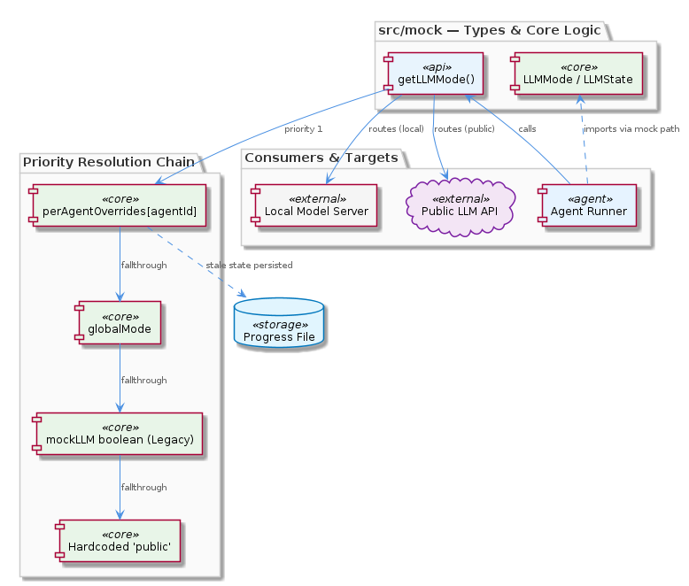
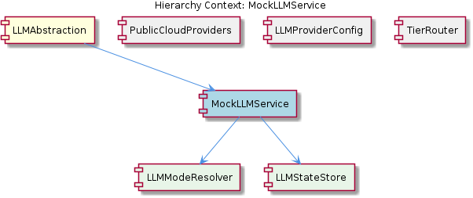

# MockLLMService

**Type:** SubComponent

Because LLMState and LLMMode are defined here rather than in a shared types module, any file importing these types must reference src/mock/llm-mock-service.ts, creating an unconventional import dependency on a file named 'mock'

# MockLLMService — Technical Insight Document

## What It Is

`MockLLMService` is implemented in `src/mock/llm-mock-service.ts` and, despite the strong "mock" connotation of its filename, serves as the **single source of truth** for two foundational types in the LLM subsystem: the `LLMMode` union type (`'mock' | 'local' | 'public'`) and the `LLMState` interface. It is a SubComponent of the larger `LLMAbstraction` parent and itself contains two logical children: `LLMModeResolver` (the `getLLMMode()` resolution function) and `LLMStateStore` (the persisted `LLMState` structure including `globalMode` and `perAgentOverrides`).

Functionally, `MockLLMService` is the canonical mode-resolution authority for the entire LLM stack. Any code path that needs to know which provider tier (mock, local, or public) an agent should target must reach into this file — either directly via `getLLMMode()` or indirectly via the types it exports. This places it on the critical path of every model invocation, not merely those during testing.

## Architecture and Design

The architectural centerpiece of `MockLLMService` is a **four-level priority chain** implemented inside `getLLMMode()`. The chain resolves, in strict order: (1) `perAgentOverrides[agentId]` from `llmState`, (2) the global `llmState.globalMode`, (3) a legacy `mockLLM` boolean fallback, and (4) a hardcoded default of `'public'`. This Chain-of-Responsibility-style resolution centralizes a decision that would otherwise be scattered across agent code, ensuring all downstream agent behavior branches on a single deterministic output — a property emphasized in the `LLMModeResolver` child description, which warns that no other location should make this decision independently.

The presence of level 3 — the legacy `mockLLM` boolean — is a deliberate backward-compatibility seam. It signals that the codebase has migrated from a simpler binary "mock or not" flag toward the richer three-valued `LLMMode` enum, while retaining the older interface so existing callers continue to function. The trade-off here is clear: simplicity of the new API is sacrificed slightly to avoid a breaking change, and the cost is a subtly more complex resolution chain that developers must hold in their heads.

A second notable design decision is the **co-location of canonical types with mock infrastructure**. `LLMState` and `LLMMode` live alongside what the filename suggests is a test utility. This is unconventional — most codebases would isolate such types in a shared `types/` module — and it creates an import dependency from production code into a file named `mock`. The sibling components `PublicCloudProviders`, `LLMProviderConfig`, and `TierRouter` all ultimately depend on the `LLMMode` produced here, even though provider registries live in `config/llm-providers.yaml` and tier strategy is documented in `integrations/mcp-server-semantic-analysis/docs/TIERED-MODEL-PROPOSAL.md`.

## Implementation Details

The core function `getLLMMode(agentId)` is the mandatory entry point for mode resolution and should be the first place consulted when debugging unexpected model behavior. Internally it reads from the `LLMStateStore` child — specifically `llmState.perAgentOverrides[agentId]` first, falling through to `llmState.globalMode`, then to the legacy `mockLLM` boolean, and finally returning the hardcoded `'public'` default.

The `LLMStateStore` is **persisted to a progress file** between runs. This is a significant implementation detail with operational consequences: a per-agent override written during a previous agent execution survives process restarts and continues to take precedence over any newly-set `globalMode`. There is no runtime warning when this happens — the stale override silently wins. Developers debugging "why is this agent still using the wrong model after I changed the global setting?" almost always trace the answer back to a leftover entry in `perAgentOverrides`.

The `LLMMode` union admits three values, each routing to a distinct backend strategy:
- `'mock'` — returns canned responses (the original purpose suggested by the filename)
- `'local'` — routes to a locally-running model server
- `'public'` — routes via `PublicCloudProviders`, the default fallback

Notably, the `'local'` mode's resolution lives in this same mock service file, meaning **local development infrastructure is coupled to mock infrastructure** rather than residing in a dedicated local-provider module. This coupling is an artifact of the file's evolution into a de facto types/resolution hub.

## Integration Points

`MockLLMService` sits inside `LLMAbstraction` and is the type-providing peer to its siblings. `LLMProviderConfig` reads provider definitions from `config/llm-providers.yaml`, but the *selection* between those providers is gated by the `LLMMode` value this service produces. `TierRouter`, whose design rationale is captured in `integrations/mcp-server-semantic-analysis/docs/TIERED-MODEL-PROPOSAL.md`, performs tier-based model selection only *after* `getLLMMode()` has determined the mode bucket. `PublicCloudProviders` is the default destination when no override or global mode is set — the fourth-level fallback of `'public'` exists specifically to route to it.

Because the canonical types are exported from `src/mock/llm-mock-service.ts`, every file that imports `LLMMode` or `LLMState` creates a dependency edge pointing into a file whose name suggests test-only scope. This is an **unconventional import topology** that can mislead new contributors using directory-based heuristics to navigate the codebase. The two child components, `LLMModeResolver` and `LLMStateStore`, are not separate files but logical groupings within this single source — `LLMModeResolver` corresponds to the `getLLMMode()` function and `LLMStateStore` corresponds to the persisted `LLMState` structure.

The persistence layer (the progress file storing `llmState`) is another integration point worth noting: it links runtime mode resolution to the agent run lifecycle, meaning any system that resets or migrates progress files must consider the implications for cached `perAgentOverrides`.

## Usage Guidelines

**Treat `src/mock/llm-mock-service.ts` as a core types file, not a mock.** The filename is misleading; this is a load-bearing module on the production code path. When importing `LLMMode` or `LLMState`, do not assume the import is restricted to test contexts.

**Always start mode-related debugging at `getLLMMode()`.** If an agent is using an unexpected model, the resolution chain is the answer in nearly every case. Walk the four levels in order: check `llmState.perAgentOverrides[agentId]` first (this is the most common silent culprit), then `llmState.globalMode`, then the legacy `mockLLM` boolean, then accept that the hardcoded `'public'` default has kicked in.

**Be aware that per-agent overrides persist across runs.** Setting `globalMode = 'local'` does not clear existing per-agent overrides written to the progress file by previous runs. If a global mode change is not taking effect, inspect and likely clear the persisted `perAgentOverrides` map. Tooling or scripts that change `globalMode` should consider whether they also need to invalidate stale overrides.

**Do not duplicate mode-resolution logic elsewhere.** The `LLMModeResolver` child description is explicit: `getLLMMode()` is the single authoritative resolver, and no other location should make this decision independently. Branching agent behavior on a locally-derived `LLMMode` value risks divergence from the canonical chain.

**When adding a new provider tier**, remember that the workflow spans multiple sibling components: register the provider in `config/llm-providers.yaml` (`LLMProviderConfig`), consult the tier strategy in `integrations/mcp-server-semantic-analysis/docs/TIERED-MODEL-PROPOSAL.md` (`TierRouter`), and — if a new mode value is needed — extend the `LLMMode` union here in `src/mock/llm-mock-service.ts`. The legacy `mockLLM` boolean fallback should not be extended; it exists solely for backward compatibility with the pre-enum interface.

---

### Summary of Architectural Findings

1. **Patterns identified**: Chain-of-Responsibility resolution (four-level priority chain in `getLLMMode()`); centralized authority pattern (single resolver, no duplicated decision logic); backward-compatibility shim (legacy `mockLLM` boolean as level 3).
2. **Key design trade-offs**: Co-locating canonical types with mock infrastructure trades discoverability for migration cost; persisting per-agent overrides trades cross-run consistency for the surprise of stale state silently winning.
3. **Structural insight**: A file named for test-only purposes has become a load-bearing types and resolution module — a naming/location discrepancy explicitly flagged for new developers.
4. **Scalability considerations**: The `perAgentOverrides` map scales with the number of agents tracked in the progress file; the four-level chain itself is O(1) per resolution. Adding new modes requires only extending the `LLMMode` union, but each new mode increases the surface area downstream consumers (`TierRouter`, `PublicCloudProviders`) must handle.
5. **Maintainability assessment**: Moderate. The centralized resolver is a maintainability win, but the file's misleading name, the silent-precedence behavior of persisted overrides, and the coupling of `'local'` mode resolution to mock infrastructure are all sources of friction. A future refactor extracting `LLMMode`/`LLMState` to a shared types module and isolating local-provider logic would reduce onboarding confusion without changing runtime semantics.

## Hierarchy Context

### Parent
- [LLMAbstraction](./LLMAbstraction.md) -- [LLM] The LLMAbstraction component implements a strict, four-level priority chain for mode resolution that is critical to understand when debugging unexpected model behavior. Defined canonically in `src/mock/llm-mock-service.ts`, the resolution order is: (1) per-agent override stored in `llmState.perAgentOverrides[agentId]`, (2) global mode stored in `llmState.globalMode`, (3) legacy `mockLLM` boolean fallback for backward compatibility, and (4) a hardcoded default of `'public'`. This means that if a developer sets a global mode to `'local'` but an earlier agent run left a per-agent override in the progress file, that agent will silently continue using the override rather than the global setting. The `getLLMMode()` function is the entry point for this resolution logic and should be consulted first whenever a mode appears to be ignored. New developers should note that the `LLMMode` union type (`'mock' | 'local' | 'public'`) and `LLMState` interface are both defined in the mock service file rather than in a shared types module, which means the canonical type definitions live in a file whose name suggests it is only relevant to mocking — this can cause confusion when navigating the codebase.

### Children
- [LLMModeResolver](./LLMModeResolver.md) -- getLLMMode() is identified in parent analysis as the single authoritative resolver for agent LLM mode, meaning all downstream agent behavior branches on its output — no other location should make this decision independently.
- [LLMStateStore](./LLMStateStore.md) -- LLMState is declared in src/mock/llm-mock-service.ts, a file whose name implies test-only scope — the SubComponent description explicitly warns new developers to treat this as a core types file, signaling a naming/location discrepancy that has caused onboarding confusion.

### Siblings
- [PublicCloudProviders](./PublicCloudProviders.md) -- The parent component description references a 'public' LLMMode value, indicating cloud providers are the default fallback when no override or global mode is set in getLLMMode()
- [LLMProviderConfig](./LLMProviderConfig.md) -- config/llm-providers.yaml serves as the canonical registry of provider definitions, meaning adding a new provider requires an entry here before any adapter code is wired up
- [TierRouter](./TierRouter.md) -- integrations/mcp-server-semantic-analysis/docs/TIERED-MODEL-PROPOSAL.md is the authoritative design document for tier selection strategy, making it the first place to read when understanding why a request lands on a specific model

---

*Generated from 6 observations*
