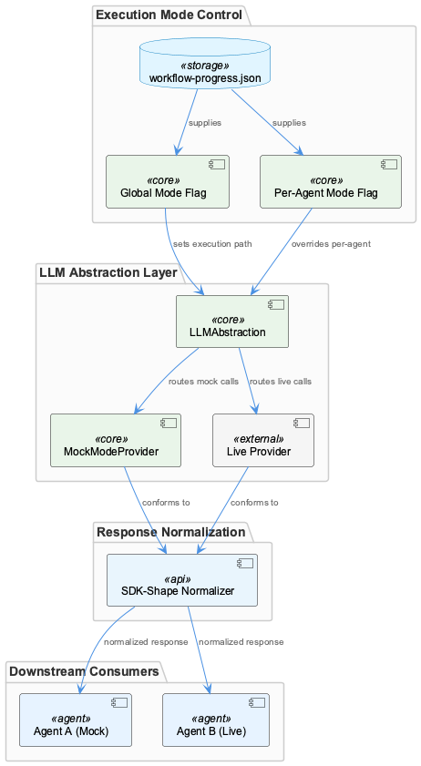
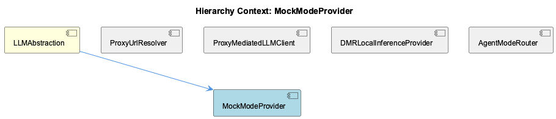

# MockModeProvider

**Type:** SubComponent

Mock responses must conform to the same SDK-shape normalization contract as real provider responses, ensuring downstream consumers are unaffected by the execution path

# MockModeProvider — Technical Reference

## What It Is

MockModeProvider is a sub-component of LLMAbstraction that implements one of three named execution paths available for LLM calls. Rather than routing requests to a live provider (cloud or local), it intercepts calls and returns synthetic responses — while maintaining full compliance with the SDK-shape normalization contract that governs all provider outputs in the system.

Mode activation is controlled through `.data/workflow-progress.json`, where both global and per-agent mock flags reside. This file-based configuration means MockModeProvider is not a compile-time or environment-level concern — it is a runtime-switchable path managed through the same state file that tracks workflow progress.

## Architecture and Design

The central design decision behind MockModeProvider is **response contract parity**: mock responses must be structurally identical to responses from ProxyMediatedLLMClient, DMRLocalInferenceProvider, or any cloud provider path. This is enforced through the same SDK-shape normalization layer that all providers in LLMAbstraction pass through. Downstream consumers — agents, orchestrators, token-usage trackers — cannot distinguish a mock response from a live one. This is not accidental; it is the explicit contract that makes MockModeProvider useful for integration testing rather than just unit testing.

The routing decision itself lives in AgentModeRouter, which evaluates the priority chain: per-agent override → global mode → legacy flags. MockModeProvider sits at the end of one branch of this chain. When AgentModeRouter resolves an agent's mode as `mock`, the call is directed to MockModeProvider rather than through ProxyUrlResolver or toward the DMR endpoint. This means MockModeProvider is never self-selecting — it is always invoked by the routing layer, keeping activation logic centralized.

A notable architectural property is **per-agent granularity**. Because AgentModeRouter evaluates mode independently per agent, it is valid for Agent A to resolve to MockModeProvider while Agent B routes through ProxyMediatedLLMClient to a live cloud model. This mixed-mode capability is the direct consequence of storing overrides per-agent in `.data/workflow-progress.json` rather than as a single global switch.

## Implementation Details

No code symbols or key files were surfaced in the analysis, so implementation mechanics must be inferred from behavioral observations rather than source-level detail.

MockModeProvider's core responsibility is producing responses that satisfy the SDK-shape contract. Given that sibling providers like DMRLocalInferenceProvider achieve shape compliance by reusing the OpenAI SDK request format (targeting an OpenAI-compatible endpoint), and ProxyMediatedLLMClient normalizes proxy responses before returning them, MockModeProvider must apply equivalent normalization to whatever synthetic payloads it generates. The normalization layer is the shared interface that makes provider substitution transparent.

Runtime mode switching — toggling the mock flag in `.data/workflow-progress.json` without restarting or redeploying — implies that MockModeProvider is consulted on a per-call basis rather than being instantiated once at startup. The mode resolution happens at call time through AgentModeRouter, so MockModeProvider only activates when a given call's resolved mode is `mock`.

## Integration Points

MockModeProvider's primary integration is with AgentModeRouter, which is the sole routing authority that directs calls to it. MockModeProvider does not interact with ProxyUrlResolver (no proxy URL is needed for mock responses) and does not reach the DMR endpoint at `localhost:${DMR_PORT}/engines/v1`. It is deliberately isolated from the network layer.

The shared integration surface with all other providers is the SDK-shape normalization contract enforced by LLMAbstraction. This is the seam that makes MockModeProvider a drop-in replacement — not a special case requiring downstream handling. Token-usage telemetry, wave-analysis attribution, and any other consumers of LLM responses interact with mock output through the same interface.

The state dependency on `.data/workflow-progress.json` is worth noting as an integration point: anything that writes to that file can influence whether MockModeProvider is active for a given agent. This couples mock-mode activation to the workflow state management layer, which is an intentional design choice enabling dynamic test scenario construction.

## Usage Guidelines

**Mixed-mode integration testing** is the primary intended use case. Developers can configure a subset of agents to use MockModeProvider by setting per-agent mock flags in `.data/workflow-progress.json`, while other agents continue to call live providers. This is the correct approach when testing orchestration logic, inter-agent communication, or pipeline structure without incurring full API costs or latency.

**Response fidelity matters.** Because downstream consumers rely on SDK-shape compliance, any synthetic responses produced by MockModeProvider must pass the same normalization checks as live responses. Introducing mock responses that deviate from the expected shape — even in optional fields — risks masking integration bugs that would surface in production.

**Mode switching is cheap but not instantaneous per-call.** Since mode resolution reads from `.data/workflow-progress.json` through AgentModeRouter's priority chain, toggling mock mode takes effect on subsequent calls without redeployment. However, developers should be aware that in-flight calls at the moment of a flag toggle will complete on their original path — there is no mid-call redirection.

**Do not bypass AgentModeRouter to invoke MockModeProvider directly.** The routing priority chain (per-agent → global → legacy) is the system's single source of truth for mode resolution. Direct invocation would circumvent per-agent overrides and could produce inconsistent behavior in multi-agent workflows where some agents are intentionally live.

## Hierarchy Context

### Parent
- [LLMAbstraction](./LLMAbstraction.md) -- LLMAbstraction is a multi-layered abstraction over LLM providers that enables provider-agnostic model calls through three distinct execution paths: mock mode (for testing), local inference via Docker Model Runner (DMR), and public cloud providers (Anthropic, OpenAI, Groq) routed through a rapid-llm-proxy. The system supports per-agent and global mode switching stored in `.data/workflow-progress.json`, allowing runtime toggling between modes without code changes. Provider selection follows a priority chain from per-agent overrides to global mode to legacy flags.

The architecture centers on a proxy-mediated request pattern where most LLM calls route through a local rapid-llm-proxy daemon (default port 12435) via `/api/complete`, enabling centralized token tracking, tier-based routing, and telemetry attribution. The `llm-with-process.ts` module exists specifically to inject a `process` tag into proxy requests — a gap in the SDK's `LLMService.complete()` that caused all wave-analysis calls to appear as `process='unknown'` in token-usage telemetry. DMR provider uses an OpenAI-compatible API at `localhost:${DMR_PORT}/engines/v1` for fully local inference.

Key patterns include: environment-variable-driven URL resolution with multiple fallback levels, singleton client instances with health-check caching, YAML-based provider configuration with env-var expansion, and SDK-shape response normalization ensuring downstream consumers work unchanged regardless of which provider path was taken.

### Siblings
- [ProxyUrlResolver](./ProxyUrlResolver.md) -- Resolves proxy endpoint by checking environment variables RAPID_LLM_PROXY_URL, LLM_CLI_PROXY_URL, and LLM_PROXY_URL in priority order, falling back to localhost:12435 as the default, ensuring compatibility across Docker and host environments
- [ProxyMediatedLLMClient](./ProxyMediatedLLMClient.md) -- The llm-with-process.ts module exists specifically to inject a process tag into proxy requests, filling a gap in LLMService.complete() that caused wave-analysis calls to appear as process='unknown' in token-usage telemetry
- [DMRLocalInferenceProvider](./DMRLocalInferenceProvider.md) -- DMR provider targets an OpenAI-compatible API at localhost:${DMR_PORT}/engines/v1, allowing reuse of OpenAI SDK request formatting without modification
- [AgentModeRouter](./AgentModeRouter.md) -- Priority chain resolves in order: per-agent override → global mode → legacy flags, meaning a per-agent mock setting overrides a global DMR mode without affecting other agents

---

*Generated from 4 observations*
