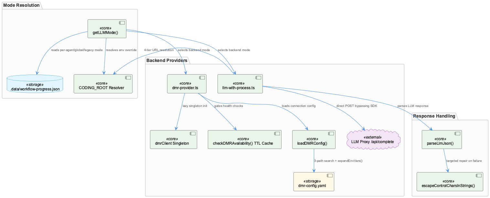
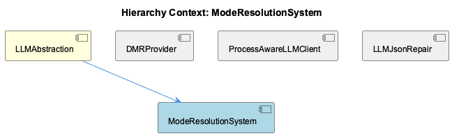

# ModeResolutionSystem

**Type:** SubComponent

# ModeResolutionSystem — Technical Insight Document

## What It Is

ModeResolutionSystem is the coordination seam within the LLMAbstraction component, implemented primarily in `llm-mock-service.ts` (mode selection), `dmr-provider.ts` (local Docker Model Runner backend selection and lifecycle), `llm-with-process.ts` (proxy-routed public provider calls), and `parse-llm-json.ts` (output validation). Its central responsibility, expressed in `getLLMMode()`, is to determine WHICH backend — mock, DMR/local, or proxy-routed public — should serve a given LLM request, without embedding any provider-specific request or response handling itself. State driving this decision is persisted in `.data/workflow-progress.json`, read by `llm-mock-service.ts`.

## Architecture and Design

The defining pattern is a **layered configuration resolution / priority-chain**: `getLLMMode()` resolves mode in strict order — per-agent override, then global mode, then legacy `mockLLM` flag, then a `'public'` default. This supports fine-grained mixed-mode testing (one wave-agent forced to mock while siblings hit live providers) at the cost of a four-tier debugging path when investigating "why is this agent using mode X."

A cross-cutting theme is defensive resolution against host/container/submodule path ambiguity. `isMockLLMEnabled()` and `getLLMMode()` both prefer an environment-resolved `CODING_ROOT` over the explicit `repositoryPath` argument passed in, silently overriding the caller's own parameter to compensate for Docker bind-mount divergence (e.g., `/Users/<USER_ID_REDACTED>/Agentic/coding` on host vs. `/coding` in container). The same defensive posture appears in `loadDMRConfig()`'s three-path search order (cwd, `integrations/semantic-analysis/config`, `__dirname`-relative) and in `resolveProxyCompleteUrl()`'s four-tier URL fallback (`RAPID_LLM_PROXY_URL > LLM_CLI_PROXY_URL > LLM_PROXY_URL > localhost`). These are not isolated hacks but a recurring architectural motif across the whole LLMAbstraction surface.

Because mode resolution returns only a mode string used for branching at call sites, adding a future backend (e.g., a qwen-laptop-style local llama.cpp target) requires only extending the priority chain and adding a call-site branch — not touching `dmr-provider.ts`, `llm-with-process.ts`, or `parse-llm-json.ts`.

## Implementation Details

`dmr-provider.ts` combines two orthogonal lifecycle mechanisms in one module: a **singleton** (`dmrClient`, lazily built via `initializeDMRClient()`) avoiding repeated OpenAI-compatible client construction, and a **TTL cache** (`checkDMRAvailability()` gated by `lastHealthCheck` vs. `dmrConfig.connection.healthCheckInterval`) throttling health-check polling against Docker Model Runner. `loadDMRConfig()` layers `expandEnvVars()` on top of its multi-path YAML search, treating `dmr-config.yaml` as a template with `${VAR}` substitution rather than static data.

`llm-with-process.ts` is a deliberate **parallel implementation**, not a wrapper, around `@rapid/llm-proxy`'s `LLMService.complete()`: `llmWithProcessComplete()` posts directly to `/api/complete` because the SDK's request shape lacks a `process` field needed for token-usage telemetry attribution.

`parse-llm-json.ts`'s `parseLlmJson()` uses a two-stage, **narrow-repair** (not general lenient-parsing) strategy: raw `JSON.parse()` first, falling back to `escapeControlCharsInStrings()` only on failure — which tracks in-string state character-by-character to escape control characters solely inside string literals, preserving the invariant that genuinely malformed output still throws.

## Integration Points

ModeResolutionSystem lives inside its parent, LLMAbstraction, providing the provider-agnostic switch between concrete backends. It relates directly to its siblings: DMRProvider implements the local-inference backend selected by mode resolution (with a known gap — no teardown/reset hook if Docker Desktop restarts mid-process); ProcessAwareLLMClient implements the proxy-routed public path, duplicating configuration/URL-resolution logic that presumably also exists in the SDK; LLMJsonRepair enforces the output-validation boundary applied regardless of which backend served the request.

Configuration is deliberately split across two unmixed sources — JSON state (`workflow-progress.json`) for mode selection and YAML (`dmr-config.yaml`) for DMR connection parameters.

## Usage Guidelines

Debugging mode selection requires walking all four priority tiers, not just reading one flag. Any code reading `repositoryPath` behavior should be aware `CODING_ROOT` silently takes precedence. `llm-with-process.ts` is an intentional architectural crack — a second code path to the LLM proxy — that should be retired if the SDK ever adds `process` support; it should not be extended further. Do not broaden `parse-llm-json.ts` into general lenient parsing; its strict fail-loudly boundary is intentional and should be preserved even as other mode-resolution modules favor graceful multi-source fallback.

## Hierarchy Context

### Parent
- [LLMAbstraction](./LLMAbstraction.md) -- LLMAbstraction provides a provider-agnostic layer for interacting with multiple LLM backends (Anthropic, OpenAI, Groq, and local Docker Model Runner), enabling mode-switching between mock, local, and public inference without changing call-site code. It centers on a mode-resolution system stored in workflow-progress.json (llm-mock-service.ts) that supports global and per-agent overrides, allowing tests and specific agents to run against mock data while others hit real providers. This lets the broader system's wave-agents and analysis pipelines be developed and tested without incurring real API costs or requiring live credentials.

The component also handles local inference via DMR (dmr-provider.ts), which wraps Docker Desktop's Model Runner using an OpenAI-compatible client, with YAML-based configuration loading, environment variable expansion, and cached health checks to avoid excessive availability polling. A separate direct-fetch wrapper (llm-with-process.ts) bypasses the SDK's LLMService.complete() to inject a required 'process' telemetry field into proxy requests, addressing a specific attribution gap in token-usage telemetry — demonstrating the abstraction layer's willingness to parallel rather than replace the underlying SDK when the SDK lacks needed fields.

Robustness is a recurring theme: parse-llm-json.ts implements a narrow, well-tested JSON repair routine (escapeControlCharsInStrings) that fixes a specific documented failure mode (raw control characters like newlines inside LLM-generated JSON string values) without becoming a general-purpose lenient parser, preserving the invariant that genuinely malformed replies still fail loudly rather than being silently misinterpreted.

### Siblings
- [DMRProvider](./DMRProvider.md) -- [LLM] DMRProvider (dmr-provider.ts) implements a module-level singleton for its OpenAI-compatible client: a `dmrClient` variable initialized lazily via `initializeDMRClient()` rather than a class instance passed around by dependency injection. This is a pragmatic choice for a Node module that is imported once per process, but it means the client's lifecycle is tied to module load order and there is no explicit teardown/reset hook visible — a long-running process (e.g. the semantic-analysis service) that needs to reconnect after Docker Desktop restarts would have to either restart the process or add an explicit invalidation path, since nothing in the described API resets `dmrClient` to null on failure.
- [ProcessAwareLLMClient](./ProcessAwareLLMClient.md) -- [LLM] The core design decision in llm-with-process.ts is to bypass the @rapid/llm-proxy SDK's LLMService.complete() entirely rather than extend or monkey-patch it. llmWithProcessComplete() reimplements the HTTP call as a direct fetch to /api/complete purely to inject a required 'process' telemetry field the SDK's request shape has no slot for. This is a pragmatic but risky trade-off: it buys an immediate fix for a token-usage attribution gap, but it also means llm-with-process.ts must independently track any future changes to the proxy's request/response contract (auth headers, retry semantics, error shapes) that the SDK would otherwise absorb transparently. The 4-tier URL resolution in resolveProxyCompleteUrl() (RAPID_LLM_PROXY_URL > LLM_CLI_PROXY_URL > LLM_PROXY_URL > localhost default) duplicates configuration logic that presumably also exists inside the SDK client, a second place that must be kept in sync with any proxy endpoint change.
- [LLMJsonRepair](./LLMJsonRepair.md) -- [LLM] The LLMJsonRepair component (parse-llm-json.ts) implements a deliberately two-stage parseLlmJson() strategy: attempt a raw JSON.parse() first, and only fall back to a repair pass (escapeControlCharsInStrings()) on failure. This ordering matters architecturally — it means well-formed LLM output pays zero repair cost, and the repair logic is only ever exercised on the narrow, empirically-observed failure mode of unescaped control characters (literal newlines/tabs) appearing inside string literals of otherwise-valid JSON. The design explicitly rejects becoming a general lenient/fuzzy JSON parser, which is a conscious trade-off: it will not silently 'fix' truncated JSON, trailing commas, or unquoted keys, and a genuinely malformed response still throws.

---

*Generated from 10 observations*
