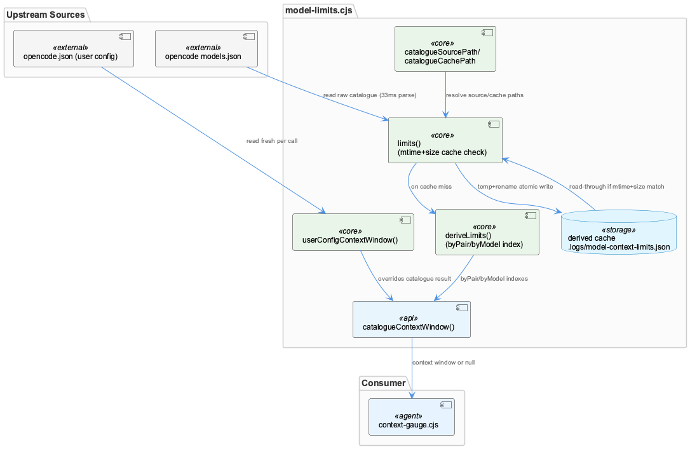
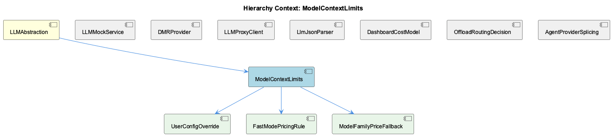

# ModelContextLimits

**Type:** SubComponent

[Architecture Notes] Cross-process caching is achieved via disk (JSON file), not shared memory or IPC, because each status-line tick is a brand-new OS process — a design constraint imposed by the surrounding statusline architecture, not chosen for this module in isolation; User-level config (opencode.json) is layered ABOVE a derived public catalogue, establishing an override precedence: explicit local declaration > majority-vote inference > absence (null); The module treats an external tool's cache (opencode's models.json) as an upstream read-only data source and never writes to it, keeping ownership boundaries clean between opencode and the statusline tooling; Test seams (OPENCODE_MODELS_JSON, OPENCODE_CONFIG env vars, and _resetForTests()) are threaded through explicitly rather than mocked via module replacement, indicating a deliberate design for CommonJS-style dependency injection without a mocking framework

# ModelContextLimits — Technical Insight Document

## What It Is

ModelContextLimits is implemented in `lib/statusline/model-limits.cjs` and provides the statusline system's authoritative answer to "how large is this model's context window?" It exists as a child domain of `LLMAbstraction`, sitting alongside siblings like `LLMMockService`, `DMRProvider`, and `DashboardCostModel` as one of several concerns that mediate between raw model/provider data and consumer-facing tooling. Its job is to resolve a provider/model pair (or a user-declared custom model) to a numeric context-window size, sourced from opencode's public models catalogue, a user's own `opencode.json`, or — when neither source can be trusted — a modal vote across all providers that mention the model id.

The module was born from a documented failure mode: a hardcoded five-line regex mapping `/^claude-/` to a fixed 200K window silently became wrong when `github-copilot/claude-opus-5` and `claude-sonnet-5` moved to a 1,000,000-token window, causing a 188,240-token session to render as 94% bold-red (imminent compaction) instead of the honest 19% green. That anecdote is the stated rationale for the entire live-catalogue-driven design replacing hand-maintained constants.

## Architecture and Design

The dominant architectural pattern is a **read-through derived cache with content-identity invalidation**. Because each statusline pane re-executes this module in a brand-new OS process every 5 seconds, standard in-memory memoization (`_memo`, `_userMemo`) only helps within a single tick's multiple calls to `catalogueContextWindow()` — it cannot survive across ticks or panes. The real optimization is an on-disk derived cache at `catalogueCachePath()` (`.logs/model-context-limits.json`), which avoids repeatedly paying a documented 33ms cost to re-parse opencode's 4.5MB/213-provider `models.json`. This is an explicit architectural adaptation to a process-boundary constraint imposed by the surrounding statusline architecture, not a design chosen in isolation.

A second pattern is **priority-ordered fallback resolution**: exact provider/model match (`byPair`) → user config override → ordered fallback providers (`FALLBACK_PROVIDERS`: github-copilot, anthropic, openai, <COMPANY_NAME_REDACTED>) → modal vote across the full catalogue. This layering establishes a clear override precedence — explicit local declaration beats majority-vote inference beats absence (null) — mirrored conceptually in sibling `LLMMockService`'s three-tier `getLLMMode()` precedence chain and in child `ModelFamilyPriceFallback`'s exact-match → suffix-strip → family-fallback cascade.

A third pattern is **atomic file write via temp-file-then-rename**, ensuring a reader in a concurrent pane's process never observes a half-written cache file. And a fourth, cross-cutting pattern is the **fail-soft null-propagation contract**: every failure path returns `null`, never `0` or an exception, treating "unknown" as semantically distinct from "measured zero."

## Implementation Details

`deriveLimits()` (lines 100-141) builds two indexes from the raw catalogue: `byPair` for exact provider/model lookups, and `byModel` as a fallback for custom providers absent from any public catalogue (e.g., a user's `rapid-proxy` entry). Resolution walks `FALLBACK_PROVIDERS` in fixed priority order, and only when none declare the model does it fall back to a modal vote across all providers mentioning that model id — with ties deliberately broken toward the **larger** context window, since under-reporting occupancy risks a false "about to compact" red state unsupported by evidence.

`userConfigContextWindow()` (lines 178-198) reads `OPENCODE_CONFIG` (or defaults to `~/.config/opencode/opencode.json`) and looks up `provider[provider].models[model].limit.context`. This value is checked first in `catalogueContextWindow()` and acts as an outright veto, not a mere tiebreaker — critical for cases like a laptop-local `qwen-laptop` llama.cpp provider that's actually 32K context but shares a model id with a 262K catalogue entry, where trusting the catalogue would silently under-report occupancy by 8x. Notably, this read is fresh per call rather than folded into the mtime-based derived cache, since a config edit wouldn't trip the catalogue's own invalidation trigger.

`limits()` (lines 207-240) implements cache invalidation via `{mtimeMs, size}` content identity rather than hashing — an explicit trade-off, since hashing 4.5MB would cost more than the parse the cache exists to avoid. It also implements the temp-file+rename atomic write (`${cacheFile}.${process.pid}.tmp` → `fs.renameSync`), with any write failure caught and silently cleaned up, forfeiting only the caching optimization, never correctness.

`catalogueContextWindow()` (lines 246-260) is the public API combining user override, exact provider/model match, and `byModel` fallback, returning `null` on any miss. `_resetForTests()` (lines 262-266) clears module-level memoization, and `catalogueSourcePath()`/`catalogueCachePath()` (lines 56-67) resolve locations with env var overrides (`OPENCODE_MODELS_JSON`, `OPENCODE_CONFIG`) — test seams threaded explicitly through the module rather than mocked via module replacement, indicating deliberate CommonJS-style dependency injection.

## Integration Points

ModelContextLimits treats opencode's `models.json` as an upstream read-only data source, never writing to it, preserving a clean ownership boundary between opencode and statusline tooling. Its consumer, `context-gauge.cjs` (not shown here), relies on the `null`-vs-zero distinction to know when to fall back to its own regex table rather than treating a missing window as a real empty value.

Within its own hierarchy, ModelContextLimits is the parent of three children: `UserConfigOverride` (implementing `userConfigContextWindow()`'s veto behavior directly), and `FastModePricingRule` and `ModelFamilyPriceFallback` — which, despite living in a different file (`cost-model.ts` in the system-health-dashboard) and domain (pricing rather than context windows), share the same fail-soft, cascade-resolution philosophy. `ModelFamilyPriceFallback`'s exact-match → suffix-strip → family-fallback order is explicitly analogous to this module's `byPair` → user-override → fallback-providers → modal-vote chain.

As a child of `LLMAbstraction`, it complements sibling components: `LLMMockService`'s persisted-state mode toggling, `DMRProvider`'s protocol-reuse strategy, `LLMProxyClient`'s layered URL-resolution precedence, and `LlmJsonParser`'s two-stage failure-mode pipeline — all instances of the parent domain's recurring theme of explicit precedence chains and fail-soft degradation over ambiguous collapsing of signals.

## Usage Guidelines

Developers should never treat this module's `null` as `0` — it is a deliberate "no opinion" signal, and callers must implement their own fallback (as `context-gauge.cjs` does) rather than assuming a numeric zero-context model. When adding new custom/self-hosted providers, populate `opencode.json`'s `provider[provider].models[model].limit.context` rather than expecting the public catalogue to reflect local reality — the user config always overrides the catalogue by design.

Because cache invalidation relies on `mtime+size` rather than content hashing, any tooling that rewrites `models.json` in place with identical size/mtime (rather than replacing it wholesale) risks a stale cache; this is an accepted, low-stakes trade-off given the cost of a single stale statusline tick. Test authors should use the provided env var seams (`OPENCODE_MODELS_JSON`, `OPENCODE_CONFIG`) and `_resetForTests()` rather than mocking the module directly. Finally, any modification to the modal-vote tie-break logic should preserve the larger-window bias — it exists specifically to avoid false compaction warnings, and inverting it would reintroduce the exact failure class the module was built to eliminate.

## Hierarchy Context

### Parent
- [LLMAbstraction](./LLMAbstraction.md) -- [LLM] The mock/local/public mode toggle system in llm-mock-service.ts is designed around a persisted state file (.data/workflow-progress.json) rather than environment variables, which allows runtime mode switching without process restarts. The LLMState structure with globalMode and perAgentOverrides fields enables fine-grained control where a specific agent can be forced into mock mode for testing while the rest of the system runs against real providers. This is critical for integration testing scenarios where a developer wants to validate one agent's prompt-handling logic without incurring API costs or non-determinism from the LLM calls of other agents in a multi-agent pipeline. The getLLMMode() read path checks perAgentOverrides first, then falls back to globalMode, and finally to the legacy progress.mockLLM boolean, establishing a three-tier precedence resolution that any new developer must understand before assuming a single toggle controls behavior.

### Children
- [UserConfigOverride](./UserConfigOverride.md) -- [LLM] userConfigContextWindow() in lib/statusline/model-limits.cjs implements the actual 'UserConfigOverride' behavior: it reads process.env.OPENCODE_CONFIG (or defaults to ~/.config/opencode/opencode.json) and looks up provider[provider].models[model].limit.context. This value is checked FIRST in catalogueContextWindow(), before the public catalogue's byPair/byModel indexes are even consulted — an early return on any truthy `declared` value means a user override is not merely a tiebreaker but an outright veto over what models.dev says about the same model id.
- [FastModePricingRule](./FastModePricingRule.md) -- [LLM] The fast-mode pricing rule in integrations/system-health-dashboard/src/components/cost/cost-model.ts is implemented as a multiplicative transform (`scalePrice`, `FAST_MODE_MULTIPLIER = 2`) applied to a recursively-resolved base price inside `priceForModel()`, rather than as extra rows in `DEFAULT_COST_CONFIG.modelPrices`. The design rationale is stated explicitly in the comment block above `FAST_MODE_SUFFIX`: a hand-maintained `<model>-fast` twin for every priced model would silently drift out of sync whenever a new fast-capable model is added, and the failure mode of a missing twin is dangerous because `priceForModel()` would still return `priced: true` via the family fallback at the *standard* rate — under-billing a 2x-throughput call with no warning surfaced anywhere in the UI.
- [ModelFamilyPriceFallback](./ModelFamilyPriceFallback.md) -- [LLM] priceForModel() in integrations/system-health-dashboard/src/components/cost/cost-model.ts implements a three-tier resolution cascade — exact key match, then fast-mode suffix stripping/recursion, then family fallback — and the ORDER is load-bearing, not incidental. The exact match is checked first specifically so that an explicit `<model>-fast` row in modelPrices can override the automatic 2x multiplier rule; only when no exact key exists does the code fall into the FAST_MODE_SUFFIX branch, which recursively calls priceForModel() on the de-suffixed base name and then calls scalePrice() with FAST_MODE_MULTIPLIER. This means a single hardcoded model gets three possible price sources without three hardcoded prices, but it also means a bug in the exact-match key naming (e.g. a typo in a `-fast` row) silently falls through to auto-doubling instead of raising an error — consistent with the fail-soft philosophy also seen in lib/statusline/model-limits.cjs's null-not-throw contract.

### Siblings
- [LLMMockService](./LLMMockService.md) -- [LLM] The `use-classifier-judge.ts` hook (integrations/system-health-dashboard/src/components/llm-routing/use-classifier-judge.ts) implements the same config-vs-runtime split described for LLMMockService's `getLLMMode()` precedence chain, but for the offload judge rather than the mock toggle: `JudgeBackend.enabled` is what the YAML file says, while `JudgeBackend.reachable` is whether it actually answered on the last poll. The header comment documents a real incident (2026-09-02) where `enabled: true` masked a dead backend for about a day because nothing distinguished 'switched off' from 'not answering' — the exact class of ambiguity that `getLLMMode()`'s three-tier precedence (perAgentOverrides → globalMode → legacy progress.mockLLM) is designed to avoid by making precedence explicit rather than collapsing multiple signals into one boolean.
- [DMRProvider](./DMRProvider.md) -- [LLM] The DMR provider in dmr-provider.ts is deliberately built as a thin OpenAI-shape adapter rather than a bespoke client — it targets `http://${DMR_HOST}:${DMR_PORT}/engines/v1` but reuses the same request/response contract as the OpenAI SDK integration. This is a 'protocol reuse' strategy: instead of writing DMR-specific request builders, response parsers, and error mappers, the team accepts that Docker Model Runner exposes an OpenAI-compatible surface and piggybacks on existing code paths. The trade-off is that any DMR-specific quirks (different error codes, different streaming semantics, different rate-limit headers) would have to be shimmed into the OpenAI shape rather than handled natively, which could become a leaky abstraction if DMR's compatibility layer ever diverges meaningfully from the OpenAI spec it's mimicking.
- [LLMProxyClient](./LLMProxyClient.md) -- [LLM] The parent context establishes that llm-with-process.ts is a deliberate fetch-based bypass around the SDK's LLMService.complete(), built specifically to inject the 'process' telemetry tag the rapid-llm-proxy's /api/complete endpoint requires, with resolveProxyCompleteUrl() implementing a layered precedence (RAPID_LLM_PROXY_URL → LLM_CLI_PROXY_URL → LLM_PROXY_URL → localhost default). This is the LLMProxyClient's actual transport layer, and the dashboard code surveyed here (offload-decision.tsx, use-classifier-judge.ts) is the operator-facing control plane that sits ABOVE that transport: neither file makes an LLM completion call itself, they instead call GET/PATCH against the proxy's HTTP surface (/api/llm/routing/resolve, /api/llm/classifier) to inspect and edit the routing policy that governs how llm-with-process.ts's requests get dispatched. This is a clean separation between the data-plane client (proxy-bridge, llm-with-process.ts) and the control-plane client (this dashboard code), but it also means the two must agree on wire semantics independently — evidenced by the extensive commentary in offload-decision.tsx about the proxy's resolved answers being compared against the dashboard's own ladder logic rather than trusted.
- [LlmJsonParser](./LlmJsonParser.md) -- [LLM] parse-llm-json.ts's core value proposition is that it treats malformed JSON-mode output as a two-orthogonal-failure-mode problem rather than one generic 'try/catch and give up' problem. escapeControlCharsInStrings() targets corruption caused by raw control characters (e.g. literal newlines or tabs) embedded inside string literals — a byte-level defect that a naive JSON.parse() cannot tolerate — while truncateToLastCompleteElement() targets a structural defect: the provider hit its output-token ceiling mid-object/mid-array. Because these are independent failure modes with independent signatures, running them as a fixed two-stage pipeline rather than a single heuristic means each stage can be reasoned about, tested, and evolved in isolation, and a malformed-but-complete response only pays the cost of the first stage.
- [DashboardCostModel](./DashboardCostModel.md) -- [LLM] cost-model.ts is deliberately framed as "pure cost/budget logic... No React here" — every exported function (budgetForMonth, priceForModel, cellCostUsd, monthlySeries) is a pure function of CostRow[]/CostConfig inputs with no hooks, fetch calls, or component state. This is a sharp architectural boundary against sibling files like use-classifier-judge.ts and offload-decision.tsx, which interleave data-fetching, polling, and dirty-state tracking directly inside hooks and components. The payoff is testability (pure functions can be unit-tested without a DOM or mock fetch) and the ability to reuse the same pricing math in both the live dashboard tab and, presumably, offline reporting scripts — at the cost of pushing all I/O (GET /api/token-usage/cost, GET /api/llm/settings) to callers this file doesn't show.
- [OffloadRoutingDecision](./OffloadRoutingDecision.md) -- [LLM] OffloadDecision (offload-decision.tsx) is architected around a dual-mode toggle — 'config' (routes, answering 'what will happen') versus 'recorded' (calls, answering 'what did happen') — that deliberately share the same GATES/rung geometry so an operator can flip between intent and behaviour without re-reading a layout. This is a single-component design choice explicitly justified in the header comment rather than splitting into two cards, trading some internal branching complexity (mode-dependent counts, detail strings) for a consistent mental model at the UI layer.
- [AgentProviderSplicing](./AgentProviderSplicing.md) -- [LLM] The cost-model.ts module in the dashboard's cost tab implements a layered price-resolution strategy in priceForModel(): exact model key match, then fast-mode suffix stripping with a 2x multiplier via scalePrice(), then family-based fallback through FAMILY_REPRESENTATIVE. This mirrors the same 'tiered precedence resolution' philosophy seen elsewhere in the LLM subsystem (e.g. getLLMMode()'s three-tier fallback), suggesting a project-wide convention of building explicit precedence chains rather than single flat lookups whenever provider/model identity is ambiguous or evolving.

---

*Generated from 10 observations*
