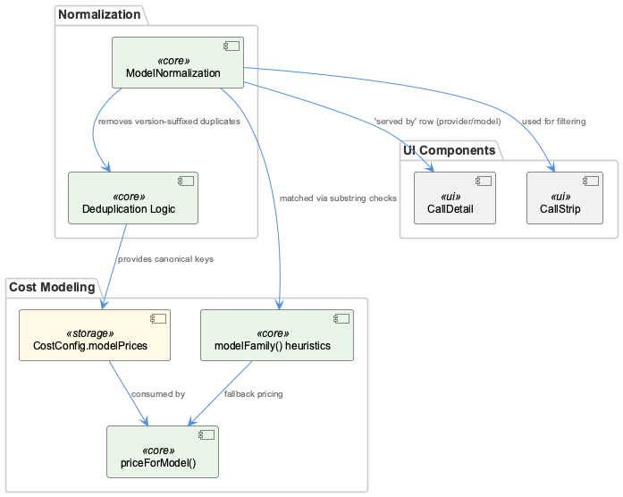
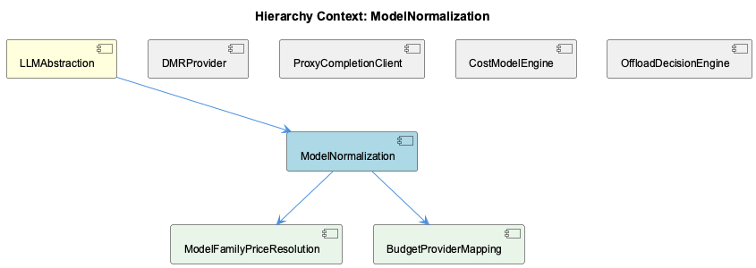

# ModelNormalization

**Type:** SubComponent

Provides the canonical model string matched against modelFamily() heuristics (substring checks like 'sonnet', 'opus', 'gpt-4o-mini') for price fallback

# ModelNormalization — Technical Insight Document

## What It Is

ModelNormalization is a conceptual subcomponent within LLMAbstraction responsible for producing the canonical model identifier string that flows through the cost and routing subsystems of cost-model.ts. Rather than living in a single dedicated file, it is expressed through the behavior of downstream consumers: `priceForModel()` in cost-model.ts, `modelFamily()` heuristics, and UI surfaces like CallDetail and CallStrip that display or filter by `call.model`. Notably, its own child component, ModelFamilyPriceResolution, reveals an important nuance: the "normalized" value passed into `prices[normalized]` is actually the raw model string unchanged — meaning true canonicalization is more aspirational/interface-level than an enforced transformation step in the current code.

## Architecture and Design

The architecture centers on a single canonical model string acting as a shared key across multiple consumers: pricing lookup, family-based heuristic matching, UI display, and deduplication logic. This is a "normalize once, consume everywhere" pattern — model identifiers produced here become the keys in `CostConfig.modelPrices`, consumed directly by `priceForModel()`. The design pushes fallback complexity downstream into sibling/child logic rather than doing exhaustive canonicalization upfront, as evidenced by ModelFamilyPriceResolution's three-tier resolution (exact → family-representative → generic family match) implemented in CostModelEngine.

Deduplication is a key design decision: version-suffixed variants of the same model are collapsed so cost and routing aggregates aren't fragmented, protecting the integrity of aggregation-based features (dashboards, cost totals) that rely on stable, unique model keys.

## Implementation Details

The core mechanics rely on substring-based heuristics rather than strict schema validation — `modelFamily()` performs checks like matching 'sonnet', 'opus', or 'gpt-4o-mini' within a model string. This heuristic approach trades precision for flexibility, allowing new model variants to be recognized without code changes as long as they contain a known family substring. The deduplication logic operates on near-duplicate detection, likely pattern-matching version suffixes to prevent proliferation of effectively-identical model keys. Since ModelFamilyPriceResolution confirms no real string transformation occurs before the `prices[normalized]` lookup, the "normalization" burden is effectively deferred to consistent upstream naming conventions and the fallback tiers in `priceForModel()`.

## Integration Points

ModelNormalization's output is consumed in several concrete places: `CostConfig.modelPrices` keys used by `priceForModel()` in cost-model.ts; the family-matching heuristics in `modelFamily()`; the 'served by' row in CallDetail (via `call.provider`/`call.model`); and CallStrip's filtering logic. Within its own hierarchy, it contains ModelFamilyPriceResolution (exact/family/generic price lookup tiers) and BudgetProviderMapping (mapping providers like 'copilot' or 'github' to budget categories such as 'claude-max'). As a child of LLMAbstraction, it operates alongside siblings DMRProvider, ProxyCompletionClient, CostModelEngine, and OffloadDecisionEngine — notably sharing consumers with CostModelEngine, whose `priceForModel()` three-tier resolution directly depends on the identifiers this component produces.

## Usage Guidelines

Developers should treat the model string as the single source of truth propagated across cost, pricing, and UI layers — changes to naming conventions here ripple into `CostConfig.modelPrices`, `modelFamily()` matching, and UI displays simultaneously. Because actual canonicalization is minimal (per ModelFamilyPriceResolution's finding), maintaining consistent naming at the point of model string creation is more important than relying on downstream normalization. When adding new model families, ensure substring heuristics in `modelFamily()` won't collide with unrelated model names, and verify deduplication logic correctly folds new version-suffixed variants to avoid fragmenting cost aggregates.

## Hierarchy Context

### Parent
- [LLMAbstraction](./LLMAbstraction.md) -- [LLM] The mode-resolution logic in getLLMMode() (llm-mock-service.ts) establishes a clear precedence chain that new developers must understand before debugging unexpected LLM behavior: per-agent overrides in workflow-progress.json take precedence over a global mode setting, which in turn overrides a legacy mockLLM boolean flag, with 'public' as the ultimate fallback. This four-tier resolution means that a developer trying to force mock mode for testing might set the global mode but be silently overridden by a stale per-agent override left in workflow-progress.json from a previous run. The dual-checking of both llmState (new) and mockLLM (legacy) shapes in isMockLLMEnabled() and getLLMState() is a deliberate backward-compatibility shim, indicating the config schema evolved over time but old state files or tooling that only write the legacy flag must continue to work without breaking the mock system.

### Children
- [ModelFamilyPriceResolution](./ModelFamilyPriceResolution.md) -- priceForModel() in cost-model.ts first checks prices[normalized] for an exact hit, setting source: 'exact'; the 'normalized' value is actually just the raw model string unchanged, so no real canonicalization occurs before lookup.
- [BudgetProviderMapping](./BudgetProviderMapping.md) -- budgetProvider() in cost-model.ts returns 'copilot' when the lowercased provider includes 'copilot' or equals 'github', otherwise defaults to 'claude-max' for anthropic/claude-code/max-oauth-passthrough.

### Siblings
- [DMRProvider](./DMRProvider.md) -- DMRProvider (dmr-provider.ts) implements an OpenAI-compatible client interface so it can be substituted for remote providers without changing call sites
- [ProxyCompletionClient](./ProxyCompletionClient.md) -- llm-with-process.ts tags each completion request with a process identifier, which downstream shows up as CostRow.process in cost-model.ts
- [CostModelEngine](./CostModelEngine.md) -- priceForModel() implements a three-tier resolution: exact model key match, family-representative fallback via FAMILY_REPRESENTATIVE, then generic family match, defaulting to a zero-priced 'none' source
- [OffloadDecisionEngine](./OffloadDecisionEngine.md) -- evaluateOffload() in offload-gates.ts reproduces the proxy's short-circuit gate order exactly (considered→route-allows→band→target→target-band→scope→transport→offloaded), because gate order determines which reason string is attributed to a call

---

*Generated from 4 observations*
