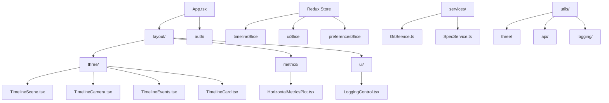

# ModularComponentArchitecturePattern

## Table of Contents

- [Overview](#overview)
- [Real Implementation Analysis](#real-implementation-analysis)
- [Domain-Driven Module Organization](#domain-driven-module-organization)
- [Standardized Component Interfaces](#standardized-component-interfaces)
- [State Management Modularization](#state-management-modularization)
- [Service Layer Modularization](#service-layer-modularization)
- [Container/Presentation Pattern Implementation](#containerpresentation-pattern-implementation)
- [Global State Coordination Pattern](#global-state-coordination-pattern)
- [Custom Hook Extraction Pattern](#custom-hook-extraction-pattern)
- [Configuration Module Architecture](#configuration-module-architecture)
- [Testing Strategy for Modular Architecture](#testing-strategy-for-modular-architecture)
- [Key Benefits Demonstrated](#key-benefits-demonstrated)
- [Implementation Checklist](#implementation-checklist)
- [Related Patterns](#related-patterns)
- [Pattern Consolidation](#pattern-consolidation)
- [References](#references)

## Overview

**Problem:** Component organization becomes chaotic in large React applications without clear modular boundaries, leading to tight coupling, difficult maintenance, and poor scalability.

**Solution:** Implement a domain-driven modular architecture with hierarchical organization, clear interfaces, and composition-based design patterns.

**Implementation:** Timeline project demonstrates sophisticated modular patterns with domain-specific directories, standardized interfaces, and coordinated state management.

**Significance:** Critical architectural pattern that enables maintainable, testable, and scalable React applications

## Real Implementation Analysis

Based on comprehensive analysis of the Timeline project codebase, this pattern demonstrates proven modular architecture principles in a production 3D visualization application.

### Architecture Overview



## Domain-Driven Module Organization

### 1. Physical Directory Structure

**File Path: `src/components/`**

```typescript
components/
├── auth/           // Authentication domain
│   └── AuthDialog.tsx
├── error/          // Error handling domain  
│   └── ErrorBoundary.tsx
├── layout/         // Application shell domain
│   ├── BottomBar.tsx
│   ├── Layout.tsx
│   └── TopBar.tsx
├── metrics/        // Data visualization domain
│   └── HorizontalMetricsPlot.tsx
├── three/          // 3D visualization domain
│   ├── DraggableTimelineMarker.tsx
│   ├── TimelineAxis.tsx
│   ├── TimelineCamera.tsx
│   ├── TimelineCard.tsx
│   ├── TimelineEvents.tsx
│   ├── TimelineScene.tsx
│   └── ViewportFilteredEvents.tsx
└── ui/             // Reusable UI controls domain
    └── LoggingControl.tsx
```

### 2. Module Boundary Principles

Each module follows **Single Responsibility Principle** with clear boundaries:

- **`three/`**: All 3D visualization using React Three Fiber
- **`metrics/`**: Chart and data visualization components  
- **`layout/`**: Application shell and structural components
- **`auth/`**: Authentication and authorization flows
- **`ui/`**: Reusable controls and widgets

## Standardized Component Interfaces

### Interface Contract Pattern

**File: `src/components/three/TimelineScene.tsx`**

```typescript
export interface TimelineSceneProps {
  events: TimelineEvent[];
  selectedCardId: string | null;
  cameraTarget: Vector3;
  onCardSelect: (id: string | null) => void;
  onCardHover: (id: string | null) => void;
  currentPosition: number;
  viewMode: 'manual' | 'view-all' | 'focus' | 'drone';
  isAnimating: boolean;
}

export const TimelineScene: React.FC<TimelineSceneProps> = ({
  events,
  selectedCardId,
  cameraTarget,
  onCardSelect,
  onCardHover,
  currentPosition,
  viewMode,
  isAnimating,
}) => {
  // Consistent prop destructuring pattern
  const dispatch = useAppDispatch();
  const { camera } = useThree();
  
  // Module-specific logic encapsulation
  const handleCameraControl = useCallback((mode: ViewMode) => {
    dispatch(updateCameraMode({ mode, timestamp: Date.now() }));
  }, [dispatch]);

  return (
    <>
      <TimelineCamera
        target={cameraTarget}
        viewMode={viewMode}
        onModeChange={handleCameraControl}
      />
      <TimelineEvents
        events={events}
        selectedId={selectedCardId}
        onSelect={onCardSelect}
        onHover={onCardHover}
      />
      <TimelineAxis currentPosition={currentPosition} />
    </>
  );
};
```

### Composition-Based Architecture

**File: `src/components/TimelineVisualization.tsx`**

```typescript
export const TimelineVisualization: React.FC = () => {
  const dispatch = useAppDispatch();
  const { events, selectedCardId, markerPosition } = useAppSelector(selectTimelineState);
  
  return (
    <div className="position-relative w-100 h-100">
      {/* 3D Scene Module - Independent rendering */}
      <div className="w-100 h-100">
        <TimelineScene
          events={events}
          selectedCardId={selectedCardId}
          onCardSelect={(id) => dispatch(selectCard({ id }))}
          onCardHover={(id) => dispatch(hoverCard({ id }))}
          currentPosition={markerPosition || 0}
        />
      </div>

      {/* Metrics Module - Overlay coordination */}
      {events.length > 0 && (
        <HorizontalMetricsPlot
          events={events}
          currentPosition={markerPosition || 0}
          onPositionChange={(position) => 
            dispatch(updateTimelinePosition({ position }))
          }
        />
      )}
    </div>
  );
};
```

## State Management Modularization

### Redux Slice Architecture

**File: `src/store/index.ts`**

```typescript
export const store = configureStore({
  reducer: {
    timeline: timelineSlice,      // Timeline data domain
    ui: uiSlice,                 // UI interactions domain
    preferences: preferencesSlice, // User settings domain
    repository: repositorySlice,   // Data source domain
    logging: loggingSlice,        // Debug/monitoring domain
  },
  middleware: (getDefaultMiddleware) =>
    getDefaultMiddleware({
      serializableCheck: {
        // Allow Three.js Vector3 objects in state
        ignoredActions: ['timeline/updateCameraTarget'],
        ignoredPaths: ['timeline.cameraTarget']
      }
    })
});
```

### Intent-Based Action Organization

**File: `src/store/intents/uiIntents.ts`**

```typescript
// UI interaction coordination across modules
export const selectCard = createAsyncThunk(
  'ui/selectCard',
  async (params: { id: string | null }, { dispatch, getState }) => {
    const state = getState() as RootState;
    
    // Cross-module coordination
    if (params.id) {
      // Close other cards (global state management)
      dispatch(clearCardSelection());
      
      // Update camera focus (3D module coordination)
      const event = selectEventById(state.timeline.events, params.id);
      if (event) {
        dispatch(updateCameraTarget({ 
          target: new Vector3(event.position, 0, 0),
          mode: 'focus'
        }));
      }
    }
    
    return params.id;
  }
);
```

## Service Layer Modularization

### Domain-Specific Services

**File: `src/data/services/GitRepositoryService.ts`**

```typescript
export class GitRepositoryService {
  private cache = new Map<string, TimelineEvent[]>();
  private readonly API_BASE = '/api/v1/git';
  
  async fetchHistory(repository: string): Promise<TimelineEvent[]> {
    // Service module encapsulates API communication
    const cacheKey = `git-${repository}`;
    if (this.cache.has(cacheKey)) {
      return this.cache.get(cacheKey)!;
    }
    
    try {
      const response = await fetch(`${this.API_BASE}/history?repository=${repository}`);
      const events = await response.json();
      
      // Transform raw data to domain objects
      const timelineEvents = events.map(this.transformGitEvent);
      this.cache.set(cacheKey, timelineEvents);
      
      return timelineEvents;
    } catch (error) {
      // Graceful degradation to mock data
      console.warn('Git service unavailable, using mock data');
      return this.getMockData();
    }
  }
  
  private transformGitEvent = (gitEvent: GitCommit): TimelineEvent => ({
    id: gitEvent.hash,
    title: gitEvent.message.split('\n')[0],
    description: gitEvent.message,
    date: new Date(gitEvent.date),
    position: this.calculateTimelinePosition(gitEvent.date),
    type: 'commit',
    metadata: {
      author: gitEvent.author,
      hash: gitEvent.hash,
      changes: gitEvent.stats
    }
  });
}
```

## Container/Presentation Pattern Implementation

### Smart Container Component

**File: `src/components/three/ViewportFilteredEvents.tsx`**

```typescript
// Container: Data logic and state management
export const ViewportFilteredEvents: React.FC<ViewportFilteredEventsProps> = React.memo((props) => {
  const { camera } = useThree();
  const dispatch = useAppDispatch();
  
  // Performance optimization through viewport culling
  const visibleEvents = useViewportFiltering(
    props.events,
    camera,
    props.cameraTarget,
    props.currentPosition,
    {
      cullingDistance: 100,
      fadingDistance: 80,
      maxVisibleCards: 50
    }
  );
  
  // State coordination
  const handleCardInteraction = useCallback((id: string | null, type: 'select' | 'hover') => {
    if (type === 'select') {
      dispatch(selectCard({ id }));
    } else {
      dispatch(hoverCard({ id }));
    }
  }, [dispatch]);
  
  // Delegate presentation to pure component
  return (
    <TimelineEvents
      events={visibleEvents}
      selectedCardId={props.selectedCardId}
      onSelect={(id) => handleCardInteraction(id, 'select')}
      onHover={(id) => handleCardInteraction(id, 'hover')}
    />
  );
});
```

### Pure Presentation Component

**File: `src/components/three/TimelineEvents.tsx`**

```typescript
// Presentation: Pure rendering logic
interface TimelineEventsProps {
  events: TimelineEvent[];
  selectedCardId: string | null;
  onSelect: (id: string | null) => void;
  onHover: (id: string | null) => void;
}

export const TimelineEvents: React.FC<TimelineEventsProps> = React.memo(({
  events,
  selectedCardId,
  onSelect,
  onHover
}) => {
  return (
    <group name="timeline-events">
      {events.map((event) => (
        <TimelineCard
          key={event.id}
          event={event}
          isSelected={selectedCardId === event.id}
          onSelect={() => onSelect(event.id)}
          onHover={() => onHover(event.id)}
        />
      ))}
    </group>
  );
});
```

## Global State Coordination Pattern

### Cross-Module Communication

**File: `src/utils/three/cardUtils.ts`**

```typescript
// Global coordination for component interactions
export const globalOpenCards = {
  openCards: new Set<string>(),
  animatingCards: new Set<string>(),
  hoveredCard: null as string | null,
};

export const globalClickHandlers = {
  clearHoverCallbacks: new Set<(id: string | null) => void>(),
  clearSelectionCallbacks: new Set<(id: string | null) => void>(),
};

// Coordinated interaction management across modules
export function clearAllCardHovers() {
  if (globalOpenCards.hoveredCard) {
    for (const callback of globalClickHandlers.clearHoverCallbacks) {
      callback(null);
    }
    globalOpenCards.hoveredCard = null;
  }
}

export function ensureExclusiveCardOpen(cardId: string) {
  // Close all other cards before opening new one
  for (const openId of globalOpenCards.openCards) {
    if (openId !== cardId) {
      globalOpenCards.openCards.delete(openId);
      // Trigger close animation
      for (const callback of globalClickHandlers.clearSelectionCallbacks) {
        callback(null);
      }
    }
  }
  globalOpenCards.openCards.add(cardId);
}
```

## Custom Hook Extraction Pattern

### Reusable Stateful Logic

**File: `src/hooks/useViewportFiltering.ts`**

```typescript
export function useViewportFiltering(
  events: TimelineEvent[],
  camera: Camera,
  cameraTarget: Vector3,
  currentPosition: number,
  options: ViewportFilteringOptions
) {
  const [visibleEvents, setVisibleEvents] = useState<TimelineEvent[]>([]);
  
  useLayoutEffect(() => {
    // Complex viewport culling algorithm
    const cameraPosition = camera.position;
    const viewDirection = new Vector3().subVectors(cameraTarget, cameraPosition).normalize();
    
    const filtered = events.filter((event) => {
      const eventPosition = new Vector3(event.position, 0, 0);
      const distance = cameraPosition.distanceTo(eventPosition);
      
      // Distance-based culling
      if (distance > options.cullingDistance) return false;
      
      // Frustum culling check
      const eventDirection = new Vector3().subVectors(eventPosition, cameraPosition).normalize();
      const dot = viewDirection.dot(eventDirection);
      
      return dot > -0.5; // Within view cone
    })
    .sort((a, b) => {
      // Sort by distance for rendering order
      const distA = cameraPosition.distanceTo(new Vector3(a.position, 0, 0));
      const distB = cameraPosition.distanceTo(new Vector3(b.position, 0, 0));
      return distA - distB;
    })
    .slice(0, options.maxVisibleCards);
    
    setVisibleEvents(filtered);
  }, [events, camera.position, cameraTarget, currentPosition, options]);
  
  return visibleEvents;
}
```

## Configuration Module Architecture

### Centralized Configuration

**File: `src/config/index.ts`**

```typescript
// Domain-specific configuration modules
import { colors, threeColors, threeOpacities } from './colors';
import { dimensions, breakpoints, zIndex } from './dimensions';
import { animation, animationStates, performance } from './animation';
import { metricsConfig, metricLabels } from './metricsConfig';

export const config = {
  // 3D visualization domain
  three: {
    colors: threeColors,
    opacities: threeOpacities,
    camera: {
      fov: 75,
      near: 0.1,
      far: 1000,
      initialPosition: [50, 30, 50]
    },
    performance: {
      maxVisibleCards: 50,
      cullingDistance: 100,
      animationThrottle: 16
    }
  },
  
  // Metrics visualization domain
  metrics: {
    ...metricsConfig,
    labels: metricLabels,
    dimensions: {
      height: 120,
      padding: 20,
      barHeight: 4
    }
  },
  
  // Animation system domain
  animation: {
    ...animationConfig,
    states: animationStates,
    performance: performance
  },
  
  // Utility functions for cross-module coordination
  validate: () => { /* validation logic */ },
  get: (path: string) => { /* dynamic config access */ },
  prefersReducedMotion: () => window.matchMedia('(prefers-reduced-motion: reduce)').matches,
};
```

## Testing Strategy for Modular Architecture

### Unit Testing Isolated Modules

```typescript
// Test file: src/components/three/__tests__/TimelineEvents.test.tsx
describe('TimelineEvents Component', () => {
  const mockEvents: TimelineEvent[] = [
    { id: '1', title: 'Test Event', position: 10, date: new Date(), type: 'commit' }
  ];
  
  it('renders events independently', () => {
    const onSelect = jest.fn();
    const onHover = jest.fn();
    
    render(
      <TimelineEvents
        events={mockEvents}
        selectedCardId={null}
        onSelect={onSelect}
        onHover={onHover}
      />
    );
    
    // Module can be tested in isolation
    expect(screen.getByText('Test Event')).toBeInTheDocument();
  });
  
  it('handles interactions without side effects', () => {
    const onSelect = jest.fn();
    
    render(<TimelineEvents events={mockEvents} onSelect={onSelect} />);
    
    fireEvent.click(screen.getByText('Test Event'));
    expect(onSelect).toHaveBeenCalledWith('1');
    // No global state changes in pure component
  });
});
```

## Key Benefits Demonstrated

### 1. **Maintainability**
- Clear module boundaries make code easier to understand and modify
- Changes to one domain don't affect others
- Consistent patterns reduce cognitive load

### 2. **Testability** 
- Each module can be tested in isolation
- Pure components have predictable outputs
- State logic is separated from presentation

### 3. **Reusability**
- Components and hooks can be reused across the application
- Service modules can be used in different contexts
- Configuration is centralized and shareable

### 4. **Scalability**
- New features can be added as modules
- Domain boundaries prevent architectural drift
- Performance optimizations can be module-specific

### 5. **Developer Experience**
- Clear patterns reduce onboarding time
- TypeScript interfaces provide compile-time safety
- Module organization matches mental models

## Implementation Checklist

- [ ] **Define Domain Boundaries**: Identify distinct functional areas in your application
- [ ] **Create Physical Separation**: Organize components into domain-specific directories
- [ ] **Establish Interface Contracts**: Define consistent prop patterns and TypeScript interfaces
- [ ] **Implement Composition**: Use component composition over inheritance
- [ ] **Extract Reusable Logic**: Create custom hooks for shared stateful logic
- [ ] **Centralize Configuration**: Create domain-specific configuration modules
- [ ] **Coordinate Global State**: Implement patterns for cross-module communication
- [ ] **Write Isolated Tests**: Test each module independently
- [ ] **Document Patterns**: Maintain clear documentation of architectural decisions

## Related Patterns

This pattern integrates with several other architectural patterns:

- **Container/Presentation Pattern**: Separates data logic from rendering
- **Custom Hook Pattern**: Extracts reusable stateful logic
- **Service Layer Pattern**: Abstracts data access and API communication
- **Redux Architecture**: Provides predictable state management
- **Configuration Management**: Centralizes application settings


## Pattern Consolidation  

This pattern consolidates component organization approaches that were previously documented separately:

- **Component Orchestration**: How high-level components coordinate child components and data flow
- **Compound Component Pattern**: Components that work together as cohesive units with shared context

These are now documented as aspects of the overall modular architecture rather than separate patterns.

## References

- [Modularizing React Applications - Martin Fowler](https://martinfowler.com/articles/modularizing-react-apps.html)
- [React Architecture Patterns - GeeksforGeeks](https://www.geeksforgeeks.org/react-architecture-pattern-and-best-practices/)
- [React Design Patterns - SitePoint](https://www.sitepoint.com/react-architecture-best-practices/)
- Timeline project implementation analysis
- Production codebase semantic analysis

---

*This pattern was extracted from Timeline project semantic analysis and represents proven modular architecture patterns in a production React application with 3D visualization, metrics, and complex state management.*