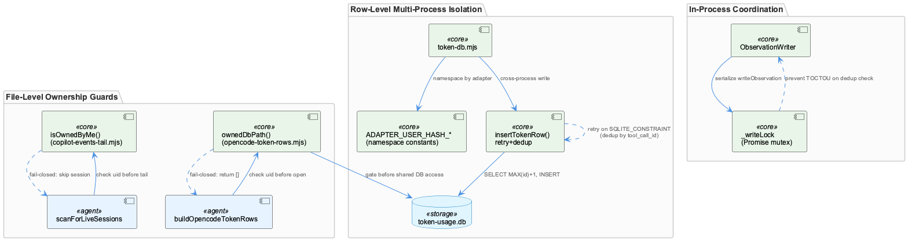
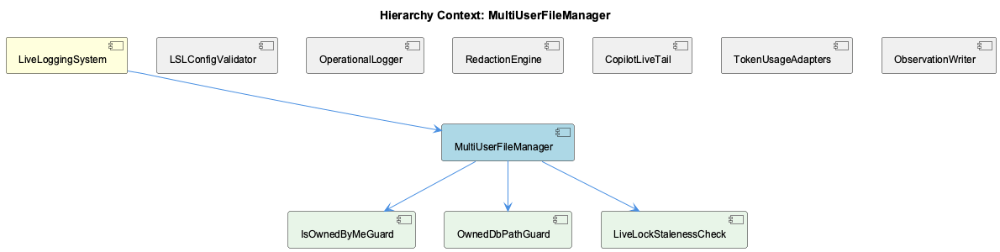

# MultiUserFileManager

**Type:** SubComponent

# MultiUserFileManager — Technical Insight Document

## What It Is

MultiUserFileManager is not a single class or file — it is a cross-cutting concern realized by convention across at least four files: `lib/lsl/live/copilot-events-tail.mjs`, `lib/lsl/token/opencode-token-rows.mjs`, `lib/lsl/token/token-db.mjs`, and `src/live-logging/ObservationWriter.js`. No code graph entry or literal class named `MultiUserFileManager` exists anywhere in the evidence; the responsibility it names — routing file and database access safely across multiple OS users and multiple OS processes — is distributed across independent guards and locking strategies. As a child of LiveLoggingSystem, it exists to protect the parent's session/observation pipeline from cross-user data leakage and cross-process write races. A developer searching for "the multi-user file manager" must instead know to look for the `isOwnedByMe`/`ownedDbPath` idiom (realized as children IsOwnedByMeGuard and OwnedDbPathGuard), the `LiveLockStalenessCheck` heuristic, and the retry/mutex strategies in token-db.mjs and ObservationWriter.js.

## Architecture and Design

The component operates at two distinct granularities. At the file level, uid-ownership checks (`isOwnedByMe` in copilot-events-tail.mjs, `ownedDbPath` in opencode-token-rows.mjs) gate access to session directories and `opencode.db` before any read occurs. At the row level, token-db.mjs uses per-adapter namespace constants — `ADAPTER_USER_HASH_CLAUDE` ('cladpt'), `ADAPTER_USER_HASH_COPILOT` ('copadt'), `ADAPTER_USER_HASH_OPENCODE` ('opnadt') — to partition writes inside the single shared `token-usage.db` file also written by the rapid-llm-proxy daemon, echoing the per-user hash namespacing pattern used by `validateUserEnvironment()` in the parent LiveLoggingSystem.

A second axis of design is process locality: cross-process writer coordination (token-db.mjs, competing with the proxy daemon) uses optimistic concurrency with bounded retry, while in-process coordination (ObservationWriter's `this._writeLock = Promise.resolve()`) uses a promise-chain mutex. These are structurally similar races solved with mechanisms appropriate to whether writers share a Node heap — no shared locking primitive spans both.

The system also embodies a deliberate asymmetric failure philosophy mirroring the parent's own async-buffering tradeoffs (FLUSH_INTERVAL_MS/MAX_BUFFER_SIZE): ownership checks fail closed (leaking another user's data is the worse outcome), while token row insertion is explicitly "never-throws" best-effort (D-08), since losing an accounting row is preferable to crashing the LSL hot path.

## Implementation Details

`isOwnedByMe(sessionDir, myUid)` and `ownedDbPath(dbPath)` both call `fs.statSync`, compare `st.uid` to `process.getuid()`, and return a falsy sentinel (`false`/`''`) on mismatch or stat failure — but they diverge subtly: `isOwnedByMe` short-circuits to `true` before stat-ing when `myUid == null` (non-POSIX platforms), while `ownedDbPath` stats unconditionally and only checks `typeof process.getuid === 'function'` afterward, meaning platform-specific stat failures produce different stderr messages and downstream behavior despite nominally checking "the same" thing.

`findLiveLockFile()` implements LiveLockStalenessCheck by listing a directory (`fs.readdirSync`), filtering for `/^inuse\.\d+\.lock$/`, and comparing `Date.now() - st.mtimeMs` against `LOCK_STALE_GRACE_MS` (10 minutes) — a heuristic mtime-based liveness proxy; the pid embedded in the filename is matched but never parsed or used via `kill(pid, 0)` or `/proc`.

In token-db.mjs, `insertTokenRow()` performs a non-atomic SELECT-then-INSERT (`NEXT_ID_SQL` seed followed by parameterized INSERT), risking `SQLITE_CONSTRAINT` under concurrent writes into the same adapter hash space. The fix is `INSERT_ID_RETRY_ATTEMPTS = 3` with dedup-probe disambiguation: a constraint violation on `(user_hash, tool_call_id)` is treated as genuine duplicate and dropped, while any other violation triggers id recompute-and-retry — a hand-rolled optimistic-concurrency substitute for a transaction, since the proxy daemon writer is a separate process the adapter cannot coordinate with directly.

## Integration Points

MultiUserFileManager sits beneath LiveLoggingSystem and interacts with siblings CopilotLiveTail (which relies on `isOwnedByMe` and `findLiveLockFile` for session-directory safety) and TokenUsageAdapters (which relies on `ownedDbPath` and the ADAPTER_USER_HASH_* namespacing). ObservationWriter.js, another sibling, uses `ConfigurableRedactor` (RedactionEngine) independently of these guards and applies its own in-process `_writeLock` for TOCTOU prevention around `_isSemanticallyDuplicate`. token-db.mjs positions itself as "the ONLY host-side file that touches the proxy-owned token-usage.db," acting as a deliberate single chokepoint separate from the proxy daemon's own writer code.

## Usage Guidelines

Any fix to the ownership-check logic (e.g., symlink-traversal handling) must be applied in both `isOwnedByMe` and `ownedDbPath` since neither imports the other — the guard is only as strong as its weakest duplicate. Developers should not attempt to add real pid-liveness checking to `findLiveLockFile` without recognizing it's a deliberate heuristic. When adding new cross-process writers to shared SQLite files, follow token-db.mjs's namespace-partitioning-plus-retry pattern rather than assuming transactional guarantees; when adding new in-process concurrent writers, prefer ObservationWriter's promise-chain mutex pattern instead. Preserve the fail-closed/fail-open asymmetry: ownership/read guards must fail closed, while row-insertion paths feeding the hot path should remain never-throw per D-08.

## Hierarchy Context

### Parent
- [LiveLoggingSystem](./LiveLoggingSystem.md) -- [LLM] The LiveLoggingSystem's validation layer (scripts/validate-lsl-config.js, LSLConfigValidator class) is architecturally decoupled from the runtime logging layer (integrations/semantic-analysis/src/logging.ts). This separation means a developer touching one file should be aware the other exists independently: the validator is a preflight/health-check tool invoked separately (likely via CLI or CI) to sanity-check `.specstory/config/lsl-config.json` and `redaction-config.yaml` before or during operation, while logging.ts is the actual hot-path code executed during live sessions. Bugs in schema validation won't crash live logging and vice versa, but a misconfigured lsl-config.json that passes validation with wrong runtime assumptions could still cause silent misbehavior in logging.ts if the two ever drift out of sync in their assumptions about field names or defaults.

### Children
- [IsOwnedByMeGuard](./IsOwnedByMeGuard.md) -- [LLM] The `IsOwnedByMeGuard` component is not a class but a recurring idiom instantiated independently in `isOwnedByMe(sessionDir, myUid)` (lib/lsl/live/copilot-events-tail.mjs) and `ownedDbPath(dbPath)` (lib/lsl/token/opencode-token-rows.mjs). Both functions call `fs.statSync` on a target path, compare `st.uid` against the current process uid (`process.getuid()`), and return a falsy sentinel (`false` or `''`) on any mismatch or stat failure. `isOwnedByMe` explicitly special-cases non-POSIX platforms by returning `true` when `myUid == null` (Windows has no uid concept), while `ownedDbPath` guards the same case with `typeof process.getuid === 'function'` before comparing — two different spellings of the identical platform-detection intent, confirming the parent's observation that this is convention, not a shared module.
- [OwnedDbPathGuard](./OwnedDbPathGuard.md) -- [LLM] `ownedDbPath()` in lib/lsl/token/opencode-token-rows.mjs (lines ~130-148) and `isOwnedByMe()` in lib/lsl/live/copilot-events-tail.mjs (lines ~108-119) are the two concrete realizations of the 'OwnedDbPathGuard' idiom, but they diverge in a subtle way beyond naming: `ownedDbPath` treats `fs.statSync` failure and a uid mismatch as the SAME outcome (both log to stderr and return `''`), whereas `isOwnedByMe` also collapses stat failure and uid mismatch to `false`, but additionally short-circuits to `true` when `process.getuid` is unavailable (non-POSIX) BEFORE ever calling `fs.statSync`. `ownedDbPath` instead calls `fs.statSync` unconditionally and only checks `typeof process.getuid === 'function'` after the stat succeeds — meaning on a platform where `statSync` itself throws for a POSIX-specific reason, the two guards would produce different stderr messages and different callers' downstream behavior for what is nominally 'the same' check.
- [LiveLockStalenessCheck](./LiveLockStalenessCheck.md) -- [LLM] The LiveLockStalenessCheck is realized by `findLiveLockFile()` in lib/lsl/live/copilot-events-tail.mjs, which treats an `inuse.<pid>.lock` file's filesystem mtime as the sole liveness signal for a Copilot session directory. It lists the directory with `fs.readdirSync`, filters names against the regex `/^inuse\.\d+\.lock$/`, and for each match compares `Date.now() - st.mtimeMs` against `LOCK_STALE_GRACE_MS` (10 minutes, `10 * 60 * 1000`). This is a heuristic proxy for process liveness rather than an actual liveness check — there is no `kill(pid, 0)`-style syscall or `/proc` lookup against the pid embedded in the lock filename; the pid digits are matched by the regex but never parsed or used, only the timestamp matters.

### Siblings
- [LSLConfigValidator](./LSLConfigValidator.md) -- [CGR] LSLConfigValidator (class) in validate-lsl-config.js
- [OperationalLogger](./OperationalLogger.md) -- Lives in integrations/semantic-analysis/src/logging.ts, the actual hot-path code executed during live sessions as opposed to the validator's preflight checks.
- [RedactionEngine](./RedactionEngine.md) -- [LLM] None of the code excerpts supplied for this analysis (lib/lsl/live/copilot-events-tail.mjs, lib/lsl/token/opencode-token-rows.mjs, lib/lsl/token/token-db.mjs, src/live-logging/ObservationWriter.js, tests/agents/copilot-session-command.test.mjs) contain the RedactionEngine's own implementation — no class or module literally named RedactionEngine appears. The only concrete evidence of a redaction component is the import `import ConfigurableRedactor from './ConfigurableRedactor.js';` at src/live-logging/ObservationWriter.js:19 and the constructor comment noting `this.dbPath` is retained specifically 'as a path string used to derive `projectRoot` for the redactor' (ObservationWriter.js, Phase 44 Plan 13 comment block). This means the redaction subsystem is consumed, not defined, inside the files under review — any deeper architectural claim about RedactionEngine's internals (rule sets, regex patterns, PII categories) cannot be grounded in this evidence set and should be treated as external to what was reviewed.
- [CopilotLiveTail](./CopilotLiveTail.md) -- [LLM] The component's central architectural decision is a permanent, documented data-loss boundary rather than a bug to be fixed: copilot-events-tail.mjs states in its header that 'Copilot CLI emits ONLY subagent.started/subagent.completed/subagent.failed lifecycle events on disk' and that inner reasoning/tool calls are 'NEVER persisted to events.jsonl' — meaning 'The inner reasoning is FOREVER LOST — no live mitigation possible.' The code operationalizes this acceptance by stamping every observation with `lsl_incomplete: true` (constant `COPILOT_LSL_INCOMPLETE_REASON`) and building a synthetic two-message stub via `buildStubObservation()` instead of a real transcript, and by exposing the gap externally through a `lsl_incomplete_marker_present` heartbeat field referenced in the file's own comments. This is a deliberate degraded-parity contract, not an oversight, and any future 'fix' attempt should be redirected toward the heartbeat/health surface rather than toward trying to recover data that structurally does not exist on disk.
- [TokenUsageAdapters](./TokenUsageAdapters.md) -- [LLM] copilot-events-tail.mjs implements a poll-based file tail (tailEventsFile, TAIL_POLL_INTERVAL_MS=200) over Copilot's `~/.copilot/session-state/<uuid>/events.jsonl` rather than an fs.watch()-based approach, explicitly choosing statSync polling per RESEARCH-copilot.md Option A1. The module's own comments flag a hard architectural limitation: Copilot CLI persists only `subagent.started`/`subagent.completed`/`subagent.failed` lifecycle bookends to disk, never the sub-agent's actual messages or reasoning — so buildStubObservation() synthesizes a 2-message user/assistant exchange from spawn metadata alone, and every resulting observation is stamped `lsl_incomplete: true` with a locked note (COPILOT_LSL_INCOMPLETE_NOTE), a deliberately accepted, permanent data-loss gap rather than a bug to fix.
- [ObservationWriter](./ObservationWriter.md) -- src/live-logging/ObservationWriter.js routes all three write methods through km-core's putEntity via the legacy-ingest adapter (legacyObservationToEntity, legacyDigestToEntity, legacyInsightToEntity), per the Phase 44 hard-cutover decision (no dual-write, no feature flag).

---

*Generated from 9 observations*
