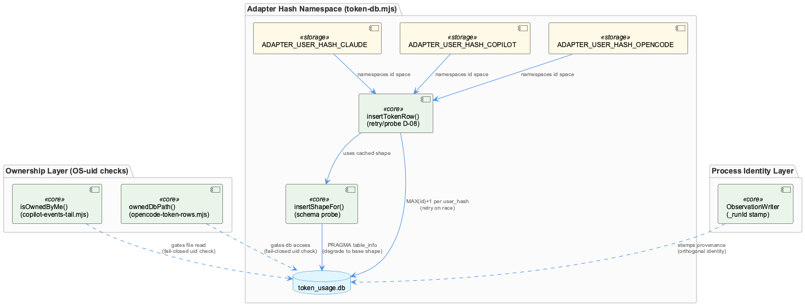
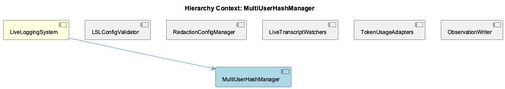

# MultiUserHashManager

**Type:** SubComponent

# MultiUserHashManager — Technical Insight Document

## What It Is

MultiUserHashManager is a conceptual, not literal, entity within LiveLoggingSystem: no single class by this name exists in the codebase. Instead, "multi-user hash management" is a responsibility distributed across three independent mechanisms living in different files: the static `ADAPTER_USER_HASH_CLAUDE`/`ADAPTER_USER_HASH_COPILOT`/`ADAPTER_USER_HASH_OPENCODE` constants in `lib/lsl/token/token-db.mjs`, OS-level uid ownership checks in `lib/lsl/live/copilot-events-tail.mjs` (`isOwnedByMe`) and `lib/lsl/token/opencode-token-rows.mjs` (`ownedDbPath`), and the per-process `_runId` stamp generated in `src/live-logging/ObservationWriter.js`'s constructor. As a SubComponent of LiveLoggingSystem, it should be understood as a documentation-level grouping of these "who wrote this row" mechanisms rather than a unifying implementation.

## Architecture and Design

The core architectural pattern is **namespace partitioning via fixed hash-like keys**: the three `ADAPTER_USER_HASH_*` constants (`'cladpt'`, `'copadt'`, `'opnadt'`) are hardcoded 6-character strings — not derived hashes — conforming to the proxy's `/^[a-z][a-z0-9]{5}$/` validation. This is documented as decision D-06 ("id-collision avoidance"), and it exists to shard a shared SQLite composite primary key `(user_hash, id)` across concurrent writers (the proxy daemon plus up to three adapters) without ever racing the proxy's own in-memory id counter. This is a narrower sibling of the SHA256-based OS-username hashing used elsewhere in LiveLoggingSystem's config validation (LSLConfigValidator) — same "hash as namespace key" idea, but applied to a small closed set of known agent writers rather than an open set of OS users, so there's no real collision risk since values are static.

A second, orthogonal layer is the **fail-closed ownership gate**: `isOwnedByMe` and `ownedDbPath` both `stat` a file/directory and compare its `uid` against `process.getuid()`, refusing reads across OS-user boundaries by returning null/empty with a stderr notice rather than throwing. This gates *which files* are ever read, while the hash constants in token-db.mjs gate *how rows are namespaced* once data has passed that gate — two layers that a hypothetical MultiUserHashManager would sit between, but which are not actually unified in code.

A third layer, per-process identity via ObservationWriter's `_runId` (`'obs-writer-' + Date.now() + random`), addresses a different problem entirely — provenance across service restarts — reinforcing that "multi-user hashing" in this codebase actually spans OS-user identity, agent-adapter identity, and process/temporal identity as three separate concerns.

## Implementation Details

`insertTokenRow()` in token-db.mjs is the concurrency-safety workhorse (decision D-08): it recomputes `NEXT_ID_SQL` (`SELECT COALESCE(MAX(id), 0) + 1 ... WHERE user_hash = ?`) fresh on every retry rather than caching it, bounded by `INSERT_ID_RETRY_ATTEMPTS = 3`, explicitly to handle another writer taking the id between SELECT and INSERT. On a `SQLITE_CONSTRAINT` failure, it disambiguates by probing for a `(user_hash, tool_call_id)` duplicate — deciding whether to retry (a lost id race) or drop the row (a genuine dedup hit). This two-branch handling is the mechanism actually protecting the hash-partitioned id space from data loss or double counting.

Complementing this, `insertShapeFor()` performs runtime schema probing (via `PRAGMA table_info`), memoized in a WeakMap keyed by the `db` handle, to conditionally include the `ROUTING_COLUMNS` (route_key, route_band, route_step, offloaded_from, chain_position, attempt_trail, routing_source) only if the proxy has already migrated them in — a defensive posture required because the adapter opens the database with `fileMustExist: true` and never owns or migrates its schema.

## Integration Points

token-db.mjs positions itself as a "second writer" against a SQLite database owned by the rapid-llm-proxy daemon, which is the primary source of truth for `token_usage.db`. This ties MultiUserHashManager's concerns directly to sibling TokenUsageAdapters, which frames the same files (`copilot-events-tail.mjs`, `opencode-token-rows.mjs`, `token-db.mjs`) as a lossy, best-effort compensation layer reconstructing token rows for agents that bypass the proxy. The uid-check mechanism also integrates with sibling LiveTranscriptWatchers, since `copilot-events-tail.mjs` doubles as both a polling watcher and an ownership-gated reader, while `opencode-token-rows.mjs` performs an on-demand SQLite pull rather than continuous tailing. ObservationWriter, a direct sibling and also a child-like dependency point, imports `ConfigurableRedactor` and stamps its own `_runId`, showing that identity/provenance concerns recur at the observation-write layer independent of the token-db hash scheme.

## Usage Guidelines

Developers should not search for a `MultiUserHashManager` class — there isn't one; the three mechanisms (uid checks, adapter hash constants, runId stamping) must be reasoned about independently and are duplicated rather than centralized (both tail/reader files implement their own uid check rather than sharing a utility). When adding a fourth agent adapter, a new fixed `ADAPTER_USER_HASH_*` constant must be chosen respecting the proxy's charset validation, and `insertTokenRow`'s retry/probe discipline must be reused rather than reimplemented to avoid id races. Any new writer against token_usage.db must treat the schema as externally owned, using schema-probing patterns like `insertShapeFor` rather than assuming column presence. Because failures in this subsystem must never propagate (per token-db.mjs's documented best-effort contract), new code here should follow the same never-throw, fail-closed conventions already used by `isOwnedByMe`/`ownedDbPath`.

## Hierarchy Context

### Parent
- [LiveLoggingSystem](./LiveLoggingSystem.md) -- [LLM] LiveLoggingSystem's identity within the Coding ontology is defined declaratively rather than through code inheritance: it is registered as an L2 class in .data/ontologies/coding.lower.json, extending the 'Component' L1 carrier that is itself one of three L1 carriers (Component/SubComponent/Detail) shared across all L2 subsystems. This means a new developer looking for a 'LiveLoggingSystem class' in the traditional OOP sense will not find one directly — instead, the concept is materialized through the ontology registry chain (upper.json → coding-ontology.json → coding.lower.json), loaded at runtime by OntologyRegistry from the @fwornle/km-core package. Any change to LiveLoggingSystem's semantic definition, description text used for classification, or its relationship to sibling classes must be made in these JSON ontology files, not in TypeScript source.

### Siblings
- [LSLConfigValidator](./LSLConfigValidator.md) -- [CGR] LSLConfigValidator (class) in validate-lsl-config.js
- [RedactionConfigManager](./RedactionConfigManager.md) -- [LLM] RedactionConfigManager's actual configuration surface is not visible as a dedicated class in the supplied code files, but its effects are wired directly into the observation-writing hot path: src/live-logging/ObservationWriter.js imports `ConfigurableRedactor` from './ConfigurableRedactor.js' at the top of the module (alongside `getLSLWindow` from lib/lsl/window.mjs and `routeFromArtifacts` from lib/attribution/repo-router.mjs), and the class retains `this.dbPath` specifically as 'a config path, NOT a handle' used to derive `projectRoot` for the redactor. This means redaction configuration resolution is coupled to the writer's constructor-time path setup rather than being an independently injectable dependency, so any consumer of ObservationWriter inherits whatever redaction behavior ConfigurableRedactor derives from that project-relative path.
- [LiveTranscriptWatchers](./LiveTranscriptWatchers.md) -- [LLM] The 'LiveTranscriptWatchers' subcomponent is realized across two structurally different watcher implementations that share no code: lib/lsl/live/copilot-events-tail.mjs implements a polled file-tail (statSync + interval polling at TAIL_POLL_INTERVAL_MS=200ms) against ~/.copilot/session-state/<uuid>/events.jsonl, while the OpenCode side (lib/lsl/token/opencode-token-rows.mjs) is not a live tail at all but a pull-based SQLite reader against ~/.local/share/opencode/opencode.db invoked at measurement-stop rather than continuously. This means 'watcher' is a loose term covering two very different consistency models — push-like polling for Copilot vs on-demand snapshot query for OpenCode — and a developer extending live transcript capture to a third agent must first decide which model fits that agent's on-disk artifact shape rather than assuming a single reusable watcher abstraction exists.
- [TokenUsageAdapters](./TokenUsageAdapters.md) -- [LLM] The TokenUsageAdapters component solves a specific asymmetry in the Coding project's LLM accounting: the rapid-llm-proxy at :12435 is the primary source of truth for token_usage.db, but three foreground agents (Claude Code, Copilot CLI, OpenCode) each have paths where calls bypass the proxy entirely. lib/lsl/token/copilot-events-tail.mjs, lib/lsl/token/opencode-token-rows.mjs, and lib/lsl/token/token-db.mjs form a 'second writer' subsystem that reconstructs token rows after the fact from each agent's own persistence layer (Copilot's events.jsonl, OpenCode's SQLite opencode.db) rather than intercepting the network call. This is an inherently lossy, best-effort compensation strategy rather than a clean instrumentation point — the code repeatedly documents (in token-db.mjs's insertTokenRow docstring) that failures must never propagate, since the adapters are patching a gap in an otherwise-authoritative pipeline.
- [ObservationWriter](./ObservationWriter.md) -- [CGR] ObservationWriter (class) in ObservationWriter.js

---

*Generated from 9 observations*
