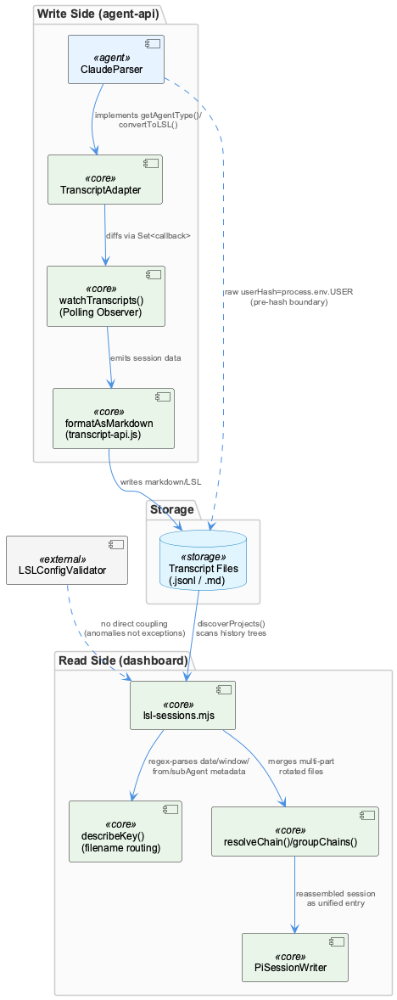
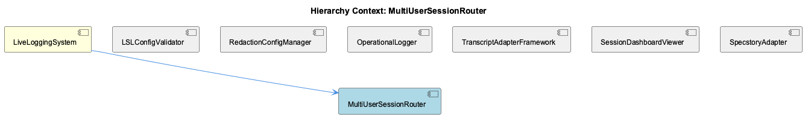

# MultiUserSessionRouter

**Type:** SubComponent

[Architecture Notes] Clear separation between routing/config validation (LSLConfigValidator per parent context) and downstream consumption (lsl-sessions.mjs), with no direct code coupling — routing bugs surface as data anomalies, not exceptions, in the reader; Raw (unhashed) usernames transiently exist in ClaudeParser.parseFile()'s metadata.userHash (process.env.USER) before any downstream re-hashing into the pseudonymized LSL scheme described in parent observations — a potential boundary worth confirming is closed before data reaches persistent storage; Format-agnostic router design: both .jsonl (pi) and .md (legacy) transcript formats coexist under the same user/date/window directory structure, requiring readers to format-detect and branch (isLsl(), format detection in listSessions()); Logging is uniformly routed through categorized createLogger() calls (transcript-api.js, claude-parser.js) rather than console.*, aligning with the project's centralized logging-config.json and constraint-monitor enforcement; No shared schema-validation call is evident between the write-side (transcript-api.js formatAsMarkdown) and read-side (lsl-sessions.mjs/PiSessionWriter.js) markdown serializers, meaning schema drift would only be caught by manual testing or by LSLConfigValidator at a different layer entirely

# MultiUserSessionRouter — Technical Insight Document

## What It Is

MultiUserSessionRouter is the routing and discovery layer responsible for locating, parsing, and reassembling multi-user session transcripts across the LiveLoggingSystem. Its primary implementation lives in `integrations/system-health-dashboard/lsl-sessions.mjs`, with key functions including `discoverProjects()` (lines ~78-98), which scans sibling project roots and `/workspace` for `.specstory/history` trees, `describeKey()` (lines ~121-128), which regex-parses date/window/from/subAgent routing metadata directly out of chain filenames, and `readSession()`/`resolveChain()` (lines ~155-210), which merge `.jsonl` and `.md` transcript parts into a unified pi-shaped entry list. It operates alongside the write-side transcript machinery in `lib/agent-api/transcript-api.js` and `lib/agent-api/transcripts/claude-parser.js`, effectively serving as the read-side consumer of data produced by the adapter framework.

## Architecture and Design

The router's defining architectural trait is a **filename-as-routing-record pattern**: rather than maintaining a separate index of sessions, routing metadata (user-hash, date, window, redirect/subAgent info) is encoded directly into transcript filenames and decoded via `describeKey()`. This is a deliberate trade-off — it avoids index synchronization problems but pushes all routing logic into regex parsing, making the filename format itself a load-bearing contract.

A **chain/grouping pattern** handles multi-part rotated files: `groupChains()`/`concatChain()` reassemble fragments into a single logical session before `readSession()` treats them as one entity. Layered on top is a **format-agnostic router design** — both `.jsonl` (pi) and legacy `.md` formats coexist under the same user/date/window directory structure, requiring format-detection branches like `isLsl()` inside `listSessions()`. Notably, legacy markdown chains are converted on-the-fly using the same parser/writer logic used in backfill migrations, making the read path effectively a live preview of the write-side migration — an elegant reuse of conversion code, though it means read-path performance is coupled to conversion cost.

Critically, there is **no direct code coupling** between the parent LSLConfigValidator's routing/config validation and this downstream consumption layer. Routing bugs therefore don't surface as exceptions — they surface as silent data anomalies in the reader, which has real debugging implications discussed below.

## Implementation Details

On the write side, `TranscriptAdapter` (abstract base class in `lib/agent-api/transcript-api.js`, ~120-160) defines the adapter pattern with abstract methods `getAgentType()`, `getTranscriptDirectory()`, `readTranscripts()`, `convertToLSL()`, and `getCurrentSession()`. `ClaudeParser` is the concrete implementation, with its own `getTranscriptDirectory()` (claude-parser.js ~38-49) building Claude's directory-naming convention independently of LSL's hashed routing scheme — a divergence the router must reconcile when reading.

Live transcript watching uses a **polling-based Observer pattern**: `watchTranscripts()`/`stopWatching()` (transcript-api.js ~175-215) use `setInterval` plus `Set<callback>` diffing with a configurable interval (default 1000ms), rather than filesystem events.

A notable implementation detail with security implications: `ClaudeParser.parseFile()` (claude-parser.js ~135-165) sets `metadata.userHash` to the **raw, unhashed** `process.env.USER` value, not a SHA-256 truncated hash. This raw username transiently exists before any downstream re-hashing into LSL's pseudonymized scheme — a boundary that should be confirmed closed before data reaches persistent storage or the router's output.

Serialization is duplicated rather than shared: `formatAsMarkdown` in `transcript-api.js` and `PiSessionWriter` in the dashboard implement the same logical session model independently, with no shared schema-validation call between write-side and read-side (`lsl-sessions.mjs`/`PiSessionWriter.js`) — schema drift would only be caught by manual testing or by LSLConfigValidator operating at a different layer entirely.

## Integration Points

MultiUserSessionRouter is a child of **LiveLoggingSystem**, which centralizes config validation via **LSLConfigValidator** (`scripts/validate-lsl-config.js`), enforcing a fail-closed schema across five required sections (`version`, `multiUser`, `fileManager`, `operationalLogger`, `classification`). Though the router doesn't directly call the validator, it depends implicitly on the config it enforces (windowing, file management).

It shares the transcript pipeline with sibling **TranscriptAdapterFramework** (the abstract `TranscriptAdapter`/`ClaudeParser` machinery) and consumes output that should pass through **RedactionConfigManager**'s pseudonymization rules — the raw `userHash` issue flagged above is precisely the boundary RedactionConfigManager is meant to guard. **SessionDashboardViewer** likely consumes the router's unified session output directly. Logging throughout (`transcript-api.js`, `claude-parser.js`) routes through categorized `createLogger()` calls tied to the `transcript` category in `config/logging-config.json` (~13-17, level: info), consistent with project-wide centralized logging enforced by constraint-monitor rather than raw `console.*` calls.

## Usage Guidelines

Developers extending transcript support should implement new agent parsers as `TranscriptAdapter` subclasses (following `ClaudeParser`'s example) rather than bypassing the abstraction, to keep `convertToLSL()` and directory discovery consistent with `lsl-sessions.mjs` expectations. Anyone modifying filename conventions must update `describeKey()`'s regex in lockstep — since routing state is filename-encoded rather than indexed, format changes are high-risk and silent-failure-prone. Given the confirmed lack of shared schema validation between `formatAsMarkdown` and `PiSessionWriter`, any change to session shape should be manually verified across both serializers. Finally, the raw-`userHash` leak in `ClaudeParser.parseFile()` should be treated as a priority fix or confirmed-safe before this router is used with untrusted or multi-tenant data, since it directly undermines the pseudonymization guarantees the parent LiveLoggingSystem's classification schema is designed to enforce.

## Hierarchy Context

### Parent
- [LiveLoggingSystem](./LiveLoggingSystem.md) -- [LLM] The LiveLoggingSystem's configuration validation is centralized in scripts/validate-lsl-config.js through the LSLConfigValidator class, which acts as a schema enforcement gatekeeper for two distinct config artifacts: .specstory/config/lsl-config.json (structural/behavioral settings) and .specstory/config/redaction-config.yaml (privacy/classification rules). This separation reflects a deliberate architectural decision to decouple 'how the logger behaves' from 'what the logger is allowed to record', allowing redaction policy to be iterated on independently from file-management or session-windowing logic. The initializeSchemas() method enumerates five required top-level sections (version, multiUser, fileManager, operationalLogger, classification), meaning any config missing even one of these fails validation outright—this is a strict fail-closed design rather than a permissive fail-open one, which is notable for a system handling potentially sensitive session transcripts.

### Siblings
- [LSLConfigValidator](./LSLConfigValidator.md) -- [CGR] LSLConfigValidator (class) in validate-lsl-config.js
- [RedactionConfigManager](./RedactionConfigManager.md) -- [LLM] lib/agent-api/transcripts/claude-parser.js:parseFile() sets session metadata `userHash: process.env.USER || 'unknown'` — this is the RAW, unhashed OS username, not a SHA-256 truncated hash. This directly contradicts the pseudonymization pattern described for LSL's `validateUserEnvironment()` (hash+truncate to 6 chars) referenced in the parent LiveLoggingSystem context. If ClaudeParser's output metadata is persisted or surfaced without passing back through a redaction/hashing step, this is a plaintext-username leak in exactly the kind of session transcript metadata the classification schema is meant to guard, and is worth verifying against whatever RedactionConfigManager rules apply downstream of this adapter.
- [OperationalLogger](./OperationalLogger.md) -- [CGR] OperationalLogger (class) in OperationalLogger.js
- [TranscriptAdapterFramework](./TranscriptAdapterFramework.md) -- [LLM] [object Object]
- [SessionDashboardViewer](./SessionDashboardViewer.md) -- [LLM] [object Object]
- [SpecstoryAdapter](./SpecstoryAdapter.md) -- [CGR] SpecstoryAdapter (class) in specstory-adapter.js

---

*Generated from 10 observations*
