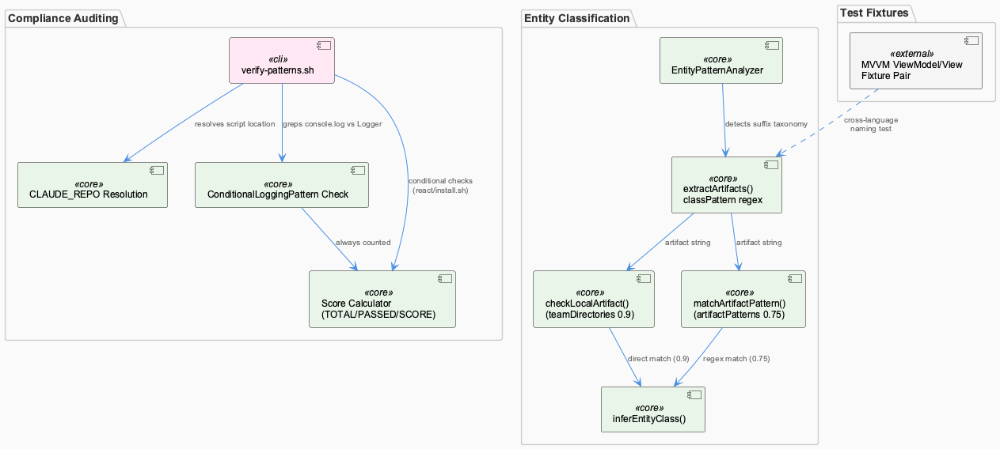
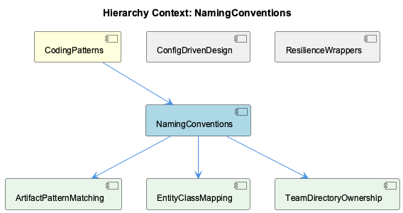

# NamingConventions

**Type:** SubComponent

[Architecture Notes] verify-patterns.sh resolves its own repo root relative to its script location, creating an implicit coupling between file placement and correctness; EntityPatternAnalyzer hardcodes team-to-directory and team-to-regex mappings in-class rather than externalizing them to a config file, which is somewhat inconsistent with the project's otherwise config-driven-behavior convention (config/features.yaml, config/task-taxonomy.yaml) noted in the parent CodingPatterns component; Naming-convention detection (suffix regex) is decoupled from team disambiguation (directory/pattern lookup), a two-stage design that trades simplicity for the risk of suffix collisions across teams (e.g. 'Manager' or 'Agent' appearing in multiple teams' domains); Compliance scoring in verify-patterns.sh is project-shape-dependent (denominator varies based on file existence), reducing comparability of scores across runs or repos

# NamingConventions

## What It Is

NamingConventions is the sub-component of CodingPatterns responsible for turning informal naming idioms (`*Manager`, `*Service`, `*Agent`, `*Engine`, `*Handler`, `*Analyzer`, `*Classifier`, `*Filter`, `*Monitor`) into machine-enforceable rules. It manifests in two concrete artifacts: `scripts/knowledge-management/verify-patterns.sh`, a compliance-scanning script that greps the codebase for adherence to conventions like ConditionalLoggingPattern, and `src/ontology/heuristics/EntityPatternAnalyzer.ts`, which formalizes the suffix-based naming taxonomy into an executable classifier via the `classPattern` regex used in `extractArtifacts()`. A third, narrower artifact — the `integrations/graphify/tests/fixtures/xaml_viewmodel/` fixture pair (`DesignViewModel.cs` / `DesignView.xaml`) — demonstrates that the graphify parser can recognize a *different* naming convention (MVVM's ViewModel/View pairing) entirely outside this project's own Manager/Service/Agent vocabulary, and should not be mistaken for a production standard.

Where its parent CodingPatterns treats naming conventions as one idiom among many (alongside adapter patterns and circuit-breakers), NamingConventions is the sub-component that operationalizes just this one convention — turning "style" into "signal" that downstream systems can consume.

## Architecture and Design

The dominant architectural pattern is **suffix-based naming taxonomy as machine-readable metadata rather than pure style guidance** (Architectural Patterns observation 7). This single design decision cascades into everything else: because `EntityPatternAnalyzer.ts` treats a class name like `Manager` or `Agent` as evidence of team ownership, naming conventions stop being cosmetic and become an input to automated classification.

This is realized as a **two-stage, two-tier design**: stage one (`extractArtifacts()`) detects the *presence* of a naming convention via a shared, team-agnostic regex; stage two (`analyzeEntityPatterns()`) disambiguates *which team* the artifact belongs to, first via `checkLocalArtifact()` (path-based, confidence 0.9) and, failing that, via `matchArtifactPattern()` (regex-based, confidence 0.75). This confidence gradient encodes an explicit design assumption — physical location is a stronger ownership signal than name — documented further in the child component TeamDirectoryOwnership. The trade-off is that naming-convention detection is fully decoupled from team disambiguation, which is simple to implement but creates suffix-collision risk: `Manager` or `Agent` can legitimately appear across multiple teams' domains (Coding, RaaS, ReSi, Agentic, UI), so the same shared classPattern is applied uniformly across all five domains before any team-specific filtering occurs.

A second pattern, orthogonal to the classifier, is **grep-based compliance auditing** in `verify-patterns.sh`, which enforces the ConditionalLoggingPattern naming/usage convention by comparing `console.log` calls against `Logger.*` calls. Unlike sibling ConfigDrivenDesign's characterization of this same script as data-driven "monitoring-as-code," from the NamingConventions perspective the interesting detail is that the script's own correctness is coupled to its physical file location (`scripts/knowledge-management/verify-patterns.sh`), resolving `CLAUDE_REPO` relative to `SCRIPT_DIR` — an implicit, fragile analog to the same "location matters" assumption embedded in `checkLocalArtifact()`.

## Implementation Details

`EntityPatternAnalyzer.extractArtifacts()` applies a single shared `classPattern` regex — `[A-Z][a-zA-Z]+(Service|Agent|Manager|Engine|Handler|Analyzer|Classifier|Filter|Monitor)` — against free-text knowledge content to pull out candidate artifact names. These raw strings (e.g., `'LSLSession'`, `'Kubernetes'`) then flow into `analyzeEntityPatterns()`, which invokes `checkLocalArtifact()` against the hardcoded `teamDirectories` map (child: TeamDirectoryOwnership) and, on failure, `matchArtifactPattern()` against the five per-team `artifactPatterns` regex arrays (child: ArtifactPatternMatching). Both paths converge on `inferEntityClass()` / `inferEntityClassFromPattern()`, which map the matched keyword to a canonical entity class name using hand-maintained lookup tables (child: EntityClassMapping).

On the compliance side, `verify-patterns.sh` builds its `TOTAL_CHECKS`/`PASSED_CHECKS`/`SCORE` block conditionally: ConditionalLoggingPattern is always checked, but ReduxStateManagementPattern and NetworkAwareInstallationPattern checks are only added to the denominator if `package.json` mentions 'react' or `install.sh` exists, respectively. This variable-denominator design means naming/pattern compliance scores are not comparable across projects of different shapes — a project without `install.sh` can score 100% without ever validating network-awareness.

## Integration Points

NamingConventions sits directly under CodingPatterns and exposes its internal mechanics through three children: ArtifactPatternMatching (the `ArtifactPattern` interface bundling team, regex list, and entity-class map — noted to drift out of sync, e.g. `MCPService`/`MCPTool` both collapsing to `MCPAgent`), EntityClassMapping (the duplicated keyword→class tables across `entityClassMap` and `teamMappings`), and TeamDirectoryOwnership (the path-prefix-based `teamDirectories` confidence-0.9 tier). These three children are not independent features but decomposed facets of the same `EntityPatternAnalyzer.ts` mechanism.

Laterally, it shares the same source file and script with sibling ConfigDrivenDesign, which frames `verify-patterns.sh` as an instance of monitoring-as-code reading a `TransferablePattern` list from a shared JSON knowledge base — meaning naming-convention compliance is one data-driven check among several externalized policies. Sibling ResilienceWrappers explicitly disclaims that either `verify-patterns.sh` or `EntityPatternAnalyzer.ts` are true resilience decorators, positioning both instead as "guard-rail" code, reinforcing that NamingConventions' role is detection/classification, not runtime fault-tolerance.

## Usage Guidelines

Developers introducing a new suffix-bearing class name (`*Manager`, `*Service`, etc.) should recognize that this name is not cosmetic in this codebase — it will be picked up by `extractArtifacts()` and fed into team-ownership inference. Anyone adding a new team, subsystem, or entity class must update `teamDirectories`, the relevant `artifactPatterns` array, and the corresponding `entityClassMap`/`teamMappings` entries in tandem; the analysis explicitly notes there is no single source of truth, so partial updates silently produce mis-classification rather than errors. Because directory-based matching (confidence 0.9) outranks regex-based matching (confidence 0.75), moving a file between teams without updating `teamDirectories` will cause stale ownership inferences with no drift-detection mechanism.

For compliance tooling, do not treat `verify-patterns.sh`'s percentage score as cross-project-comparable, since its denominator depends on which optional files/configs exist in the target repo. Also avoid relocating `verify-patterns.sh` without setting `CODING_TOOLS_PATH`/`CODING_REPO`, since its repo-root inference depends on its own path. Finally, when encountering naming patterns like `*ViewModel`/`*View` in fixtures such as `integrations/graphify/tests/fixtures/xaml_viewmodel/`, understand these represent test coverage of cross-language convention *recognition*, not additions to this project's own naming standard.

## Hierarchy Context

### Parent
- [CodingPatterns](./CodingPatterns.md) -- CodingPatterns serves as a catch-all component for general programming wisdom, design patterns, conventions, and best practices that are applied across the Coding project but do not belong to any single functional subsystem. Rather than being a discrete module with its own directory, it manifests as recurring architectural idioms observed across the codebase—such as adapter patterns for storage backends, lazy initialization patterns for agent classes, circuit-breaker and caching wrappers around external services, and shared concurrency utilities like work-stealing task distribution. These patterns are documented in docs/architecture/*.md files and implemented consistently across SubComponents like GraphDatabaseManager, LLMServiceProvider, and CircuitBreakerManager.

Because no representative source files were directly attributed to this component, its presence is inferred from cross-cutting conventions referenced in the broader Existing Knowledge graph (e.g., Detail-level entities like ProviderRegistryManager and GraphDatabaseManager) and from architecture documentation describing system-wide approaches (health monitoring, LLM routing, memory systems). The component effectively functions as a conceptual umbrella capturing idiomatic code style, naming conventions (e.g., *Manager, *Adapter, *Service suffixes), and best-practice enforcement mechanisms like the ConstraintMonitoringService and egress-lint-allowlist.json.

Key architectural patterns include the consistent use of dependency-injected registries (ProviderRegistryManager), decorator-like wrapping of network calls (CircuitBreakerManager, CachingMechanism), and configuration-driven behavior (config/features.yaml, config/agent-profiles.json) rather than hardcoded logic, reflecting a broader project convention of externalizing policy from mechanism.

### Children
- [ArtifactPatternMatching](./ArtifactPatternMatching.md) -- [LLM] The `ArtifactPattern` interface in src/ontology/heuristics/EntityPatternAnalyzer.ts couples three independent concerns into a single record: a `team` string, an array of `RegExp` objects, and an `entityClassMap` keyed by keyword. This means the regex list and the entity-class lookup table are maintained as parallel structures that must be kept in sync by hand — for example the 'Coding' team's patterns array contains `/MCP(Agent|Service|Tool)/i` while its entityClassMap only maps the bare keyword `MCP: 'MCPAgent'`, silently collapsing `MCPService` and `MCPTool` matches to the same `MCPAgent` entity class in `inferEntityClassFromPattern`. This is a latent classification-accuracy bug rather than a crash risk, since the method still returns *a* class, just not necessarily the correct one.
- [EntityClassMapping](./EntityClassMapping.md) -- [LLM] The `EntityClassMapping` convention, as implemented in src/ontology/heuristics/EntityPatternAnalyzer.ts, encodes team-ownership inference as static, hand-maintained data structures rather than derived metadata. The `entityClassMap` fields nested inside each `ArtifactPattern` object (e.g. `{ Kubernetes: 'KubernetesCluster', Lambda: 'AWSLambdaFunction' }`) and the parallel `teamMappings` record inside `inferEntityClass()` both hardcode the same keyword-to-class relationship twice — once for pattern-matched artifacts and once for path-matched artifacts. This duplication means any new entity class (e.g. adding a new AWS resource type for the 'UI' team) must be added in at least two places (the `patterns: RegExp[]` array and the corresponding `entityClassMap`), and a third place if `teamMappings` needs the same key. There is no single source of truth for the suffix convention within this file.
- [TeamDirectoryOwnership](./TeamDirectoryOwnership.md) -- [LLM] EntityPatternAnalyzer.analyzeEntityPatterns() (src/ontology/heuristics/EntityPatternAnalyzer.ts) implements a two-step ownership inference cascade with an explicit confidence gradient: checkLocalArtifact() first tests whether an extracted artifact's path starts with one of the hard-coded directory prefixes in the teamDirectories Map (confidence 0.9), and only if that fails does matchArtifactPattern() fall back to regex matching against artifactPatterns (confidence 0.75). This ordering encodes a design assumption that a file's physical location is a stronger ownership signal than its name — but because both paths and class names are static, hand-maintained lists, the analyzer has no mechanism to detect drift when a file moves teams or a class is renamed without an accompanying update to this file.

### Siblings
- [ConfigDrivenDesign](./ConfigDrivenDesign.md) -- [LLM] scripts/knowledge-management/verify-patterns.sh is the concrete enforcement mechanism for the ConfigDrivenDesign/CodingPatterns umbrella described in the parent context. Rather than encoding pattern rules directly in application logic, it externalizes 'compliance checks' (ConditionalLoggingPattern, ReduxStateManagementPattern, NetworkAwareInstallationPattern) as ripgrep-based heuristics run against the tree, and reads a `TransferablePattern` list with `significance >= 8` out of a JSON knowledge-base file (`$SHARED_MEMORY`) via `jq`. This is a textbook instance of the 'monitoring-as-code' convention called out in the parent observations (ConstraintMonitoringService, health-verification-rules.json) — the script itself contains no hardcoded assertions about what 'compliant' code looks like beyond what's already declared in data (the pattern list), and it writes its score back into that same JSON file (`.metadata.last_pattern_verification`, `.metadata.pattern_compliance_score`), making the knowledge base both the source of truth and the sink for compliance telemetry.
- [ResilienceWrappers](./ResilienceWrappers.md) -- [LLM] No code_graph evidence was provided for this analysis (the <code_graph> block is empty), so all observations below are grounded directly in the two source files supplied — scripts/knowledge-management/verify-patterns.sh and src/ontology/heuristics/EntityPatternAnalyzer.ts — rather than in graph-derived call relationships. Neither file is a 'wrapper' in the classic circuit-breaker/retry sense described in the parent CodingPatterns context; verify-patterns.sh is a compliance-scanning shell script and EntityPatternAnalyzer.ts is a heuristic classifier, so the ResilienceWrappers label as applied to these files is best read as 'defensive/guard-rail code' rather than network-resilience decorators like CircuitBreakerManager or CachingMechanism.

---

*Generated from 9 observations*
