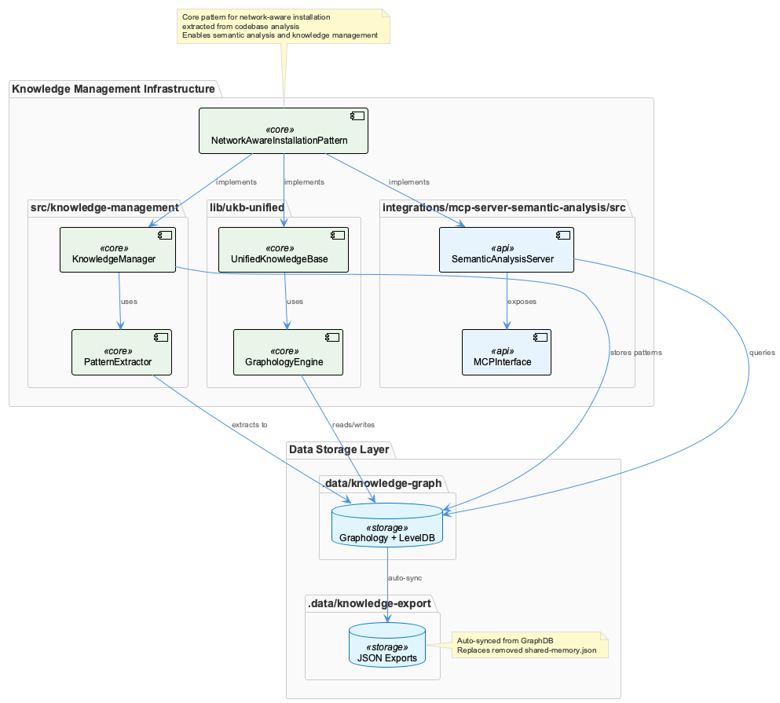
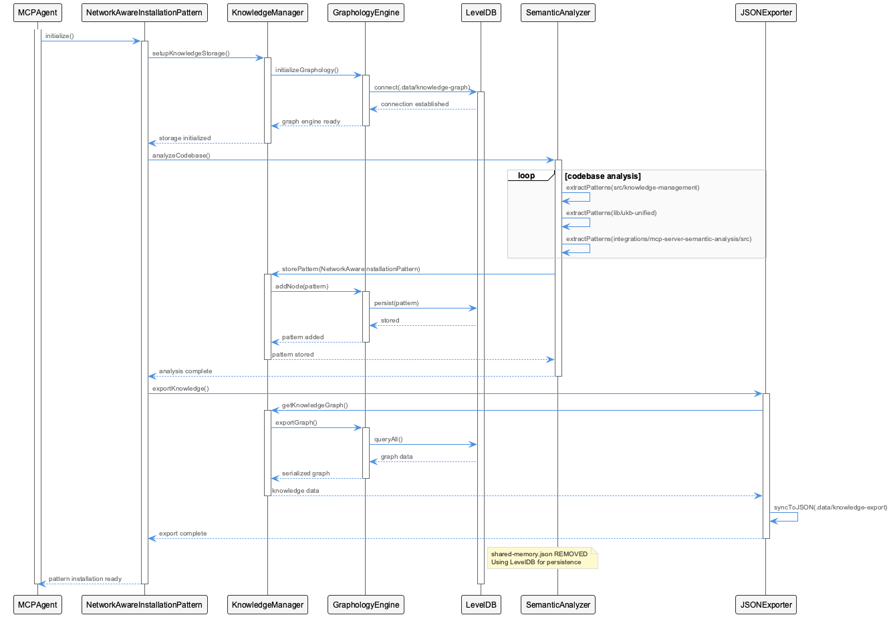
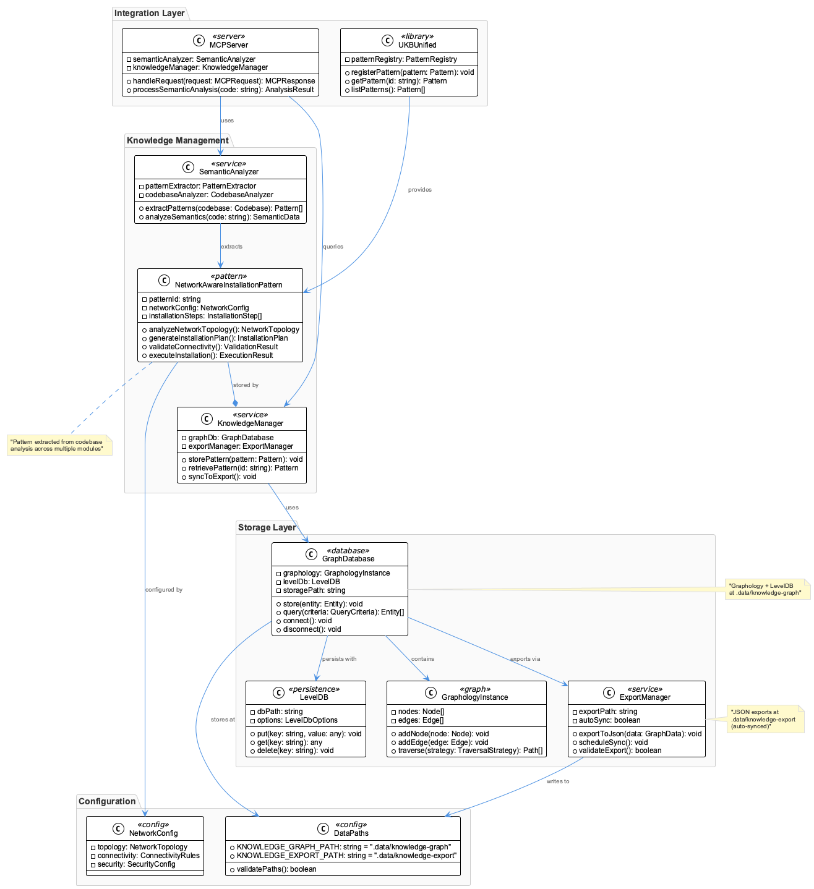
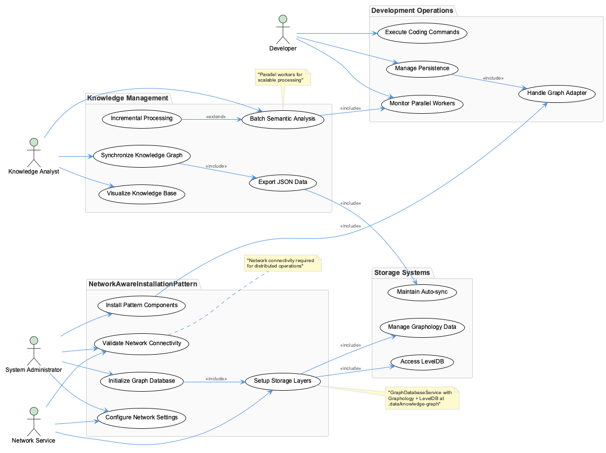

# NetworkAwareInstallationPattern

**Type:** TransferablePattern

Current codebase uses GraphDatabaseService with Graphology + LevelDB storage at .data/knowledge-graph, with auto-synced JSON exports to .data/knowledge-export directory

## What It Is

- Available commands include 'vkb' for visualization, 'coding' for development operations, and 'graph-sync' for knowledge synchronization between storage layers

- Current codebase uses GraphDatabaseService with Graphology + LevelDB storage at .data/knowledge-graph, with auto-synced JSON exports to .data/knowledge-export directory

## How It Works

- Recent parallel workers implementation for batch mode semantic analysis suggests scalable processing patterns suitable for network-aware operations

- Incremental content constraints now only apply to edit/write operations, reducing unnecessary processing overhead for network-dependent installations

## Usage Guidelines

- Knowledge persistence must utilize GraphDatabaseAdapter and PersistenceAgent components, avoiding the removed shared-memory.json approach

## Diagrams

### Architecture

### Sequence

### Class

### Use cases

---

*Generated from 5 observations*
