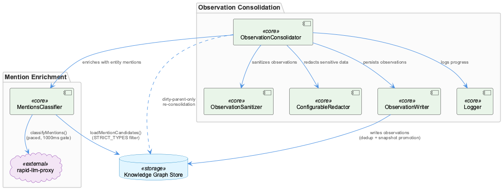
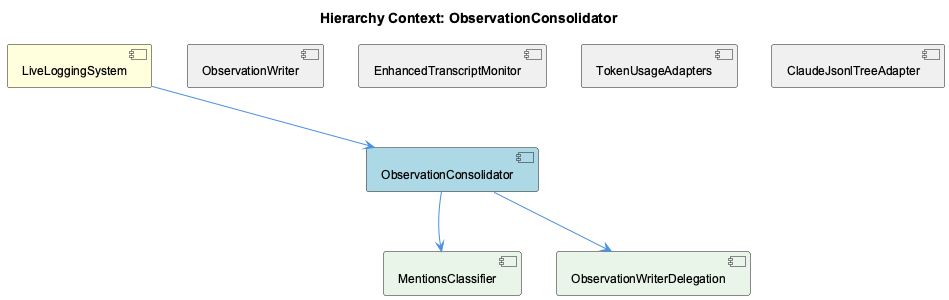

# ObservationConsolidator

**Type:** SubComponent

## What It Is

ObservationConsolidator is implemented in `ObservationConsolidator.js` (with tests in `ObservationConsolidator.test.js`), as a SubComponent of LiveLoggingSystem. Notably, the observations available for this document do not include the consolidator's own method bodies or source excerpts — its structure is known entirely through the code graph's import edges and one session work record documenting its scheduling behavior. This is an important caveat that should be preserved in any future analysis: statements about the consolidator's internal logic are largely inferential.

What can be said with confidence is that ObservationConsolidator is responsible for two things: (1) consolidating observations into parent-node descriptions on a scheduled basis, and (2) orchestrating a set of collaborator modules to sanitize, redact, classify, and persist observation data.

## Architecture and Design

The dominant pattern is **orchestrator/facade over single-responsibility collaborators**. Per the code graph, ObservationConsolidator.js imports ObservationWriter.js, ConfigurableRedactor.js, ObservationSanitizer.js, Logger.js (createLogger), and MentionsClassifier.js (loadMentionCandidates, classifyMentions). Rather than embedding sanitization, redaction, entity-mention enrichment, and persistence logic inline, the consolidator delegates each concern outward, keeping its own role focused on sequencing and scheduling.

The second major design decision, captured in the "Stage 5 Scheduled Observation Consolidation" session record, is a **dirty-parent-only scheduled re-consolidation strategy**: rather than re-synthesizing all parent nodes on every cycle, the consolidator re-synthesizes only parents whose children have changed. This is an explicit cost-vs-freshness trade-off — dramatically cheaper than full re-synthesis while nearly matching its quality — and it defines the consolidator's core scalability posture.

A third pattern, inherited through its dependency on MentionsClassifier, is **closed-set LLM classification** to prevent hallucinated graph edges: rather than letting an LLM freely propose entity mentions, the consolidator's enrichment step is constrained to a fixed candidate set.

## Implementation Details

Since the consolidator's own source is not present in the retrieved files, implementation detail is best understood through its children/collaborators, which are also modeled as child components: MentionsClassifier and ObservationWriterDelegation.

MentionsClassifier (`src/live-logging/MentionsClassifier.js`) exposes `loadMentionCandidates(kmStore)` and `classifyMentions(insightSummary, candidates)`. The former loads the L1+L2+L3 vertical of the entity graph (Component/SubComponent/Detail) via `kmStore.findByOntologyClass()`, filtering strictly with a `STRICT_TYPES` Set even though the underlying store query is an OR-gate that would otherwise admit mis-stamped Insights, Processes, Containers, and Observations (74/16/11/15 such entities respectively, per the module's own comments). This guard is the mechanism that keeps consolidator-driven mention edges targeted at architectural nodes only. The latter function performs a single LLM call (taskType `mentions-classification`, routed to claude-haiku) via `callProxy()`, which posts to the rapid-llm-proxy `/api/complete` endpoint using standard URL-resolution precedence and wraps fetch failures with cause-chain detail to avoid undici's generic "fetch failed" collapse.

Because ObservationConsolidator's own loop mirrors insights to the knowledge graph sequentially, it produces a steady stream of mentions-classify calls. MentionsClassifier protects this with a module-level pacing gate (`_paced()`, `_minIntervalMs()`, default 1000ms) — a rate limiter that exists specifically to protect the consolidator's per-cycle SLA rather than the classifier's own concerns.

ObservationWriterDelegation represents the consolidator's dependency on ObservationWriter.js for durable persistence, inheriting its turn-aware semantic dedup and snapshot-promotion behavior on the write path.

## Integration Points

ObservationConsolidator sits within LiveLoggingSystem alongside siblings ObservationWriter, MentionsClassifier, EnhancedTranscriptMonitor, TokenUsageAdapters, and ClaudeJsonlTreeAdapter, and it directly contains (depends on) two of these as children: MentionsClassifier and ObservationWriterDelegation.

Its integration surface, per the import graph, includes ConfigurableRedactor.js and ObservationSanitizer.js (pre-persistence sanitization/redaction), Logger.js's `createLogger` (logging), ObservationWriter.js (persistence), and MentionsClassifier.js (entity-mention enrichment). The dependency on ObservationWriter is consequential: ObservationWriter mediates all observation persistence with turn-aware semantic dedup and snapshot promotion, but its `[Raw]` fallback observations — generated on proxy timeout — are logged as "storing" yet have been repeatedly observed to silently fail to persist. Any consolidation output funneled through this path inherits that same unverified-persistence risk, downstream of the consolidator's own logic.

The MentionsClassifier dependency creates a concrete cross-component timing coupling: a 429 from Claude Max-OAuth's per-model haiku rate limit forces a fallback CLI path that can take 14–20s, which can exceed the consolidator's own 15s KG-push budget per cycle — causing the same insights to fail repeatedly, off-corporate-network. MentionsClassifier's internal pacing gate exists specifically to protect this SLA owned by its caller.

## Usage Guidelines

Developers extending or debugging ObservationConsolidator should be aware of several coupled risks rather than treating it as an isolated unit. First, any failure investigation involving missing or stale observations should check ObservationWriter's `[Raw]` fallback path, since writes reported as successful there may not have actually persisted. Second, timing failures in KG-push cycles (especially off-corporate-network) should be checked against MentionsClassifier's rate-limiting behavior and Claude Max-OAuth haiku limits before assuming a bug in the consolidator itself — the 15s per-cycle budget is tight against a 14–20s CLI fallback. Third, the dirty-parent-only re-consolidation strategy means freshness is approximate, not guaranteed exhaustive — this is an intentional trade-off, not a bug, and should not be "fixed" toward full re-synthesis without weighing cost implications. Finally, because ObservationConsolidator's own source was unavailable in this review, any deep changes to its orchestration logic should be verified against the actual `ObservationConsolidator.js` file rather than this document's inferred composition model.

## Code Evidence

Key code artifacts grounding this entity's analysis:

**Structural:**
- ObservationConsolidator (class) in ObservationConsolidator.js

**Relationships:**
- Imports: MentionsClassifier.js, loadMentionCandidates, classifyMentions, Logger.js, createLogger, ConfigurableRedactor.js, ObservationSanitizer.js, ObservationSanitizer, ObservationWriter.js, ObservationWriter (+2 more)

**Other:**
- ObservationConsolidator.js (module) in ObservationConsolidator.js
- ObservationConsolidator.test.js (module) in ObservationConsolidator.test.js
- The code graph's import list for ObservationConsolidator.js names five collaborators — ObservationWriter.js, ConfigurableRedactor.js, ObservationSanitizer.js, Logger.js (createLogger), and MentionsClassifier.js (loadMentionCandidates, classifyMentions) — indicating the consolidator is structured as an orchestrator over discrete single-responsibility modules rather than a monolithic class: sanitization/redaction is delegated outward before persistence, persistence itself is delegated to ObservationWriter, and entity-mention enrichment is delegated to MentionsClassifier. None of ObservationConsolidator's own method bodies are present in the retrieved files, so this composition is inferred entirely from the import edges rather than from reading the orchestration logic itself.

## Work Record

What working sessions recorded about this entity — decisions taken, problems hit, and why things are the way they are:

- Stage 5 Scheduled Observation Consolidation — Cost Model and Routing Gap: implements a dirty-parent-only scheduled re-consolidation strategy that re-synthesizes only parents with new children, far cheaper than full re-synthesis while nearly matching quality.
- Per the 'Stage 5 Scheduled Observation Consolidation — Cost Model and Routing Gap' record, ObservationConsolidator periodically re-consolidates parent-node descriptions/observations so they stay fresh as children accumulate, implementing a dirty-parent-only scheduled strategy that is far cheaper than full re-synthesis while nearly matching quality — this describes the consolidator's own scheduling/cost trade-off and is not recoverable from any file in the current retrieval set.
- Per the 'ObservationWriter — Semantic Dedup, Snapshot Promotion, and Raw Fallback Silent' record, ObservationWriter.js — an import of ObservationConsolidator.js per the code graph — mediates all observation persistence with turn-aware semantic dedup and snapshot promotion, but [Raw] fallback observations generated on proxy timeout are logged as 'storing' yet have been repeatedly observed to silently fail to persist. Because ObservationConsolidator depends on ObservationWriter for its own writes, any consolidation output funneled through that path inherits this same unverified-persistence risk downstream of the consolidator's own logic.

## Hierarchy Context

### Parent
- [LiveLoggingSystem](./LiveLoggingSystem.md) -- [SESSION] ObservationWriter.js (per the 'ObservationWriter — Semantic Dedup, Snapshot Promotion, and Raw Fallback Silent' record) mediates all observation persistence between ETM and the database, applying turn-aware semantic dedup and snapshot promotion, but [Raw] fallback observations generated on proxy timeout are logged as 'storing' yet have been repeatedly observed to silently fail to persist

### Children
- [MentionsClassifier](./MentionsClassifier.md) -- [CGR] MentionsClassifier.js (module) in MentionsClassifier.js
- [ObservationWriterDelegation](./ObservationWriterDelegation.md) -- [SESSION] Per the 'ObservationWriter — Semantic Dedup, Snapshot Promotion, and Raw Fallback Silent' record, ObservationWriter.js mediates all observation persistence with turn-aware semantic dedup and snapshot promotion, but [Raw] fallback observations generated on proxy timeout are logged as 'storing' yet have been repeatedly observed to silently fail to persist. This record describes the write-path's own failure mode; it establishes that a caller delegating writes to ObservationWriter inherits an unverified-persistence risk on the fallback branch specifically, not on the primary dedup/snapshot path.

### Siblings
- [ObservationWriter](./ObservationWriter.md) -- [SESSION] ObservationWriter — Semantic Dedup, Snapshot Promotion, and Raw Fallback Silent: [Raw] fallback observations generated on proxy timeout are logged as 'storing' yet have been repeatedly observed to silently fail to persist.
- [MentionsClassifier](./MentionsClassifier.md) -- [CGR] MentionsClassifier.js (module) in MentionsClassifier.js
- [EnhancedTranscriptMonitor](./EnhancedTranscriptMonitor.md) -- [CGR] EnhancedTranscriptMonitor (class) in enhanced-transcript-monitor.js
- [TokenUsageAdapters](./TokenUsageAdapters.md) -- [LLM] `STOP_ADAPTERS` (lib/lsl/token/stop-adapter-registry.mjs) is the component's core data structure: a per-agent keyed registry where each entry declares `mode: 'transcript'` (claude, copilot, opencode) or `mode: 'stamp-only'` (pi), with only 'transcript' entries carrying a `build`/`locate` pair. This is a deliberate Strategy/Adapter hybrid — the keyed-map shape lets `captureForegroundTokens` treat all four agents uniformly while the mode flag encodes a hard invariant (D-04): only agents that bypass rapid-llm-proxy get a transcript rebuild, because building one for a proxy-routed agent would double-count tokens already present in `token_usage`.
- [ClaudeJsonlTreeAdapter](./ClaudeJsonlTreeAdapter.md) -- [LLM] lib/lsl/adapters/claude-jsonl-tree.mjs implements the Claude sub-agent transcript discovery path via `walkSubAgentJsonl()`, which recursively visits `~/.claude/projects/<encoded-cwd>/<parent-uuid>/subagents/agent-<hex>.jsonl` and filters every candidate through `SUBAGENT_PATH_RE` at the candidate stage rather than after conversion. The regex captures three groups — encoded-cwd, parent session UUID, and agent hex id — that are re-extracted downstream by three separate single-purpose functions (`projectFromClaudeSubagentPath`, `parentSessionFromClaudeSubagentPath`, `agentIdFromClaudeSubagentPath`) instead of being threaded through as a parsed object, so every caller that needs row metadata re-runs the same regex against the same path.

---

*Generated from 14 observations*
