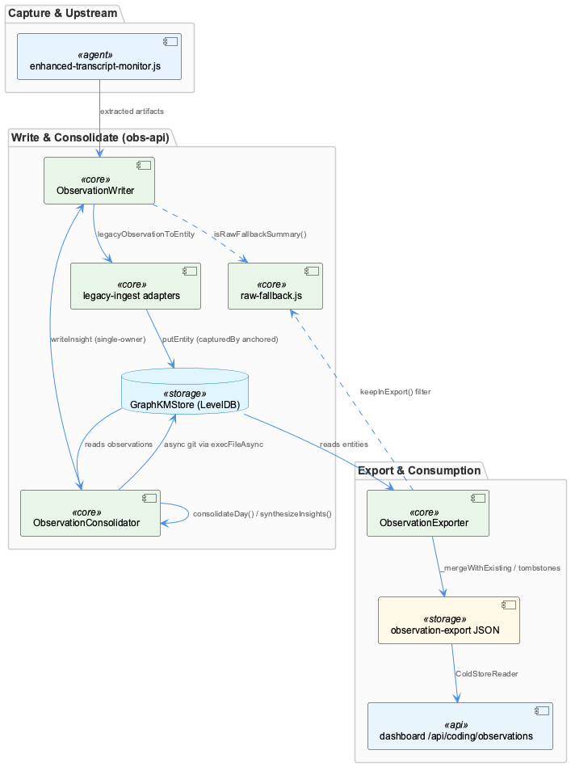
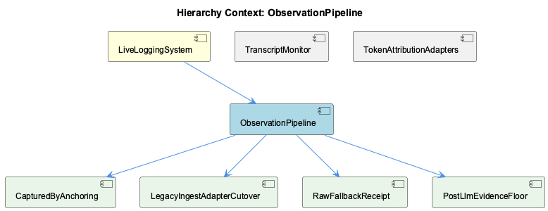

# ObservationPipeline

**Type:** SubComponent

## What It Is

ObservationPipeline is the write-consolidate-export subsystem of LiveLoggingSystem, implemented across `src/live-logging/ObservationWriter.js`, `src/live-logging/ObservationConsolidator.js`, `src/live-logging/ObservationExporter.js`, and the small shared utility `src/live-logging/raw-fallback.js`. It is the piece of the logging pipeline responsible for turning captured session artifacts into durable km-core `Entity` records, progressively summarizing them into digests and insights, and projecting the result into a git-tracked JSON contract consumed by the dashboard. Where its parent LiveLoggingSystem is concerned with classifying captured content (via `ontology-classification-agent.ts`), ObservationPipeline is concerned with what happens once content is captured: persisting it, refining it, and serving it back out.

## Architecture and Design

The pipeline follows a clear ETL/pipeline pattern: capture (handled upstream by sibling TranscriptMonitor's `EnhancedTranscriptMonitor` and `enhanced-transcript-monitor.js`'s `extractFileChanges`/`toolCallArgs`/`bashWriteTargets`) feeds ObservationWriter, which feeds ObservationConsolidator, which feeds ObservationExporter. ObservationWriter documents its own origin as a hard cutover from SQLite to km-core, explicitly eliminating the dual-source problem left by Plan 44-07's read-only migration, where dashboard reads had moved to km-core while writes still landed in SQLite and were invisible without manual migration.

Several named design patterns recur. The Adapter pattern, embodied in child entity LegacyIngestAdapterCutover, translates legacy SQLite-row shapes to km-core `Entity` objects via `legacyObservationToEntity`/`legacyDigestToEntity`/`legacyInsightToEntity` from `@fwornle/km-core/adapters/legacy-ingest` — shared forward-adapter logic used by both ObservationWriter and ObservationConsolidator, with the consolidator additionally hand-rolling inverse transforms (`_toLegacyObsRow`, etc.) so legacy-shaped internal code can keep operating. The Two-level memory hierarchy (Observer/Reflector, modeled explicitly on Mastra) structures ObservationConsolidator's `consolidateDay()` → `synthesizeInsights()` flow. A Tombstone pattern generalizes from insight deduplication into ObservationExporter's safety-merge logic. And child entity CapturedByAnchoring implements a routing pattern where `capturedBy` edges are anchored by writer subsystem (`ANCHOR_FOR_KIND`) rather than a single undifferentiated root, falling back to `ANCHOR_ROOT` ('LiveLoggingSystem') only when needed.

A key structural decision is single ownership: obs-api is the sole process constructing and holding the km-core `GraphKMStore`/LevelDB handle, injected as `options.kmStore` into all three main classes. ObservationConsolidator further enforces single-owner writes by routing all Insight persistence through `ObservationWriter.writeInsight` rather than writing km-core directly (Phase 58 Plan 02, D-06), avoiding drift across writer/bridge/consolidator paths.

## Implementation Details

ObservationWriter's `ANCHOR_ROOT`/`ANCHOR_FOR_KIND` constants were derived empirically: an audit found all 1,244 existing `capturedBy` edges cleanly attributable to a writer subsystem by `runId` prefix, requiring only a lookup, not a heuristic — though `ANCHOR_ROOT` is retained as fallback after a prior incident orphaned 22 Insights.

ObservationConsolidator's deduplication is threshold-banded rather than exact-match: `INSIGHT_DEDUP_THRESHOLD = 0.88` merges near-duplicates, `INSIGHT_FACET_THRESHOLD = 0.83` demotes borderline matches to cross-linked facets, and a secondary `INSIGHT_TOPIC_JACCARD_MERGE/FACET` band (0.60/0.30) catches paraphrases whose embedding cosine falls short but whose topic tokens overlap — calibrated against the observed fact that MiniLM-L6-v2 cosines float around 0.89–0.92 on shared vocabulary alone. Git operations are routed through `execFileAsync` (promisified `execFile`) rather than `execFileSync`, a deliberate choice documented against a measured incident where a synchronous git child blocked the event loop for 7.5 minutes, freezing HTTP routes and the 2-second consolidation heartbeat — a direct consequence of consolidation running in-process rather than as an isolated worker. Separately, the consolidator periodically re-synthesizes parent-node descriptions from accumulated child observations to keep them fresh without full reprocessing; this scheduler/routing/backfill machinery is described as fully implemented and running corpus-wide, with one guard-coverage defect still open.

ObservationExporter writes `.data/observation-export/{observations,digests,insights,metadata}.json`, consumed by the dashboard's `/api/coding/observations` via ColdStoreReader. Its `_mergeWithExisting` logic distinguishes tombstoned records (`_collectTombstones` reading `metadata.absorbed`), deliberately excluded records (`_knownObservationIds`), and genuinely lost records (DB reset) — only the last class is resurrected from a prior export, a distinction added after conflating them cost 26 turns of raw-fallback rows.

Child entity RawFallbackReceipt, `raw-fallback.js`, exists purely to fix a string-drift bug: `RAW_FALLBACK_PREFIX = '[Raw]'` and `isRawFallbackSummary()` were previously duplicated across `ObservationWriter._fallbackSummary`, `_classifyQuality`, and `scripts/backfill-raw-observations.mjs`; drift in one copy caused `ObservationExporter.keepInExport` to silently drop legitimate rows. Extraction into a zero-import module also lets ObservationExporter reuse the prefix without importing ObservationWriter's ioredis/km-core dependencies.

## Integration Points

Upstream, sibling TranscriptMonitor's `enhanced-transcript-monitor.js` extracts file changes and tool-call artifacts that feed ObservationWriter. Downstream, ObservationExporter's JSON output is treated as a load-bearing interface contract for the dashboard, not a debug artifact. Internally, a module-level EventEmitter (`_observationEmitter`) decouples ObservationWriter from SSE broadcast consumers (event bus/pub-sub pattern). All three main classes share the injected `kmStore`, which is also the source of test contention: the Typed-Views Test Suite timeout traces to concurrent Jest workers contending on this single effectively single-threaded obs-api backend. Sibling TokenAttributionAdapters is explicitly unrelated to this pipeline's supplied source.

## Usage Guidelines

Developers extending this pipeline should treat `raw-fallback.js`'s prefix constant as the single source of truth rather than re-deriving `[Raw]` locally, given its documented drift history. Insight/digest writes should go through ObservationWriter rather than direct km-core calls, per the single-owner convention. Long-running git or child-process calls inside ObservationConsolidator must remain asynchronous given the in-process, single-LevelDB-handle deployment model. Export-filtering changes must preserve the three-way tombstoned/excluded/lost distinction in `_mergeWithExisting` to avoid resurrecting or losing rows incorrectly, and any change to `ANCHOR_FOR_KIND` should account for `ANCHOR_ROOT` as an intentional fallback, not dead code.

## Work Record

What working sessions recorded about this entity — decisions taken, problems hit, and why things are the way they are:

- The 'Typed-Views Test Suite — obs-api Contention Timeout' record establishes that a timeout failure in the typed-views test suite is caused by concurrent Jest test workers contending on a shared, effectively single-threaded obs-api backend endpoint — consistent with ObservationWriter and ObservationConsolidator in this file set both routing reads and writes through one `kmStore`/LevelDB handle rather than per-worker isolation.
- The 'Stage 5 Scheduled Observation Consolidation — Cost Model and Routing Gap' record establishes that ObservationConsolidator periodically re-synthesizes parent-node descriptions from accumulated child observations to keep descriptions fresh without reprocessing every parent on every pass, and states this routing/backfill/scheduler machinery is fully implemented and running corpus-wide in production, with one guard-coverage defect still open.

## Hierarchy Context

### Parent
- [LiveLoggingSystem](./LiveLoggingSystem.md) -- [LLM] The classification layer for LiveLoggingSystem is implemented in ontology-classification-agent.ts, which categorizes captured session content as it flows through the logging pipeline. Its hierarchy-root validation logic is tested separately in ontology-classification-agent.hierarchy-roots.test.ts, indicating that root-node classification (i.e., correctly assigning top-level ontology categories rather than leaf nodes) is treated as a distinct correctness concern from general classification accuracy — likely because incorrect root assignment cascades into misfiled session data across the entire per-person or per-project vault structure.

### Children
- [CapturedByAnchoring](./CapturedByAnchoring.md) -- [LLM] The anchoring mechanism this component names is implemented directly in `src/live-logging/ObservationWriter.js` as the `ANCHOR_ROOT` ('LiveLoggingSystem') and `ANCHOR_FOR_KIND` ({observation: 'ObservationWriter', digest: 'ObservationConsolidator', insight: 'ObservationConsolidator'}) constants. The comment block above them documents the measured basis for the split: all 1,244 pre-existing `capturedBy` edges pointed at the single undifferentiated `ANCHOR_ROOT` until 2026-09-21, and when audited, every one of them cleanly attributed to a writer subsystem via its `runId` prefix (`obs-writer` vs `obs-consolidator`/`insight-resynthesize`) — meaning the kind-based split required no heuristic, only a lookup on which caller invoked the write.
- [LegacyIngestAdapterCutover](./LegacyIngestAdapterCutover.md) -- [LLM] The cutover is implemented as a pair of adapter modules imported from `@fwornle/km-core/adapters/legacy-ingest`: `ObservationWriter.js` pulls in `legacyObservationToEntity`, `legacyDigestToEntity`, and `legacyInsightToEntity` to convert SQLite-row-shaped writes into km-core `Entity` objects, while `ObservationConsolidator.js` imports the same `legacyDigestToEntity`/`legacyInsightToEntity` pair for its own write path and additionally hand-rolls the INVERSE transforms (`_toLegacyObsRow`, `_toLegacyDigestRow`, `_toLegacyInsightRow`) so that internal code written against the old row shape can keep operating against km-core `Entity` objects without a rewrite. This asymmetry — one canonical forward adapter shared by two writers, but a locally-defined reverse adapter only in the consolidator — is the concrete shape of 'LegacyIngestAdapterCutover': the cutover eliminated the SQLite handle but preserved its row contract as an in-memory shim.
- [RawFallbackReceipt](./RawFallbackReceipt.md) -- [LLM] `src/live-logging/raw-fallback.js` is the entire implementation of what the parent context calls the 'raw fallback receipt': a two-export leaf module (`RAW_FALLBACK_PREFIX = '[Raw]'` and `isRawFallbackSummary()`) with zero imports. Its own docstring frames it not as a formatting helper but as a bug-fix artifact — the `[Raw]` prefix used to be duplicated verbatim across `ObservationWriter._fallbackSummary`, `ObservationWriter._classifyQuality`, and `scripts/backfill-raw-observations.mjs`, and one of those three copies silently drifted from the others. When it did, `ObservationExporter.keepInExport` stopped recognizing placeholder rows as placeholders and dropped legitimate un-summarized receipts out of the export entirely. Extracting the constant and its matcher into one module is a textbook 'single source of truth' fix for a classic string-literal drift bug.
- [PostLlmEvidenceFloor](./PostLlmEvidenceFloor.md) -- [LLM] The string "PostLlmEvidenceFloor" does not appear anywhere in the supplied code files (ObservationWriter.js, ObservationConsolidator.js, ObservationExporter.js, raw-fallback.js, enhanced-transcript-monitor.js), and the accompanying <code_graph> block is empty — there is no class, function, export, or comment in this evidence set that names or implements this component. Everything below is therefore inference from thematically adjacent code, not a description of an actual PostLlmEvidenceFloor implementation.

### Siblings
- [TranscriptMonitor](./TranscriptMonitor.md) -- [CGR] EnhancedTranscriptMonitor (class) in enhanced-transcript-monitor.js
- [TokenAttributionAdapters](./TokenAttributionAdapters.md) -- [LLM] None of the supplied source files (enhanced-transcript-monitor.js, ObservationConsolidator.js, ObservationExporter.js, ObservationWriter.js, raw-fallback.js) define or reference any 'TokenAttributionAdapters' class, module, or naming convention. The files cover transcript capture, observation consolidation, JSON export, and raw-fallback marking — none of which mention token attribution, adapter interfaces, or per-token routing logic.

---

*Generated from 10 observations*
