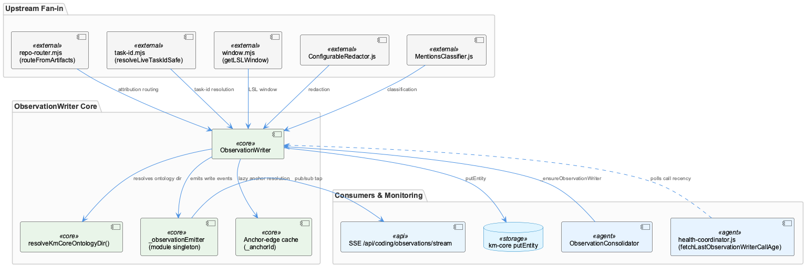
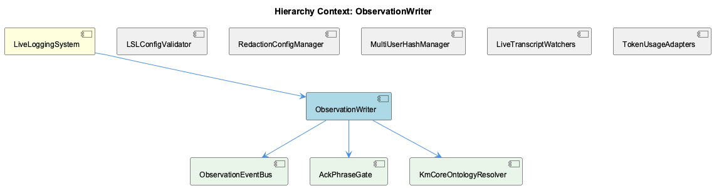

# ObservationWriter

**Type:** SubComponent

[LLM] The resolveKmCoreOntologyDir() function in ObservationWriter.js implements a two-tier fallback (defaultOntologyDir() first, then an import.<COMPANY_NAME_REDACTED>.resolve walk-up) to locate the km-core ontology JSON files — the same files the parent context says define LiveLoggingSystem's L2 classification. This ties ObservationWriter's runtime correctness directly to the ontology file layout described earlier (upper.json → coding-ontology.json → coding.lower.json chain); a misconfigured or missing ontology directory would silently degrade to null, per the comment 'should never fire' — an optimistic assumption worth scrutinizing given how critical ontologyDir is (per the CLAUDE.md mandatory rule cited in the same file).

# ObservationWriter — Technical Insight Document

## What It Is

ObservationWriter is implemented as a class in `src/live-logging/ObservationWriter.js`, serving as the write-path core of the LiveLoggingSystem subsystem. It is the single point through which observation, digest, and insight nodes are ultimately persisted via km-core's `putEntity` call. As documented in the module's own header comments, ObservationWriter is a product of the Phase 44 SQLite-to-km-core cutover — it no longer holds a database handle, but instead orchestrates a pipeline that pulls together attribution routing, task-id resolution, temporal windowing, redaction, and classification before handing off a fully-formed entity to km-core.

Test coverage reflects the complexity of this pipeline: `ObservationWriter.test.js`, `ObservationWriter.needs-lsl-resolution.test.js`, `ObservationWriter.pre-llm-dedup.test.js`, and `ObservationWriter.prior-context-lsl.test.js` each exercise distinct concerns — LSL resolution, pre-LLM deduplication, and prior-context windowing — indicating that the class's responsibilities have grown organically alongside these named test suites.

## Architecture and Design

The dominant pattern is **fan-in aggregation**: ObservationWriter imports `routeFromArtifacts` from `lib/attribution/repo-router.mjs`, `resolveLiveTaskIdSafe` from `lib/lsl/token/task-id.mjs`, `getLSLWindow` from `lib/lsl/window.mjs`, and `ConfigurableRedactor` from `./ConfigurableRedactor.js`, plus references to `MentionsClassifier.js` and `ObservationConsolidator.js`. Many upstream concerns converge before a single write, making this the architectural hub of the live-logging pipeline rather than a thin persistence wrapper.

A second pattern is the **module-level EventEmitter singleton** (`_observationEmitter`, `setMaxListeners(32)`) exposed via `subscribeObservationWritten`, `_resetObservationEmitterForTests`, and `_emitObservationWrittenForTests`. This is the concrete realization of the child component **ObservationEventBus**. Per Phase 55 Plan 06 Task 3, this was a deliberate choice: because ObservationWriter is constructed lazily (via `_ensureObservationWriter` in `ObservationConsolidator.js` and `_initObservationWriter` in `enhanced-transcript-monitor.js`), an instance-scoped emitter would create ordering hazards for the SSE endpoint `/api/coding/observations/stream`. The trade-off — explicitly acknowledged in source comments — sacrifices encapsulation purity for lifecycle simplicity.

Health monitoring is externalized rather than self-reported: `fetchLastObservationWriterCallAge` in `health-coordinator.js` polls the recency of writer calls, implementing a pull-based heartbeat layered on top of the write path instead of internal self-instrumentation.

## Implementation Details

The constructor enforces a **fail-fast invariant**: `retentionDays` must be ≥ 1, or construction throws, with a comment pointing to CONTEXT.md L4. This couples the `.observations/config.json` configuration surface to the internal 4-hour dedup window used by `_isSemanticallyDuplicate`, refusing to silently clamp misconfiguration that could corrupt downstream pruning (35-04 pruner).

The **AckPhraseGate** child component is implemented via a curated `_ACK_PHRASES` set (~40 whole-message acknowledgements like 'y', 'ok', 'lgtm') acting as a pre-LLM triviality filter. Its dual-condition design — whole-message match plus "no files touched" — prevents short legitimate commands (e.g., "go" meaning "go to line 40") from being misclassified as filler.

The **KmCoreOntologyResolver** child component is `resolveKmCoreOntologyDir()`, a two-tier fallback: first `defaultOntologyDir()` from `@fwornle/km-core`, then a hand-rolled `import.<COMPANY_NAME_REDACTED>.resolve`-style walk-up computing a path into `lib/km-core/.data/ontologies`. The fallback is commented as one that "should never fire" — an optimistic assumption given that omitting `ontologyDir` elsewhere throws `opts.classes omitted but store has no ontology registry`, per a cited CLAUDE.md mandatory rule.

An **anchor-edge cache** (`_anchorId`, `_anchorResolveAttempted`) lazily resolves and attaches each new Observation/Digest/Insight node to the LiveLoggingSystem Component, operationalizing the ontology relationship (LiveLoggingSystem as an L2 class extending Component) at the code level — without it, nodes would become graph orphans in the unified viewer.

Notably, the `dbPath` field persists in the constructor purely as a string used to derive `projectRoot` for `ConfigurableRedactor`, despite the class no longer holding a SQLite handle — a legacy-naming smell flagged explicitly in observations.

## Integration Points

ObservationWriter sits directly beneath **LiveLoggingSystem** in the hierarchy, and its ontology-anchoring behavior is what keeps LiveLoggingSystem's declarative L2 registration in `coding.lower.json` meaningfully connected to the persisted graph. It shares the `ConfigurableRedactor` dependency with sibling **RedactionConfigManager**, whose redaction behavior is derived from the same `dbPath`-sourced `projectRoot`. Consumers include `ObservationConsolidator.js` (`_ensureObservationWriter`) and `enhanced-transcript-monitor.js` (`_initObservationWriter`), both of which construct the writer lazily. Test infrastructure stubs it via `makeObservationWriterStub` in `live-opencode-sqlite-poll.test.js`. Externally, `health-coordinator.js` observes it without direct coupling, via `fetchLastObservationWriterCallAge`.

## Usage Guidelines

Developers should treat `retentionDays` as a hard contract, not a tunable clamp — invalid values are meant to fail construction, not silently degrade dedup behavior. The `dbPath` field should not be mistaken for an active database handle; it is purely a path-string source. Anyone extending ontology-driven behavior must edit `coding.lower.json` and related ontology JSON files, not TypeScript source, and must be aware that a missing `ontologyDir` is a critical failure mode despite being coded as "should never fire." When subscribing to observation events, use `subscribeObservationWritten` rather than assuming per-instance events, since the emitter is a shared module singleton — test code should use `_resetObservationEmitterForTests` to avoid cross-test leakage.

## Code Evidence

Key code artifacts grounding this entity's analysis:

**Structural:**
- ObservationWriter (class) in ObservationWriter.js
- fetchLastObservationWriterCallAge (function) in health-coordinator.js
- _initObservationWriter (method) in enhanced-transcript-monitor.js
- _ensureObservationWriter (method) in ObservationConsolidator.js
- makeObservationWriterStub (function) in live-opencode-sqlite-poll.test.js

**Relationships:**
- Calls: debug
- Imports: repo-router.mjs, routeFromArtifacts, task-id.mjs, resolveLiveTaskIdSafe, window.mjs, getLSLWindow, ConfigurableRedactor.js, ObservationWriter.js, ObservationWriter, MentionsClassifier.js (+3 more)

**Other:**
- ObservationWriter.js (module) in ObservationWriter.js
- ObservationWriter.test.js (module) in ObservationWriter.test.js
- ObservationWriter.needs-lsl-resolution.test.js (module) in ObservationWriter.needs-lsl-resolution.test.js
- ObservationWriter.pre-llm-dedup.test.js (module) in ObservationWriter.pre-llm-dedup.test.js
- ObservationWriter.prior-context-lsl.test.js (module) in ObservationWriter.prior-context-lsl.test.js
- ObservationWriter.js is the central module in the code graph, importing routeFromArtifacts (repo-router.mjs), resolveLiveTaskIdSafe (task-id.mjs), getLSLWindow (window.mjs), ConfigurableRedactor.js, and referencing MentionsClassifier.js and ObservationConsolidator.js. This makes ObservationWriter a hub that aggregates window resolution, attribution routing, task-id resolution, redaction, and classification into a single write pipeline — a fan-in architecture where many upstream concerns converge before a single km-core putEntity call, as described in the file's own header comments about the Phase 44 SQLite-to-km-core cutover.
- The presence of fetchLastObservationWriterCallAge in health-coordinator.js as a distinct entity in the code graph indicates that ObservationWriter's write cadence is externally monitored — some health/liveness subsystem polls or tracks the age of the last call into ObservationWriter, separate from the writer's own internal logic. This is a classic external-observability pattern: rather than ObservationWriter self-reporting health, a coordinator queries its call recency, implying a pull-based heartbeat model layered on top of the write path.

## Hierarchy Context

### Parent
- [LiveLoggingSystem](./LiveLoggingSystem.md) -- [LLM] LiveLoggingSystem's identity within the Coding ontology is defined declaratively rather than through code inheritance: it is registered as an L2 class in .data/ontologies/coding.lower.json, extending the 'Component' L1 carrier that is itself one of three L1 carriers (Component/SubComponent/Detail) shared across all L2 subsystems. This means a new developer looking for a 'LiveLoggingSystem class' in the traditional OOP sense will not find one directly — instead, the concept is materialized through the ontology registry chain (upper.json → coding-ontology.json → coding.lower.json), loaded at runtime by OntologyRegistry from the @fwornle/km-core package. Any change to LiveLoggingSystem's semantic definition, description text used for classification, or its relationship to sibling classes must be made in these JSON ontology files, not in TypeScript source.

### Children
- [ObservationEventBus](./ObservationEventBus.md) -- [LLM+CGR] ObservationWriter.js implements a module-level `_observationEmitter` (a plain Node `EventEmitter`, `setMaxListeners(32)`) alongside exported `subscribeObservationWritten`, `_resetObservationEmitterForTests`, and `_emitObservationWrittenForTests` functions — this is the ObservationEventBus itself. The code graph's parent context confirms this is a deliberate Phase 55 Plan 06 Task 3 decision: rather than an instance-scoped emitter tied to the `ObservationWriter` class's lifecycle (which is constructed lazily by obs-api per the `_ensureObservationWriter` method noted in the parent CGR entities), a process-wide singleton lets the `/api/coding/observations/stream` SSE endpoint subscribe independently of when/whether a writer instance exists yet. The trade-off is explicit in the source comment: encapsulation purity is sacrificed for lifecycle simplicity.
- [AckPhraseGate](./AckPhraseGate.md) -- [LLM] The `_ACK_PHRASES` set in `src/live-logging/ObservationWriter.js` (class `ObservationWriter`, static field around the constructor) is a curated, length-capped whitelist of 40-ish whole-message acknowledgements ('y', 'ok', 'lgtm', 'thanks', 'go ahead', etc.) used as a pre-LLM triviality gate. The comment explicitly ties correctness to two conditions: the phrase must match the WHOLE message (not a substring) and the turn must have touched no files — this dual-condition design is what prevents a legitimately short request like 'go' (meaning 'go to line 40') from being misclassified as a filler acknowledgement, since the file-touch check acts as a corroborating signal beyond lexical matching alone.
- [KmCoreOntologyResolver](./KmCoreOntologyResolver.md) -- [LLM] The `resolveKmCoreOntologyDir()` function in `src/live-logging/ObservationWriter.js` implements a two-tier fallback strategy for locating the km-core ontology directory: it first tries the package-exported `defaultOntologyDir()` helper (imported from `@fwornle/km-core`), and only on failure falls back to a hand-rolled `import.<COMPANY_NAME_REDACTED>.resolve`-style walk-up that computes `path.resolve(here, '..', '..', 'lib', 'km-core', '.data', 'ontologies')` from `fileURLToPath(import.<COMPANY_NAME_REDACTED>.url)`. The comment explicitly labels this fallback path as one that 'should never fire' — an optimistic assumption that deserves scrutiny given the function's own docstring cites a CLAUDE.md mandatory rule (Phase 41 lesson, commits 87bc2f567/fd35c5350) stating that ANY host-side process constructing `GraphKMStore` MUST pass `ontologyDir`, since omitting it throws `opts.classes omitted but store has no ontology registry`.

### Siblings
- [LSLConfigValidator](./LSLConfigValidator.md) -- [CGR] LSLConfigValidator (class) in validate-lsl-config.js
- [RedactionConfigManager](./RedactionConfigManager.md) -- [LLM] RedactionConfigManager's actual configuration surface is not visible as a dedicated class in the supplied code files, but its effects are wired directly into the observation-writing hot path: src/live-logging/ObservationWriter.js imports `ConfigurableRedactor` from './ConfigurableRedactor.js' at the top of the module (alongside `getLSLWindow` from lib/lsl/window.mjs and `routeFromArtifacts` from lib/attribution/repo-router.mjs), and the class retains `this.dbPath` specifically as 'a config path, NOT a handle' used to derive `projectRoot` for the redactor. This means redaction configuration resolution is coupled to the writer's constructor-time path setup rather than being an independently injectable dependency, so any consumer of ObservationWriter inherits whatever redaction behavior ConfigurableRedactor derives from that project-relative path.
- [MultiUserHashManager](./MultiUserHashManager.md) -- [LLM] Multi-user isolation in the live-logging/token subsystem is implemented via distinct per-adapter hash constants rather than a single shared user identity: lib/lsl/token/token-db.mjs defines ADAPTER_USER_HASH_CLAUDE ('cladpt'), ADAPTER_USER_HASH_COPILOT ('copadt'), and ADAPTER_USER_HASH_OPENCODE ('opnadt'), each conforming to the proxy's `/^[a-z][a-z0-9]{5}$/` charset validation (referenced in the comment at token-usage.ts:46-47). This design (documented as decision D-06 'id-collision avoidance') deliberately partitions the id space so that `insertTokenRow`'s `MAX(id)+1` allocation per adapter hash never races the proxy daemon's own in-memory id counter — a form of manual sharding of a shared SQLite composite primary key `(user_hash, id)` across multiple concurrent writers (the proxy plus up to three adapters).
- [LiveTranscriptWatchers](./LiveTranscriptWatchers.md) -- [LLM] The 'LiveTranscriptWatchers' subcomponent is realized across two structurally different watcher implementations that share no code: lib/lsl/live/copilot-events-tail.mjs implements a polled file-tail (statSync + interval polling at TAIL_POLL_INTERVAL_MS=200ms) against ~/.copilot/session-state/<uuid>/events.jsonl, while the OpenCode side (lib/lsl/token/opencode-token-rows.mjs) is not a live tail at all but a pull-based SQLite reader against ~/.local/share/opencode/opencode.db invoked at measurement-stop rather than continuously. This means 'watcher' is a loose term covering two very different consistency models — push-like polling for Copilot vs on-demand snapshot query for OpenCode — and a developer extending live transcript capture to a third agent must first decide which model fits that agent's on-disk artifact shape rather than assuming a single reusable watcher abstraction exists.
- [TokenUsageAdapters](./TokenUsageAdapters.md) -- [LLM] The TokenUsageAdapters component solves a specific asymmetry in the Coding project's LLM accounting: the rapid-llm-proxy at :12435 is the primary source of truth for token_usage.db, but three foreground agents (Claude Code, Copilot CLI, OpenCode) each have paths where calls bypass the proxy entirely. lib/lsl/token/copilot-events-tail.mjs, lib/lsl/token/opencode-token-rows.mjs, and lib/lsl/token/token-db.mjs form a 'second writer' subsystem that reconstructs token rows after the fact from each agent's own persistence layer (Copilot's events.jsonl, OpenCode's SQLite opencode.db) rather than intercepting the network call. This is an inherently lossy, best-effort compensation strategy rather than a clean instrumentation point — the code repeatedly documents (in token-db.mjs's insertTokenRow docstring) that failures must never propagate, since the adapters are patching a gap in an otherwise-authoritative pipeline.

---

*Generated from 22 observations*
