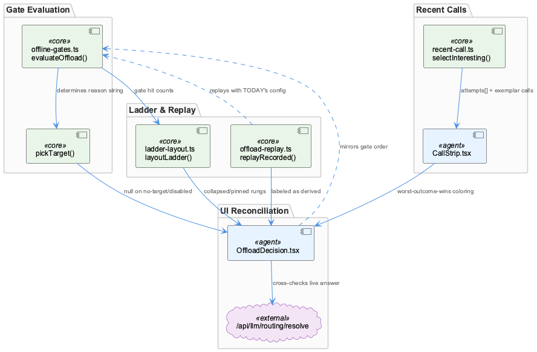
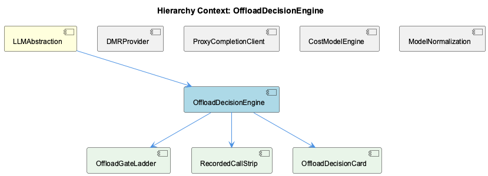

# OffloadDecisionEngine

**Type:** SubComponent

evaluateOffload() in offload-gates.ts reproduces the proxy's short-circuit gate order exactly (considered→route-allows→band→target→target-band→scope→transport→offloaded), because gate order determines which reason string is attributed to a call

# OffloadDecisionEngine — Technical Insight Document

## What It Is

OffloadDecisionEngine is the subsystem, living within the LLMAbstraction parent component, responsible for determining and explaining why a call was or wasn't offloaded, and for surfacing that logic transparently in the UI. Its core logic lives in `offload-gates.ts`, where `evaluateOffload()` and `pickTarget()` implement the decision rules, supported by `ladder-layout.ts` (`layoutLadder()`), `offload-replay.ts` (`replayRecorded()`), and `recent-call.ts` (`selectInteresting()`). Rather than being a standalone decision-maker, it functions as a faithful **mirror** of logic that actually lives in the proxy — its purpose is to reproduce, visualize, and audit that proxy-side behavior for developers and operators.

## Architecture and Design

The dominant architectural pattern here is **mirroring with verification**. `evaluateOffload()` in `offload-gates.ts` reproduces the proxy's short-circuit gate order exactly — considered → route-allows → band → target → target-band → scope → transport → offloaded — because gate evaluation order determines which reason string gets attributed to a call. This is a deliberate design constraint: any reordering would silently change user-facing explanations even if the final offload/no-offload outcome stayed the same.

Rather than trusting its own mirrored logic blindly, the system cross-checks itself against ground truth: `OffloadDecision.tsx` calls the proxy's live `/api/llm/routing/resolve` endpoint whenever the saved (non-draft) policy is active, and renders a destructive banner on any disagreement between local and live answers. This is a self-validating architecture — the mirror is useful for fast, offline-capable UI rendering, but the system acknowledges the risk of drift and actively detects it rather than assuming correctness.

The engine composes three children — OffloadGateLadder, RecordedCallStrip, and OffloadDecisionCard — each handling a distinct visualization concern (gate progression, historical call bins, and mode-switchable summary counts respectively), sharing the same underlying `GATES` array and `evaluateOffload()` logic.

## Implementation Details

The `GATES` const array (owned by child OffloadGateLadder) is the backbone data structure: it's a positionally-indexed array where the index of a gate literally *is* the rung number in the ladder visualization, and `RUNG_OFFLOADED` is a sentinel marking the successful outcome. Because index equals meaning, gate order in the array is load-bearing — it must match the proxy's short-circuit order exactly, not just conceptually align with it.

`pickTarget()` makes a deliberate lossy simplification: it collapses "no target declared" and "target declared but disabled" into a single null return, matching the proxy's `pickOffloadTarget()`, even though UI reason strings elsewhere distinguish the two cases. This is a conscious trade-off favoring parity with the proxy's actual behavior over UI expressiveness.

`layoutLadder()` in `ladder-layout.ts` manages visual density by collapsing runs of 2+ zero-hit gates into a single folded row — but it pins `RUNG_OFFLOADED` and any selected/active rung so the outcome and current focus are never hidden, even at zero count. This balances compactness against losing sight of what matters.

`offload-replay.ts`'s `replayRecorded()` explicitly labels its output as *derived*, not *observed* — it replays historical calls against today's config/policy rather than the config in force at call time, an important epistemic distinction encoded directly into the UI/data model to prevent misreading replayed results as historical fact.

`recent-call.ts`'s `selectInteresting()` filters recorded calls for relevance: it rejected a naive "has attempt_trail" heuristic (which retained 388/500 rows in a live sample — too permissive) in favor of requiring a real `attempts[]` entry, plus preserving one "newest ordinary call" exemplar per route so unremarkable baseline behavior remains visible alongside anomalies.

## Integration Points

OffloadDecisionEngine sits under LLMAbstraction alongside siblings DMRProvider, ProxyCompletionClient, CostModelEngine, and ModelNormalization, though its integration is most direct with the live proxy API (`/api/llm/routing/resolve`), which it uses for both `pickTarget()`/`evaluateOffload()` parity and live cross-checking in `OffloadDecision.tsx`. Internally, its three children consume shared primitives: OffloadGateLadder owns `GATES`, RecordedCallStrip (`CallStrip.tsx`) renders bins colored by worst-outcome-wins via a `SEVERITY` ranking defined in `recent-call.ts` (never averaged, so a single anomalous call is never diluted by surrounding ordinary ones), and OffloadDecisionCard toggles between "config" mode (counting routes via resolve calls) and "recorded" mode (counting from `recent`), while sharing `GATES`/`evaluateOffload()` across both and just swapping the unit word.

## Usage Guidelines

Developers modifying `offload-gates.ts` must preserve the exact gate ordering — considered→route-allows→band→target→target-band→scope→transport→offloaded — since it is copied deliberately from the proxy and any divergence corrupts reason-string attribution, not just outcomes. Any changes to the proxy's `pickOffloadTarget()` or short-circuit order must be mirrored here, and the live cross-check in `OffloadDecision.tsx` should be treated as the safety net — a triggered disagreement banner is a signal to fix the mirror, not silence the check. When adding fields to `GATES`, remember the index-as-rung-number convention used by OffloadGateLadder. When working with historical call data, respect the derived-vs-observed distinction from `replayRecorded()`, and when filtering "interesting" calls, follow the `attempts[]`-based approach over attempt_trail heuristics to avoid over-inclusion. Finally, prefer native controls (as CallStrip does with `<input type='range'>`) for accessibility parity with existing UI conventions elsewhere in the app.

## Hierarchy Context

### Parent
- [LLMAbstraction](./LLMAbstraction.md) -- [LLM] The mode-resolution logic in getLLMMode() (llm-mock-service.ts) establishes a clear precedence chain that new developers must understand before debugging unexpected LLM behavior: per-agent overrides in workflow-progress.json take precedence over a global mode setting, which in turn overrides a legacy mockLLM boolean flag, with 'public' as the ultimate fallback. This four-tier resolution means that a developer trying to force mock mode for testing might set the global mode but be silently overridden by a stale per-agent override left in workflow-progress.json from a previous run. The dual-checking of both llmState (new) and mockLLM (legacy) shapes in isMockLLMEnabled() and getLLMState() is a deliberate backward-compatibility shim, indicating the config schema evolved over time but old state files or tooling that only write the legacy flag must continue to work without breaking the mock system.

### Children
- [OffloadGateLadder](./OffloadGateLadder.md) -- GATES array in offload-gates.ts is a const array where 'Index into GATES: where this route stopped, or RUNG_OFFLOADED if it moved' — index IS the rung number, order must match the proxy's short-circuit order exactly.
- [RecordedCallStrip](./RecordedCallStrip.md) -- CallStrip uses a native <input type='range'> deliberately instead of a custom slider, per the comment citing free keyboard/touch/screen-reader semantics and consistency with the settings dialog's bare checkboxes.
- [OffloadDecisionCard](./OffloadDecisionCard.md) -- Component toggles between mode 'config' (counts routes via resolveKey/pooled requests to /api/llm/routing/resolve) and 'recorded' (counts calls from `recent`), sharing GATES/evaluateOffload but changing the unit word.

### Siblings
- [DMRProvider](./DMRProvider.md) -- DMRProvider (dmr-provider.ts) implements an OpenAI-compatible client interface so it can be substituted for remote providers without changing call sites
- [ProxyCompletionClient](./ProxyCompletionClient.md) -- llm-with-process.ts tags each completion request with a process identifier, which downstream shows up as CostRow.process in cost-model.ts
- [CostModelEngine](./CostModelEngine.md) -- priceForModel() implements a three-tier resolution: exact model key match, family-representative fallback via FAMILY_REPRESENTATIVE, then generic family match, defaulting to a zero-priced 'none' source
- [ModelNormalization](./ModelNormalization.md) -- Model identifiers normalized here feed directly into CostConfig.modelPrices keys consumed by priceForModel() in cost-model.ts

---

*Generated from 7 observations*
