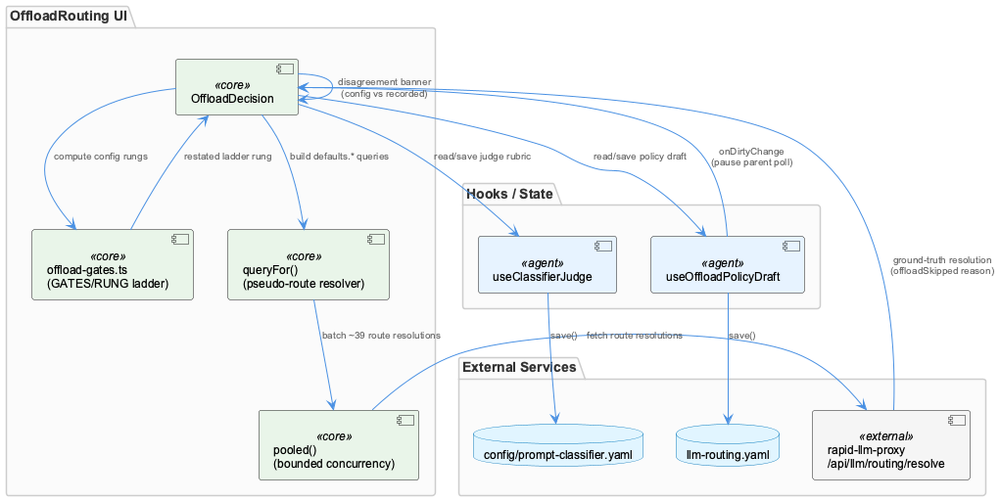
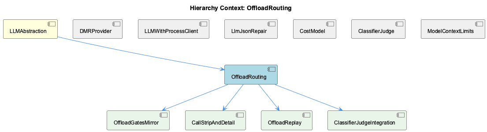

# OffloadRouting

**Type:** SubComponent

## What It Is

OffloadRouting is implemented in `integrations/system-health-dashboard/src/components/llm-routing/offload-decision.tsx`, centered on the `OffloadDecision` component. It is a dashboard subcomponent within the LLM routing UI that reconciles what an offload policy *declares* against what the rapid-llm-proxy actually *did* — a dual-mode analysis surface with 'Configuration' and 'Recorded' modes sharing one gate ladder (`GATES`, `RUNG_OFFLOADED`, imported from `./offload-gates`). As a child of LLMAbstraction, it sits alongside siblings like DMRProvider, LLMWithProcessClient, LlmJsonRepair, CostModel, and ClassifierJudge, but its specific concern is verifying offload decisions against ground truth rather than transport, pricing, or JSON repair.

## Architecture and Design

The component's defining pattern is config-vs-recorded reconciliation: one shared ladder/rung model rendered against two independently sourced counts — declared policy (route-counting) versus proxy-recorded outcomes (call-counting) — with disagreements surfaced as first-class UI state (a "destructive banner") rather than logged silently. The `configRungs` useMemo cross-checks the UI's own `evaluateOffload` computation against the proxy's independently resolved answer from `/api/llm/routing/resolve`, but explicitly only `!policy.dirty` — a deliberate non-comparison guard that declines to fabricate a comparison against stale server state when there's nothing valid to compare against.

State composition avoids a centralized store: `OffloadDecision` pulls from two independently-polled hooks — `useOffloadPolicyDraft` and `useClassifierJudge` — plus locally-resolved proxy responses, reconciling everything in memoized derived values. Parent/child coordination uses an `onDirtyChange` callback prop instead of shared state, deliberately keeping the polling-vs-editing race resolution in the parent tab that owns the fetch, directly implementing the poll/explicit-state contract established in the "LLM Mode Toggle" session record.

## Implementation Details

`queryFor()` resolves synthetic pseudo-routes ('defaults.fg-chat', 'defaults.background') via sentinel queries (`job=fg-chat`, `job=bg-__unrouted__`) engineered to match no real route key — a workaround forcing the proxy's fallback logic to reveal its class default since no direct "what is your default" endpoint exists. `pooled()` provides bounded-concurrency fan-out (width=8) for batching ~39 route-resolution fetches, trading latency for connection-count discipline against the local proxy service. The `CLASSIFIER_IMPLS` constant documents a historical rename ('http' → 'service') preserved for backward compatibility, an explicit case of UI naming driven by a diagnosed usability failure rather than refactor preference.

The component treats the proxy's `/api/llm/routing/resolve` response as ground truth and its local ladder (`offload-gates.ts`) as a restatement to be checked against it — a mirror relationship implemented by child OffloadGatesMirror, whose actual rung-mapping logic (`evaluateOffload`, `rungOfReason`, `describeTargets`, `jobClassOf`) lives outside the retrieved code and is visible only as import identifiers. Similarly, children CallStripAndDetail (via `./call-strip` and `./call-detail` imports and a `selectedCall` state slot) and OffloadReplay (via `replayRecorded`, `totalsByRoute` from `./offload-replay`) are consumed but not implemented within this component's own file.

## Integration Points

OffloadRouting depends on the rapid-llm-proxy's `/api/llm/routing/resolve` endpoint as its source of truth, and its disagreement logic is asserted in CI via `tests/agents/offload-gates-contract.test.mjs`. It composes ClassifierJudgeIntegration through the standalone `useClassifierJudge` hook (in `use-classifier-judge.ts`), which persists to `config/prompt-classifier.yaml` via `GET/PATCH /api/llm/classifier`, deliberately separate from the offload policy's `llm-routing.yaml` save cycle to avoid cross-contaminating unrelated saves. The `resolveError` state surfaces resolve-fetch failures but cannot distinguish proxy-layer stalls from provider-level failures, mirroring a diagnostic gap identified in the "CLI/UKB Run Timeout" session record. Note that adjacent files like `cost-model.ts`, `provider.tsx`, and `model-limits.cjs` are filename-proximate neighbors, not part of this component's implementation.

## Usage Guidelines

Developers should preserve the single-component-with-toggle design rather than splitting Configuration/Recorded into separate cards — the value is explicitly in diffing without re-reading structure. The dirty-guard on comparison logic must not be bypassed: never compare live UI computations against stale server state when `policy.dirty` is true. Hook separation (`useOffloadPolicyDraft` vs `useClassifierJudge`) should be maintained to keep save() blast radius aligned with backing file boundaries — do not merge them. When modifying pooled fetch concurrency or sentinel query keys, preserve the documented rationale (connection-count discipline, fallback-branch forcing) rather than treating them as arbitrary constants.

## Work Record

What working sessions recorded about this entity — decisions taken, problems hit, and why things are the way they are:

- The 'LLM Mode Toggle — Poll/Explicit State Handling' work record establishes that operator-initiated explicit overrides must survive background polling without being clobbered; offload-decision.tsx implements this exact contract via its onDirtyChange prop, which tells the parent tab to skip its own config-refetch poll while the OffloadDecision card holds an unsaved policy edit (policy.dirty), since a poll mid-edit would swap the routes/providers the card is computing its preview against.
- The 'CLI/UKB Run Timeout and Provider Error Diagnostics' work record establishes that reported ~15-second CLI timeouts required distinguishing rapid-llm-proxy-layer timeouts from provider-specific failures further down the call chain, with the proxy itself ruled out via log evidence — directly relevant to offload-decision.tsx's own resolve fetches against /api/llm/routing/resolve, which surface a resolveError state but have no code-level way to distinguish a proxy-layer stall from a provider-level one, matching the diagnostic gap the session record describes.

## Hierarchy Context

### Parent
- [LLMAbstraction](./LLMAbstraction.md) -- [SESSION] The 'LLM Model Catalogue — Endpoint-Gated Access Rules' record establishes that the model catalogue must track which API surface (Responses API vs /chat/completions) gates access to specific models, so valid models are not erroneously removed nor invalid endpoint combinations silently allowed

### Children
- [OffloadGatesMirror](./OffloadGatesMirror.md) -- [LLM] The code supplied for this analysis does not contain `offload-gates.ts`, the file that offload-decision.tsx's own header comment names as the thing being mirrored ('`offload-gates.ts` restates the proxy's offload block, and a restatement drifts'). Everything nameable about the mirror — `GATES`, `RUNG_OFFLOADED`, `evaluateOffload`, `rungOfReason`, `describeTargets`, `jobClassOf` — is visible only as import identifiers and as prose in offload-decision.tsx:34-38, never as the implementation that decides what a rung means or how a route entry maps to one.
- [CallStripAndDetail](./CallStripAndDetail.md) -- [LLM] The requested component "CallStripAndDetail" is not present in any supplied code file. offload-decision.tsx imports `CallStrip, stripRows` from './call-strip' and `CallDetail` from './call-detail' (visible in the import block near the top of offload-decision.tsx), and it maintains a `selectedCall` state slot (`useState<number | null>`) that is clearly meant to link a strip selection to a detail view, but neither call-strip.tsx nor call-detail.tsx — nor any combined CallStripAndDetail file — was included in the code files given here. Everything below is therefore inferred from the consuming component's usage, not read from the component's own implementation.
- [OffloadReplay](./OffloadReplay.md) -- [LLM] The 'OffloadReplay' component/module is never defined in the supplied code files — it is only visible as an import site: offload-decision.tsx pulls `replayRecorded` and `totalsByRoute` from `./offload-replay` (a relative path implying a sibling file `offload-replay.ts`/`.tsx` that was not retrieved). Everything below is therefore inferred from the CALLER's usage contract, not from the component's own implementation, which is precisely the evidence gap this analysis is required to flag.
- [ClassifierJudgeIntegration](./ClassifierJudgeIntegration.md) -- [LLM] use-classifier-judge.ts is deliberately a standalone hook (useClassifierJudge, exported from this file) rather than folded into the offload policy draft hook, and the header comment states the reason explicitly: the two render in one card but persist to different files on different machines' schedules — the offload policy lives in rapid-llm-proxy's llm-routing.yaml while the judge's backends and rubric live in this repo's config/prompt-classifier.yaml. The comment frames the risk concretely: a single combined save() would let a rubric typo roll back an unrelated offload toggle, or let a rejected band refuse an otherwise-valid rubric edit. This mirrors the sibling hook relationship the parent OffloadDecision component documents for useOffloadPolicyDraft, but the actual separation logic — GET /api/llm/classifier and PATCH /api/llm/classifier as an independent fetch/save cycle — lives entirely in this file.

### Siblings
- [DMRProvider](./DMRProvider.md) -- [SESSION] LLM Model Catalogue — Endpoint-Gated Access Rules establishes that the catalogue must track which API surface (Responses API vs /chat/completions) gates access to specific models, so DMRProvider-style entries are not erroneously removed nor invalid endpoint combinations silently allowed.
- [LLMWithProcessClient](./LLMWithProcessClient.md) -- [SESSION] LLM CLI Proxy — Provider Architecture and Restart Behavior notes proxy-bridge/server.mjs routes calls through a tiered provider fallback chain with network-mode-aware routing, which this client depends on as its transport layer.
- [LlmJsonRepair](./LlmJsonRepair.md) -- [SESSION] RapidLlmProxy — Universal Agent Routing, Worker Pool, Semantic Dispatch, and Health record ties this utility to rapid-llm-proxy's client-side glue that must stay in sync with proxy-side response changes.
- [CostModel](./CostModel.md) -- [LLM] cost-model.ts implements priceForModel() with a three-tier resolution order — exact model key, then fast-mode suffix stripping via FAST_MODE_MULTIPLIER, then family fallback via modelFamily()/FAMILY_REPRESENTATIVE — and explicitly documents that a missing fast-mode twin would silently fall through to family pricing at the standard rate with priced:true and no warning, which is why the multiplier rule exists as a computed relationship rather than hand-maintained duplicate rows.
- [ClassifierJudge](./ClassifierJudge.md) -- [SESSION] LLM Mode Toggle — Poll/Explicit State Handling establishes that explicit operator-set flags must not be clobbered by background polling — the same operator-edit-vs-poll conflict this hook's dirty/draft state design addresses.
- [ModelContextLimits](./ModelContextLimits.md) -- [LLM] lib/statusline/model-limits.cjs:deriveLimits() is the core translation from opencode's raw models.dev catalogue (~4.5MB/213 providers) into two flat lookup maps: `byPair` (exact `provider/model` → context size) and `byModel` (a single best-guess size per model id, for when the caller's provider is a custom one like a user's `rapid-proxy` entry that doesn't appear in the public catalogue). The `byModel` resolution first tries FALLBACK_PROVIDERS in order (`github-copilot`, `anthropic`, `openai`, `<COMPANY_NAME_REDACTED>` — i.e. 'who actually serves these ids for us'), and only falls back further to a vote-counted modal value across all providers offering that id, with ties broken toward the LARGER window specifically to avoid under-reporting occupancy and false-triggering a red 'about to compact' state on insufficient evidence.

---

*Generated from 11 observations*
