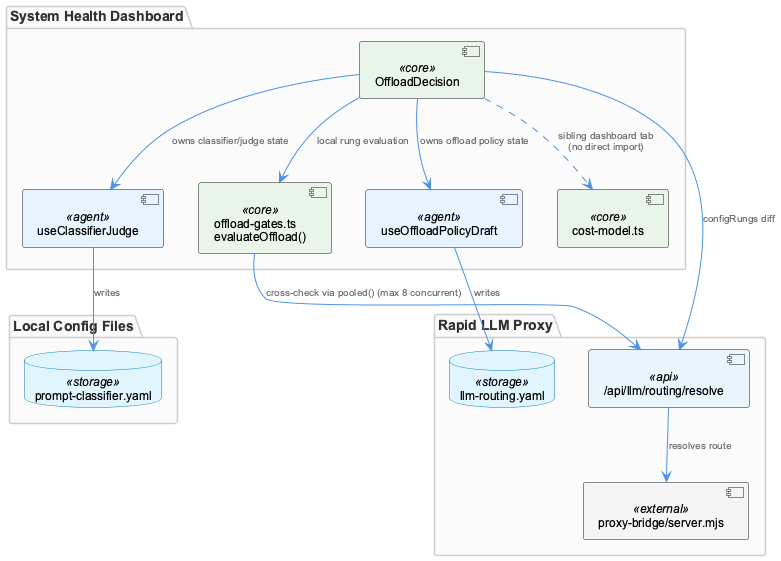
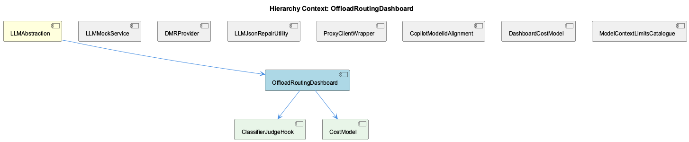

# OffloadRoutingDashboard

**Type:** SubComponent

## What It Is

No file in the supplied set defines a component literally named "OffloadRoutingDashboard." The observations converge strongly on `OffloadDecision`, implemented at `integrations/system-health-dashboard/src/components/llm-routing/offload-decision.tsx`, as the actual code artifact behind this SubComponent identifier — it is a dashboard card that toggles between 'config' and 'recorded' modes, renders a gate ladder (`GATES`, `RUNG_OFFLOADED`), and surfaces disagreements between the UI's own policy evaluation and the proxy's live resolution. Every claim below is grounded in that inferred correspondence rather than a direct name match, and should be read accordingly — this is the closest thematic and functional match, not a confirmed line-level hit.

## Architecture and Design

The component sits under LLMAbstraction in the hierarchy and is built on a deliberate separation-of-state principle: rather than one unified dashboard store, `offload-decision.tsx` composes two independently-persisted hooks — `useOffloadPolicyDraft(proxyBase, onSaved)` for offload policy (bands, providers, offload rules) and `useClassifierJudge(proxyBase)`, realized as the child ClassifierJudgeHook, for classifier/judge state (backends, rubric, strategy). The `use-classifier-judge.ts` header comment explains this split exists because the two halves write different files on different machines' schedules (`llm-routing.yaml` in rapid-llm-proxy versus this repo's `config/prompt-classifier.yaml`), bounding the blast radius of any single save.

A second defining pattern is verification-over-trust: `offload-gates.ts`'s `evaluateOffload()` restates the proxy's offload logic locally for instant UI feedback, but the `configRungs` useMemo in `offload-decision.tsx` cross-checks every route's locally-computed rung against a live `/api/llm/routing/resolve` call, using `pooled()` to bound concurrency to 8 requests across up to ~39 routes. Mismatches populate a `disagreements` array meant for a "destructive banner," and this same invariant is enforced in CI via `tests/agents/offload-gates-contract.test.mjs` — a mirror-checked-against-source pattern rather than blind trust in client restatement.

## Implementation Details

The mode toggle ('config' vs 'recorded') shares one rung/ladder geometry across two data sources, so the UI presentation logic doesn't fork per mode even though the underlying data does. `configRungs` is the central derived-state computation: it fans out pooled resolve calls, compares each against the local `evaluateOffload()` output, and only triggers expensive recomputation (`replay`) when a genuine counterfactual exists — an optional/derived-state gating decision that avoids redundant work. Dirty-state is propagated upward via an `onDirtyChange` callback, letting a sibling tab-level poll avoid clobbering an in-progress edit — a concrete cross-component coordination mechanism visible in the code.

The child ClassifierJudgeHook (`use-classifier-judge.ts`) fetches `GET ${proxyBase}/api/llm/classifier`, unwraps `d.judge`, and merges it with default `knn` sub-fields spread first, so a partial payload from an older proxy still yields a well-formed `Judge` object instead of undefined sub-properties — a defensive-merge pattern for API/version skew.

## Integration Points

The dashboard's `/api/llm/routing/resolve` calls depend on `proxy-bridge/server.mjs`, which implements the tiered, network-mode-aware provider fallback chain and runs as the persistent launchd service `com.coding.llm-cli-proxy`, independent of any terminal session. This means `resolveError` state and stale/failed resolutions in the UI can originate from that external service being down or restarting, not from a bug in the React layer.

The band and provider resolution logic (`d.route?.complexity`, `d.route?.provider`) reads from backend routing/banding policy that ensures requests only reach models with verified capability support, so the proxy's resolved band is treated as authoritative over any locally-stored route entry for `from-caller` routes. Within its own subtree, OffloadRoutingDashboard contains ClassifierJudgeHook (classifier/judge state) and CostModel — the latter, per its own observations, is a deliberately React-free pure-function module (`budgetForMonth`, `priceForModel`, `cellCostUsd`, `monthlySeries`, `isSynthetic`) kept separate from the llm-routing component tree despite serving a related dashboard tab. Sibling components at the LLMAbstraction level (DMRProvider, LLMJsonRepairUtility, ProxyClientWrapper, LLMMockService, CopilotModelIdAlignment, ModelContextLimitsCatalogue) show no direct code linkage in the supplied files — several of their own observation sets explicitly note the same filename-substring retrieval problem affecting this document.

## Usage Guidelines

Developers extending this area should preserve the two-hook separation rather than merging offload policy and classifier/judge state into one object — the split exists specifically to prevent an unrelated rubric edit from rolling back an offload toggle across two files with independent save schedules. Any change to `evaluateOffload()`'s local gate logic must stay consistent with the proxy's actual resolution behavior, since the contract test (`tests/agents/offload-gates-contract.test.mjs`) will fail on divergence — this is an intentional guardrail, not incidental coverage. Given the acknowledged uncertainty in retrieval (no literal `OffloadRoutingDashboard` symbol found), future work should treat `offload-decision.tsx` as the working implementation target but verify the actual export name before making structural claims in code or documentation.

## Work Record

What working sessions recorded about this entity — decisions taken, problems hit, and why things are the way they are:

- The work record 'LLM CLI Proxy — Provider Architecture and Restart Behavior' establishes that `proxy-bridge/server.mjs` implements the tiered, network-mode-aware provider fallback chain that `offload-decision.tsx`'s `/api/llm/routing/resolve` calls are querying, and that this proxy runs as the persistent launchd service `com.coding.llm-cli-proxy` independent of any terminal session. This means the dashboard's `resolveError` state and any stale/failed resolution in the UI can originate from that external service being down or mid-restart, not from a bug in the React code itself.
- The work record 'Rapid LLM Proxy Routing' establishes that model routing and banding allocations are managed to ensure requests only reach models with verified support for required capabilities — this is the backend policy that `offload-decision.tsx`'s band resolution (`d.route?.complexity`) and provider resolution (`d.route?.provider`) are reading, explaining why the component treats the proxy's resolved band as authoritative over any locally-stored route entry for `from-caller` routes.

## Hierarchy Context

### Parent
- [LLMAbstraction](./LLMAbstraction.md) -- [SESSION] 'LLM Model Catalogue — Endpoint-Gated Access Rules' establishes that the model catalogue must track which models are accessible via which API surface (Responses API vs /chat/completions), since some models are gated per-endpoint and mismatched combinations must be rejected rather than silently allowed

### Children
- [ClassifierJudgeHook](./ClassifierJudgeHook.md) -- [LLM] The component named "ClassifierJudgeHook" is concretely implemented as `useClassifierJudge(proxyBase, pollMs = 30_000)` in `integrations/system-health-dashboard/src/components/llm-routing/use-classifier-judge.ts`. It fetches `GET ${proxyBase}/api/llm/classifier`, unwraps `d.judge`, and merges it into local state with default `knn` sub-fields spread first so a partial payload from an older proxy still produces a well-formed `Judge` object rather than `undefined` sub-properties. This is a genuine implementation match, not a thematic neighbor — the file's own header comment explicitly frames it as 'the judge — who decides how hard a request is, and whether they are answering,' which is exactly the ClassifierJudgeHook responsibility.
- [CostModel](./CostModel.md) -- [LLM] `cost-model.ts` (integrations/system-health-dashboard/src/components/cost/cost-model.ts) is the actual CostModel implementation, and it is deliberately React-free — every export (`budgetForMonth`, `priceForModel`, `cellCostUsd`, `monthlySeries`, `isSynthetic`) is a pure function over plain data (`CostRow`, `CostConfig`, `BudgetConfig`). This is a pattern seen nowhere else in the supplied set: `offload-decision.tsx` and `use-classifier-judge.ts` both mix fetch/useState/useEffect directly into their domain logic, while cost-model.ts pushes all of that (the `GET /api/token-usage/cost` and `GET /api/llm/settings` calls) to an unseen caller, keeping pricing math independently testable and reusable outside React.

### Siblings
- [LLMMockService](./LLMMockService.md) -- [SESSION] 'PlantUML Source Files (.puml) Versioning Policy' work record is filed under LLMMockService, indicating the component's manifest also absorbs unrelated documentation-versioning decisions rather than only LLM mode state.
- [DMRProvider](./DMRProvider.md) -- [LLM] None of the five retrieved files implement, import, or reference DMRProvider, dmrClient, checkDMRAvailability, or Docker Model Runner in any form. The files returned for this component — tests/features/copilot-model-ids.test.mjs, integrations/system-health-dashboard/src/components/cost/cost-model.ts, .../llm-routing/offload-decision.tsx, .../llm-routing/use-classifier-judge.ts, and .../store/provider.tsx — belong to the rapid-llm-proxy routing/cost dashboard and its Redux shell, a different subsystem from the local Docker Model Runner inference tier the parent SubComponent description attributes to dmr-provider.ts. This is a filename-substring retrieval miss ('provider', 'model') rather than evidence that DMRProvider was folded into these files.
- [LLMJsonRepairUtility](./LLMJsonRepairUtility.md) -- [LLM] None of the retrieved code files implement or reference an 'LLMJsonRepairUtility' component. The five files supplied — tests/features/copilot-model-ids.test.mjs, integrations/system-health-dashboard/src/components/cost/cost-model.ts, integrations/system-health-dashboard/src/components/llm-routing/offload-decision.tsx, integrations/system-health-dashboard/src/components/llm-routing/use-classifier-judge.ts, and integrations/system-health-dashboard/src/store/provider.tsx — cover copilot model-id drift testing, cost/budget arithmetic, offload routing UI, classifier-judge health state, and a Redux provider wrapper respectively. None contains string-repair, control-character-escaping, or truncation logic. The only description of JSON-repair behaviour (escapeControlCharsInStrings, truncateToLastCompleteElement in parse-llm-json.ts) comes from the parent entity's own observations, not from any file body shown here, so it cannot be re-grounded as evidence for this SubComponent.
- [ProxyClientWrapper](./ProxyClientWrapper.md) -- [LLM] None of the retrieved files define or import a class, module, or export named `ProxyClientWrapper`. The five files present — `tests/features/copilot-model-ids.test.mjs`, `integrations/system-health-dashboard/src/components/cost/cost-model.ts`, `integrations/system-health-dashboard/src/components/llm-routing/offload-decision.tsx`, `integrations/system-health-dashboard/src/components/llm-routing/use-classifier-judge.ts`, and `integrations/system-health-dashboard/src/store/provider.tsx` — are dashboard-side consumers and test guards that read from or configure `rapid-llm-proxy` over HTTP; none of them wrap or instantiate a proxy HTTP client themselves. This looks like filename-substring retrieval surfacing the parent's ('LLMServiceProvider'/'LLMProxyClient') general neighbourhood rather than the `ProxyClientWrapper` SubComponent's own implementation file.
- [CopilotModelIdAlignment](./CopilotModelIdAlignment.md) -- [SESSION] 'LLM Model Catalogue — Endpoint-Gated Access Rules' establishes that mismatched model/endpoint combinations must be rejected rather than silently allowed, which is the same failure class this alignment script guards against for retired Copilot ids.
- [DashboardCostModel](./DashboardCostModel.md) -- [LLM] `integrations/system-health-dashboard/src/components/cost/cost-model.ts` defines `BudgetConfig` with both a standing `monthlyEur` cap and an optional `monthlyEurByMonth` override map, and `budgetForMonth()` resolves a given month by checking the override map first (via `Object.prototype.hasOwnProperty.call`, so an explicit `null` entry is honoured as 'no cap that month' rather than falling through). The `DEFAULT_COST_CONFIG.budgets.copilot` entry encodes a concrete case of this: `monthlyEur: 300` with `monthlyEurByMonth: { '2026-08': 1000 }`, documented in the interface comment as the record of a cap that moved 300→600→1000 across August 2026 as extensions were approved — the design exists specifically so a single editable number doesn't retroactively re-judge past months against a budget cap they never had.
- [ModelContextLimitsCatalogue](./ModelContextLimitsCatalogue.md) -- [LLM] None of the five retrieved files implement or reference a model-context-limits catalogue (i.e. per-model max-token/context-window bookkeeping). tests/features/copilot-model-ids.test.mjs guards against retired Copilot model IDs causing 400s, integrations/system-health-dashboard/src/components/cost/cost-model.ts prices tokens already consumed, offload-decision.tsx and use-classifier-judge.ts route/classify calls by complexity band, and store/provider.tsx is a generic Redux bootstrap component unrelated to LLM models at all. No file defines a context-window ceiling, a 'maxTokens'/'contextLimit' field, or per-model capacity table that a 'ModelContextLimitsCatalogue' component would own.

---

*Generated from 10 observations*
