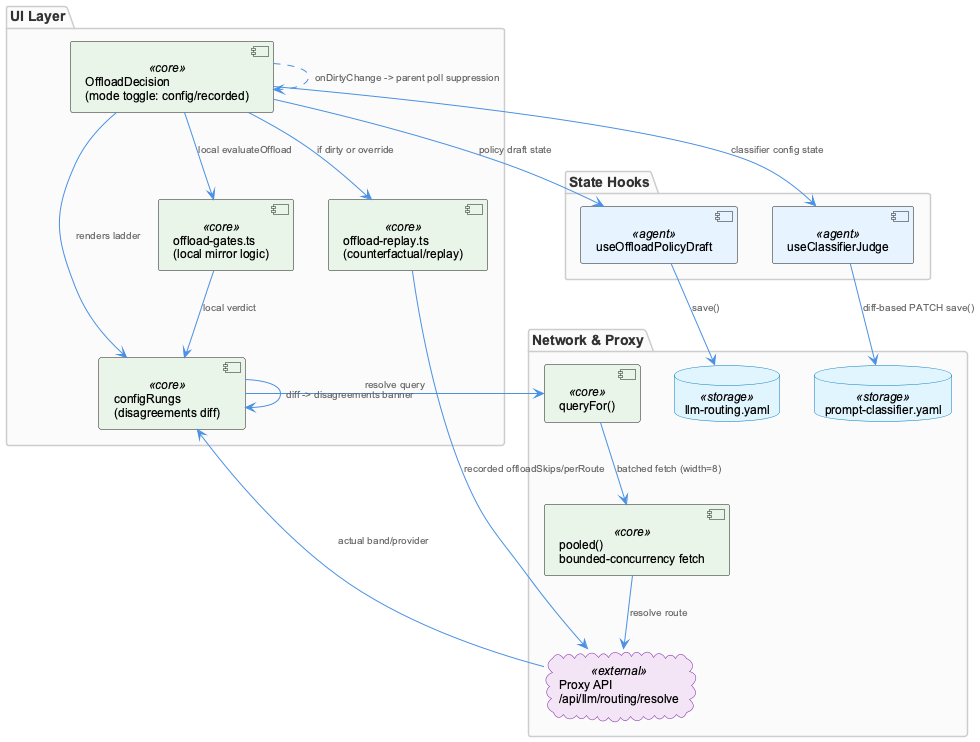
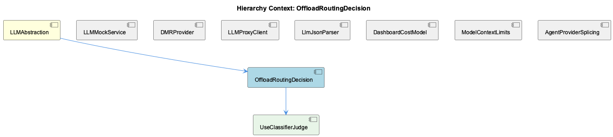

# OffloadRoutingDecision

**Type:** SubComponent

[Code References] integrations/system-health-dashboard/src/components/llm-routing/offload-decision.tsx - OffloadDecision component, mode toggle and configRungs/disagreements logic; integrations/system-health-dashboard/src/components/llm-routing/offload-decision.tsx - pooled() bounded-concurrency fetch helper; integrations/system-health-dashboard/src/components/llm-routing/offload-decision.tsx - queryFor() route-key to resolve-query mapping; integrations/system-health-dashboard/src/components/llm-routing/use-classifier-judge.ts - useClassifierJudge hook, JudgeBackend.enabled vs reachable distinction; integrations/system-health-dashboard/src/components/llm-routing/use-classifier-judge.ts - save() diff-based PATCH construction; integrations/system-health-dashboard/src/components/llm-routing/offload-decision.tsx - onDirtyChange effect reporting draft state to parent

# OffloadRoutingDecision — Technical Insight Document

## What It Is

OffloadRoutingDecision is the operator-facing control-plane component for LLM offload routing, implemented primarily in `integrations/system-health-dashboard/src/components/llm-routing/offload-decision.tsx`, with its configuration-state management delegated to a child hook, `UseClassifierJudge` (`use-classifier-judge.ts`). As a SubComponent of the parent `LLMAbstraction` domain, it sits alongside siblings like `LLMProxyClient`, `LLMMockService`, `DMRProvider`, `LlmJsonParser`, and `DashboardCostModel` in the system-health dashboard's LLM routing surface. Functionally, it renders a dual-mode "GATES/rung" ladder UI that answers two related but distinct questions: in `config` mode, "what will happen" to a route under the current policy; in `recorded` mode, "what did happen" to actual proxy calls. Both modes share the same visual geometry deliberately, so operators can toggle between intent and observed behavior without re-orienting to a new layout.

## Architecture and Design

The component's defining architectural trait is a **mirror-and-verify (shadow validation) pattern**: `offload-gates.ts` locally re-implements the proxy's offload decision logic (`evaluateOffload`) for instant preview, but every route resolution is also independently confirmed against the live proxy via `/api/llm/routing/resolve` (constructed by `queryFor()` and dispatched through the bounded-concurrency `pooled()` helper). `configRungs` diffs the local verdict against the proxy's authoritative band/provider/offloadSkipped fields, surfacing mismatches as a `disagreements` array rendered in a destructive banner — but only when `policy.dirty` is false, since an unsaved draft has no ground truth to compare against yet.

State ownership is deliberately split across two independent, file-scoped hooks — `useOffloadPolicyDraft` (backing the proxy-side `llm-routing.yaml`) and `useClassifierJudge` (backing local `config/prompt-classifier.yaml`) — rather than a unified settings hook. This is an explicit design decision to keep unrelated save paths (a rubric edit vs. an offload band toggle) from interfering with each other, even though both render inside a single card. This hook-per-resource isolation is echoed structurally in the child relationship to `UseClassifierJudge`.

Cross-component coordination uses inversion of control: rather than suppressing the parent tab's polling internally, OffloadDecision reports dirty state upward via the `onDirtyChange` callback prop and a `useEffect`, letting the parent decide whether to pause its own config-fetching poll. This keeps the side-effect-prone logic at the layer that owns it.

## Implementation Details

The `pooled()` async helper caps concurrent fetches at width=8 against up to 39 route entries, preventing socket bursts against the proxy's resolve endpoint — a concrete scalability guard. `resolveKey` memoization avoids redundant refetching, recomputing only when route/provider/complexity/offload identity or `policy.network` changes; it explicitly excludes `hours`, since traffic-window changes affect displayed counts but never routing destinations.

Counterfactual/replay computation (`replayRecorded`, `totalsByRoute` from `offload-replay.ts`) is lazily gated: it only runs when the operator is exploring a hypothetical — an unsaved draft or an explicit network override diverging from the live network — otherwise the proxy's recorded `offloadSkips`/`perRoute` data serves as ground truth without redundant reconstruction.

The child hook `useClassifierJudge` distinguishes `JudgeBackend.enabled` (config truth) from `reachable` (runtime truth), a distinction directly motivated by a documented 2026-09-02 postmortem in which a silently dead backend stayed marked "enabled" for a day. Its `save()` method sends a diff-based PATCH — only backends whose `draftEnabled` differs from `judge.enabled`, plus changed rubric/strategy — minimizing the blast radius of concurrent edits.

## Integration Points

OffloadRoutingDecision sits above the data-plane transport layer represented by sibling `LLMProxyClient` (`llm-with-process.ts`): neither `offload-decision.tsx` nor `use-classifier-judge.ts` issues LLM completions directly; both call GET/PATCH against the proxy's HTTP surface (`/api/llm/routing/resolve`, `/api/llm/classifier`) to inspect and edit the policy governing how the transport layer dispatches requests. This creates a clean control-plane/data-plane split, but requires both sides to independently agree on wire semantics — hence the extensive local-vs-proxy disagreement checking.

It shares the config-vs-runtime distinction pattern with sibling `LLMMockService`'s `getLLMMode()` three-tier precedence (perAgentOverrides → globalMode → legacy `progress.mockLLM`), both addressing the same class of ambiguity: collapsing distinct signals into one boolean. It contrasts sharply with sibling `DashboardCostModel`'s `cost-model.ts`, which is pure, hook-free, I/O-free logic — the antithesis of OffloadDecision's fetch-and-poll-heavy component design.

## Usage Guidelines

Developers should treat the `config`/`recorded` mode toggle as a single component intentionally, not split it — the shared ladder geometry is a deliberate UX contract. Disagreement banners should only be trusted/displayed when `policy.dirty` is false. When extending route resolution, preserve the `pooled` concurrency cap and the `resolveKey` exclusion of `hours` to avoid performance regressions. Any new config fields should follow the `enabled`/`reachable` split precedent rather than collapsing state into a single flag, and saves should remain diff-based PATCHes rather than full-file rewrites. Finally, side-effect suppression (like polling pauses) belongs in the owning parent via callback props, not embedded reactively inside this subcomponent.

## Hierarchy Context

### Parent
- [LLMAbstraction](./LLMAbstraction.md) -- [LLM] The mock/local/public mode toggle system in llm-mock-service.ts is designed around a persisted state file (.data/workflow-progress.json) rather than environment variables, which allows runtime mode switching without process restarts. The LLMState structure with globalMode and perAgentOverrides fields enables fine-grained control where a specific agent can be forced into mock mode for testing while the rest of the system runs against real providers. This is critical for integration testing scenarios where a developer wants to validate one agent's prompt-handling logic without incurring API costs or non-determinism from the LLM calls of other agents in a multi-agent pipeline. The getLLMMode() read path checks perAgentOverrides first, then falls back to globalMode, and finally to the legacy progress.mockLLM boolean, establishing a three-tier precedence resolution that any new developer must understand before assuming a single toggle controls behavior.

### Children
- [UseClassifierJudge](./UseClassifierJudge.md) -- [CGR] useClassifierJudge (function) in use-classifier-judge.ts

### Siblings
- [LLMMockService](./LLMMockService.md) -- [LLM] The `use-classifier-judge.ts` hook (integrations/system-health-dashboard/src/components/llm-routing/use-classifier-judge.ts) implements the same config-vs-runtime split described for LLMMockService's `getLLMMode()` precedence chain, but for the offload judge rather than the mock toggle: `JudgeBackend.enabled` is what the YAML file says, while `JudgeBackend.reachable` is whether it actually answered on the last poll. The header comment documents a real incident (2026-09-02) where `enabled: true` masked a dead backend for about a day because nothing distinguished 'switched off' from 'not answering' — the exact class of ambiguity that `getLLMMode()`'s three-tier precedence (perAgentOverrides → globalMode → legacy progress.mockLLM) is designed to avoid by making precedence explicit rather than collapsing multiple signals into one boolean.
- [DMRProvider](./DMRProvider.md) -- [LLM] The DMR provider in dmr-provider.ts is deliberately built as a thin OpenAI-shape adapter rather than a bespoke client — it targets `http://${DMR_HOST}:${DMR_PORT}/engines/v1` but reuses the same request/response contract as the OpenAI SDK integration. This is a 'protocol reuse' strategy: instead of writing DMR-specific request builders, response parsers, and error mappers, the team accepts that Docker Model Runner exposes an OpenAI-compatible surface and piggybacks on existing code paths. The trade-off is that any DMR-specific quirks (different error codes, different streaming semantics, different rate-limit headers) would have to be shimmed into the OpenAI shape rather than handled natively, which could become a leaky abstraction if DMR's compatibility layer ever diverges meaningfully from the OpenAI spec it's mimicking.
- [LLMProxyClient](./LLMProxyClient.md) -- [LLM] The parent context establishes that llm-with-process.ts is a deliberate fetch-based bypass around the SDK's LLMService.complete(), built specifically to inject the 'process' telemetry tag the rapid-llm-proxy's /api/complete endpoint requires, with resolveProxyCompleteUrl() implementing a layered precedence (RAPID_LLM_PROXY_URL → LLM_CLI_PROXY_URL → LLM_PROXY_URL → localhost default). This is the LLMProxyClient's actual transport layer, and the dashboard code surveyed here (offload-decision.tsx, use-classifier-judge.ts) is the operator-facing control plane that sits ABOVE that transport: neither file makes an LLM completion call itself, they instead call GET/PATCH against the proxy's HTTP surface (/api/llm/routing/resolve, /api/llm/classifier) to inspect and edit the routing policy that governs how llm-with-process.ts's requests get dispatched. This is a clean separation between the data-plane client (proxy-bridge, llm-with-process.ts) and the control-plane client (this dashboard code), but it also means the two must agree on wire semantics independently — evidenced by the extensive commentary in offload-decision.tsx about the proxy's resolved answers being compared against the dashboard's own ladder logic rather than trusted.
- [LlmJsonParser](./LlmJsonParser.md) -- [LLM] parse-llm-json.ts's core value proposition is that it treats malformed JSON-mode output as a two-orthogonal-failure-mode problem rather than one generic 'try/catch and give up' problem. escapeControlCharsInStrings() targets corruption caused by raw control characters (e.g. literal newlines or tabs) embedded inside string literals — a byte-level defect that a naive JSON.parse() cannot tolerate — while truncateToLastCompleteElement() targets a structural defect: the provider hit its output-token ceiling mid-object/mid-array. Because these are independent failure modes with independent signatures, running them as a fixed two-stage pipeline rather than a single heuristic means each stage can be reasoned about, tested, and evolved in isolation, and a malformed-but-complete response only pays the cost of the first stage.
- [DashboardCostModel](./DashboardCostModel.md) -- [LLM] cost-model.ts is deliberately framed as "pure cost/budget logic... No React here" — every exported function (budgetForMonth, priceForModel, cellCostUsd, monthlySeries) is a pure function of CostRow[]/CostConfig inputs with no hooks, fetch calls, or component state. This is a sharp architectural boundary against sibling files like use-classifier-judge.ts and offload-decision.tsx, which interleave data-fetching, polling, and dirty-state tracking directly inside hooks and components. The payoff is testability (pure functions can be unit-tested without a DOM or mock fetch) and the ability to reuse the same pricing math in both the live dashboard tab and, presumably, offline reporting scripts — at the cost of pushing all I/O (GET /api/token-usage/cost, GET /api/llm/settings) to callers this file doesn't show.
- [ModelContextLimits](./ModelContextLimits.md) -- [LLM] The module in lib/statusline/model-limits.cjs implements a two-tier caching strategy specifically because it runs in a fresh process every 5 seconds per status-line pane (documented in the file's header comment). The in-process memo (`_memo`, `_userMemo`) only helps within a single tick's multiple calls to catalogueContextWindow(); the real cross-tick optimization is the on-disk derived cache at catalogueCachePath() (.logs/model-context-limits.json), which avoids re-parsing opencode's 4.5MB/213-provider models.json (a documented 33ms cost) on every single tick across every open pane. This is a deliberate departure from typical in-memory caching because the process boundary itself defeats memoization.
- [AgentProviderSplicing](./AgentProviderSplicing.md) -- [LLM] The cost-model.ts module in the dashboard's cost tab implements a layered price-resolution strategy in priceForModel(): exact model key match, then fast-mode suffix stripping with a 2x multiplier via scalePrice(), then family-based fallback through FAMILY_REPRESENTATIVE. This mirrors the same 'tiered precedence resolution' philosophy seen elsewhere in the LLM subsystem (e.g. getLLMMode()'s three-tier fallback), suggesting a project-wide convention of building explicit precedence chains rather than single flat lookups whenever provider/model identity is ambiguous or evolving.

---

*Generated from 10 observations*
