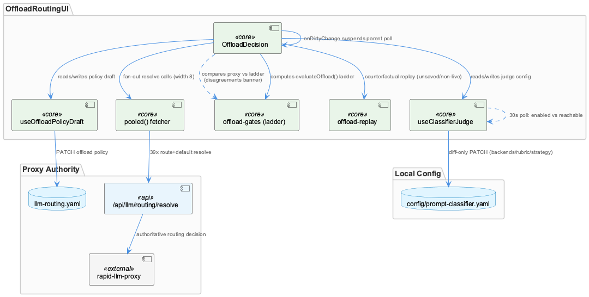
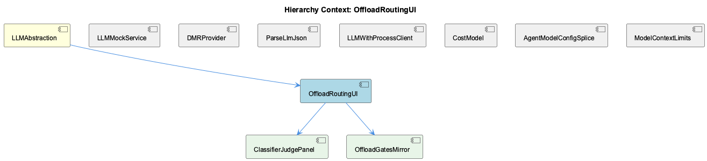

# OffloadRoutingUI

**Type:** SubComponent

## What It Is

OffloadRoutingUI is implemented primarily as `integrations/system-health-dashboard/src/components/llm-routing/offload-decision.tsx`, exporting the `OffloadDecision` component. Its own header comment frames its purpose plainly: "Does the offload move this call?" It provides a dual-mode view — `'config'` (counting ROUTES, answering "what will happen") and `'recorded'` (counting CALLS, answering "what did") — sharing one gate ladder so toggling the mode diffs intent against observed behaviour without switching layouts. Supporting logic lives in `use-classifier-judge.ts` (the `useClassifierJudge` hook) and `offload-gates.ts` (child entity OffloadGatesMirror), with `ClassifierJudgePanel` most plausibly corresponding to the judge-rendering fragment built around `useClassifierJudge` and the `showRubric` toggle, though no file literally carries that name.

As a SubComponent, it sits under LLMAbstraction, alongside siblings like LLMWithProcessClient, CostModel, and DMRProvider, and its behavior is directly bound to the routing-tier discipline (max-subscription → work/GH Copilot → Groq Llama-70B) that LLMAbstraction mandates.

## Architecture and Design

The defining pattern is client-side restatement cross-checked against authoritative service truth. `offload-gates.ts` (OffloadGatesMirror) restates rapid-llm-proxy's offload gate ladder locally — its own comment warns "a restatement drifts" — so `OffloadDecision`'s `configRungs` useMemo reconciles that local `evaluateOffload()` verdict against a live call to `${proxyBase}/api/llm/routing/resolve` for every route+default entry, surfacing any mismatch (differing `offloadSkipped` rung via `rungOfReason()`, or differing `provider`) as a destructive banner. This banner only appears under a saved, non-dirty policy, since an unsaved draft has nothing on the proxy side to compare against.

To keep 39 concurrent local resolve calls from opening 39 sockets, the component uses a bounded-concurrency helper `pooled()` (width 8) rather than `Promise.all` fan-out — a deliberate scalability guard given that rapid-llm-proxy was previously ruled out as a source of timeout problems, so pooling rather than defensive retry/timeout logic was judged sufficient.

State is split by save-boundary: `useOffloadPolicyDraft` and `useClassifierJudge` each own exactly one backing config file (rapid-llm-proxy's `llm-routing.yaml` vs. this repo's `config/prompt-classifier.yaml`), preventing cross-contamination on save. Dirty-state is lifted via an `onDirtyChange` callback so editing can suspend a parent-level config poll without the child owning that poll loop itself — coordinating two independent poll loops (the judge's own 30s `setInterval`, and the implied parent poll) only through a dirty flag, not a shared scheduler.

## Implementation Details

`resolveKey`, a `useMemo` over route/provider/complexity/offload fields plus `policy.network`, deliberately excludes `hours` — the code comment explains that the traffic-window filter changes counts, never where a route resolves, so keying resolves on it would refire the 39-request pool on every window change and "make the selector feel broken." This decouples the resolve-query cache key from the display-only time filter.

`JudgeBackend` in `use-classifier-judge.ts` keeps `reachable` (nullable boolean) structurally distinct from `enabled`, because on the 30-second poll cadence an enabled-but-unresponsive judge is otherwise indistinguishable from a correctly-disabled one — "switched off" and "not answering" require different fixes. The hook's `save()` sends only diffed fields (`backends`, `rubric`, `strategy`) as a PATCH body, avoiding a poll-vs-edit race clobbering untouched fields — mirrored by `OffloadDecision`'s own dirty-suspension behavior.

`CLASSIFIER_IMPLS` hardcodes the three judge implementations the proxy recognizes (`none`, `local-llm`, `service`), noting the 2026-08-31 rename from `http` to `service` (still proxy-accepted with a warning); an unlisted value would fail save with an opaque YAML error rather than clean UI validation. Counterfactual replay (`replayRecorded`/`totalsByRoute` from `./offload-replay`) computes only when policy is unsaved or a non-live network is selected, avoiding redundant work when live recorded data already answers the question.

## Integration Points

`OffloadDecision` composes sibling hooks/components — `useOffloadPolicyDraft`, `useClassifierJudge`, `CallStrip`, `CallDetail`, `FlowTab`, `offload-gates`, `offload-replay` — rather than being monolithic, while retaining the config/recorded mode logic itself. It integrates with rapid-llm-proxy via `/api/llm/routing/resolve` for live reconciliation, structurally the kind of check able to surface tier-ordering defects like the previously observed bug where the system demoted to a lower tier as primary rather than treating it as a fallback. Its children, ClassifierJudgePanel and OffloadGatesMirror, represent the judge-config UI and the local gate-ladder restatement respectively.

## Usage Guidelines

Treat any divergence banner between config and proxy resolve results as a real signal, not noise — it exists specifically to catch drift between the restated ladder and the authoritative service, including tier-ordering regressions. Do not add `hours` to `resolveKey`; that coupling was explicitly rejected for UX reasons. When extending `CLASSIFIER_IMPLS`, keep it synchronized with the proxy's accepted values to avoid opaque save failures. Preserve the diff-only PATCH pattern in `useClassifierJudge.save()` and the `onDirtyChange` suspension pattern when adding new editable config surfaces, to avoid poll/edit races.

## Work Record

What working sessions recorded about this entity — decisions taken, problems hit, and why things are the way they are:

- Rapid-LLM-Proxy — Universal Agent Routing establishes rapid-llm-proxy as the mandatory routing authority these UI components mirror and must never silently diverge from.
- The 'LLM Routing Tier Priority' record establishes that requests must follow a strict fallback order (max-subscription first, then work/GH Copilot, then Groq Llama-70B only as an absolute last resort), and that the previously-observed bug was the system demoting to a lower tier as the PRIMARY choice rather than a simple availability failure. `OffloadDecision`'s disagreement-detection path (comparing each route's ladder rung against the proxy's live `/api/llm/routing/resolve` answer) is structurally the kind of check that would surface exactly this class of ordering defect, by naming both the ladder's expected rung and the proxy's actual reason string side by side.
- The 'CLI/UKB Run Timeout and Provider Error Diagnostics' record establishes that rapid-llm-proxy was explicitly ruled out as a timeout source by log evidence, pushing timeout fixes toward provider client code instead of the shared proxy layer. This is relevant context for why `OffloadDecision` treats proxy `/resolve` calls as cheap and safe to pool 8-wide rather than guarding them with timeout/retry logic of its own — the proxy layer itself was not where latency problems were found.

## Hierarchy Context

### Parent
- [LLMAbstraction](./LLMAbstraction.md) -- [SESSION] 'LLM Routing Tier Priority' establishes that LLM requests must follow fallback tier order — max-subscription models first, then work/GH Copilot models, then Groq Llama-70B only as a last resort — rather than demoting to lower-tier providers as primary

### Children
- [ClassifierJudgePanel](./ClassifierJudgePanel.md) -- [LLM] No file or component literally named `ClassifierJudgePanel` appears in the supplied code. The closest concrete artifact is the hook `useClassifierJudge` in `integrations/system-health-dashboard/src/components/llm-routing/use-classifier-judge.ts`, which is consumed inside `OffloadDecision` (`offload-decision.tsx`) via `const judge = useClassifierJudge(proxyBase)` and a `showRubric` boolean state. If `ClassifierJudgePanel` exists, it is most plausibly either (a) an as-yet-unretrieved presentational component that renders `judge.backends`, `judge.rubric`, and the `showRubric` toggle, or (b) simply the mental/parent-doc name for the judge-related UI fragment that lives inline inside `OffloadDecision` rather than as its own file — the code graph gives no import or export named `ClassifierJudgePanel` to disambiguate.
- [OffloadGatesMirror](./OffloadGatesMirror.md) -- [LLM] The component named "OffloadGatesMirror" is almost certainly `offload-gates.ts`, the module `offload-decision.tsx` imports `GATES`, `RUNG_OFFLOADED`, `describeTargets`, `evaluateOffload`, `jobClassOf`, and `rungOfReason` from (`import { GATES, RUNG_OFFLOADED, describeTargets, evaluateOffload, jobClassOf, rungOfReason } from './offload-gates'`). Its own header comment, quoted verbatim inside `offload-decision.tsx`, states the mirror's purpose and risk directly: "`offload-gates.ts` restates the proxy's offload block, and a restatement drifts." That sentence is the component's entire reason for existing — a local re-encoding of rapid-llm-proxy's gate ladder, kept only because a UI cannot make 39 live resolve calls fast enough to be the sole source of truth for every render.

### Siblings
- [LLMMockService](./LLMMockService.md) -- [SESSION] PlantUML Diagram Generation — Wave 4 Syntax Failures ties LLMMockService to diagnostic work on syntax failures and truncation in generated .puml files produced during mocked/simulated runs.
- [DMRProvider](./DMRProvider.md) -- [LLM] None of the five retrieved code files reference DMRProvider, dmr-provider.ts, dmr-config.yaml, Docker Model Runner, or any OpenAI-compatible local-endpoint client. The retrieved set is `tests/features/copilot-model-ids.test.mjs`, `integrations/system-health-dashboard/src/components/cost/cost-model.ts`, `.../llm-routing/offload-decision.tsx`, `.../llm-routing/use-classifier-judge.ts`, and `.../store/provider.tsx` — a drift-guard test, a pricing module, a routing-visualization component, a classifier-health hook, and a Redux provider wrapper, respectively. These are dashboard/observability and CI-guard code, not provider-client code, and share no function, class, import, or config key with the DMRProvider described in the parent context.
- [ParseLlmJson](./ParseLlmJson.md) -- [LLM] None of the supplied code files implement or reference the ParseLlmJson component. The five files retrieved — tests/features/copilot-model-ids.test.mjs, integrations/system-health-dashboard/src/components/cost/cost-model.ts, .../llm-routing/offload-decision.tsx, .../llm-routing/use-classifier-judge.ts, and .../store/provider.tsx — are drift-guard tests, cost-accounting logic, an offload-policy UI card, a classifier-judge polling hook, and a Redux provider wrapper respectively. None contain a JSON-repair pipeline, a function named escapeControlCharsInStrings or truncateToLastCompleteElement, or any parsing of LLM completion text. This is retrieval-by-filename noise: these files sit near LLM-routing infrastructure but are not parse-llm-json.ts.
- [LLMWithProcessClient](./LLMWithProcessClient.md) -- [SESSION] RapidLlmProxy — Universal Agent Routing, Worker Pool, Semantic Dispatch establishes that rapid-llm-proxy is the mandatory shared routing proxy all clients must go through, which this wrapper directly targets via /api/complete.
- [CostModel](./CostModel.md) -- [LLM] cost-model.ts:budgetForMonth implements month-scoped budget resolution where an explicit null in monthlyEurByMonth is distinguished from an absent key via Object.prototype.hasOwnProperty.call, meaning 'no cap this month' and 'not recorded, use standing cap' are two different states the function must not conflate — a subtle correctness detail visible only by reading the hasOwnProperty guard.
- [AgentModelConfigSplice](./AgentModelConfigSplice.md) -- [LLM] tests/features/copilot-model-ids.test.mjs is a drift guard, not a routing implementation: it hardcodes a RETIRED list (currently ['claude-sonnet-4.6', 'claude-opus-4.6']) and asserts that integrations/semantic-analysis/scripts/align-copilot-model-ids.mjs rewrites every one of them to a non-retired successor. The test explicitly checks that the Dockerfile invokes the alignment script AFTER the last `npm install` for semantic-analysis (via `findLastIndex`), because an npm install re-vendors @rapid/llm-proxy's dist and would silently undo the rewrite if the script ran first. This encodes a real incident (2026-09-20) where the vendored SDK named a retired model, Copilot returned 400, and Wave 3 fell through to `[llm] All providers failed`, writing a ~600-char stub instead of a ~4400-char analysis, with nothing in the logs naming the model.
- [ModelContextLimits](./ModelContextLimits.md) -- [LLM] None of the supplied files define, import, or reference an entity named 'ModelContextLimits', nor any construct for per-model context-window/token-ceiling limits (e.g. a max-tokens-per-model table, a truncation-by-context-size guard, or a 'does this prompt fit' check). The five files retrieved — cost-model.ts, offload-decision.tsx, use-classifier-judge.ts, provider.tsx, and copilot-model-ids.test.mjs — were surfaced by filename/topic proximity to the parent LLM-routing area, not because they implement this component.

---

*Generated from 12 observations*
