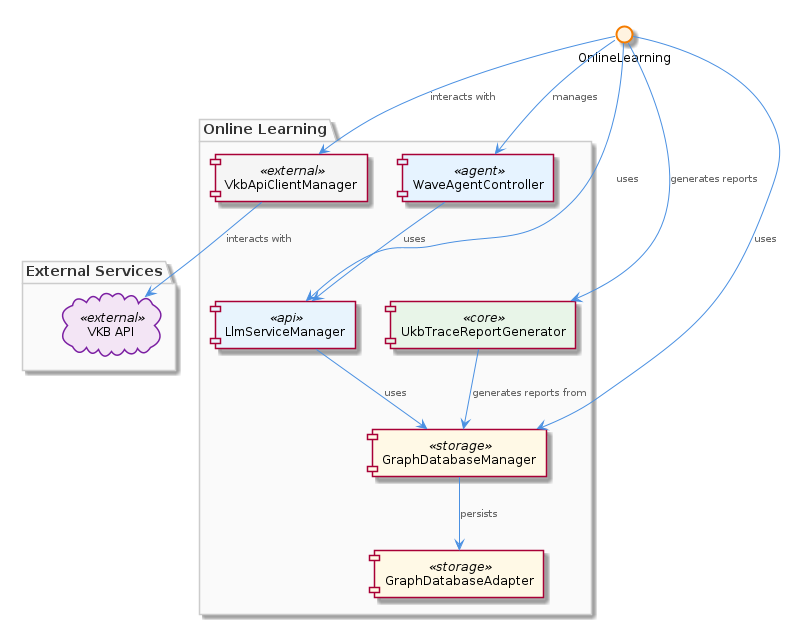
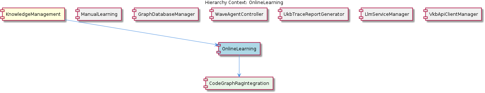

# OnlineLearning

**Type:** SubComponent

OnlineLearning could interact with the WaveAgentController for managing the execution of Wave agents during automatic knowledge processing.

## What It Is  

**OnlineLearning** is the automatic‑knowledge‑extraction sub‑component of the **KnowledgeManagement** domain.  It lives under the `KnowledgeManagement` folder (the exact path is not listed in the observations, but its parent component’s implementation resides in `integrations/mcp-server-semantic-analysis/src/storage/graph-database-adapter.ts`).  OnlineLearning orchestrates a pipeline that discovers, extracts, and persists knowledge entities from learning material without human intervention.  The pipeline draws on several “manager” services—`GraphDatabaseManager`, `LlmServiceManager`, `WaveAgentController`, `UkbTraceReportGenerator`, and `VkbApiClientManager`—to move data from raw sources through LLM‑driven processing into the persistent graph store.  Its child component, **CodeGraphRagIntegration**, supplies a specialized RAG (Retrieval‑Augmented Generation) capability for code‑base analysis, extending the automatic extraction logic to source‑code artifacts.  

  

---

## Architecture and Design  

The architecture follows a **manager‑orchestrated pipeline** pattern.  Each manager encapsulates a distinct technical concern:

* **GraphDatabaseManager** – abstracts CRUD operations against the graph store.  
* **LlmServiceManager** – provides a thin façade for invoking large language models (LLMs) during extraction.  
* **WaveAgentController** – coordinates the lifecycle of “Wave agents,” which are the runtime workers that execute LLM prompts and post‑processing steps.  
* **UkbTraceReportGenerator** – collects execution metadata from the pipeline and produces trace reports for auditability.  
* **VkbApiClientManager** – handles external VKB (Virtual Knowledge Base) API calls required for supplemental knowledge retrieval.

These managers are wired together by a configuration‑driven workflow (the observation that “OnlineLearning may follow a specific pipeline or workflow, potentially defined in a configuration file or module”).  The workflow definition lives outside the source symbols we have, but its presence explains how the components are sequenced without hard‑coded dependencies.  

At the data‑persistence layer, **GraphDatabaseAdapter** (implemented in `integrations/mcp-server-semantic-analysis/src/storage/graph-database-adapter.ts`) provides the concrete bridge to a **Graphology + LevelDB** store.  This adapter is used by `GraphDatabaseManager` to write the automatically extracted knowledge graph, and the same adapter is shared with the sibling **ManualLearning** component, ensuring a consistent storage contract across manual and automatic pathways.  

The overall design can be visualised as a directed graph of responsibilities, which is captured in the relationship diagram below.  

  

---

## Implementation Details  

Even though the source contains **zero code symbols** directly under OnlineLearning, the surrounding ecosystem gives a clear picture of the implementation mechanics:

1. **Graph Interaction** – `GraphDatabaseAdapter` implements the low‑level API for persisting vertices and edges.  It serialises entities to JSON and stores them in LevelDB, leveraging Graphology’s in‑memory graph model for fast traversal before committing to disk.  `GraphDatabaseManager` calls this adapter for every create, update, or delete operation generated by the extraction pipeline.

2. **LLM Invocation** – `LlmServiceManager` abstracts the underlying LLM provider (e.g., OpenAI, Anthropic).  It exposes methods such as `runPrompt(prompt: string, context: object)` that the Wave agents invoke.  By centralising token handling, request throttling, and response parsing, the manager shields the rest of the pipeline from provider‑specific quirks.

3. **Wave Agent Execution** – `WaveAgentController` spawns lightweight agents (likely Node.js workers or containerised tasks) that perform the heavy‑weight LLM calls.  The controller monitors agent health, retries failed jobs, and reports status back to the pipeline orchestrator.

4. **Trace Reporting** – `UkbTraceReportGenerator` listens to events emitted by the manager layer (e.g., “entity‑extracted”, “graph‑write‑complete”).  It aggregates these events into a structured trace report that can be stored for debugging, compliance, or analytics.

5. **External Knowledge Retrieval** – `VkbApiClientManager` encapsulates HTTP client logic for the VKB service.  During extraction, agents may request supplemental definitions or taxonomies; the manager handles authentication, pagination, and error handling.

6. **Code‑Graph RAG Extension** – The child component **CodeGraphRagIntegration** adds a specialised RAG loop for source‑code.  Its README describes a “Graph‑Code RAG system” that analyses code repositories, extracts API calls, data flow, and maps them onto the knowledge graph.  This integration re‑uses the same managers (LLM, graph, trace) but supplies a different input adaptor that parses code ASTs.

The pipeline configuration (likely a YAML or JSON file) enumerates the sequence: *fetch raw material → invoke Wave agents → LLM extraction → enrich via VKB → persist via GraphDatabaseManager → generate trace*.  Because the configuration is external, the pipeline can be extended or reordered without code changes, supporting rapid experimentation.

---

## Integration Points  

OnlineLearning sits at the convergence of several system boundaries:

* **Parent – KnowledgeManagement** – The parent component supplies the overarching graph‑storage strategy (`graph-database-adapter.ts`).  OnlineLearning inherits this storage contract, ensuring that any knowledge entity it creates is immediately queryable by other KnowledgeManagement services (e.g., recommendation engines, analytics).

* **Siblings** –  
  * **ManualLearning** shares the `GraphDatabaseManager` and thus the same persistence semantics.  This creates a unified view of both manually curated and automatically extracted knowledge.  
  * **WaveAgentController** and **LlmServiceManager** are co‑located siblings that together provide the compute substrate for LLM‑driven extraction.  Their tight coupling is intentional: the controller knows how to schedule LLM calls via the manager.  
  * **UkbTraceReportGenerator** consumes events emitted by both `GraphDatabaseManager` and the Wave agents, producing cross‑component traceability.  
  * **VkbApiClientManager** offers an external data‑enrichment hook; any knowledge entity that requires domain‑specific context can be augmented through this manager.

* **Child – CodeGraphRagIntegration** – This integration adds a new input adaptor (code‑base parser) while re‑using the same manager stack.  It demonstrates the extensibility of OnlineLearning: new domains can plug in their own extractors without altering the core pipeline.

* **Configuration Layer** – Though not a concrete file in the observations, the pipeline configuration acts as the glue that binds these managers together.  It defines which agents run, which LLM prompts are used, and how trace reports are formatted.

---

## Usage Guidelines  

1. **Leverage the Configuration File** – When extending OnlineLearning (e.g., adding a new knowledge source), modify the pipeline configuration rather than editing manager code.  This preserves the separation of concerns and keeps the system maintainable.

2. **Respect the Manager Interfaces** – All interactions with the graph, LLM, or external APIs should go through their respective managers (`GraphDatabaseManager`, `LlmServiceManager`, `VkbApiClientManager`).  Direct calls bypassing these abstractions break the retry, logging, and tracing guarantees.

3. **Monitor Wave Agents** – The `WaveAgentController` provides health metrics (agent count, error rates).  Production deployments should integrate these metrics into observability dashboards to detect back‑pressure or LLM throttling early.

4. **Trace Reporting is Mandatory** – Enable `UkbTraceReportGenerator` for every pipeline run.  The generated reports are the primary source for debugging extraction failures and for compliance audits.

5. **Version the Graph Schema** – Since both OnlineLearning and ManualLearning write to the same graph, schema evolution must be coordinated.  Use the JSON export capabilities of the `GraphDatabaseAdapter` to version‑control graph snapshots.

---

### Architectural Patterns Identified  

* **Manager/Facade Pattern** – Each technical domain (graph, LLM, external API) is encapsulated behind a dedicated manager class.  
* **Pipeline/Workflow Configuration** – The extraction process is defined declaratively, allowing dynamic re‑ordering of steps.  
* **Agent‑Based Execution** – Wave agents act as isolated workers that perform LLM‑heavy tasks, providing scalability and fault isolation.  
* **Adapter Pattern** – `GraphDatabaseAdapter` adapts the generic Graphology API to the concrete LevelDB persistence layer.

### Design Decisions and Trade‑offs  

* **Centralised Graph Storage** – Using a single Graphology + LevelDB store simplifies queries but couples manual and automatic knowledge pathways; any schema change impacts both.  
* **External LLM Service** – Delegating LLM calls to `LlmServiceManager` enables provider flexibility but introduces latency and cost considerations; the Wave agents mitigate this by parallelising calls.  
* **Configuration‑Driven Pipeline** – Gains flexibility and rapid iteration at the expense of static type safety; validation tooling is required to prevent mis‑configurations.  
* **Trace Generation** – Adds overhead but provides essential observability; the trade‑off is acceptable for a system focused on insight generation.

### System Structure Insights  

OnlineLearning is a **sub‑component** that sits one level below **KnowledgeManagement** and shares its persistence backbone.  Its sibling components each own a distinct responsibility, yet they converge on the same manager interfaces, creating a cohesive yet modular ecosystem.  The child **CodeGraphRagIntegration** demonstrates the extensibility of the design: new domains can plug in custom extractors while re‑using the existing pipeline infrastructure.

### Scalability Considerations  

* **Graphology + LevelDB** scales horizontally for read‑heavy workloads; however, write contention can arise when many Wave agents persist simultaneously.  Sharding or moving to a distributed graph store would be a future mitigation.  
* **Wave Agents** can be horizontally scaled (more agents = higher parallelism) limited only by LLM provider rate limits; the `LlmServiceManager` should implement back‑pressure handling.  
* **Trace Reporting** stores metadata separately, avoiding bottlenecks on the main graph store.

### Maintainability Assessment  

The **manager‑oriented** layout isolates concerns, making unit testing straightforward (each manager can be mocked).  The **configuration‑driven pipeline** reduces code churn when processes evolve.  However, the reliance on external configuration files demands robust validation and documentation to prevent runtime mis‑behaviour.  Overall, the architecture balances flexibility with clear module boundaries, supporting long‑term maintainability.

## Hierarchy Context

### Parent
- [KnowledgeManagement](./KnowledgeManagement.md) -- [LLM] The KnowledgeManagement component utilizes the GraphDatabaseAdapter (integrations/mcp-server-semantic-analysis/src/storage/graph-database-adapter.ts) for persisting data in a graph database with automatic JSON export synchronization. This design decision enables efficient storage and retrieval of knowledge entities and relationships, which is crucial for the system's overall goals of knowledge discovery and insight generation. Furthermore, the use of Graphology+LevelDB persistence ensures a scalable and performant solution for managing the knowledge graph.

### Children
- [CodeGraphRagIntegration](./CodeGraphRagIntegration.md) -- The integrations/code-graph-rag/README.md file describes the Graph-Code RAG system, which is used for analyzing codebases and extracting knowledge entities and relationships.

### Siblings
- [ManualLearning](./ManualLearning.md) -- ManualLearning likely interacts with the GraphDatabaseManager to store and retrieve manually created knowledge entities and relationships.
- [GraphDatabaseManager](./GraphDatabaseManager.md) -- GraphDatabaseManager likely utilizes the GraphDatabaseAdapter for interacting with the graph database.
- [WaveAgentController](./WaveAgentController.md) -- WaveAgentController likely interacts with the LlmServiceManager for LLM operations and initialization.
- [UkbTraceReportGenerator](./UkbTraceReportGenerator.md) -- UkbTraceReportGenerator likely interacts with the GraphDatabaseManager to retrieve data for trace reports.
- [LlmServiceManager](./LlmServiceManager.md) -- LlmServiceManager likely interacts with other components for LLM-related tasks, such as the GraphDatabaseManager and WaveAgentController.
- [VkbApiClientManager](./VkbApiClientManager.md) -- VkbApiClientManager likely interacts with the GraphDatabaseManager for storing and retrieving data related to VKB API interactions.

---

*Generated from 7 observations*
