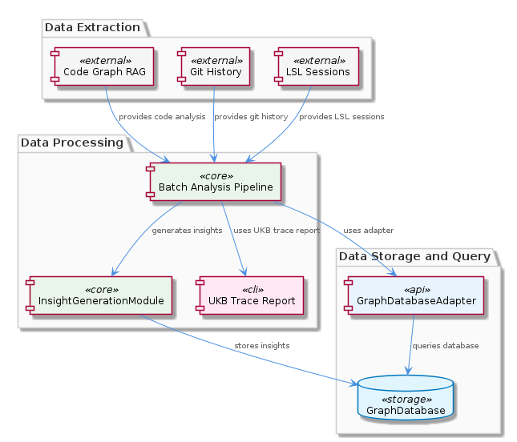
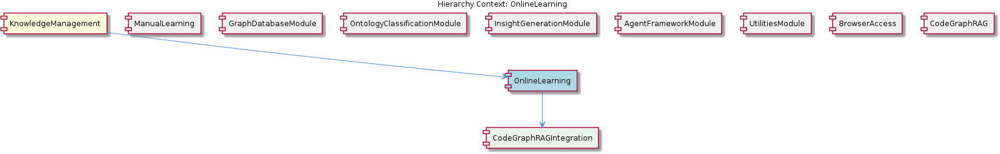

# OnlineLearning

**Type:** SubComponent

OnlineLearning relies on the batch analysis pipeline to process data from git history, LSL sessions, and code analysis.

## What It Is  

OnlineLearning is a **sub‑component** of the larger **KnowledgeManagement** system. Its implementation lives primarily in the **`integrations/code-graph-rag/`** directory, where the Code Graph RAG (Retrieval‑Augmented Generation) system is defined. The component orchestrates a **batch analysis pipeline** that ingests three distinct data streams—Git history, LSL (Learning Session Log) sessions, and static code analysis results. Extracted entities are persisted through the **`GraphDatabaseAdapter`** (found at `integrations/mcp-server-semantic-analysis/src/storage/graph-database-adapter.ts`) and later fed to the **`InsightGenerationModule`**, which produces actionable learning insights. Throughout the processing flow, the **UKB trace report** from the **UtilitiesModule** is used to log and audit each stage, ensuring traceability of the knowledge‑extraction lifecycle.  

---

## Architecture and Design  

The design of OnlineLearning is deliberately **modular** and **pipeline‑centric**. A clear separation exists between **data ingestion**, **knowledge extraction**, **persistence**, and **insight generation**:

1. **Batch Analysis Pipeline** – Acts as the backbone, pulling data from version‑control (Git), runtime learning sessions (LSL), and code‑analysis tools. This pipeline is scheduled in batches, allowing the system to process large histories without overwhelming resources.  

2. **Code Graph RAG Integration** – Encapsulated in `integrations/code-graph-rag/`, this child component provides a graph‑based retrieval layer that maps code entities to semantic representations. The RAG approach enables the system to answer “code‑centric” queries using the graph built from the batch pipeline.  

3. **GraphDatabaseAdapter** – Implemented in `integrations/mcp-server-semantic-analysis/src/storage/graph-database-adapter.ts`, this adapter abstracts the underlying **Graphology + LevelDB** store. Its presence is a textbook **Adapter pattern**, allowing OnlineLearning (and its siblings such as `GraphDatabaseModule`) to interact with the graph without coupling to a specific database implementation.  

4. **InsightGenerationModule** – Shared with the sibling `InsightGenerationModule`, it consumes the entity graph and leverages the **UKB trace report** from the `UtilitiesModule` to produce insights. The reliance on a common utilities package demonstrates a **shared‑services** approach within the KnowledgeManagement family.  

5. **Traceability via UKB** – The UKB trace report is injected from `UtilitiesModule`, providing a lightweight observability layer that records processing timestamps, success/failure flags, and lineage information.  

The component’s **relationship diagram** (shown below) visualizes these interactions, highlighting how OnlineLearning sits between the data ingestion side (Git, LSL, code analysis) and downstream consumers (InsightGenerationModule, GraphDatabaseAdapter).  

---

## Implementation Details  

### Batch Analysis Pipeline  
The pipeline is orchestrated by scripts (not explicitly listed but implied by the “batch analysis” description). It sequentially executes three collectors:

* **Git History Collector** – Parses commit metadata, file diffs, and author information.  
* **LSL Session Collector** – Reads learning‑session logs, extracting timestamps, learner actions, and outcomes.  
* **Code Analysis Collector** – Runs static analysis tools (e.g., ESLint, TypeScript compiler) to produce an AST‑level view of the codebase.

Each collector emits **entity records** (functions, classes, modules, learning events) that are fed into the **Code Graph RAG** engine.

### Code Graph RAG Integration (`integrations/code-graph-rag/`)  
The README in this folder describes a **graph‑based RAG system** that builds a knowledge graph where nodes represent code entities and edges capture relationships (e.g., imports, inheritance, call‑graph links). The RAG layer stores these nodes in the same Graphology + LevelDB store accessed via the `GraphDatabaseAdapter`. Retrieval queries are expressed as graph traversals, enabling semantic searches like “find all functions that mutate a given state variable”.

### GraphDatabaseAdapter (`integrations/mcp-server-semantic-analysis/src/storage/graph-database-adapter.ts`)  
Key responsibilities:

* **CRUD Operations** – `createEntity`, `readEntity`, `updateEntity`, `deleteEntity`.  
* **Batch Upserts** – Optimized for the high‑volume writes produced by the batch pipeline.  
* **JSON Export Sync** – Automatically serializes the graph to JSON after each batch, ensuring external tools can consume a snapshot without direct DB access.  

The adapter also exposes a **query interface** used by the InsightGenerationModule to fetch sub‑graphs for analysis.

### InsightGenerationModule (Sibling)  
Consumes the persisted graph and runs classification rules defined in the `OntologyClassificationModule`. It then produces **learning insights** (e.g., “this module has high churn but low test coverage”). The UKB trace report from `UtilitiesModule` logs each insight generation run, providing auditability.

### UtilitiesModule – UKB Trace Report  
A lightweight logging utility that records processing metadata. The trace is attached to each batch run and each insight generation cycle, enabling developers to trace back from an insight to the exact data slice that produced it.

---

## Integration Points  

| Integration | Direction | Interface / Path | Purpose |
|-------------|-----------|------------------|---------|
| **Parent – KnowledgeManagement** | Upward | Component hierarchy (OnlineLearning is a child of KnowledgeManagement) | Provides the overall knowledge‑graph context and shared persistence layer. |
| **Sibling – GraphDatabaseModule** | Shared | `GraphDatabaseAdapter` (same file as above) | Both modules read/write to the same Graphology + LevelDB store, ensuring consistency. |
| **Sibling – InsightGenerationModule** | Downward | Direct API calls to `generateInsights(entityGraph)` | Consumes the entity graph produced by OnlineLearning to emit insights. |
| **Sibling – UtilitiesModule** | Side‑channel | `UKB trace report` (imported from UtilitiesModule) | Supplies observability data for each processing step. |
| **Child – CodeGraphRAGIntegration** | Internal | `integrations/code-graph-rag/` files | Implements the graph‑based retrieval layer that powers the RAG queries used by OnlineLearning. |
| **External – Git/LSL Sources** | Input | File system / remote repo APIs | Feed raw data into the batch analysis pipeline. |
| **External – Static Code Analyzers** | Input | CLI tools invoked by the pipeline | Provide AST and metric data for graph construction. |

These connections illustrate a **layered integration**: raw data → batch pipeline → graph construction (RAG) → persistence (adapter) → insight generation, all while being observed by the UKB trace utility.

---

## Usage Guidelines  

1. **Run the Batch Pipeline on Stable Snapshots** – Because the pipeline processes large histories, schedule it during low‑traffic windows and point it at a tagged Git commit or a frozen LSL export to avoid race conditions.  

2. **Do Not Bypass the GraphDatabaseAdapter** – Directly manipulating the underlying LevelDB files circumvents the JSON export sync and can corrupt the knowledge graph. All reads/writes should go through the adapter’s public methods.  

3. **Leverage the UKB Trace Report** – When adding new collectors or transformation steps, extend the UKB payload with custom fields (e.g., `collectorName`, `recordsProcessed`). This keeps the end‑to‑end trace complete and aids debugging.  

4. **Version the Ontology** – The `OntologyClassificationModule` expects entity types to match a known schema. If you introduce new entity kinds (e.g., “workflow”), update the ontology definitions and run the `migrate-graph-db-entity-types.js` script (found in `scripts/`) to migrate existing records.  

5. **Testing the RAG Layer** – Use the sample queries from the `integrations/code-graph-rag/README.md` to validate that newly added code entities are correctly indexed and retrievable.  

6. **Monitoring Scalability** – Keep an eye on the size of the LevelDB store; when it exceeds a few gigabytes, consider archiving older snapshots (the JSON export can be stored in cold storage) to maintain query performance.  

---

### Architectural Patterns Identified  

1. **Adapter Pattern** – `GraphDatabaseAdapter` abstracts Graphology + LevelDB.  
2. **Pipeline (Batch Processing) Pattern** – Sequential ingestion, transformation, and loading steps.  
3. **Shared‑Service / Utility Pattern** – UKB trace report from `UtilitiesModule` is used across siblings.  
4. **Modular Integration** – Child component (`CodeGraphRAGIntegration`) encapsulates a distinct capability (graph‑based RAG).  

### Design Decisions and Trade‑offs  

* **Batch vs. Real‑time** – Opting for batch processing simplifies handling of massive Git histories but introduces latency; real‑time insights are not possible without additional streaming infrastructure.  
* **Graphology + LevelDB Storage** – Provides fast key‑value access and flexible graph traversals but limits horizontal scaling; sharding would require a different backend.  
* **Adapter Centralization** – Guarantees a single point of change for storage concerns, at the cost of a potential bottleneck if many components issue high‑frequency writes.  

### System Structure Insights  

* OnlineLearning sits as a **mid‑tier** component within KnowledgeManagement, bridging raw learning data and higher‑level insight services.  
* Its sibling modules share the same persistence layer, fostering data consistency but also coupling their lifecycles.  
* The child `CodeGraphRAGIntegration` isolates the RAG logic, making it reusable for other sub‑components that may need code‑centric retrieval.  

### Scalability Considerations  

* **Horizontal Scaling** – The current LevelDB backend is not natively distributed; scaling out would require migrating to a distributed graph store (e.g., Neo4j, JanusGraph).  
* **Batch Size Tuning** – Adjusting the size of each batch run can balance throughput against memory consumption.  
* **Index Management** – Adding custom indexes in Graphology can improve query speed for frequently accessed entity types.  

### Maintainability Assessment  

* **High Cohesion** – Each module has a clear responsibility (e.g., ingestion, storage, insight generation).  
* **Loose Coupling via Interfaces** – The `GraphDatabaseAdapter` and UKB trace utility act as contracts, reducing ripple effects of internal changes.  
* **Documentation** – README files in `integrations/code-graph-rag/` and clear script locations (`scripts/migrate-graph-db-entity-types.js`) aid onboarding.  
* **Potential Debt** – Reliance on a single‑node LevelDB store may become a maintenance bottleneck as data volume grows; proactive migration planning is advisable.

## Hierarchy Context

### Parent
- [KnowledgeManagement](./KnowledgeManagement.md) -- [LLM] The KnowledgeManagement component utilizes a GraphDatabaseAdapter for persistence, which is implemented in the file integrations/mcp-server-semantic-analysis/src/storage/graph-database-adapter.ts. This adapter provides an interface for agents to interact with the central Graphology + LevelDB knowledge graph. The adapter also includes automatic JSON export sync, ensuring that the knowledge graph remains up-to-date. Furthermore, the migrateGraphDatabase script, located in scripts/migrate-graph-db-entity-types.js, is used to update entity types in the live LevelDB/Graphology database, demonstrating a clear focus on data consistency and integrity.

### Children
- [CodeGraphRAGIntegration](./CodeGraphRAGIntegration.md) -- The integrations/code-graph-rag/README.md file describes the Graph-Code RAG system as a graph-based RAG system for any codebases.

### Siblings
- [ManualLearning](./ManualLearning.md) -- ManualLearning relies on the migrateGraphDatabase script in scripts/migrate-graph-db-entity-types.js to update entity types in the live LevelDB/Graphology database.
- [GraphDatabaseModule](./GraphDatabaseModule.md) -- GraphDatabaseModule uses the GraphDatabaseAdapter to interact with the Graphology + LevelDB knowledge graph.
- [OntologyClassificationModule](./OntologyClassificationModule.md) -- OntologyClassificationModule uses the OntologySystem to classify entities based on their types and properties.
- [InsightGenerationModule](./InsightGenerationModule.md) -- InsightGenerationModule uses the UKB trace report from the UtilitiesModule to generate insights.
- [AgentFrameworkModule](./AgentFrameworkModule.md) -- AgentFrameworkModule uses the agent development guide in integrations/copi/docs/hooks.md to provide a framework for agent development.
- [UtilitiesModule](./UtilitiesModule.md) -- UtilitiesModule uses the checkpoint system to track progress and ensure data consistency.
- [BrowserAccess](./BrowserAccess.md) -- BrowserAccess uses the browser access guide in integrations/browser-access/README.md to provide browser access to the MCP server.
- [CodeGraphRAG](./CodeGraphRAG.md) -- CodeGraphRAG uses the code-graph-rag guide in integrations/code-graph-rag/README.md to provide a graph-based RAG system.

---

*Generated from 5 observations*
