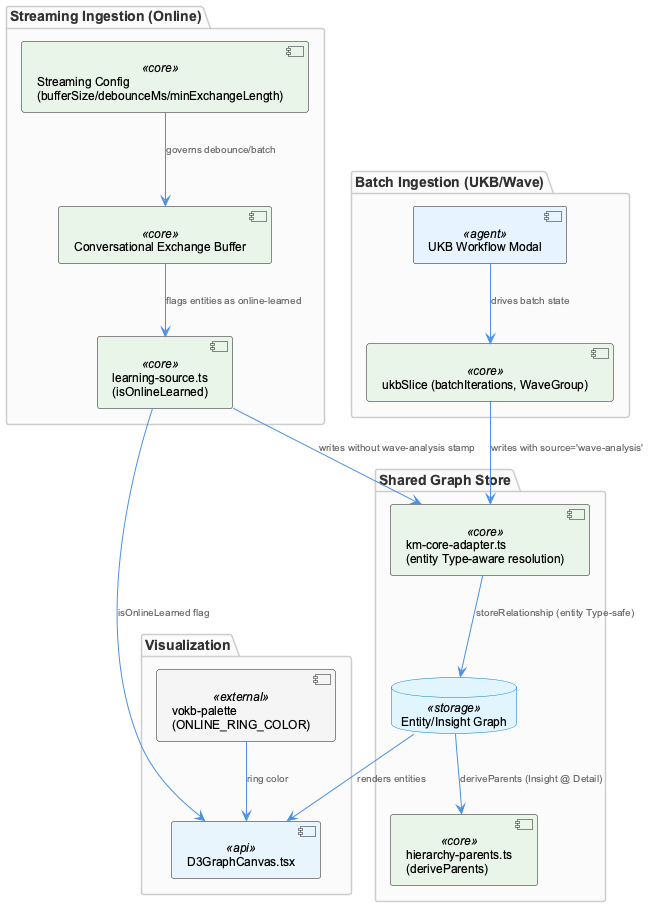
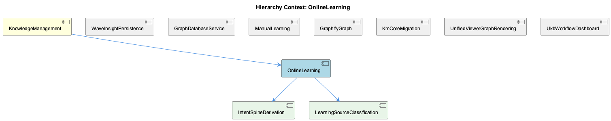

# OnlineLearning

**Type:** SubComponent

lib/ukb-unified/core/WorkflowOrchestrator.js executeIncrementalWorkflow() builds workflow_name: 'incremental-analysis' parameters from a gap scope (sinceCommit, commits, sessions) and calls mcp__semantic_analysis__execute_workflow to run automated extraction

# OnlineLearning — Technical Insight Document

## What It Is

OnlineLearning is the automated, incremental knowledge-extraction subsystem within KnowledgeManagement, implemented primarily around `lib/ukb-unified/core/WorkflowOrchestrator.js` and `lib/ukb-unified/cli.js`. Where its sibling ManualLearning provides a human-authoring path (add-entity/update-entity commands via UKBDatabaseWriter), OnlineLearning exists to automatically detect what has changed since the last analysis run — new commits, new sessions — and drive an extraction pipeline over just that gap, rather than reprocessing the entire codebase. Its core entry point is `WorkflowOrchestrator.executeIncrementalWorkflow()`, which constructs an `incremental-analysis` workflow request and dispatches it through `mcp__semantic_analysis__execute_workflow`.

## Architecture and Design

The dominant pattern is gap-based incremental processing with a capability-gated execution strategy. `UKBCliDefaultCommand` (in `lib/ukb-unified/cli.js`) begins each run by loading a `TeamCheckpointManager` checkpoint and calling `GapAnalyzer.getGapSummary()` to determine whether this is a first run or an incremental one, based on `checkpoint.lastSuccessfulRun`. The resulting gap scope (sinceCommit, sinceTimestamp, commits, sessions) is handed to `WorkflowOrchestrator.executeIncrementalWorkflow()`, which packages it into `IncrementalAnalysisWorkflowParams` — notably mapping commits to `c.sha` and sessions to `s.path`, so the workflow consumes lightweight descriptors rather than full domain objects, keeping the orchestration layer decoupled from GapAnalyzer's internal representations.

A second key design decision is the availability gate implemented by `WorkflowOrchestrator.checkMCPToolsAvailability()`: all automated workflow execution checks for the presence of MCP tool functions before running, falling back to `mock*Workflow` methods when MCP isn't available. This makes the subsystem degrade gracefully in environments without the MCP toolchain (e.g., local dev, tests) while preserving the same orchestration interface.

The actual extraction pipeline is structured as named, ordered substep sequences per agent, defined in `AGENT_SUBSTEPS` (multi-agent-graph.tsx) — e.g., `kg_operators: conv→aggr→embed→dedup→pred→merge` and `git_history: fetch→diff→extract`. Each substep is tagged with an `llmUsage` level (`none`/`fast`/`standard`/`premium`), explicitly documenting which stages are pure algorithmic transformations versus LLM-invoking steps, which is a meaningful cost/latency design signal baked directly into the pipeline metadata.

## Implementation Details

`executeIncrementalWorkflow()` builds a `workflow_name: 'incremental-analysis'` payload carrying `sinceCommit`, `sinceTimestamp`, `commits`, `sessions`, `maxCommits`, `maxSessions`, and `significanceThreshold` — giving the underlying MCP workflow both boundary information (since when) and volume/quality caps (max counts, significance threshold) to bound the work performed. This is consistent with an incremental system that must avoid unbounded reprocessing as gaps grow.

On the UI side, `ukb-workflow-modal.tsx`'s `calculateDynamicEta()` observes `process.batchIterations` from the currently running batch to project completion time for the online-learning batch pipeline — an adaptive, self-referential estimation technique rather than a static progress bar, useful given that substep durations vary by `llmUsage` tier.

Once extraction completes, `data-processor.js`'s `exportOnlineKnowledge()` pulls the results back out via `databaseManager.graphDB.queryEntities({team, limit:5000})`, and explicitly relabels entities whose `source` was `'auto'` into `'online'` for visualization purposes — a small but important semantic translation layer between how data is tagged internally by the extraction pipeline and how it's presented to consumers.

## Integration Points

OnlineLearning sits under KnowledgeManagement alongside ManualLearning and VkbServer. It shares the underlying graph storage with VkbServer (via `databaseManager.graphDB`) and, downstream, its exported `'online'`-tagged entities are presumably visualized through the same channels VkbServer exposes (`/api/entities`, `/api/export`, etc.), though the exact route wiring for online-sourced data isn't detailed in these observations. It contrasts directly with ManualLearning, which writes through `UKBDatabaseWriter` from stdin JSON — OnlineLearning instead writes through the batch/automated extraction path driven by MCP workflows. Internally, its children `WorkflowOrchestrator`, `IncrementalAnalysisWorkflowParams`, and `UKBCliDefaultCommand` form a clear call chain: CLI detects the gap → orchestrator builds and dispatches workflow params → MCP tools (or mocks) execute the actual analysis.

## Usage Guidelines

Developers extending OnlineLearning should treat `GapAnalyzer.getGapSummary()` and the `TeamCheckpointManager` checkpoint as the source of truth for incremental scope — new substeps or extraction agents should be registered in `AGENT_SUBSTEPS` with an accurate `llmUsage` tag so ETA calculations and cost expectations remain meaningful. Because `checkMCPToolsAvailability()` silently falls back to mock workflows, care should be taken when testing that MCP tools are actually available if real incremental analysis (not mock output) is required. When exposing new online-learned data, follow the `exportOnlineKnowledge()` convention of tagging with `source: 'online'` rather than leaving the raw `'auto'` tag, to keep the visualization layer's semantics consistent with what ManualLearning-produced entities look like.

## Hierarchy Context

### Parent
- [KnowledgeManagement](./KnowledgeManagement.md) -- [LLM] The KnowledgeManagement component centers around a VKB (Virtual Knowledge Base) server that exposes graph-based storage operations to the rest of the Coding infrastructure. This server acts as the primary access point for entity CRUD operations, query resolution, and relationship traversal across the knowledge graph, decoupling consumers (agents, CLI tools, other components) from the underlying storage engine. This abstraction layer is critical because it has allowed the project to migrate storage backends (LevelDB to KMCore) without requiring downstream consumers to change their integration code, as evidenced by the dedicated migration test suite.

### Children
- [WorkflowOrchestrator](./WorkflowOrchestrator.md) -- executeIncrementalWorkflow() builds workflow_name: 'incremental-analysis' with parameters sinceCommit, sinceTimestamp, commits (mapped to sha), sessions (mapped to path), maxCommits, maxSessions, significanceThreshold
- [IncrementalAnalysisWorkflowParams](./IncrementalAnalysisWorkflowParams.md) -- scope.commits.map(c => c.sha) and scope.sessions.map(s => s.path) show the incremental workflow expects lightweight commit/session descriptors from GapAnalyzer rather than full objects
- [UKBCliDefaultCommand](./UKBCliDefaultCommand.md) -- UKBCli.defaultCommand() calls this.checkpointManager.loadCheckpoint() and checks checkpoint.lastSuccessfulRun to detect first-run vs incremental scenarios

### Siblings
- [ManualLearning](./ManualLearning.md) -- lib/ukb-database/cli.js exposes add-entity, update-entity, add-relation, import, and export commands that read JSON from stdin and pass it through UKBDatabaseWriter, a manual-authoring entry point distinct from the batch pipeline
- [VkbServer](./VkbServer.md) -- lib/vkb-server/api-routes.js's ApiRoutes.registerRoutes() wires dozens of endpoints (/api/entities, /api/relations, /api/stats, /api/export, /api/query, /api/ontology/classes) as the single HTTP surface for all consumers

---

*Generated from 7 observations*
