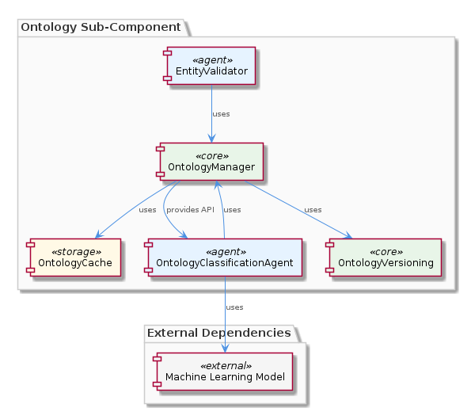

# Ontology

**Type:** SubComponent

The EntityValidator in the Ontology sub-component employs a set of predefined rules to validate entity content and detect staleness in observations and insights, as seen in the integrations/mcp-server-semantic-analysis/src/agents/entity-validator.ts file.

## What It Is  

The **Ontology** sub‑component lives inside the SemanticAnalysis domain and is implemented primarily in the `integrations/mcp-server-semantic-analysis/src/agents/` directory.  The key source files are  

* `ontology-manager.ts` – defines the **OntologyManager** and the **HierarchicalOntologyStructure** that underpins the whole ontology.  
* `ontology-classification-agent.ts` – implements the **OntologyClassificationAgent**, which classifies incoming observations against the ontology using a machine‑learning model.  
* `entity-validator.ts` – provides the **EntityValidator** that applies a rule‑set to verify entity payloads and flag stale observations.  
* `ontology-cache.ts` – contains the caching layer that stores frequently accessed ontology metadata.  
* `ontology-versioning.ts` – implements the versioning mechanism that tracks changes to the ontology definitions.  

Together these files constitute a self‑contained sub‑component that supplies a hierarchical, version‑aware, cache‑backed ontology service to the rest of the **SemanticAnalysis** system.

---

## Architecture and Design  

Ontology follows a **modular, agent‑based architecture** that mirrors the overall design of its parent component **SemanticAnalysis**.  Each functional concern is encapsulated in its own agent class, exposing a narrow, well‑defined API.  

* The **OntologyManager** (in `ontology-manager.ts`) embodies a **hierarchical structure** – upper and lower ontology definitions are organized as a tree, enabling inheritance of concepts.  This mirrors the *HierarchicalOntologyStructure* child entity and provides a natural way to resolve entity relationships.  
* **OntologyClassificationAgent** (in `ontology-classification-agent.ts`) consumes the manager’s API and augments it with a **machine‑learning classifier**.  The agent therefore acts as a façade that hides the ML details while presenting a simple `classify(observation)` method to callers.  
* **EntityValidator** (in `entity-validator.ts`) operates as a rule‑engine, applying static validation rules and detecting “staleness” – i.e., when an observation no longer matches the current ontology version.  
* The **caching layer** (`ontology-cache.ts`) and **versioning system** (`ontology-versioning.ts`) are cross‑cutting concerns that are injected into the manager and agents.  The cache reduces latency for repeated look‑ups, while versioning guarantees consistency across agents that may otherwise operate on out‑of‑date definitions.  

These design choices produce a clear separation of concerns: the manager handles data organization, the classification agent focuses on inference, and the validator enforces integrity.  The **pipeline** sibling component, which uses a DAG‑based execution model, can schedule these agents in a deterministic order, ensuring that the cache is primed before classification runs.

---

## Implementation Details  

### OntologyManager & HierarchicalOntologyStructure  
`ontology-manager.ts` declares the **OntologyManager** class.  Internally it constructs a **HierarchicalOntologyStructure** object that stores upper‑ontology nodes (core concepts) and lower‑ontology nodes (domain‑specific extensions).  The manager exposes methods such as `getEntity(id)`, `search(term)`, and `listChildren(parentId)`.  These methods walk the tree, leveraging parent‑child links to resolve inheritance and to provide a unified view of the ontology.

### Caching (`ontology-cache.ts`)  
The cache is a simple in‑memory map keyed by entity identifiers.  The manager checks the cache first in `getEntity`; if a miss occurs, it loads the entity from the underlying definition store and then populates the cache.  The cache is invalidated whenever the **OntologyVersioning** module signals a version bump (see below).

### Versioning (`ontology-versioning.ts`)  
Versioning is implemented as a monotonically increasing integer stored alongside each ontology definition file.  The module exports `getCurrentVersion()` and `incrementVersion()` functions.  When a new ontology file is deployed, the version is incremented, and the cache is flushed.  This ensures that the **EntityValidator** can detect stale observations by comparing the observation’s recorded version with `getCurrentVersion()`.

### Classification Agent (`ontology-classification-agent.ts`)  
The **OntologyClassificationAgent** composes three collaborators: the **OntologyManager**, the **cache**, and a **ML model** (instantiated via a helper `loadModel()` function).  Its primary method `classify(observation)` performs the following steps:  

1. Retrieve the latest ontology version via `OntologyVersioning.getCurrentVersion()`.  
2. Use the cache to obtain relevant entity metadata.  
3. Pass the observation and metadata to the ML model, which returns a confidence‑scored list of matching ontology concepts.  
4. Return the top‑ranked concept(s) together with the version stamp, enabling downstream components (e.g., **KnowledgeGraphConstructor**) to link the observation correctly.

### Entity Validation (`entity-validator.ts`)  
The **EntityValidator** defines a static rule set (e.g., required fields, type constraints).  Its `validate(entity)` method runs these rules and also checks the entity’s version against the current ontology version.  If the versions differ, the validator flags the entity as **stale**, prompting a re‑classification or update.

---

## Integration Points  

Ontology is tightly coupled with several sibling agents within the **SemanticAnalysis** component:  

* **Pipeline** – The DAG‑based orchestrator schedules the **OntologyCache** warm‑up step before the **OntologyClassificationAgent** runs, guaranteeing that the cache is populated for high‑throughput classification.  
* **Insights** – The **InsightGenerator** consumes classification results to enrich code‑level insights; it calls `OntologyManager.getEntity` to fetch human‑readable descriptions for the concepts it surfaces.  
* **KnowledgeGraphConstructor** – Uses the versioned ontology data to create edges between code entities and ontology concepts, ensuring the graph reflects the latest definitions.  
* **EntityValidator** – Runs as a pre‑processing guard for any component that writes observations (e.g., **CodeAnalyzer**).  It validates payloads against the current ontology and prevents the propagation of invalid or outdated data.  

All interactions occur through the public API exposed by **OntologyManager** (`getEntity`, `search`, etc.) and the versioning utilities.  The agents import these modules directly via relative paths such as `../agents/ontology-manager` and `../agents/ontology-versioning`, keeping the dependency graph explicit and compile‑time safe.

---

## Usage Guidelines  

1. **Always query through OntologyManager** – Direct access to the raw definition files bypasses caching and version checks, leading to stale data.  Use `OntologyManager.getEntity(id)` or `search(term)` for any lookup.  
2. **Warm the cache before bulk classification** – In batch jobs, invoke the cache’s `preload(ids[])` method (exposed by `ontology-cache.ts`) early in the pipeline to avoid repetitive loads.  
3. **Respect versioning** – When persisting observations, store the ontology version returned by `OntologyVersioning.getCurrentVersion()`.  This enables the **EntityValidator** to detect staleness automatically.  
4. **Handle classification confidence** – The ML model returns a confidence score; downstream components should treat low‑confidence matches as candidates for manual review or re‑classification.  
5. **Update ontology via the versioning API** – Adding or modifying concepts should be done through the `OntologyVersioning.incrementVersion()` call, which guarantees cache invalidation and consistent state across agents.  

Following these practices ensures that the Ontology sub‑component remains performant, consistent, and easy to evolve.

---

### Summary of Key Insights  

| Item | Insight |
|------|---------|
| **Architectural patterns identified** | Agent‑based modular design, hierarchical data structure, cache‑aside pattern, explicit versioning for consistency. |
| **Design decisions and trade‑offs** | Hierarchical ontology enables inheritance but adds traversal cost; caching improves read latency at the expense of memory; versioning simplifies staleness detection but requires cache invalidation on every change. |
| **System structure insights** | Ontology sits under **SemanticAnalysis**, sharing a DAG‑driven pipeline with siblings; its child **HierarchicalOntologyStructure** provides the core tree model used by all agents. |
| **Scalability considerations** | Cache‑aside design supports horizontal scaling of read‑heavy classification workloads; version‑driven cache invalidation keeps consistency without full reloads; the ML classifier can be swapped for a distributed inference service if needed. |
| **Maintainability assessment** | Clear separation of concerns (manager, cache, versioning, classifier, validator) makes the codebase easy to reason about; reliance on explicit APIs reduces coupling; however, any change to the hierarchical schema may ripple through validation rules and classification logic, requiring coordinated updates. |

These observations provide a grounded view of how the **Ontology** sub‑component is architected, implemented, and integrated within the broader SemanticAnalysis system.

## Diagrams

## Hierarchy Context

### Parent
- [SemanticAnalysis](./SemanticAnalysis.md) -- [LLM] The SemanticAnalysis component employs a multi-agent architecture, utilizing agents such as the OntologyClassificationAgent, SemanticAnalysisAgent, and CodeGraphAgent, to perform tasks such as code analysis, ontology classification, and insight generation. The OntologyClassificationAgent, for instance, is implemented in the file integrations/mcp-server-semantic-analysis/src/agents/ontology-classification-agent.ts and is responsible for classifying observations against the ontology system. This agent-based approach allows for a modular and scalable design, enabling the component to handle large-scale codebases and provide meaningful insights.

### Children
- [HierarchicalOntologyStructure](./HierarchicalOntologyStructure.md) -- The integrations/mcp-server-semantic-analysis/src/agents/ontology-manager.ts file defines the hierarchical structure of the ontology system.

### Siblings
- [Pipeline](./Pipeline.md) -- The Pipeline coordinator uses a DAG-based execution model with topological sort in batch-analysis steps, each step declaring explicit depends_on edges, as seen in the integrations/mcp-server-semantic-analysis/src/agents/ontology-classification-agent.ts file.
- [Insights](./Insights.md) -- The InsightGenerator utilizes the CodeAnalyzer to extract meaningful insights from code files and git history, as referenced in the integrations/mcp-server-semantic-analysis/src/agents/insight-generator.ts file.
- [OntologyManager](./OntologyManager.md) -- The OntologyManager uses a hierarchical structure to organize the ontology system, with upper and lower ontology definitions, as seen in the integrations/mcp-server-semantic-analysis/src/agents/ontology-manager.ts file.
- [CodeAnalyzer](./CodeAnalyzer.md) -- The CodeAnalyzer utilizes a parsing mechanism to extract insights from code files, as implemented in the integrations/mcp-server-semantic-analysis/src/agents/code-analyzer.ts file.
- [InsightGenerator](./InsightGenerator.md) -- The InsightGenerator utilizes the CodeAnalyzer to extract meaningful insights from code files and git history, as referenced in the integrations/mcp-server-semantic-analysis/src/agents/insight-generator.ts file.
- [KnowledgeGraphConstructor](./KnowledgeGraphConstructor.md) -- The KnowledgeGraphConstructor utilizes Memgraph to store and manage the knowledge graph, as implemented in the integrations/mcp-server-semantic-analysis/src/agents/knowledge-graph-constructor.ts file.
- [EntityValidator](./EntityValidator.md) -- The EntityValidator utilizes a set of predefined rules to validate entity content, as implemented in the integrations/mcp-server-semantic-analysis/src/agents/entity-validator.ts file.
- [CodeGraphRAG](./CodeGraphRAG.md) -- The CodeGraphRAG utilizes a graph database to store and manage the code graph, as implemented in the integrations/code-graph-rag/README.md file.

---

*Generated from 7 observations*
