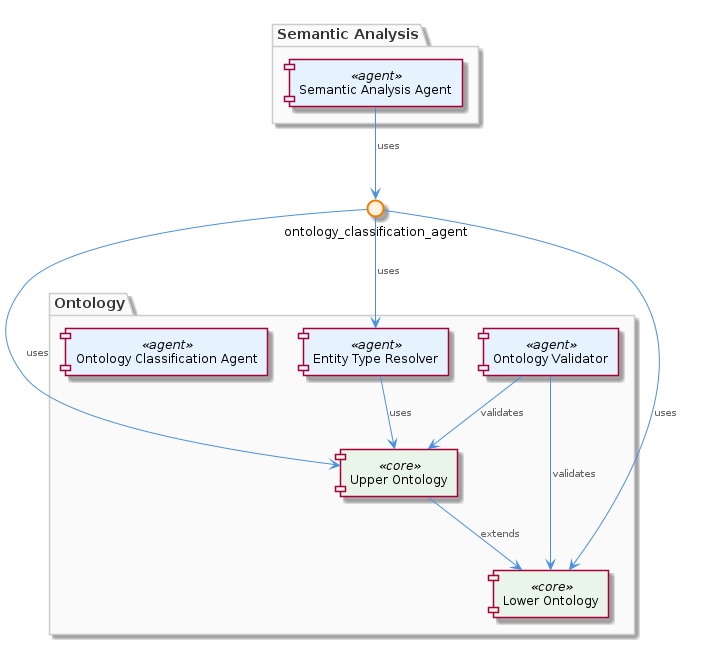

# Ontology

**Type:** SubComponent

The ontology uses a hierarchical structure, with upper ontology concepts being more general and lower ontology concepts being more specific, as seen in the integrations/mcp-server-semantic-analysis/src/ontology/upper-ontology.ts file.

## What It Is  

The **Ontology** sub‑component lives inside the **SemanticAnalysis** parent and is implemented in the *integrations/mcp-server-semantic-analysis* package. Its core definition files are  

* `integrations/mcp-server-semantic-analysis/src/ontology/upper-ontology.ts` – the top‑level, generic concepts, and  
* `integrations/mcp-server-semantic-analysis/src/ontology/lower-ontology.ts` – the more concrete, domain‑specific extensions.  

Ontology‑related logic is exercised by three key classes:  

* `EntityTypeResolver` (`integrations/mcp-server-semantic-analysis/src/ontology/entity-type-resolver.ts`) – resolves an entity’s concrete type against the hierarchical ontology,  
* `OntologyValidator` (`integrations/mcp-server-semantic-analysis/src/ontology/ontology-validator.ts`) – checks that the ontology graph is well‑formed, and  
* `OntologyClassificationAgent` (`integrations/mcp-server-semantic-analysis/src/agents/ontology-classification-agent.ts`) – the agent that drives classification of incoming entities as part of the overall semantic‑analysis pipeline (`integrations/mcp-server-semantic-analysis/src/agents/semantic-analysis-agent.ts`).  

Together these pieces give the system a **hierarchical, extensible knowledge model** that can be consulted at runtime to tag and reason about code entities extracted from Git history and LSL sessions.

---

## Architecture and Design  

Ontology is embedded in a **multi‑agent architecture** that the parent *SemanticAnalysis* component adopts. Each agent encapsulates a single responsibility: the `OntologyClassificationAgent` handles entity classification, the `SemanticAnalysisAgent` orchestrates the overall pipeline, and the `CodeGraphAgent` builds graph representations. This separation follows the *Single Responsibility Principle* and yields a **modular, plug‑in style** design where new agents can be introduced without touching existing ones.

The ontology itself follows a **hierarchical taxonomy**: the *upper ontology* provides abstract concepts (e.g., `Component`, `Service`), while the *lower ontology* refines those into concrete domain entities (e.g., `CodeGraph`, `InsightGenerator`). This hierarchy is leveraged by `EntityTypeResolver`, which walks the tree from specific to general nodes to find the best match for a given entity. The `OntologyValidator` enforces structural invariants—such as acyclic parent‑child relationships and unique identifiers—ensuring that extensions added in `lower-ontology.ts` do not corrupt the model.

Interaction flow: the `SemanticAnalysisAgent` receives raw entities, forwards them to the `OntologyClassificationAgent`, which consults `EntityTypeResolver` and, if necessary, invokes `OntologyValidator` to confirm the integrity of any newly added concepts. The result (a classified entity) is then passed downstream to other agents like `CodeGraphAgent` or the `InsightGenerator`. This pipeline is **data‑driven** and **event‑oriented** in the sense that each agent reacts to the output of its predecessor.

---

## Implementation Details  

* **Ontology Definitions** – `upper-ontology.ts` and `lower-ontology.ts` export plain TypeScript objects (or interfaces) that describe concepts, their identifiers, parent links, and optional metadata. The lower file imports the upper definitions and augments them, illustrating the **extensibility** decision: new concepts can be added simply by extending the exported map without altering core logic.

* **EntityTypeResolver** – This class implements a lookup algorithm that starts with an entity’s raw type string, attempts a direct match against the lower ontology, and, on failure, walks up the parent chain defined in the upper ontology. The resolver is pure (stateless) and can be reused across agents, promoting testability.

* **OntologyValidator** – Validation runs at startup and whenever a new lower‑ontology entry is introduced. It checks for duplicate IDs, ensures every child references an existing parent, and verifies that the graph remains a **tree** (no cycles). Errors are surfaced as exceptions that halt the pipeline, preventing downstream agents from operating on an inconsistent model.

* **OntologyClassificationAgent** – The agent implements the `Agent` interface used throughout the SemanticAnalysis system. Its `process` method receives an `Entity` payload, calls `EntityTypeResolver` to obtain a concrete ontology node, and attaches the classification result to the entity’s metadata. If the classification fails, the agent logs the incident and forwards the entity unchanged, allowing later agents to decide how to handle unclassified items.

* **Integration with the Pipeline** – The `semantic-analysis-agent.ts` file wires the classification agent into the larger batch processing flow. It creates an instance of `OntologyClassificationAgent`, passes the shared `OntologyValidator` instance for on‑the‑fly validation, and ensures that the classified entities are emitted to downstream consumers such as the `InsightGenerator` (found in `integrations/mcp-server-semantic-analysis/src/insights/insight-generator.ts`).

---

## Integration Points  

Ontology sits at the heart of the **SemanticAnalysis** pipeline. Its primary consumers are:

* **OntologyClassificationAgent** – the direct user of `EntityTypeResolver` and `OntologyValidator`.  
* **SemanticAnalysisAgent** – orchestrates the overall flow and injects the classification agent into the processing chain.  
* **InsightGenerator** – consumes the classification metadata to produce higher‑level insights (e.g., “new component added”).  

Sibling components such as **Pipeline**, **Insights**, **EntityValidator**, and **CodeGraph** all depend on the classified entity payloads produced by the ontology subsystem. For example, `EntityValidator` (`integrations/mcp-server-semantic-analysis/src/entity-validator.ts`) may reject entities whose ontology classification violates business rules, while `CodeGraphGenerator` (`integrations/code-graph-rag/src/code-graph-generator.ts`) uses the ontology to decide which nodes to render in the graph.

The only external dependency is the TypeScript runtime and the shared configuration that supplies the file paths for the ontology definitions. Because the ontology files are plain data structures, they can be swapped out (e.g., for a test double) without recompiling the agents, facilitating unit testing and CI pipelines.

---

## Usage Guidelines  

1. **Adding New Concepts** – Extend `lower-ontology.ts` by importing the relevant upper‑ontology node and defining a new entry with a unique identifier and a `parent` reference. Run the application start‑up to trigger `OntologyValidator`; any structural issue will be reported immediately.  
2. **Resolving Types** – When writing new agents that need to interpret entity types, reuse `EntityTypeResolver` instead of duplicating lookup logic. Pass the raw type string; the resolver will return the most specific ontology node or `null` if none matches.  
3. **Validation Discipline** – Never bypass `OntologyValidator`. If a custom workflow injects ontology changes at runtime, invoke the validator explicitly before the classification step to guarantee consistency.  
4. **Testing** – Mock the ontology data by providing a lightweight object that mimics the shape of the exported maps. Because the resolver is stateless, it can be unit‑tested in isolation.  
5. **Performance** – The resolver performs a simple map lookup followed by parent traversal; for very large ontologies consider caching the resolved paths, but the current design expects the ontology to remain modest in size, keeping lookups fast.

---

### Architectural patterns identified  

* **Agent‑Based Modular Architecture** – each functional piece (classification, semantic analysis, code graph generation) is encapsulated in its own agent.  
* **Hierarchical Taxonomy** – the ontology follows a parent‑child tree, enabling inheritance of properties and type resolution.  
* **Validator Pattern** – `OntologyValidator` centralizes integrity checks, preventing invalid state propagation.

### Design decisions and trade‑offs  

* **Extensibility vs. Runtime Safety** – allowing developers to add concepts in `lower-ontology.ts` promotes flexibility, but requires strict validation at startup to avoid corrupting the hierarchy.  
* **Stateless Resolver** – choosing a pure, stateless `EntityTypeResolver` simplifies testing and reuse but means every lookup walks the hierarchy anew; acceptable given the expected ontology size.  
* **Agent Isolation** – isolating classification logic in its own agent reduces coupling with the rest of the pipeline, at the cost of a slightly longer call chain (SemanticAnalysis → Classification → downstream agents).

### System structure insights  

Ontology is a **leaf sub‑component** that provides domain knowledge to the broader **SemanticAnalysis** system. Its sibling components share the same pipeline backbone but focus on different concerns (validation, insight generation, graph building). The parent component coordinates these siblings through a common batch processing framework defined in the agents directory.

### Scalability considerations  

* **Horizontal Scaling** – because agents are independent, additional processing nodes can run parallel instances of the classification agent, each reading the same immutable ontology files.  
* **Ontology Growth** – the hierarchical lookup algorithm scales linearly with the depth of the tree; if the ontology becomes very deep, a memoization cache could be introduced without altering external interfaces.  
* **Extensibility** – new lower‑ontology concepts can be added without recompiling agents, supporting continuous evolution as the codebase expands.

### Maintainability assessment  

The clear separation of concerns (definition files, resolver, validator, agent) makes the ontology subsystem highly maintainable. Adding or deprecating concepts requires changes in only one file (`lower-ontology.ts`). The validator acts as a safety net, catching structural regressions early. Because the resolver is stateless and the agents follow a consistent interface, unit tests remain straightforward, and the overall codebase benefits from low coupling and high cohesion.

## Hierarchy Context

### Parent
- [SemanticAnalysis](./SemanticAnalysis.md) -- [LLM] The SemanticAnalysis component utilizes a multi-agent system architecture, with agents such as OntologyClassificationAgent, SemanticAnalysisAgent, and CodeGraphAgent, to process git history and LSL sessions. This is evident in the code files, such as integrations/mcp-server-semantic-analysis/src/agents/ontology-classification-agent.ts, integrations/mcp-server-semantic-analysis/src/agents/semantic-analysis-agent.ts, and integrations/mcp-server-semantic-analysis/src/agents/code-graph-agent.ts, which define the respective agents and their responsibilities. The use of multiple agents allows for a modular and scalable design, enabling the processing of large amounts of data and the integration of new agents as needed.

### Siblings
- [Pipeline](./Pipeline.md) -- The batch processing pipeline is defined in integrations/mcp-server-semantic-analysis/src/agents/ontology-classification-agent.ts, which outlines the responsibilities of the OntologyClassificationAgent.
- [Insights](./Insights.md) -- The insight generation is performed by the InsightGenerator class in integrations/mcp-server-semantic-analysis/src/insights/insight-generator.ts.
- [EntityValidator](./EntityValidator.md) -- The entity validation is performed by the EntityValidator class in integrations/mcp-server-semantic-analysis/src/entity-validator.ts.
- [CodeGraph](./CodeGraph.md) -- The code graph generation is performed by the CodeGraphGenerator class in integrations/code-graph-rag/src/code-graph-generator.ts.

---

*Generated from 7 observations*
