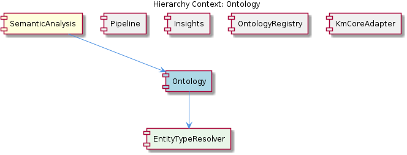
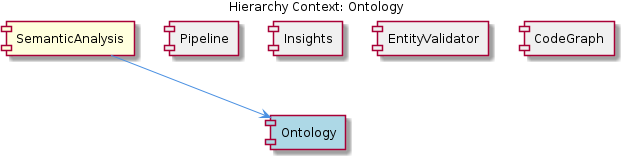

# Ontology

**Type:** SubComponent

The ontology classification system enables easier modification and extension of the agent's functionality, as demonstrated in the implementation of the SemanticAnalysisAgent in integrations/mcp-server-semantic-analysis/src/agents/semantic-analysis-agent.ts.

## What It Is  

The **Ontology** sub‑component lives inside the **SemanticAnalysis** domain of the MCP server and is realized by a collection of agents located under  

```
integrations/mcp‑server‑semantic‑analysis/src/agents/
```

Key agents that implement the ontology functionality are:

* `ontology-classification-agent.ts` – orchestrates the classification of observations against the upper‑ and lower‑ontology definitions.  
* `entity‑type‑resolution‑agent.ts` – resolves the concrete type of each entity discovered in the input data.  
* `validation‑agent.ts` – validates the resulting observations against the ontology constraints.  

All of these agents inherit from the common `BaseAgent` defined in `base-agent.ts`, which supplies a standardized lifecycle (initialisation, execution, result handling) for every agent in the SemanticAnalysis pipeline. The Ontology sub‑component therefore represents a **modular, agent‑based classification layer** that sits beneath the higher‑level `SemanticAnalysisAgent` (see `semantic-analysis-agent.ts`) and above the downstream Insight generation and Constraint monitoring stages.

---

## Architecture and Design  

The ontology system follows a **modular, agent‑centric architecture**. The cornerstone of this design is the **BaseAgent pattern** (observed in `integrations/mcp-server-semantic-analysis/src/agents/base-agent.ts`). By extending `BaseAgent`, each specialized agent—classification, type resolution, validation—shares a common contract: a `run()` method, configuration handling, and a result‑publishing interface. This pattern eliminates duplication and enforces consistency across the SemanticAnalysis family of agents.

Interaction between agents is **sequentially chained** but loosely coupled: the `OntologyClassificationAgent` first maps raw observations to upper/lower ontology concepts (see its own file for the definition logic). Its output is then consumed by the `EntityTypeResolutionAgent`, which refines the classification by determining the precise entity type. Finally, the `ValidationAgent` checks the refined observations against ontology rules, emitting validation reports. Because each agent operates on the output of the previous one without direct knowledge of the others’ internal state, the design supports **easy extension**—new agents can be inserted into the chain or existing ones replaced without touching the surrounding code.

The architecture also mirrors the **parent‑child relationship** with the broader `SemanticAnalysis` component. `SemanticAnalysisAgent` (in `semantic-analysis-agent.ts`) leverages the ontology agents as reusable building blocks, demonstrating a **composition** approach: the higher‑level agent composes lower‑level agents to achieve end‑to‑end semantic processing. Sibling components such as **Pipeline**, **Insights**, and **ConstraintMonitor** share the same modular philosophy—each defines its own set of agents (e.g., `insight-generation-agent.ts` for Insights) that plug into the overall workflow, reinforcing a consistent system‑wide design language.

---

## Implementation Details  

1. **BaseAgent (`base-agent.ts`)** – Provides the abstract class `BaseAgent` with lifecycle hooks (`initialize()`, `execute()`, `finalize()`) and a protected `logger`. All ontology agents extend this class, inheriting its error handling and configuration loading mechanisms.  

2. **OntologyClassificationAgent (`ontology-classification-agent.ts`)** – Implements the upper/lower ontology definitions. It reads a static ontology schema (likely JSON or YAML) and maps incoming observation strings to ontology nodes. The agent exposes a method `classify(observation: Observation): OntologyNode` that returns the most specific node based on the hierarchy.  

3. **EntityTypeResolutionAgent (`entity-type-resolution-agent.ts`)** – Takes the classification result and resolves the concrete entity type. It contains logic to disambiguate entities that share a parent ontology node but differ in domain‑specific attributes. The key function `resolveType(classifiedNode: OntologyNode): EntityType` performs this refinement.  

4. **ValidationAgent (`validation-agent.ts`)** – Consumes the fully resolved entities and validates them against ontology constraints (cardinality, required properties, value ranges). It uses a `validate(entity: ResolvedEntity): ValidationResult` routine that aggregates any violations into a report consumed later by the **ConstraintMonitor** component.  

5. **SemanticAnalysisAgent (`semantic-analysis-agent.ts`)** – Demonstrates how the ontology agents are composed. It creates instances of the three ontology agents, passes configuration objects, and orchestrates the pipeline: classification → type resolution → validation. Because each agent follows the `BaseAgent` contract, the `SemanticAnalysisAgent` can invoke them uniformly via their `execute()` methods.

All agents are written in TypeScript and rely on the same module resolution strategy used throughout the MCP codebase, ensuring type safety and IDE‑friendly navigation.

---

## Integration Points  

* **Parent – SemanticAnalysis**: The Ontology agents are directly invoked by `SemanticAnalysisAgent`. The parent component supplies the raw observation stream (e.g., extracted from logs or telemetry) and receives a validated, typed set of entities ready for downstream insight extraction.  

* **Sibling – Insights**: The `InsightGenerationAgent` (found in `insight-generation-agent.ts`) consumes the validated entities produced by the ontology pipeline to generate higher‑level business insights. The shared use of `BaseAgent` means the Insight agent can be swapped or extended with the same lifecycle expectations.  

* **Sibling – ConstraintMonitor**: Validation results emitted by `validation-agent.ts` feed the ConstraintMonitor dashboard (documented in `integrations/mcp-constraint-monitor/dashboard/README.md`). Violations are surfaced to operators, closing the loop between ontology enforcement and operational monitoring.  

* **Sibling – Pipeline**: The batch processing pipeline defined in `batch-analysis.yaml` declares explicit `depends_on` edges. The ontology agents appear as distinct steps within this DAG, guaranteeing that classification occurs before type resolution and validation, and that all three complete before the pipeline proceeds to insight generation.  

* **External Dependencies**: The agents import shared utilities (e.g., logging, configuration loaders) from the core MCP libraries. They also read ontology definition files that reside alongside the agents, ensuring that schema changes are localized to the ontology sub‑component.

---

## Usage Guidelines  

1. **Extend via BaseAgent** – When adding new ontology‑related functionality (e.g., a new rule set or a specialized resolver), create a class that extends `BaseAgent`. Implement the required lifecycle methods and register the agent within `SemanticAnalysisAgent` to keep the execution chain intact.  

2. **Maintain the Upper/Lower Hierarchy** – The classification logic depends on the upper/lower ontology definitions stored in `ontology-classification-agent.ts`. Any modification to the ontology schema must preserve the hierarchical relationships; otherwise, downstream type resolution may produce inaccurate results.  

3. **Keep Validation Stateless** – `ValidationAgent` should not retain mutable state between runs; it must treat each entity independently to avoid cross‑contamination of validation results, which could confuse the ConstraintMonitor UI.  

4. **Leverage Configuration Files** – All agents read their settings from configuration objects passed during initialization. Use the same configuration format as other agents in the SemanticAnalysis component to ensure consistency and avoid parsing errors.  

5. **Test in Isolation and as Part of the Pipeline** – Unit tests should target each agent’s core method (`classify`, `resolveType`, `validate`). Integration tests should run the full DAG defined in `batch-analysis.yaml` to verify that the agents cooperate correctly and that downstream Insight and ConstraintMonitor components receive the expected payloads.

---

### Summary of Architectural Insights  

| Item | Detail |
|------|--------|
| **Architectural patterns identified** | BaseAgent pattern (standardised agent lifecycle), modular agent‑based composition, sequential chaining of specialised agents. |
| **Design decisions and trade‑offs** | Centralising common behaviour in `BaseAgent` reduces duplication but introduces a single point of change; the sequential chain simplifies reasoning but can become a bottleneck if any agent is slow. |
| **System structure insights** | Ontology sits as a child of `SemanticAnalysis`, exposing three focused agents; siblings share the same BaseAgent contract, enabling uniform pipeline construction. |
| **Scalability considerations** | Because each agent is independent, they can be parallelised in future (e.g., classification on a worker pool) without redesigning the contract. The current linear chain may limit throughput for very large observation volumes. |
| **Maintainability assessment** | High maintainability: shared BaseAgent enforces consistent error handling and logging; clear separation of concerns (classification, type resolution, validation) makes updates localized. The reliance on static ontology definitions requires disciplined schema versioning to avoid breaking downstream agents. |

## Diagrams

### Relationship




## Architecture Diagrams




## Hierarchy Context

### Parent
- [SemanticAnalysis](./SemanticAnalysis.md) -- [LLM] The SemanticAnalysis component utilizes a modular architecture with multiple agents, each responsible for a specific task, such as the OntologyClassificationAgent, SemanticAnalysisAgent, and ContentValidationAgent. For instance, the OntologyClassificationAgent, defined in integrations/mcp-server-semantic-analysis/src/agents/ontology-classification-agent.ts, is used for classifying observations against the ontology system. This agent follows the BaseAgent pattern, providing a standardized structure for agent development, as seen in integrations/mcp-server-semantic-analysis/src/agents/base-agent.ts. The use of this pattern enables easier modification and extension of the agent's functionality, as demonstrated in the implementation of the SemanticAnalysisAgent in integrations/mcp-server-semantic-analysis/src/agents/semantic-analysis-agent.ts.

### Siblings
- [Pipeline](./Pipeline.md) -- The batch processing pipeline follows a DAG-based execution model, with each step declaring explicit depends_on edges in batch-analysis.yaml.
- [Insights](./Insights.md) -- The insight generation system uses a pattern catalog to extract insights, as implemented in integrations/mcp-server-semantic-analysis/src/agents/insight-generation-agent.ts.
- [ConstraintMonitor](./ConstraintMonitor.md) -- The constraint monitoring system uses a dashboard to display constraint violations, as seen in integrations/mcp-constraint-monitor/dashboard/README.md.


---

*Generated from 7 observations*
