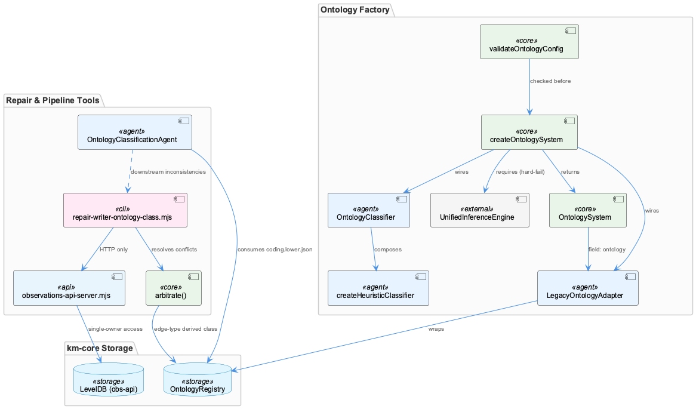
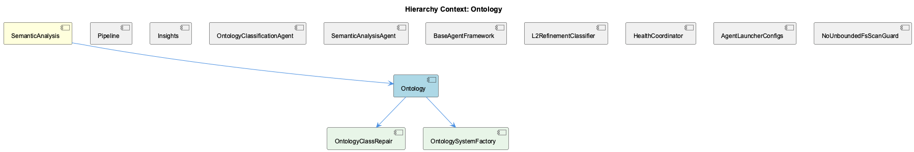

# Ontology

**Type:** SubComponent

[CGR] Imports: OntologyConfigManager.ts, OntologyConfigManager, ontologyPathResolver.ts, __clearCache, __getProbeCount, OntologyPathNotFoundError, __resetProbeCounter, resolveOntologyPath, ApiClient.ts, Entity (+10 more)

# Ontology — Technical Insight Document

## What It Is

Ontology is the classification and validation subsystem underpinning SemanticAnalysis, implemented primarily in `integrations/semantic-analysis/src/agents/ontology-classification-agent.ts`, with supporting logic in `l2-subsystem-classifier.ts`, `LegacyOntologyAdapter.ts`, and configuration/resolution utilities such as `OntologyConfigManager.ts` and `ontologyPathResolver.ts`. It is responsible for assigning ontology metadata (class, confidence, classification method) to observations extracted from git history and LSL sessions, and for validating that resulting entities conform to a defined class/hierarchy schema before they are persisted into the knowledge graph (via `GraphKMStore.ts`'s `ontology` method and the `Ontology` class defined in `types.ts`). It sits as a subcomponent of the SemanticAnalysis pipeline, alongside Pipeline, Insights, BaseAgent, L2SubsystemClassifier, and LegacyOntologyAdapter.

## Architecture and Design

The core architectural pattern is a layered, hybrid classification strategy: heuristic classifiers, an LLM-backed `OntologyClassifier`, and hard-coded hierarchy-root guards are combined within `OntologyClassificationAgent`. Closed-set root entities (CollectiveKnowledge, Coding, DynArch, Timeline, Normalisa), sourced from `HIERARCHY_ROOTS` in `@fwornle/km-core`, bypass normal classification entirely — a deliberate trade-off favoring correctness/determinism for known top-level entities over full ML-driven flexibility.

Layered atop this is a Phase 57/60 L2 refinement stage that narrows generic L1 classes (Component/SubComponent/Detail) into specific subsystem classes declared in `coding.lower.json`. This refinement is decomposed into pure, testable helper functions (`loadL2Classes`, `buildL2RefinementPrompt`, `extractL2FromLLMResponse`), separating prompt construction and response parsing from orchestration logic — a clear design choice for unit-testability and maintainability. The sibling `L2SubsystemClassifier` provides a deterministic keyword-based fallback, ensuring the system degrades gracefully rather than failing hard when LLM calls fail or configuration is missing.

`OntologyValidator` acts as a gatekeeping layer, enforcing class/hierarchy constraints against lower ontology definitions before entities are accepted, reflecting a validate-before-persist pattern consistent with the pipeline's confidence/issue-detection ethos inherited from BaseAgent.

## Implementation Details

`OntologyClassificationAgent` orchestrates classification by chaining heuristics, LLM calls, and hierarchy-root shortcuts. The L2 refinement helpers are intentionally pure functions — `loadL2Classes` reads subsystem definitions, `buildL2RefinementPrompt` constructs the LLM prompt, and `extractL2FromLLMResponse` parses results — enabling isolated testing without invoking an actual LLM. Graceful degradation is explicit: if `coding.lower.json` is absent, L2 refinement returns empty results instead of throwing.

Supporting infrastructure includes `resolveOntologyDir` (used in `backfill-insight-mentions.mjs` and `backfill-l2-subsystem-class.mjs`), `KG_ONTOLOGY_DIR` and `collectByOntologyClass` in `observations-api-server.mjs`, and `handleOntologyClasses` in `api-routes.js` — indicating the ontology directory/config is resolved consistently across backfill scripts and API servers. `OntologyPathNotFoundError`, `resolveOntologyPath`, `__clearCache`, and `__getProbeCount`/`__resetProbeCounter` (from `ontologyPathResolver.ts`) suggest a caching, probe-counted path-resolution mechanism with test-hooks for cache invalidation.

## Integration Points

Ontology data flows through `GraphKMStore.ts` (the `ontology` method) into the knowledge graph, with `Ontology` typed in `types.ts`. It integrates with `OntologyConfigManager` for configuration and `ontologyPathResolver` for locating ontology definition files. API-facing integration occurs via `handleOntologyClasses` and `collectByOntologyClass`/`KG_ONTOLOGY_DIR` in the observations API server, exposing ontology classes to consumers like `ApiClient.ts`. It also connects to viewer-facing concerns via calls to `useViewerStore`, `getClass`, `getAllClassNames`, `getRegistry`, `resolveOverlaySystem`, and `loadDisplayOverlay`, indicating ontology classes drive UI overlay/display logic as well. Test coverage spans `events.test.ts`, `graph-builder.test.ts`, and dedicated ontology variable usages across `knowledge-management.json`.

## Usage Guidelines

Developers extending classification logic should preserve the layered fallback design: hierarchy-root guards first, then heuristics/LLM, then L2 refinement with its keyword-based fallback via L2SubsystemClassifier — never let a missing `coding.lower.json` or LLM failure raise an exception; return empty/degraded results instead. New helper logic for prompt building or response parsing should remain pure and isolated, following the pattern of `loadL2Classes`/`buildL2RefinementPrompt`/`extractL2FromLLMResponse` to keep testability high. Always route new entities through `OntologyValidator` before persistence, and use `resolveOntologyPath`/`OntologyConfigManager` rather than hardcoding ontology directory paths, to stay consistent with existing backfill scripts and API server usage.

## Code Evidence

Key code artifacts grounding this entity's analysis:

**Structural:**
- ontology (method) in GraphKMStore.ts
- Ontology (class) in types.ts
- handleOntologyClasses (method) in api-routes.js
- resolveOntologyDir (function) in backfill-insight-mentions.mjs
- resolveOntologyDir (function) in backfill-l2-subsystem-class.mjs
- KG_ONTOLOGY_DIR (class) in observations-api-server.mjs
- collectByOntologyClass (function) in observations-api-server.mjs

**Relationships:**
- Calls: _tokenize, apiPath, get, classifyAvailable, useViewerStore, getClass, getAllClassNames, getRegistry, resolveOverlaySystem, loadDisplayOverlay (+10 more)
- Imports: OntologyConfigManager.ts, OntologyConfigManager, ontologyPathResolver.ts, __clearCache, __getProbeCount, OntologyPathNotFoundError, __resetProbeCounter, resolveOntologyPath, ApiClient.ts, Entity (+10 more)

**Other:**
- ontology (variable) in knowledge-management.json
- ontology (variable) in events.test.ts
- ontology (variable) in graph-builder.test.ts

## Hierarchy Context

### Parent
- [SemanticAnalysis](./SemanticAnalysis.md) -- SemanticAnalysis is a multi-agent pipeline (integrations/semantic-analysis/src/agents/) that processes git history and LSL session data to extract, classify, and persist structured knowledge entities into the ontology-backed knowledge graph. It orchestrates specialized agents extending BaseAgent (base-agent.ts) which wrap agent-specific logic in a standardized AgentResponse envelope, computing confidence breakdowns, detecting issues, and generating routing suggestions for retry/escalation between workflow steps.

At its core, OntologyClassificationAgent (ontology-classification-agent.ts) assigns ontology metadata (class, confidence, method) to observations by combining heuristic classifiers, an LLM-backed OntologyClassifier, and hard-coded hierarchy-root guards for closed-set entities (CollectiveKnowledge, Coding, DynArch, Timeline, Normalisa) imported from @fwornle/km-core's HIERARCHY_ROOTS. A newer L2 refinement layer (Phase 57/60) further refines generic L1 classes (Component/SubComponent/Detail) into specific subsystem classes declared in coding.lower.json, using pure, independently-testable helper functions (loadL2Classes, buildL2RefinementPrompt, extractL2FromLLMResponse) alongside a deterministic keyword-based fallback classifier (l2-subsystem-classifier.ts).

The SemanticAnalysisAgent (semantic-analysis-agent.ts) performs the actual code/git/vibe cross-analysis, reading files from git history, computing complexity metrics and architectural pattern detection, and invoking an LLM (via @rapid/llm-proxy's LLMService) to generate deeper semantic insights that are merged with heuristically-detected patterns. The pipeline emphasizes testability (extensive node:test suites with tmpdir-isolated ontology fixtures) and graceful degradation (e.g., absent coding.lower.json yields empty L2 refinement rather than errors), reflecting an incremental, plan-driven development process (Phase 42/57/60 markers throughout the code).

### Siblings
- [Pipeline](./Pipeline.md) -- Pipeline agents extend BaseAgent (base-agent.ts) so each stage wraps its output in a standardized AgentResponse envelope with confidence breakdowns.
- [Insights](./Insights.md) -- [CGR] INSIGHTS (class) in kb-ab-sample-tasks.mjs
- [BaseAgent](./BaseAgent.md) -- [LLM] The code files supplied for this analysis (config/agents/copilot.sh, config/agents/opencode.sh, config/agents/pi.sh, config/agents/pi-extensions/no-unbounded-fs-scan.ts, integrations/system-health-dashboard/src/components/agent-badge.tsx) do not correspond to the parent-context description of BaseAgent (integrations/semantic-analysis/src/agents/base-agent.ts) and its execute() -> process() -> calculateConfidence() -> detectIssues() -> generateRouting() -> applyCorrections() -> buildMetadata() pipeline. There is a naming collision between two unrelated 'agent' concepts in this codebase: (1) semantic-analysis's BaseAgent subclasses (OntologyClassificationAgent, SemanticAnalysisAgent) that process observations into knowledge-graph entities, and (2) the top-level 'coding' CLI wrapper's per-tool agent launch configs (copilot/opencode/pi) that configure how a human-facing coding assistant CLI is started, proxied, and instrumented. No code_graph data was provided, so no [LLM+CGR] observations can be made; all statements below are grounded in the literal file contents shown, not in the BaseAgent class itself.
- [L2SubsystemClassifier](./L2SubsystemClassifier.md) -- [LLM] The L2SubsystemClassifier's fallback path is a deterministic keyword-based classifier housed in l2-subsystem-classifier.ts, separate from the LLM-driven refinement in ontology-classification-agent.ts. This separation lets the pipeline degrade gracefully: when the LLM call fails, times out, or coding.lower.json is absent, the workflow can still emit an L2 class (or empty result) without throwing, consistent with the project's stated 'graceful degradation' design goal rather than hard-failing the whole classification step.
- [LegacyOntologyAdapter](./LegacyOntologyAdapter.md) -- [CGR] LegacyOntologyAdapter (class) in LegacyOntologyAdapter.ts

---

*Generated from 18 observations*
