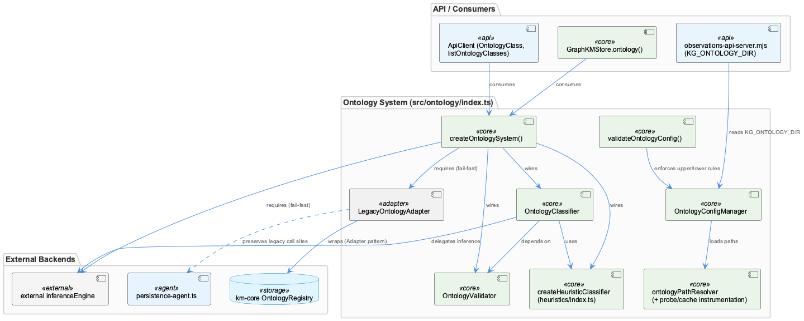
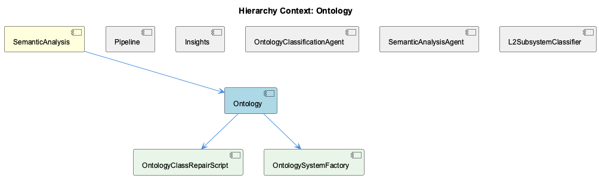

# Ontology

**Type:** SubComponent

## What It Is

Ontology is the SubComponent under SemanticAnalysis responsible for aggregating and wiring together the classification/validation subsystem used across the codebase's knowledge-management pipeline. Its aggregation point is `src/ontology/index.ts`, a barrel/composition-root file that exports `types.js`, `LegacyOntologyAdapter.js`, `OntologyValidator.js`, `OntologyClassifier.js`, `OntologyConfigManager.js`, `ontologyPathResolver.js`, `heuristics/index.js`, and `metrics.js`. Supporting surfaces exist elsewhere in the system: `Ontology`/`OntologyClass` types in `types.ts`, an `OntologyClass` class and `listOntologyClasses`/`listOntologyClassesNoDisplay` methods in `ApiClient.ts`, an `ontology` method on `GraphKMStore.ts`, and a `KG_ONTOLOGY_DIR` reference in `observations-api-server.mjs`, indicating the ontology's file-backed data is consumed both server-side and via API clients.

## Architecture and Design

The dominant pattern is Factory/composition-root: `createOntologySystem` in `src/ontology/index.ts` assembles `OntologyValidator`, `OntologyClassifier`, a heuristic classifier from `heuristics/index.ts` (`createHeuristicClassifier`), and a `LegacyOntologyAdapter`. This file contains no classification or validation logic itself — it is pure wiring, confirmed by the import graph matching its export list exactly (LegacyOntologyAdapter, OntologyClassifier, OntologyConfigManager, ontologyPathResolver, OntologyValidator, ontology/types).

A second pattern is the Adapter/migration seam: `LegacyOntologyAdapter` wraps a km-core `OntologyRegistry` so the older `OntologyValidator`/`OntologyClassifier` can keep operating unmodified. This adapter is documented inline as replacing a deleted legacy manager per "Phase 42-03 D-53," and the same adapter is constructed independently by the sibling OntologyClassificationAgent — the index.ts factory is described as "the other half of that migration seam."

A notable design trade-off is asymmetric failure handling: missing optional ontology data follows a "safe default" pattern, while missing required constructor dependencies (`inferenceEngine`, a pre-built adapter) cause `createOntologySystem` to throw explicit errors with no mock fallback. This fail-fast-on-dependencies/safe-default-on-data split is a deliberate architectural stance, not an oversight.

## Implementation Details

`createOntologySystem` requires both an `inferenceEngine` and a pre-built `LegacyOntologyAdapter` at construction time; absence of either produces a thrown Error rather than silent degradation. The resulting `OntologySystem` interface exposes an `ontology: LegacyOntologyAdapter` field as its primary handle on registry data.

Configuration validation is deliberately decoupled from system construction: `validateOntologyConfig` performs synchronous, side-effect-free checks — `upperOntologyPath` is required when `enabled` is true, and `lowerOntologyPath` is required whenever a team is specified — allowing callers to catch configuration errors before paying the cost of loading ontology files or constructing an inference engine.

Supporting infrastructure includes `OntologyConfigManager.ts` and `ontologyPathResolver.ts` for locating and resolving ontology file paths, and `metrics.ts` for instrumentation. Data-facing symbols like `Ontology`/`OntologyClass` in `types.ts`, `OntologyClass` in `ApiClient.ts`, and `listOntologyClasses`/`listOntologyClassesNoDisplay` suggest a parallel client-facing surface for enumerating ontology classes, distinct from the classification engine itself.

## Integration Points

Ontology sits under SemanticAnalysis and is closely coupled to its children: OntologySystemFactory is literally the `createOntologySystem` implementation in `src/ontology/index.ts`, while OntologyClassRepairScript (`scripts/repair-writer-ontology-class.mjs`) consumes ontology class data via obs-api's `/api/v1/entities` and `/api/v1/relations` endpoints and builds a parent-class map from `.data/ontologies/obs-api/*.json` to reconcile entities whose `ontologyClass` contradicts `entityType`.

Sibling components share both data and defect surface: L2SubsystemClassifier is meant to prevent emission of `CodingLowerOntologySource`, yet the Pipeline sibling documents a live bug where this forbidden source type is still emitted — a discrepancy in the L2 refinement source model (coding.lower.json → OntologyRegistry → classification) that nothing in the index.ts factory wiring currently guards against. OntologyClassificationAgent independently constructs the same `LegacyOntologyAdapter`, reinforcing the adapter as a shared migration seam rather than an Ontology-internal detail. A separate but conceptually adjacent workstream — adding an Intent class to the coding ontology for session-intent classification — is tracked distinctly from the KB's Intent-First Organization taxonomy work owned by SemanticAnalysisAgent.

## Usage Guidelines

Callers should invoke `validateOntologyConfig` before `createOntologySystem` to surface configuration errors (missing `upperOntologyPath` or `lowerOntologyPath`) cheaply, avoiding unnecessary file loads or inference-engine construction. Both `inferenceEngine` and a pre-built adapter must be supplied explicitly to `createOntologySystem`; there is no mock fallback, so tests and callers must construct real or stub instances rather than relying on defaults.

Because `src/ontology/index.ts` is purely aggregation, developers extending ontology behavior should modify the underlying modules (`OntologyValidator.ts`, `OntologyClassifier.ts`, `heuristics/index.ts`, `LegacyOntologyAdapter.ts`) rather than the barrel file. Given the open `CodingLowerOntologySource` emission bug, any change touching classification or the lower-ontology source model should be validated against this known discrepancy before assuming the documented invariant ("this source type should never be produced") actually holds in current pipeline output.

## Code Evidence

Key code artifacts grounding this entity's analysis:

**Structural:**
- ontology (method) in GraphKMStore.ts
- Ontology (class) in types.ts
- OntologyClass (class) in ApiClient.ts
- listOntologyClasses (method) in ApiClient.ts
- listOntologyClassesNoDisplay (method) in ApiClient.ts
- OntologyClass (class) in types.ts
- KG_ONTOLOGY_DIR (class) in observations-api-server.mjs

**Relationships:**
- Calls: apiPath, get, _tokenize, e, useViewerStore, classifyAvailable, getClass, getAllClassNames, getRegistry, resolveOverlaySystem (+10 more)
- Imports: heuristics/index.ts, createHeuristicClassifier, LegacyOntologyAdapter.ts, LegacyOntologyAdapter, metrics.ts, OntologyClassifier.ts, OntologyClassifier, OntologyConfigManager.ts, ontologyPathResolver.ts, OntologyValidator.ts (+10 more)

**Other:**
- ontology (variable) in events.test.ts
- ontology (variable) in graph-builder.test.ts
- ontology (variable) in knowledge-management.json
- src/ontology/index.ts's createOntologySystem factory wires together LegacyOntologyAdapter, OntologyValidator, OntologyClassifier, and createHeuristicClassifier from heuristics/index.ts, requiring both an inferenceEngine and a pre-built adapter with no mock fallback — errors are thrown explicitly rather than silently degraded, reflecting the codebase's stated 'safe default over hard failure' pattern for missing ontology data but a hard-failure stance for missing required dependencies like the LLM engine.
- The exports list in src/ontology/index.ts (types.js, LegacyOntologyAdapter.js, OntologyValidator.js, OntologyClassifier.js, OntologyConfigManager.js, ontologyPathResolver.js, heuristics/index.js, metrics.js) matches the import graph's LegacyOntologyAdapter, OntologyClassifier, OntologyConfigManager, ontologyPathResolver, OntologyValidator, and ontology/types.ts entries, confirming this file is the barrel/aggregation point for the whole ontology subsystem rather than an implementation file itself.

## Work Record

What working sessions recorded about this entity — decisions taken, problems hit, and why things are the way they are:

- Coding Ontology — Intent Class Addition explores adding a new Intent class to the coding ontology so entities can be classified by session intent, distinct from the KB's separate intent-spine taxonomy work.
- Pipeline CodingLowerOntologySource Emission Bug documents that the pipeline emits a CodingLowerOntologySource reference in output despite documentation stating this source type should never be produced; this is flagged as a live discrepancy in the L2 refinement source model (coding.lower.json → OntologyRegistry → classification) rather than a documentation error, and nothing in src/ontology/index.ts's factory wiring visibly guards against it.
- Coding Ontology — Intent Class Addition (about Ontology) explores adding a new Intent class to the coding ontology so entities can be classified by underlying session intent, a workstream distinct from but conceptually adjacent to the KB 'Intent-First Organization' taxonomy work tracked separately for insights.

## Hierarchy Context

### Parent
- [SemanticAnalysis](./SemanticAnalysis.md) -- [SESSION] Pipeline CodingLowerOntologySource Emission Bug documents an unresolved defect where the pipeline emits a CodingLowerOntologySource reference in output despite documentation stating this source type should never be produced, indicating a gap between the L2 refinement design and current emission behavior

### Children
- [OntologyClassRepairScript](./OntologyClassRepairScript.md) -- [LLM] scripts/repair-writer-ontology-class.mjs is the actual implementation matching the 'OntologyClassRepairScript' name: it scans entities via obs-api's /api/v1/entities and /api/v1/relations endpoints, builds a parent-class map from .data/ontologies/obs-api/*.json, and reconciles rows where ontologyClass contradicts entityType, distinguishing repairable (writer-owned), migratable (tag-in-class-field), conflicting (artifact vs artifact), and foreign/unknown-class cases.
- [OntologySystemFactory](./OntologySystemFactory.md) -- [LLM+CGR] The actual factory logic lives in src/ontology/index.ts's createOntologySystem, which requires both an inferenceEngine and a pre-built LegacyOntologyAdapter with no mock fallback, throwing explicit Errors when either is missing rather than degrading silently — this is the concrete implementation behind the entity labeled 'OntologySystemFactory'.

### Siblings
- [Pipeline](./Pipeline.md) -- [SESSION] Pipeline CodingLowerOntologySource Emission Bug tracks an unresolved defect where the pipeline emits a CodingLowerOntologySource reference in output despite documentation stating this source type should never be produced, indicating a gap between L2 refinement design and current emission behavior.
- [Insights](./Insights.md) -- [SESSION] writeInsight Embedding-Based Dedup Integration tracks embedding-based near-duplicate detection being wired into the writeInsight path behind a dry-run flag so live writes are unaffected until latency/precision are validated.
- [OntologyClassificationAgent](./OntologyClassificationAgent.md) -- [SESSION] Coding Ontology — Intent Class Addition is scoped as a distinct ontology-file investigation, separate from classification agent logic but affects what classes this agent can assign.
- [SemanticAnalysisAgent](./SemanticAnalysisAgent.md) -- [SESSION] Taxonomy Stability Validation via Disjoint Sample Re-derivation validates that an intent-derived taxonomy is stable enough to serve as a fixed spine by re-deriving it independently from disjoint data samples and measuring agreement.
- [L2SubsystemClassifier](./L2SubsystemClassifier.md) -- [SESSION] Pipeline CodingLowerOntologySource Emission Bug is the unresolved defect most directly attributable to this component's L2 refinement design, since the classifier is meant to prevent CodingLowerOntologySource from ever being emitted.

---

*Generated from 22 observations*
