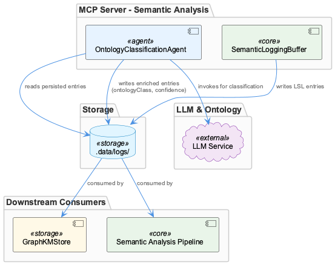

# OntologyClassificationAgent

**Type:** SubComponent

Classification output includes explicit ontology metadata fields (entityType, metadata.ontologyClass) on each enriched LSL entry, consistent with the pattern described in the broader agent-integration-guide.md of pre-populating ontology fields to prevent redundant re-classification.

# OntologyClassificationAgent — Technical Insight Document

## What It Is

`OntologyClassificationAgent` is implemented at `integrations/mcp-server-semantic-analysis/src/agents/ontology-classification-agent.ts` and functions as a **post-capture enrichment layer** within the LiveLoggingSystem. Rather than intercepting log entries as they are written, it operates asynchronously against already-persisted LSL entries, reading from the `.data/logs/` directory that SemanticLoggingBuffer populates during live Claude Code sessions. Its primary responsibility is to invoke an LLM to assign structured ontology class labels and confidence scores to each LSL observation, lifting raw transcript content into the typed ontology vocabulary consumed by downstream knowledge management pipelines.

Within the LiveLoggingSystem hierarchy, the agent represents the classification tier — the semantic enrichment step that transforms what SemanticLoggingBuffer writes into something that graph-aware consumers like `GraphKMStore` can reason over with confidence.

## Architecture and Design

The most significant architectural decision is the **strict decoupling from SemanticLoggingBuffer**. The two components share no in-process communication path. SemanticLoggingBuffer owns the write path — normalizing and persisting LSL entries to `.data/logs/` — while `OntologyClassificationAgent` owns the enrichment path, reading those same files independently. This separation means classification is not a blocking concern during capture: a session can be logged completely even if the LLM classification step is unavailable, slow, or misconfigured.

This decoupling also enables **retry and replay semantics**. Because the agent reads from durable log files rather than an in-memory stream, any entry can be re-classified without re-running a capture session. This is a meaningful operational affordance: if a classification model changes, confidence thresholds are recalibrated, or a batch of entries was misclassified, the agent can be re-run against the same `.data/logs/` files to produce fresh ontology annotations. The architecture treats classification as a side-effecting enrichment pass rather than a one-time event tightly coupled to capture time.

The agent conforms to the project-wide agent abstraction pattern documented in `docs/architecture/agent-abstraction-api.md`, exposing a standard interface that the broader Coding infrastructure can invoke uniformly. This means `OntologyClassificationAgent` is not a bespoke pipeline script — it participates in the same agent contract as other components, making it substitutable and composable within the system's agent orchestration layer.

## Implementation Details

Classification output is materialized as structured metadata on each enriched LSL entry, specifically populating the `entityType` and `metadata.ontologyClass` fields. This field-level contract is intentional and consequential: the `agent-integration-guide.md` documents a system-wide convention of **pre-populating ontology fields** on entries to prevent redundant re-classification by downstream consumers. By writing these fields during the enrichment pass, `OntologyClassificationAgent` acts as the authoritative classifier — downstream stages such as `GraphKMStore` can trust that a populated `metadata.ontologyClass` field is already settled and skip re-invoking an LLM.

Alongside the class label, the agent attaches a **confidence score** to each classified entry. This is not merely decorative metadata — it is a first-class signal for downstream consumers. `GraphKMStore` and semantic analysis pipelines can use confidence thresholds to filter low-certainty entries, weight graph edges by classification reliability, or flag entries for human review. The confidence score effectively makes the agent's uncertainty legible to the rest of the system, enabling probabilistic reasoning rather than treating all classifications as equally authoritative.

The LLM invocation is the computational core of the agent. Each LSL observation is passed to the language model with sufficient context for the model to assign a class from the project's structured ontology. The agent bridges the gap between the free-form transcript content captured by SemanticLoggingBuffer and the typed ontology vocabulary that knowledge graph consumers require.

## Integration Points

The agent's primary upstream dependency is the `.data/logs/` file store written by SemanticLoggingBuffer. The two components share this directory as a **loose coupling point** — SemanticLoggingBuffer writes, `OntologyClassificationAgent` reads, and neither has a direct reference to the other. This makes the integration resilient: changes to SemanticLoggingBuffer's internal architecture do not affect the classification agent as long as the LSL file format contract is preserved.

Downstream, the agent's output feeds `GraphKMStore` and any other semantic analysis consumers that depend on `entityType` and `metadata.ontologyClass` being populated. The confidence score field extends this integration by giving consumers a filtering handle — a consumer can trivially ignore entries below a confidence threshold without needing its own classification logic.

The agent's conformance to `docs/architecture/agent-abstraction-api.md` means it is also integrated at the orchestration level. The broader Coding infrastructure that manages agent lifecycles can invoke, schedule, or supervise `OntologyClassificationAgent` through the same interface it uses for all other agents in the system.

## Usage Guidelines

**Do not treat classification as synchronous with capture.** The architectural intent is clear: classification happens after SemanticLoggingBuffer has finished writing entries. Developers should not attempt to wire `OntologyClassificationAgent` into the live capture path or block on its completion before proceeding with downstream processing that does not require ontology labels.

**Respect the pre-population convention.** As documented in `agent-integration-guide.md`, once `entityType` and `metadata.ontologyClass` are populated by this agent, downstream components should treat those fields as settled. Overwriting or re-classifying entries that already carry ontology metadata undermines the system's redundancy-prevention design and may introduce inconsistencies in the knowledge graph.

**Use confidence scores as first-class signals.** Downstream consumers — particularly `GraphKMStore` integrations — should be written to consume the confidence score rather than assuming all classified entries are equally reliable. Building confidence-aware filtering into consumers from the start is significantly cheaper than retrofitting it later when classification <USER_ID_REDACTED> variance becomes visible in graph outputs.

**Leverage replay capability deliberately.** The file-based read path means re-running the agent over historical `.data/logs/` entries is a supported and safe operation. When the underlying LLM, ontology schema, or classification prompts change, a replay pass is the correct remediation path rather than patching individual entries manually.

**Conform to the agent abstraction contract.** Any modifications to `OntologyClassificationAgent` should preserve its compliance with the interface specified in `docs/architecture/agent-abstraction-api.md`. Deviating from this contract would isolate the component from the broader agent orchestration infrastructure and reduce its composability within the LiveLoggingSystem.

## Hierarchy Context

### Parent
- [LiveLoggingSystem](./LiveLoggingSystem.md) -- The LiveLoggingSystem (LSL) is a session logging infrastructure that captures, classifies, and persists AI agent conversations—primarily from Claude Code—into a unified format. It handles session windowing (time-window identifiers like '0800-0900'), multi-user support via SHA-256 user hashing, file routing with rotation thresholds, and transcript capture from agent-native formats. The system bridges raw agent transcripts to a normalized LSL format used downstream by semantic analysis and knowledge management pipelines.

### Siblings
- [SemanticLoggingBuffer](./SemanticLoggingBuffer.md) -- SemanticLoggingBuffer resides in integrations/mcp-server-semantic-analysis/src/logging.ts and serves as the primary write path for normalized LSL log entries produced during Claude Code sessions.

---

*Generated from 6 observations*
