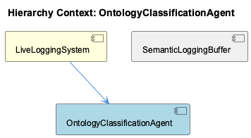

# OntologyClassificationAgent

**Type:** SubComponent

OntologyClassificationAgent could utilize the ContentValidationAgent to validate content using various modes and provide validation reports.

## What It Is  

The **OntologyClassificationAgent** is a sub‑component that lives inside the **KnowledgeManagement** module.  Its primary responsibility is to apply an ontology‑based reasoning layer to incoming entities, produce a classification label, and attach a confidence score that reflects how well the entity matches the ontology concepts.  The agent is instantiated together with its two children – **OntologyInitializer** and **OntologyModelLoader** – which together bootstrap the ontology store and load the model definitions that drive the classification logic.  

Although the repository does not expose concrete source files for the agent itself (the “0 code symbols found” observation), its surrounding context makes its placement clear: it is referenced by the **LiveLoggingSystem** and the **KnowledgeManagement** component, and it collaborates with several sibling agents (e.g., **CodeAnalysisAgent**, **ContentValidationAgent**, **ManualLearning**, **GraphDatabaseManager**).  The ontology system that the agent relies on is expected to be persisted through the same **GraphDatabaseAdapter** that the parent component uses (see `storage/graph-database-adapter.ts`).  In short, the OntologyClassificationAgent is the logical hub that turns raw concepts extracted elsewhere into structured, scored classifications stored in the knowledge graph.  

## Architecture and Design  

The architecture surrounding the OntologyClassificationAgent follows a **composition‑over‑inheritance** style.  The agent does not stand alone; instead, it composes several specialist services that each own a distinct concern:

1. **OntologyInitializer** – prepares the ontology runtime (e.g., registers namespaces, configures inference rules).  
2. **OntologyModelLoader** – reads ontology definitions, hinted at in `integrations/code-graph-rag/README.md` where “Graph‑Code” is mentioned as a possible model source.  

These children are tightly coupled to the agent, indicating a **builder**‑like pattern where the parent orchestrates their lifecycle before any classification request is processed.  

Interaction with other components is achieved through **dependency injection** of shared infrastructure.  The **GraphDatabaseManager** (a sibling) provides the persistent graph layer via the `storage/graph-database-adapter.ts` adapter, which the OntologyClassificationAgent uses to store classified entities and their confidence scores.  The agent also **delegates** to the **CodeAnalysisAgent** when it needs to extract concepts from source code – the CodeAnalysisAgent supplies AST‑derived tokens that become candidates for ontology matching.  Likewise, the **ContentValidationAgent** can be called to verify that a classification complies with validation rules before persisting it.  

Because the parent **KnowledgeManagement** component already employs a **lock‑free** GraphDatabaseAdapter to avoid LevelDB contention, the OntologyClassificationAgent inherits a concurrency‑friendly persistence model without additional locking logic.  This reuse of the adapter is a classic **adapter pattern**: the agent works against an abstract graph interface while the concrete implementation lives in `storage/graph-database-adapter.ts`.  

## Implementation Details  

Even though the source code for the OntologyClassificationAgent itself is absent, the observations let us infer its internal workflow:

1. **Bootstrapping** – On start‑up, the **OntologyInitializer** runs first, establishing the ontology environment (loading reasoners, setting up default triples).  Immediately after, **OntologyModelLoader** reads the ontology model files (potentially the “Graph‑Code” artifacts described in `integrations/code-graph-rag/README.md`) and registers them in the in‑memory representation used for classification.  

2. **Classification Pipeline** – When an entity arrives (e.g., a code fragment, a documentation snippet, or a manually entered concept from **ManualLearning**), the agent may invoke the **CodeAnalysisAgent** to produce a set of AST‑derived concepts.  Those concepts are then matched against the loaded ontology using a similarity or subsumption algorithm that yields a **confidence score**.  The exact scoring function is not disclosed, but the presence of “confidence scores” in the observations suggests a probabilistic or fuzzy matching layer.  

3. **Persistence** – The resulting classification tuple – entity identifier, ontology class, confidence score – is handed to the **GraphDatabaseManager**, which writes it into the knowledge graph via the `storage/graph-database-adapter.ts` adapter.  Because the adapter is lock‑free, multiple classification requests can be processed concurrently without risking LevelDB lock conflicts.  

4. **Validation & Feedback** – Before committing, the agent may call **ContentValidationAgent** in one of its validation modes (e.g., schema validation, rule‑based checks) to ensure the classification does not violate domain constraints.  Validation reports are either logged or fed back to the caller for corrective action.  

5. **Manual Overrides** – The **ManualLearning** component can inject manually curated entities directly into the ontology classification pipeline, allowing human‑in‑the‑loop corrections that are persisted through the same graph pathway.  

Overall, the implementation appears to be a **pipeline‑oriented** design where each stage is a distinct, replaceable service.

## Integration Points  

- **GraphDatabaseAdapter (`storage/graph-database-adapter.ts`)** – The sole persistence gateway for the agent.  All classified entities and confidence scores flow through this adapter, benefitting from the parent component’s lock‑free, LevelDB‑backed design.  
- **CodeAnalysisAgent** – Supplies AST‑based concept extraction.  The OntologyClassificationAgent likely calls a method such as `analyzeCode(source: string): Concept[]` (exact signature not given) and consumes the returned concepts for ontology matching.  
- **ContentValidationAgent** – Provides validation services.  The agent may invoke a method like `validateClassification(classification: Classification): ValidationReport`.  
- **ManualLearning** – Offers a manual entry point for entities that bypass automatic extraction.  The integration is probably a direct method call or a shared queue that the OntologyClassificationAgent monitors.  
- **LiveLoggingSystem** – Consumes classification events for real‑time monitoring, indicating that the agent emits log entries or telemetry events whenever a classification occurs.  

All these integrations are **interface‑driven**; the OntologyClassificationAgent does not need to know the internal mechanics of its siblings, only the contracts they expose (e.g., classification input, validation output).  This decoupling simplifies testing and future replacement of any sibling component.

## Usage Guidelines  

1. **Initialize Before Use** – Ensure that both **OntologyInitializer** and **OntologyModelLoader** have completed their setup before invoking any classification method.  Attempting classification prior to model loading will result in empty or default matches.  

2. **Prefer Automated Extraction** – When possible, feed raw source artifacts to the **CodeAnalysisAgent** first; let it produce the concept set that the OntologyClassificationAgent can then match.  Direct manual insertion should be reserved for cases where automated analysis cannot capture domain‑specific nuances.  

3. **Validate Before Persisting** – Run the classification result through **ContentValidationAgent** to catch schema violations early.  Ignoring validation can lead to corrupt or inconsistent entries in the knowledge graph.  

4. **Handle Confidence Scores** – The confidence score is a key decision metric.  Downstream consumers (e.g., recommendation engines) should respect a configurable threshold; low‑confidence classifications may be flagged for manual review via **ManualLearning**.  

5. **Leverage the GraphDatabaseAdapter’s Concurrency Guarantees** – The underlying adapter is lock‑free; therefore, the agent can safely be invoked from multiple async contexts (e.g., HTTP handlers, background workers) without additional synchronization.  However, developers should still avoid race conditions at the business‑logic level (e.g., duplicate classification of the same entity).  

---

### Architectural patterns identified  
- **Composition / Builder pattern** – OntologyClassificationAgent composes OntologyInitializer and OntologyModelLoader.  
- **Adapter pattern** – Interaction with the persistent graph through `storage/graph-database-adapter.ts`.  
- **Pipeline / Chain‑of‑Responsibility** – Sequential processing through CodeAnalysisAgent → OntologyClassificationAgent → ContentValidationAgent → GraphDatabaseManager.  

### Design decisions and trade‑offs  
- **Centralized ontology store** (via GraphDatabaseAdapter) simplifies querying but creates a single point of persistence; the lock‑free design mitigates contention.  
- **Delegating concept extraction to CodeAnalysisAgent** keeps classification focused on ontology logic, at the cost of an extra inter‑component call.  
- **Confidence scoring** adds nuance to classification but introduces the need for threshold management and potential manual overrides.  

### System structure insights  
- The OntologyClassificationAgent sits in the middle tier of KnowledgeManagement, bridging raw knowledge extraction (CodeAnalysisAgent, ManualLearning) and durable storage (GraphDatabaseManager).  
- Its children handle ontology lifecycle, indicating that the agent itself is largely stateless once the model is loaded.  

### Scalability considerations  
- Because persistence relies on a lock‑free LevelDB‑backed adapter, the classification pipeline can scale horizontally across multiple worker processes without database lock bottlenecks.  
- The confidence‑scoring algorithm’s complexity (not disclosed) will be the primary scalability factor; if it involves graph traversals, caching of frequently matched concepts may be required.  

### Maintainability assessment  
- Clear separation of concerns (initialization, model loading, classification, validation, persistence) makes the component easy to test in isolation.  
- The lack of concrete source files for the agent itself is a documentation gap; adding an interface definition (e.g., `IClassificationService`) would improve discoverability.  
- Reusing the same GraphDatabaseAdapter across siblings reduces duplication but also couples their upgrade cycles; any breaking change to the adapter will ripple through all agents that depend on it.  

Overall, the OntologyClassificationAgent is architecturally well‑positioned as a thin, orchestrating layer that leverages existing infrastructure (graph database, code analysis, validation) to deliver ontology‑driven classifications with confidence metrics, while remaining extensible through its clearly defined integration points.

## Diagrams

### Relationship

## Architecture Diagrams

## Hierarchy Context

### Parent
- [KnowledgeManagement](./KnowledgeManagement.md) -- [LLM] The KnowledgeManagement component utilizes a GraphDatabaseAdapter for storing and managing knowledge graphs. This adapter, implemented in storage/graph-database-adapter.ts, enables Graphology+LevelDB persistence with automatic JSON export sync. By using this adapter, the component can efficiently store and query knowledge graphs, which are essential for entity persistence and knowledge decay tracking. Furthermore, the GraphDatabaseAdapter employs a lock-free architecture to prevent LevelDB lock conflicts, ensuring that the component can handle multiple concurrent requests without performance degradation.

### Children
- [OntologyInitializer](./OntologyInitializer.md) -- Although no direct source code is available, the parent context suggests the importance of initialization in the setup of the ontology system.
- [OntologyModelLoader](./OntologyModelLoader.md) -- The integrations/code-graph-rag/README.md file mentions the use of Graph-Code, which could be related to the ontology model used in the OntologyClassificationAgent.

### Siblings
- [ManualLearning](./ManualLearning.md) -- ManualLearning utilizes the GraphDatabaseAdapter in storage/graph-database-adapter.ts to store and manage knowledge graphs.
- [OnlineLearning](./OnlineLearning.md) -- OnlineLearning uses the batch analysis pipeline to extract knowledge from git history, LSL sessions, and code analysis.
- [GraphDatabaseManager](./GraphDatabaseManager.md) -- GraphDatabaseManager utilizes the GraphDatabaseAdapter in storage/graph-database-adapter.ts to manage the graph database connection.
- [CodeAnalysisAgent](./CodeAnalysisAgent.md) -- CodeAnalysisAgent uses AST-based techniques to analyze code structures and extract concepts.
- [ContentValidationAgent](./ContentValidationAgent.md) -- ContentValidationAgent uses various modes to validate content and provide validation reports.
- [TraceReportGenerator](./TraceReportGenerator.md) -- TraceReportGenerator generates detailed trace reports of UKB workflow runs, capturing data flow, concept extraction, and ontology classification.

---

*Generated from 5 observations*
