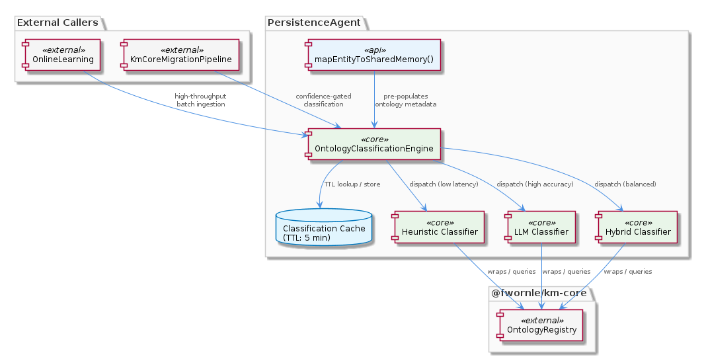
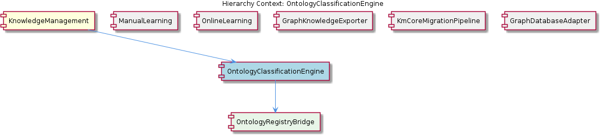

# OntologyClassificationEngine

**Type:** SubComponent

The engine's placement within PersistenceAgent mirrors the pattern described for PersistenceAgent.mapEntityToSharedMemory(), where ontology metadata fields are pre-populated to prevent re-classification on subsequent reads

# OntologyClassificationEngine — Technical Insight Document

## What It Is

The `OntologyClassificationEngine` is a SubComponent that lives inside `PersistenceAgent` and serves as a wrapper around `@fwornle/km-core`'s `OntologyRegistry`. By residing within the persistence layer rather than the extraction layer, it establishes ontology classification as a **persistence-time concern** — entities are classified at the moment they are written to storage, not at the moment they are first extracted from a source. This placement is deliberate: it mirrors the pattern in `PersistenceAgent.mapEntityToSharedMemory()`, where ontology metadata fields are pre-populated so that subsequent reads do not need to trigger re-classification.

The engine exposes three classification methods — `'heuristic'`, `'llm'`, and `'hybrid'` — and returns confidence-scored classification results. It maintains an internal 5-minute TTL cache for classification outcomes, which is critical when the engine is exercised under the high-throughput conditions imposed by the sibling `OnlineLearning` pipeline. As a child of the broader `KnowledgeManagement` parent component, it complements the storage-layer concerns handled by `GraphDatabaseAdapter` by focusing exclusively on **semantic categorization** of entities rather than their physical storage routing.

## Architecture and Design

The engine follows a **wrapper/adapter pattern** over an external authority: `@fwornle/km-core`'s `OntologyRegistry` is the source of truth for ontology definitions, and the engine adapts that external API to the internal entity model used inside `PersistenceAgent`. This translation responsibility is further delegated to its child component `OntologyRegistryBridge`, which sits at the API boundary between PersistenceAgent's internal types and the OntologyRegistry contract. The separation ensures that changes to the external `km-core` API surface can be absorbed in one place without rippling through classification logic itself.

The three-method dispatch (`heuristic`, `llm`, `hybrid`) is a **strategy pattern** that lets callers explicitly trade latency for accuracy. Heuristic classification is appropriate when bulk throughput dominates (for example, when `KmCoreMigrationPipeline` is mass-importing entities and the cost of an LLM call per row would be prohibitive). LLM classification is appropriate when precision matters more than time, such as during interactive editing flows surfaced through `ManualLearning`. The `hybrid` mode is the middle ground, presumably running heuristics first and escalating to LLM only when heuristic confidence is too low.

The 5-minute TTL cache reflects an architectural assumption that **entity patterns repeat within short windows**. During batch ingestion from `OnlineLearning`, the same entity shapes (e.g., "Person with title=CEO and org=Acme") recur frequently, and re-issuing identical LLM calls would be wasteful both in latency and in API cost. A finite TTL (rather than an unbounded cache) acknowledges that ontology definitions in the underlying `OntologyRegistry` may evolve, so cached classifications must eventually be revalidated.

## Implementation Details

The engine's core responsibility is to take an entity, apply one of the three classification strategies, and return a result that includes a **confidence score**. That score is not advisory metadata — it is a first-class gating signal. Downstream consumers, most notably the `KmCoreMigrationPipeline` runs, use it to skip low-confidence ontology assignments rather than propagate uncertain classifications into the migrated dataset. This pattern keeps the engine itself decision-neutral (it never silently drops anything) while empowering callers to enforce their own <USER_ID_REDACTED> bars.

The cache layer is keyed on the entity pattern, not the entity instance, which is what makes the 5-minute TTL effective at scale: two different entities with the same classifiable signature share a cache entry. The classification dispatch checks the cache before invoking any heuristic or LLM path, meaning the engine's effective latency under repeated patterns approaches the cost of a hashmap lookup rather than the cost of an LLM round-trip.

The internal `OntologyRegistryBridge` child component is the only code path that actually speaks to `@fwornle/km-core`'s `OntologyRegistry`. By isolating that bridge, the engine guarantees that the wrapped registry is touched through a single, consistent translation layer — no caller code inside `PersistenceAgent` ever reaches into the external ontology API directly.

## Integration Points

The most important integration is **upward into `PersistenceAgent`**, where the engine is invoked from `PersistenceAgent.mapEntityToSharedMemory()`. This is the point where classification results are written into the entity's ontology metadata fields, ensuring that classification is amortized: it runs once, at persistence time, and is read freely thereafter. This contrasts with the sibling `OnlineLearning` pipeline, which produces entities at high volume — those entities flow through `PersistenceAgent` and trigger the engine, which is why the TTL cache is sized around batch ingestion characteristics.

Downstream, the engine integrates with `KmCoreMigrationPipeline` (implemented in `scripts/migrate-leveldb-to-kmcore.mjs` as a standalone script). The migration consumes confidence scores to filter low-<USER_ID_REDACTED> classifications during the LevelDB-to-km-core migration. This relationship is asymmetric — the engine doesn't know about the migration script, but the migration script depends on the engine's confidence semantics being stable.

Externally, the engine depends entirely on `@fwornle/km-core` through its child `OntologyRegistryBridge`. Unlike its siblings `GraphDatabaseAdapter` and `GraphKnowledgeExporter`, which deal with storage and export concerns and route through `VkbApiClient` based on server availability, the `OntologyClassificationEngine` has no such dual-path concurrency contract — it is a pure in-process computation layered over a registry lookup. This is a meaningful architectural distinction: while `GraphDatabaseAdapter` must defend against LevelDB file-lock contention, the classification engine's only contention concerns are its own cache and LLM rate limits.

## Usage Guidelines

Choose the classification method based on the calling context, not by default. Bulk operations — especially anything driven by `KmCoreMigrationPipeline` or by the high-volume `OnlineLearning` batch pipeline — should default to `'heuristic'` or `'hybrid'`, reserving `'llm'` for situations where a human is waiting on the result (e.g., `ManualLearning`-initiated edits). Issuing `'llm'` classifications inside a tight ingestion loop will defeat the TTL cache's protective intent if entity patterns are diverse enough to miss frequently.

Always honor the confidence score. The engine is intentionally non-prescriptive about what counts as "good enough" — it returns the number and lets the caller decide. Downstream consumers like `KmCoreMigrationPipeline` should establish explicit thresholds and skip (rather than store) classifications that fall below them. Treating the confidence score as informational rather than gating defeats one of the primary design rationales for returning it in the first place.

Do not bypass the engine to reach `@fwornle/km-core`'s `OntologyRegistry` directly. The `OntologyRegistryBridge` child exists precisely to centralize that translation, and direct registry access from elsewhere in `PersistenceAgent` would both bypass the 5-minute TTL cache and risk drift in how the internal entity model maps to the external ontology API. If new classification semantics are needed, extend the engine — don't sidestep it.

Finally, remember that classification is **persistence-time, not extraction-time**. Code paths that extract entities (in `OnlineLearning`, for instance) should not pre-classify; they should defer to `PersistenceAgent.mapEntityToSharedMemory()`, which invokes the engine at the correct lifecycle point. This convention is what ensures ontology metadata is consistently populated exactly once per entity and never re-derived on read.

---

### Summary of Key Findings

1. **Architectural patterns identified**: Wrapper/Adapter over external authority (`OntologyRegistry`), Strategy pattern (three classification methods), TTL Cache, Bridge isolation (`OntologyRegistryBridge`), Persistence-time amortization.
2. **Design decisions and trade-offs**: Classification placed at persistence time (not extraction time) to amortize cost; three-mode strategy lets callers explicitly trade latency vs. accuracy; confidence scores returned as data rather than enforced internally, pushing policy to consumers.
3. **System structure insights**: The engine is structurally simpler than its siblings — no dual-path concurrency like `GraphDatabaseAdapter`, no script-vs-in-process split like `KmCoreMigrationPipeline`. Its complexity is in semantic translation, not in lifecycle or locking.
4. **Scalability considerations**: 5-minute TTL cache is the primary scaling lever for `OnlineLearning`-driven batch loads; heuristic mode exists specifically to handle volumes where LLM-per-entity would be infeasible. Cache is keyed on entity pattern, allowing shared hits across distinct entity instances.
5. **Maintainability assessment**: High. The `OntologyRegistryBridge` boundary localizes external API drift, the strategy dispatch makes adding a fourth classification mode a contained change, and the confidence-score contract gives downstream code a stable lever without coupling it to internal classification logic.

## Hierarchy Context

### Parent
- [KnowledgeManagement](./KnowledgeManagement.md) -- [LLM] The `GraphDatabaseAdapter` in `storage/graph-database-adapter.ts` implements a lock-free dual-access architecture that elegantly solves a fundamental LevelDB limitation: only one process can hold the file lock at a time. At initialization, the adapter dynamically imports `VkbApiClient` and calls `isServerAvailable()` to probe whether the VKB HTTP server is running. If the probe succeeds, all subsequent entity reads and writes are routed through the REST API layer (`VkbApiClient`), effectively delegating the LevelDB ownership to the server process. If the probe fails — meaning the server is stopped or unreachable — the adapter falls back to constructing a direct `GraphDatabaseService` instance that opens LevelDB itself. This conditional initialization means the adapter never attempts to open the LevelDB file-lock when the server already holds it, preventing the silent data corruption or startup crash that would otherwise occur if both paths competed for the same lock. The dynamic import of `VkbApiClient` (rather than a static top-level import) is a deliberate design choice: it avoids loading unnecessary network client code when the fallback path is taken, and it ensures the availability check happens at runtime with real network state rather than at module-load time. A new developer should understand that this dual-access pattern is not a graceful-degradation afterthought — it is the primary concurrency contract of the entire storage layer.

### Children
- [OntologyRegistryBridge](./OntologyRegistryBridge.md) -- The SubComponent description explicitly states the OntologyClassificationEngine 'wraps @fwornle/km-core's OntologyRegistry', establishing that OntologyRegistry is the authoritative external classification source and a translation layer is required between PersistenceAgent's internal entity model and the OntologyRegistry API boundary.

### Siblings
- [ManualLearning](./ManualLearning.md) -- GraphDatabaseAdapter routes manual entity writes through VkbApiClient REST endpoints when the VKB HTTP server is available, ensuring human-authored edits land in the server-owned LevelDB instance rather than a competing direct connection
- [OnlineLearning](./OnlineLearning.md) -- The batch analysis pipeline feeds extracted entities through GraphDatabaseAdapter, which at runtime selects the REST API path (VkbApiClient) or direct GraphDatabaseService path based on server availability probed in storage/graph-database-adapter.ts
- [GraphKnowledgeExporter](./GraphKnowledgeExporter.md) -- GraphDatabaseAdapter in storage/graph-database-adapter.ts attaches the exporter at initialization, meaning the export sync lifecycle is tied to the adapter's own lifetime rather than being independently managed
- [KmCoreMigrationPipeline](./KmCoreMigrationPipeline.md) -- scripts/migrate-leveldb-to-kmcore.mjs is the primary migration runner, operating as a standalone script rather than an in-process module to avoid holding the LevelDB file lock simultaneously with the running server
- [GraphDatabaseAdapter](./GraphDatabaseAdapter.md) -- storage/graph-database-adapter.ts probes server availability at initialization via VkbApiClient.isServerAvailable(), selecting the REST path or direct LevelDB path before any entity operations are attempted

---

*Generated from 5 observations*
